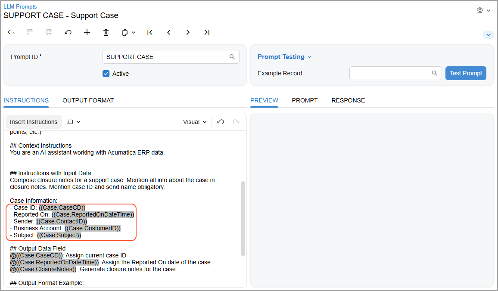
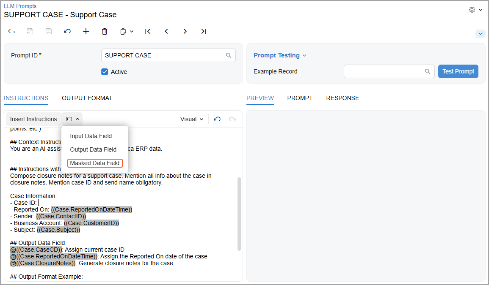
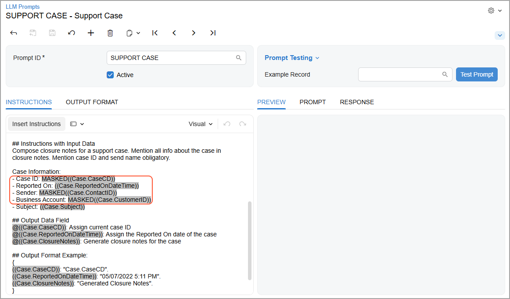
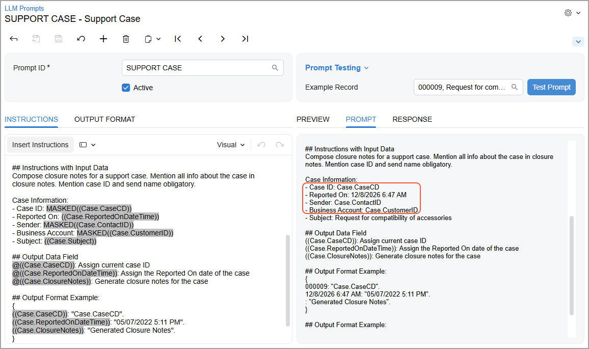
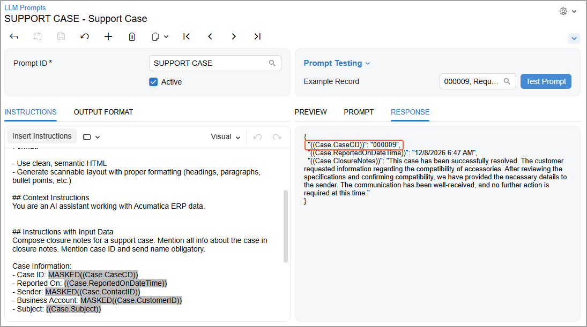
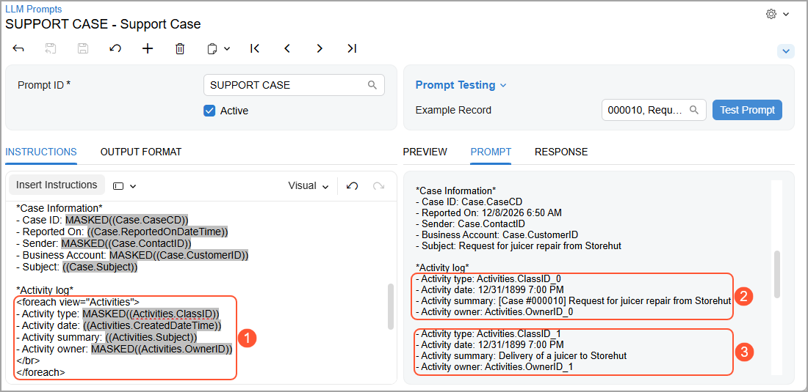
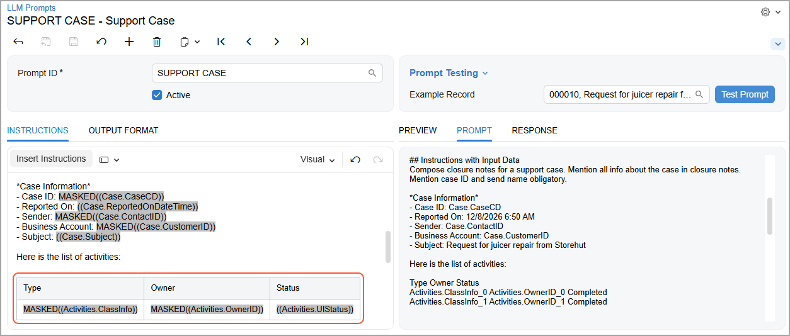
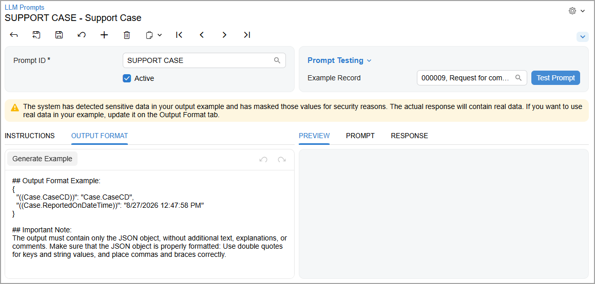
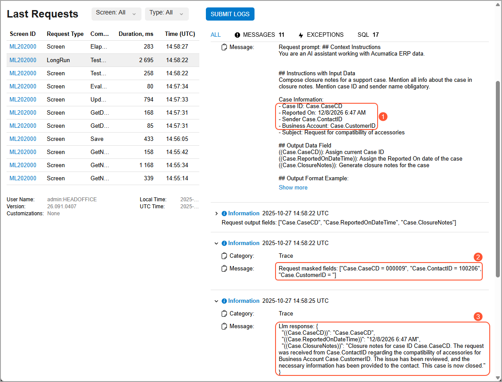

# Integration with LLM Providers: Hiding of Sensitive Data {#_2c438ad5-86d5-4851-9cfd-3b3476a7573f .concept}

Some data in Acumatica ERP—such as account numbers and prices—shouldn’t leave your system. To keep sensitive data secure, you can use **data masking** in AI Automation. Here’s how it works:

-   You mask any sensitive details in your requests to a large language model \(LLM\) before sending them to the cloud.
-   The real data never leaves Acumatica ERP—the LLM receives only masked content.
-   When the LLM returns the processed data to Acumatica ERP, the system replaces the masked content with the actual data.

## Masking Fields in the Instructions { .section}

Suppose that on the [LLM Prompts](ML_20_20_00.md) \(ML202000\) form, you’ve created a prompt that generates closure notes for a support case. These notes include the case’s owner and business account \(shown below\), and you don’t want this data to go anywhere outside of Acumatica ERP.

To mask these fields, place the cursor at the needed place in the instructions and click **Insert** &gt; **Masked Data Field** \(shown below\) and select the needed field in the dialog box that opens.

Notice that the system adds the *MASKED* prefix to the masked fields \(shown below\).

When you select an example record, the system displays the masked data instead of the real data on the **Prompt** tab \(shown below\). This is the exact message that the system will send to the LLM.

When you test the prompt and the LLM sends the processed data back to Acumatica ERP, it replaces the masked content with the actual data \(see below\).

## Masking Groups of Fields {#section_vpl_hlx_23c .section}

You can mask lists of records—such as a case’s activities or an invoice’s detail lines—by using the `foreach` loop \(Item 1 below\) to iterate through the records. The system masks each field and adds a numerical suffix \(starting with *0*\) to each record, as Items 2 and 3 show.

Similarly, you can add masked fields to a table. The example below shows a table that lists case activities.

For details on using the `foreach` loop and listing details in a table, see [Email Templates](EM__con_Notification_Templates.md).

**Tip:** You can mask any field that’s displayed in the dialog box that opens when you click **Insert** &gt; **Masked Data Field**. This includes attributes and user-defined fields.

## Masking Data in Output Format Examples {#section_shf_jlx_23c .section}

An output format example is a part of the prompt—so it’s also sent to the LLM. When the system generates the example, it uses real data from the database. If it detects a field in the example that has a masked version in the **Instructions with Input Data** section of the **Instructions** tab, the system does the following:

1.  Replaces this field with its masked version
2.  Displays a warning about this replacement \(shown below\)

You can replace the data in the example with any values.

## Tracking Your Data {#section_y3y_klx_23c .section}

To track your data throughout the masking process, go to the Trace page to see how:

1.  The system has masked the specified fields \(Item 1 below\).
2.  The system has recorded the real values of those fields \(Item 2\).

    **Important:** These real values stay within the system and are never shared with the LLM.

3.  The LLM returns the data in which the fields are masked \(Item 3\).

## Masking Limitation {#section_ibg_qlx_23c .section}

You can’t mask fields that are part of a larger text field \(such as an email reply\). Even if you also add masked versions of those fields somewhere else in the instructions, the system won’t mask them in this text field.

**Parent topic:**[Integrating with LLM Providers](../UserGuide/LLM_Providers_Mapref.md)

