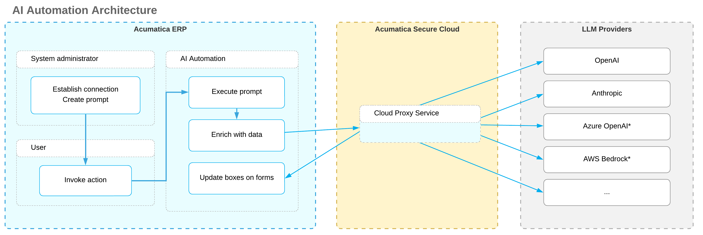

# Integration with LLM Providers: General Information {#_f3230fae-257d-4c9f-a865-3b9662d2c928 .concept}

Employees often perform repetitive tasks in Acumatica ERP—such as adding descriptions for stock and non-stock items or writing closure notes for cases. If you’ve deployed a large language model \(LLM\) through a provider, you can configure it to generate the text in Acumatica ERP.

You use *AI Automation* to connect your LLM to Acumatica ERP. The LLM can then generate helpful content right in the system to help the user with the specific task.

Setting up AI Automation is quick and easy. You'll create a connection to your LLM, create a prompt with instructions for the LLM, and test everything before you go live. Once you’ve set up the integration, AI Automation adds a new command to the More menu. A user clicks it to generate the request sent to the LLM, and the LLM takes care of the rest.

## Applicable Scenarios { .section}

You configure the connection to an LLM provider in the following cases:

-   You’re a system administrator responsible for integration with external systems.
-   You’re a customizer who works on simple customizations.

## Preparation for the Integration {#section_whh_55h_cgc .section}

Before you begin creating prompts for the LLM, make sure that the following is true:

-   You've enabled the *AI Automation* feature on the [Enable/Disable Features](CS_10_00_00.md) \(CS100000\) form. This feature is subject to licensing; please consult the Acumatica ERP sales policy for details.
-   You have an account with an LLM provider.
-   You've deployed an LLM on this provider's website.
-   Your organization's data handling policies permit sending potentially sensitive data to your LLM provider, as AI Automation does. The provider processes this data but doesn’t store it.

Acumatica ERP supports the following LLM providers:

-   Azure
-   Amazon Bedrock \(AWS\)
-   OpenAI
-   Anthropic

**Important:** LLM providers frequently update the list of available models. Models can be deprecated or retired with little notice, which may cause an existing LLM connection to stop working. To avoid errors, regularly check your provider’s documentation for model availability and expiration dates. Then review each LLM connection, update its settings accordingly, and test it to make sure that Acumatica ERP can connect to the LLM.

For OpenAI, you can’t create a connection by using your ChatGPT account. You need to use the OpenAI API.

## Solution Architecture {#section_tsw_nc1_l3c .section}

To connect to an LLM provider, Acumatica ERP routes AI Automation requests through the Acumatica Secure Cloud, which acts as a proxy. This proxy receives the request from Acumatica ERP, converts it to the provider’s API format, and forwards it to your selected LLM provider. The provider’s response returns through the same path and is written back into the Acumatica ERP database. The diagram below shows this high-level flow.

The proxy enables Acumatica ERP to connect to multiple LLM providers without changing your configuration for each provider’s API contract. The proxy doesn’t store, modify, or retain your data; it only maps requests and responses between Acumatica ERP and the provider.

You establish a direct relationship with your LLM provider \(API keys, terms, and data-use policies\). Acumatica ERP serves only as the integration layer and doesn’t access, broker, or store any data exchanged between you and your provider. You also control what data is sent to the provider. That data is not used to train Acumatica ERP generic models.

Before any data is sent, Acumatica ERP enforces existing access controls, user permissions, and audit logging. Only authorized users can configure or run prompts. You can also mask sensitive values in prompts, as described in [Integration with LLM Providers: Hiding of Sensitive Data](LLM_Providers_Data_Masking.md).

**Parent topic:**[Integrating with LLM Providers](../UserGuide/LLM_Providers_Mapref.md)

