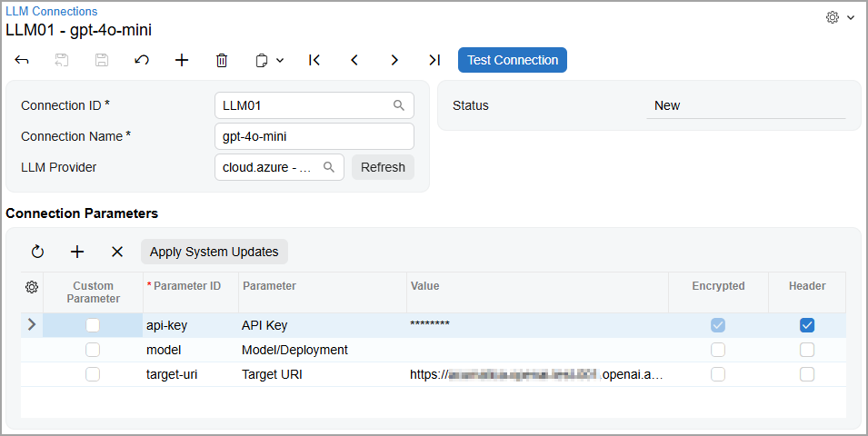
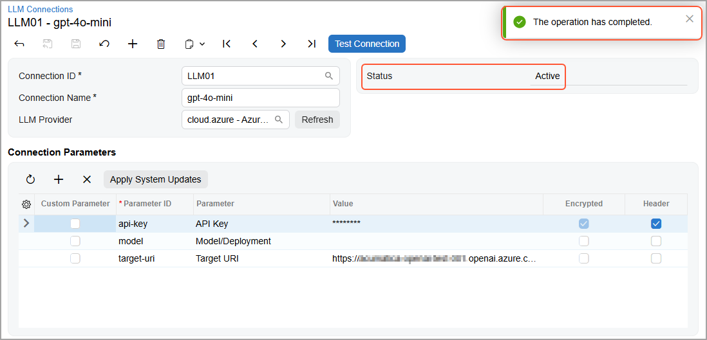

# Integration with LLM Providers: Creation of LLM Connections {#_b6177f65-a96c-4ee4-a6dd-50135b4a610e .concept}

Before you can use AI Automation, you need to establish a connection between Acumatica ERP and your LLM provider. This connection contains your credentials, which the system will use to communicate with the model during prompt processing.

In this topic, you’ll learn how to create and test this LLM connection.

## Configuring the Connection { .section}

You start the setup process by configuring the connection between the LLM and the system on the [LLM Connections](ML_20_10_00.md) \(ML201000\) form, which is shown below. Be sure to specify the following settings:

-   **Connection ID**: A unique identifier of your connection.
-   **Connection Name**: The display name of the LLM, which you can use to identify your connection. \(You can use the name specified on the model’s page on the LLM provider's website.\)
-   **LLM Provider**: The name of the LLM provider that you’re going to use.

    **Tip:** You click **Refresh** to the right of this box to load the up-to-date list of available providers.

-   **Connection Parameters**: The parameters that are used to connect to the LLM. The list of parameters depends on the provider and the model you're using. You copy the needed values from the model’s page on your provider's website.

## Testing the Connection { .section}

To make sure the connection works, you click **Test Connection** on the form toolbar. The system sends a request to the LLM provider, which verifies the connection data.

Once the system verifies the connection and its status becomes *Active* \(shown below\), you can create prompts.

**Tip:** If you’ve previously created a connection by using the Azure OpenAI provider, change *Azure OpenAI* to *Azure* in the **LLM Provider** box.

**Parent topic:**[Integrating with LLM Providers](../UserGuide/LLM_Providers_Mapref.md)

