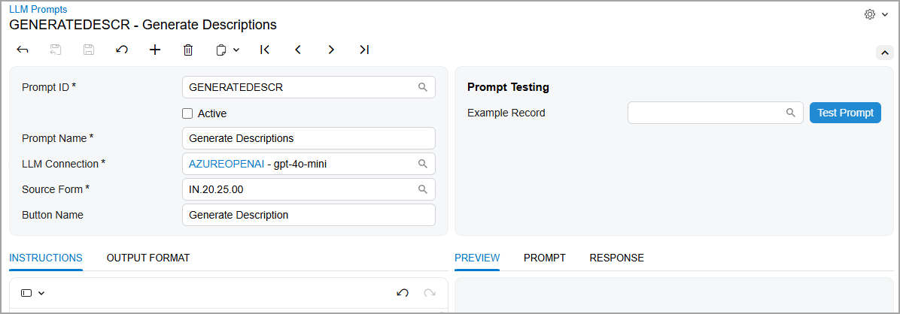
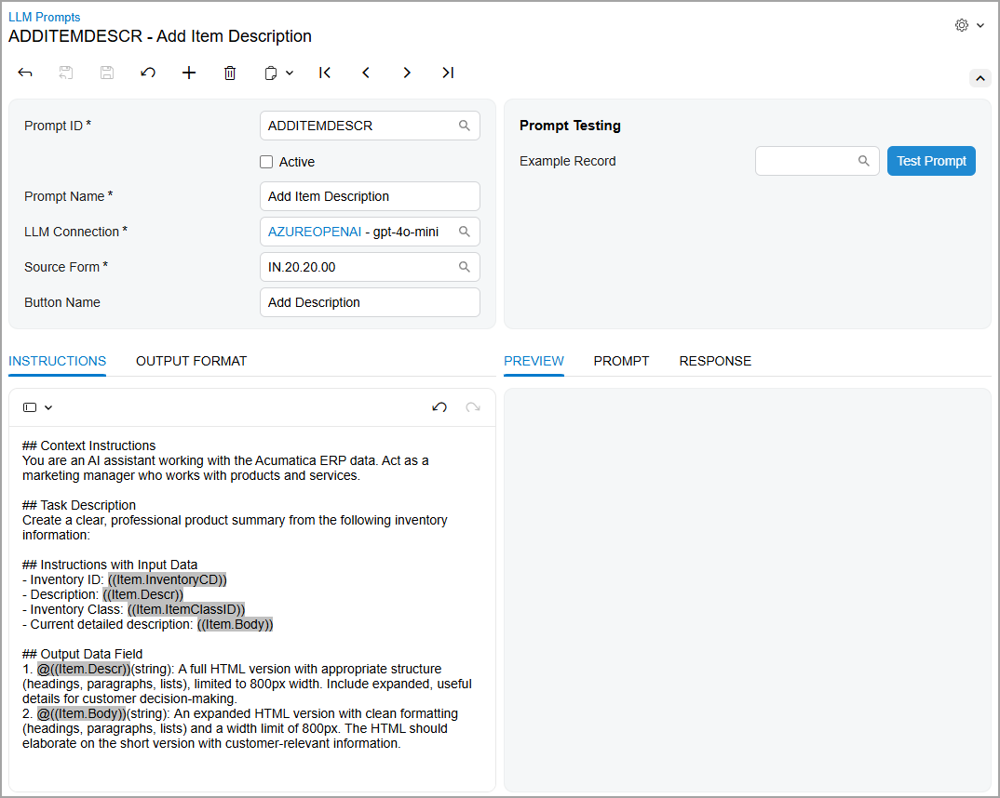
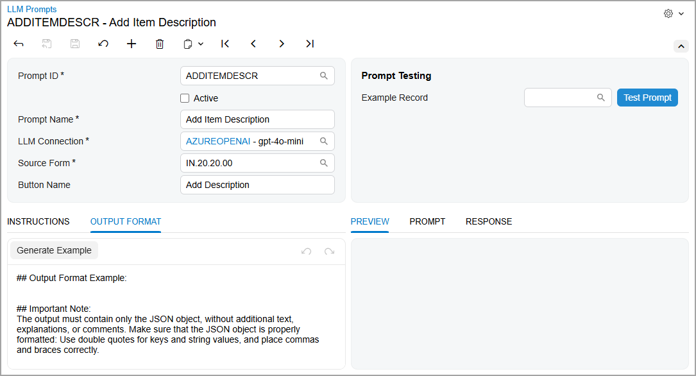
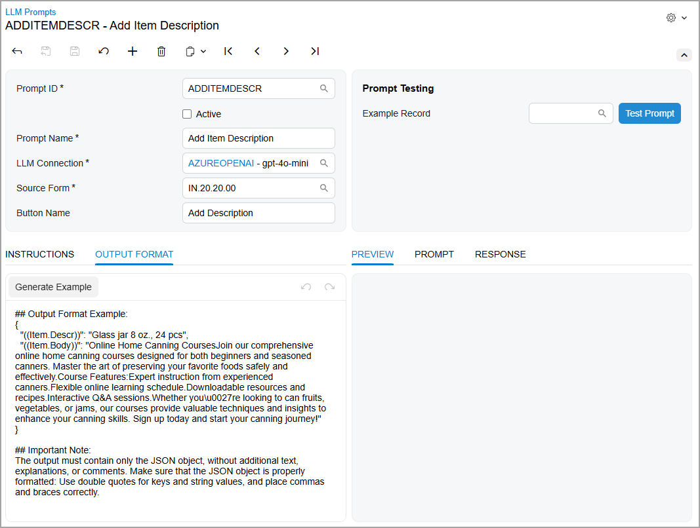
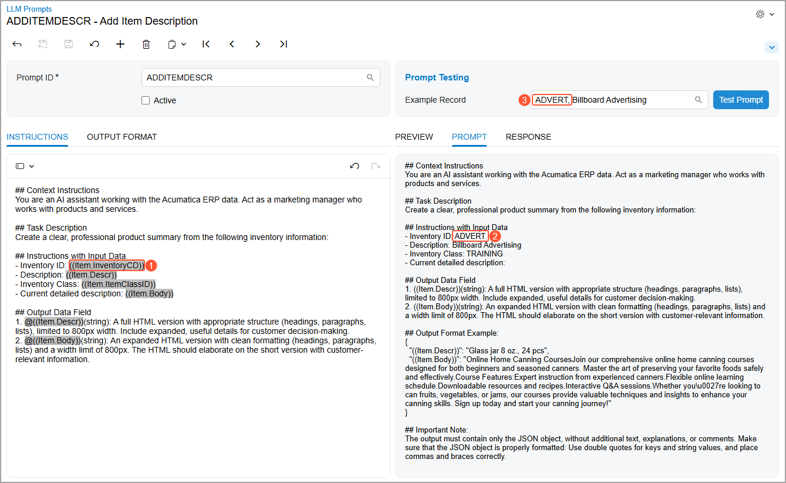
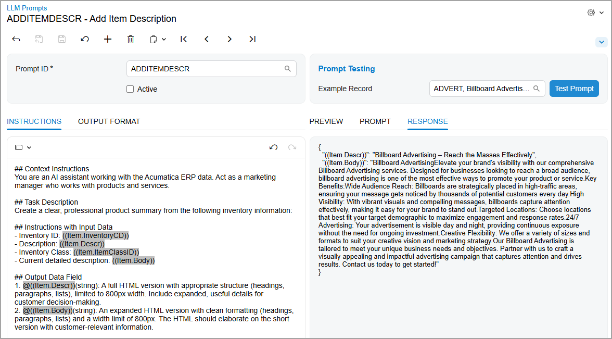
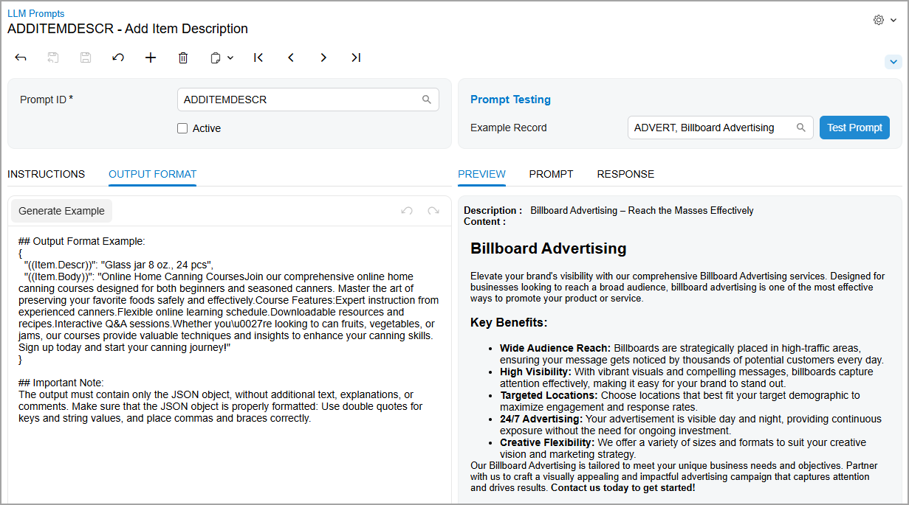
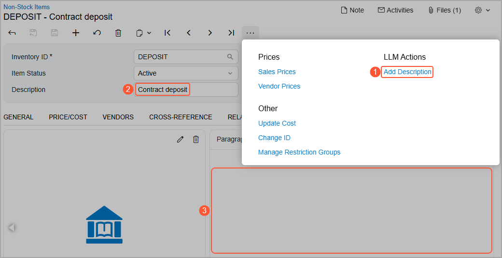
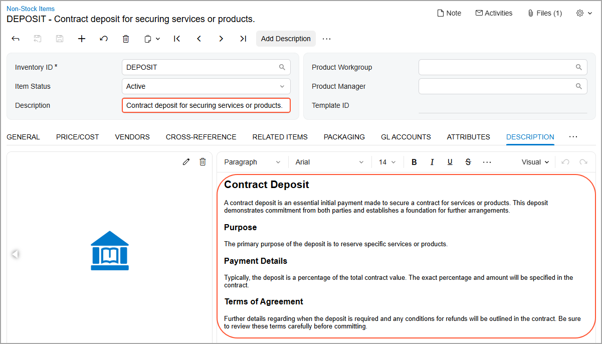

# Integration with LLM Providers: Creation of LLM Prompts {#_9b118036-3414-48cb-a9ef-ec54e1209efc .concept}

Once you’ve connected to your LLM provider, you define the instructions that tell the model what to do. These instructions are stored as prompts. The system uses each prompt to generate the full request sent to the LLM when a user runs a command or test.

After you activate a prompt, AI Automation adds a new command to the corresponding Acumatica ERP form. Users can click this command to generate content automatically—for example, to create product descriptions or closure notes.

In this topic, you’ll learn how to configure prompt settings, write instructions for the model, specify output formatting, test your prompts with sample data, and test the generated command.

## Creating a Prompt {#section_frd_jf3_23c .section}

You create a prompt on the [LLM Prompts](ML_20_20_00.md) \(ML202000\) form, which is shown below. The prompt defines the full structure of the request sent to the LLM—including instructions, input data, and output formatting.

**Tip:** A prompt defines what the model is expected to do. It may include instructions, questions, context, constraints, and examples. The prompt guides the model’s behavior, influences its output, and aligns the response with the user’s task.

In the Summary area of the form, you specify the basic settings of the prompt. You use the **Prompt Testing** section when you're ready to test it \(as described later in this topic\).

You specify the following basic settings:

-   **Prompt ID**: The internal identifier of the prompt.
-   **Active**: A check box that you select to create the command on the source form.

    The command appears on the form after you select this check box and save your changes.

-   **Prompt Name**: The prompt’s display name. This name is also used for the command \(and button\) if the **Button Name** box is left blank.
-   **LLM Connection**: The name of the connection you are going to use. Although you can create a prompt without a connection, you need a connection to test and use it.

    **Tip:** The lookup table in the **LLM Connection** box displays only connections that have been tested—that is, connections with the *Active* status.

-   **Source Form**: The data entry form for which the button and command will be created.
-   **Button Name** \(optional\): The name of the command on the More menu that the model will generate.

    If you leave this box empty, the system will use the prompt name as the command and button name.

## Adding Instructions for the Model { .section}

In the prompt, which you create on the [LLM Prompts](ML_20_20_00.md) \(ML202000\) form, you specify how the LLM should process data and what data it should return.

On the **Instructions** tab of the bottom left pane, shown below, you enter instructions for the LLM, providing as much relevant detail as possible. By default, the tab contains three sections—which you should preserve for best results:

-   **Context Instructions**: General instructions for the model, such as the business context, the role for which the prompt is executed \(for example, *write like a sales manager*\), or the tone and style of the output text.

    **Important:** These instructions affect the results and the correct execution of the prompt. Avoid removing them; instead, adjust them as needed.

-   **Instructions with Input Data**: A description of what the model should do and what data it should use. You can use only data fields from the source form as input data.
-   **Output Data Field**: Which fields \(elements on the form\) the model should fill in, how it should fill them in, and what constraints apply to the task this command will help the user perform. You can specify only fields from the source form.

    **Important:** If the instructions don’t include output fields, the system displays an error when you try to generate an example or test the prompt.

You can also add your own sections to refine the instructions; existing sections can be modified or removed. Optionally, you can precede the name of each new section with `##` or any other notation.

**Tip:** Click **Insert** on the formatting toolbar to select an input or output field.

## Specifying the Output Format { .section}

On the **Output Format** tab of the [LLM Prompts](ML_20_20_00.md) \(ML202000\) form \(bottom left pane\), shown below, you specify how the model should format the data it returns:

-   **Output Format Example**: An example of the data the model should return.
-   **Important Note**: Information about how the returned data should be formatted.

    **Attention:** Avoid removing this section. It provides guidance on what data the model should return and how this data should be formatted, which significantly improves the quality of the results.

To see an example of the returned data, you click **Generate Example** on the formatting toolbar. The system generates sample output \(see below\) based on the output fields specified on the **Instructions** tab. For these fields, the system uses randomly chosen values from the database. You can edit the example, if needed.

**Tip:** If the system can’t find values for an output field in the database, it doesn’t add this field to the example. If the number of output fields in the instructions differs from that in the returned data, you need to manually add the output field that is specified in the instructions but wasn’t added to the example.

## Testing the Prompt {#section_jhk_yd3_23c .section}

After you configure the prompt, you need to test it on the data from your instance. In the **Prompt Testing** section of the [LLM Prompts](ML_20_20_00.md) \(ML202000\) form:

1.  In the **Example Record** box, select a record of the source form.

    The system adds the full prompt—the data from the **Instructions** and **Output Format** tabs—to the **Prompt** tab of the bottom right pane. It replaces placeholder fields with real values. For example, notice that the system has replaced the `Item.InventoryCD` input field \(Item 1 below\) with the ID of the record selected in the **Example Record** box \(Items 2 and 3\).

    

2.  Click **Test Prompt**.

    The system sends the instructions to the LLM. The **Response** tab \(bottom right pane\) displays the returned data in JSON format \(shown below\).

    

3.  Review the **Preview** tab \(bottom right pane\) to see how this data will be displayed on the corresponding form \(see below\).

    

    If you aren’t satisfied with the results, you can modify the prompt and test it again.

4.  To go live, select the **Active** check box in the Summary area and save your changes. Selecting this check box adds the LLM command to the source form.

## Testing the LLM Command {#section_xlk_b23_23c .section}

Now you need to test the new command \(Item 1 below\), which is shown on the More menu of the corresponding form—the [Non-Stock Items](IN_20_20_00.md) \(IN202000\) form in this example. Before you click this command, the **Description** box \(Item 2\) and the **Description** tab \(Item 3\) may contain some text or may be empty.

**Tip:** You can mark the new command as a favorite to also display it as a button on the form toolbar. This change affects only your user account.

When you click the command or the button, the system updates the text in the **Description** box and adds a detailed description to the tab \(shown below\).

If you aren’t satisfied with the generated descriptions, you can:

-   Edit the generated text
-   Click the button again to cause the system to generate new text

**Tip:** The underlying action for the added command can be customized, as any other action of the form can. For details, see [Actions on Forms: General Information](../CustomizationPlatform/CustomizationProjects_AddingActions_GeneralInfo.md), [Action Configuration: General Information](../DeveloperGuide/WorkflowUI_Actions_GeneralInfo.md), and [Workflow Actions: General Information](../DeveloperGuide/WorkflowAPI_Actions_GeneralInfo.md).

**Parent topic:**[Integrating with LLM Providers](../UserGuide/LLM_Providers_Mapref.md)

