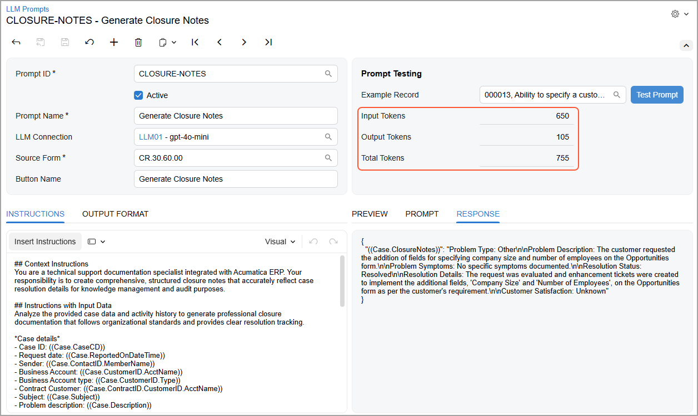
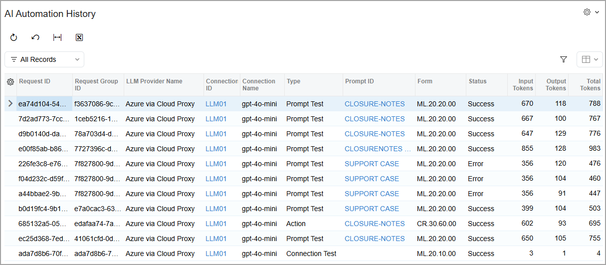

# Integration with LLM Providers: Collection of Statistics {#_153fff80-6deb-4493-a6a3-cd3cb2b1c880 .concept}

Large language model \(LLM\) providers charge by the number of processed tokens, which are small units of text. In AI Automation, you can monitor how many input and output tokens you've used. *Input* refers to the text that you send to the LLM, and *output* refers to the text in the LLM's response.

Acumatica ERP collects statistics on your LLM prompts, connections, and commands. Real-time monitoring can help you avoid budget overruns, prevent errors caused by excess token usage, and understand your usage patterns. These insights can help you refine prompts and decide whether a more efficient LLM is worth considering.

## Collecting Token Statistics { .section}

To keep track of the tokens used for a particular prompt, you use the boxes in the **Prompt Testing** section of the [LLM Prompts](ML_20_20_00.md) \(ML202000\) form. You can see at a glance the number of input and output tokens, as well as their total amount \(see below\).

You view statistics for all LLM connections, prompts, and LLM-generated commands on the [AI Automation History](ML_40_00_00.md) \(ML400000\) form, shown below. Each time you perform an operation in AI Automation, the system adds a corresponding record to the table. The **Type** column indicates the type of each record:

-   *Connection Test*: Testing of an LLM connection on the [LLM Connections](ML_20_10_00.md) \(ML201000\) form
-   *Prompt Test*: Testing of an LLM prompt on the [LLM Prompts](ML_20_20_00.md) \(ML202000\) form
-   *Action*: Testing of an LLM-generated command on the form it was designed for

## Taking Action Based on Statistics { .section}

When you review the data on the [AI Automation History](ML_40_00_00.md) \(ML400000\) form:

-   If the number of output tokens is large, you may want to use another LLM. \(Different LLMs respond differently.\)

    Alternatively, you can change the prompt and ask the LLM to be brief.

-   If the number of input tokens is large, try using shorter prompts.
-   If errors occur, review the error messages to determine whether you need to modify the connection settings or the instructions.

**Parent topic:**[Integrating with LLM Providers](../UserGuide/LLM_Providers_Mapref.md)

