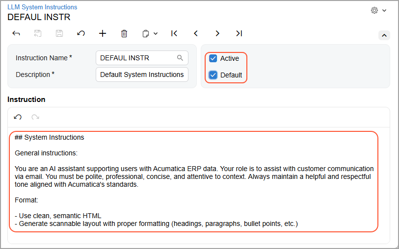
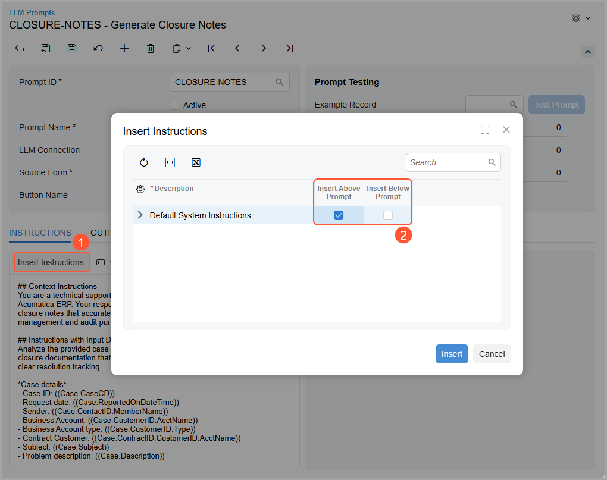

# Integration with LLM Providers: Use of System Instructions {#_ef4dc540-cde8-4e3f-a459-ec0320ebbfee .concept}

When you use AI Automation across many business workflows, you need to keep prompts consistent and aligned with your company's policies. Reusable system instructions help you centralize security, safety, and governance guidance across your prompts.

In this topic, you'll learn how to create and use system instructions.

## Overview of System Instructions { .section}

You define system instructions once and make them available to prompt engineers, who can then insert and adapt the text directly in their LLM prompts. This promotes more consistent responses, supports compliance efforts, and speeds up prompt creation across the system.

Suppose that you previously added general instructions—such as *Maintain a professional tone* and *Don't expose personal data*—to each prompt manually. These instructions were easy to forget or to phrase inconsistently.

With reusable system instructions, you can maintain a centralized library that includes the following:

-   **Safety instructions** to help users avoid harmful or unintended outcomes
-   **Security instructions** that cover topics like access control and data confidentiality
-   **General instructions** that can be reused—such as general communication principles, roles, and the response format

This approach ensures that every new prompt starts with a standard baseline, while still giving prompt engineers enough flexibility to tailor prompts to specific business cases.

You can assign the following roles for working with these instructions:

-   *Security Expert*: Creates system instructions and reviews, tests, and approves LLM prompts created by prompt engineers
-   *Prompt Engineer*: Creates LLM prompts and inserts system instructions into these prompts

With these roles assigned to the appropriate users, prompt preparation typically follows this process:

1.  A security expert creates and maintains system instructions on the [LLM System Instructions](ML_20_30_00.md) \(ML203000\) form.
2.  A prompt engineer uses the [LLM Prompts](ML_20_20_00.md) \(ML202000\) form to:
    -   Compose full prompts
    -   Insert system instructions where needed
    -   Test prompts by using real data
3.  The security expert reviews, tests, and approves the prompts created by the prompt engineer.

## Creating System Instructions {#section_rmh_w2t_k3c .section}

You create system instructions on the [LLM System Instructions](ML_20_30_00.md) \(ML203000\) form, as shown below.

You enter the text of a set of instructions in the **Instructions** section of the form. You then select the **Active** check box to make this set of instructions available for selection on the [LLM Prompts](ML_20_20_00.md) \(ML202000\) form. If you select the **Default** check box \(also shown below\), the system automatically adds this set of instructions to each new prompt created on the [LLM Prompts](ML_20_20_00.md) form.

**Tip:** You can select the **Active** and **Default** check boxes for multiple sets of instructions. Adding new default instructions does not affect the existing prompts.

If there are multiple default instructions, the system inserts all of them into the prompt.

## Inserting System Instructions into Prompts {#section_h22_y2t_k3c .section}

As a prompt engineer, you do the following when you create and test an LLM prompt on the [LLM Prompts](ML_20_20_00.md) \(ML202000\) form:

-   If default system instructions exist, the system inserts them into the prompt before the **Context Instructions** section. You can move, modify, or remove them.

    **Tip:** These changes don’t affect the original system instructions.

-   If there are no default system instructions, you can insert system instructions manually by clicking **Insert Instructions** on the **Instructions** tab of the [LLM Prompts](ML_20_20_00.md) form \(Item 1 below\). In the dialog box, you then specify where you want to add them: at the beginning of the prompt or at the end \(Item 2\).

    

As a security expert, you need to test the full prompts that the prompt engineer has created. You do this on the [LLM Prompts](ML_20_20_00.md) form. Because system instructions are a part of the prompt, you can test them only in the context of a specific task and set of data.

**Parent topic:**[Integrating with LLM Providers](../UserGuide/LLM_Providers_Mapref.md)

