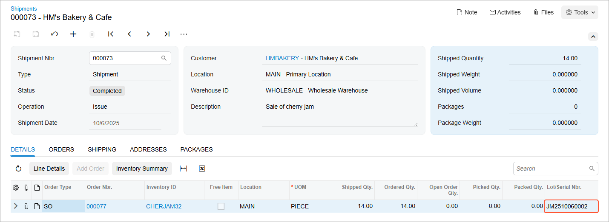

# Items with Lot and Serial Numbers: To Sell Items in Lots {#_19e48e39-acc9-4548-a393-f278958ea7ef .task}

In the following activity, you will learn how to create and process purchase and sales documents for a stock item with a lot number generated automatically when the item is shipped.

**Attention:** This activity is based on the *U100* dataset. If you are using another dataset or if any system settings have been changed in *U100*, these changes can affect the workflow of the activity and the results of the processing. To avoid issues, restore the *U100* dataset to its initial state.

## Story { .section}

Suppose that you are a sales manager in the SweetLife Fruits &amp; Jams company. You have received an order from the HM's Bakery &amp; Cafe customer for 14 jars of cherry jam, each of which is 32 ounces. Cherry jam is a new item that SweetLife has started to produce recently. You have decided that a lot number should be assigned on issue of sold jam, so that you can track the sold packs of jam in case any jars are returned.

Acting as sales manager Grace Norman in the SweetLife Head Office and Wholesale Center, you will create and process the appropriate documents to complete the sales order and record the lot number. You will use quick processing to illustrate expedited processing of the sales order.

## Configuration Overview { .section}

In the *U100* dataset, for the purposes of this activity, the following tasks have been performed:

-   On the [Enable/Disable Features](CS_10_00_00.md) \(CS100000\) form, the following features have been enabled:
    -   *Inventory and Order Management*, which provides the standard functionality of inventory and order management
    -   *Inventory*, which gives you the ability to maintain stock items by using forms related to the inventory functionality and to create and process sales and purchase documents that include stock items
-   On the [Warehouses](IN_20_40_00.md) \(IN204000\) form, the *WHOLESALE* warehouse has been created.
-   On the [Stock Items](IN_20_25_00.md) \(IN202500\) form, the *CHERJAM32* stock item has been created.
-   On the [Lot/Serial Classes](IN_20_70_00.md) \(IN207000\) form, the *LTJAM* serial class \(a class for tracking jams by lot number on sale\) has been created.
-   On the [Customers](AR_30_30_00.md) \(AR303000\) form, the *HMBAKERY* customer has been created.
-   On the [Order Types](SO_20_10_00.md) \(SO201000\) form, the *SO* order type has been configured to allow expedited multistep processing of appropriate sales orders, which will be illustrated in this example. The **Allow Quick Process** check box has been selected on the **Template** tab. On the **Quick Processing** tab of the form, the appropriate settings have been specified to configure the sequence of order processing actions to be used by default when orders of this type are quickly processed.

## Process Overview { .section}

In this activity, to perform a sale of stock items with automatic assignment of lot numbers, you will create a sales order on the [Sales Orders](SO_30_10_00.md) \(SO301000\) form, select an order type that supports quick processing, select the customer to which the items are being sold, and add items to the order.

You will use quick processing to streamline the processing of the sales order. You will click **Quick Process** on the form toolbar, review the quick processing settings, and correct them. Then you will run quick processing, during which the system processes the sales order to completion and generates all needed documents. When the quick processing completes, in the shipment on the [Shipments](SO_30_20_00.md) \(SO302000\) form, you will make sure that the system has generated a lot number for the line with the stock item that has the lot class with auto-generation settings specified.

## System Preparation { .section}

Before you start performing a sale of stock items with automatic assignment of lot numbers, you should do the following:

1.  Launch the Acumatica ERP website with the *U100* dataset preloaded, and sign in as sales manager Grace Norman by using the *norman* username and the *123* password.
2.  On the [Enable/Disable Features](CS_10_00_00.md) \(CS100000\) form, make sure that the *Lot and Serial Tracking* feature is enabled.
3.  On the Company and Branch Selection menu, in the top pane of the Acumatica ERP screen, select the *SweetLife Head Office and Wholesale Center* branch.

## Step: Creating and Processing Sales Documents { .section}

To prepare the sales order and the related sales documents \(which will be created through quick processing of the sales order\) from the *HMBAKERY* customer for 14 jars of the *CHERJAM32* jam, do the following:

1.  On the [Sales Orders](SO_30_10_00.md) \(SO301000\) form, add a new record.
2.  In the Summary area, specify the following settings:
    -   **Order Type**: *SO*
    -   **Customer**: *HMBAKERY*
    -   **Description**: `Sale of cherry jam`
3.  On the **Details** tab, add a row, and specify the following settings for it:
    -   **Inventory ID**: *CHERJAM32*
    -   **Warehouse**: *WHOLESALE*
    -   **Quantity**: `14`
    -   **Unit Price**: `16.89`
4.  On the form toolbar, click **Save**. The sales order is saved with the *Open* status.
5.  On the More menu, click **Quick Process**.
6.  In the **Process Order** dialog box, which opens so that you can review \(and change, if needed\) the settings before quickly processing the order, do the following:
    1.  In the **Warehouse ID** box, make sure that *WHOLESALE* is selected.
    2.  In the **Shipment Date** section, make sure that *Today* is selected.
    3.  In the **Shipping** section, make sure that the following check boxes are selected:
        -   **Create Shipment**
        -   **Confirm Shipment**
        -   **Update IN**
    4.  In the **Invoicing** section, do the following:
        1.  Make sure that the **Prepare Invoice** check box is selected.
        2.  Select the **Release Invoice** check box.
    5.  Click **Process**. Wait for the system to create the documents. When the processing is completed, the status of the sales order becomes *Completed*.
7.  On the **Shipments** tab, click the link in the **Document Nbr.** column. The system opens the shipment on the [Shipments](SO_30_20_00.md) \(SO302000\) form in a pop-up window.
8.  In the **Lot/Serial Nbr.** column of the **Details** tab, make sure that the system has generated the lot number for the line, as shown in the following screenshot.

    

You have created the sales order for items with a lot number that was generated automatically for the shipment, and you have used quick processing to automatically generate the related sales documents.

**Parent topic:**[Managing Items with Lot and Serial Numbers](../UserGuide/Lot_and_Serial_Numbers_Mapref.md)

