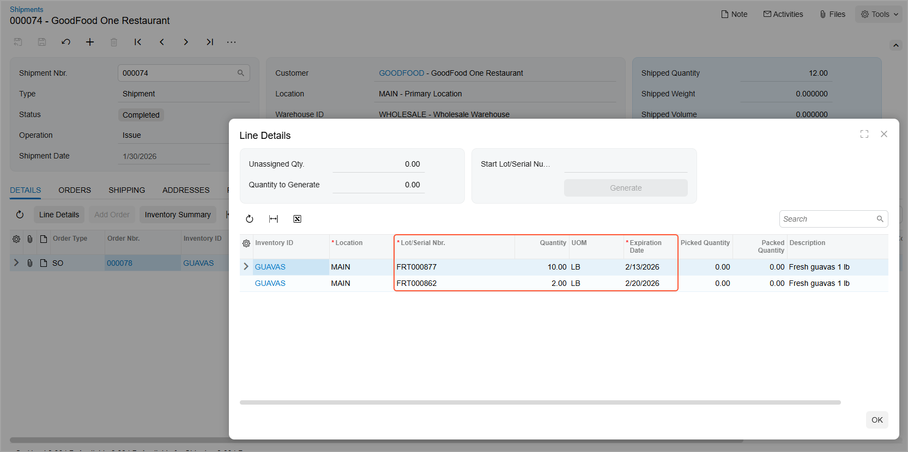

# Items with Lot and Serial Numbers: To Purchase and Sell Lot-Numbered Items that Expire {#_d7b333c0-bb86-4ac0-9281-6704e8dff04f .task}

In the following activity, you will learn how to create and process purchase and sales documents for a stock item for which the lot number and expiration date are entered manually on receipt.

**Attention:** This activity is based on the *U100* dataset. If you are using another dataset or if any system settings have been changed in *U100*, these changes can affect the workflow of the activity and the results of the processing. To avoid issues, restore the *U100* dataset to its initial state.

## Story { .section}

In this activity, you will act as sales and purchasing manager Regina Wiley in the SweetLife Head Office and Wholesale Center branch of the SweetLife Fruits &amp; Jams company.

As the purchasing manager, you will buy two boxes \(10 pounds each\) of guavas with different expiration dates from the Glory Fruit Case vendor. The vendor supplies each box with a lot number that must be used for tracking the enclosed items in the Wholesale warehouse. The lot class is defined so that fruits with the earliest expiration date are issued first when the fruit is sold.

Suppose that GoodFood One Restaurant ordered 12 pounds of guavas. As the sales manager, you will create and process the appropriate documents for the purchase and sale of these items with lot numbers and expiration dates. You will use quick processing to illustrate expedited processing of the sales order.

## Configuration Overview { .section}

In the *U100* dataset, for the purposes of this activity, the following tasks have been performed:

-   On the [Enable/Disable Features](CS_10_00_00.md) \(CS100000\) form, the following features have been enabled:
    -   *Inventory and Order Management*, which provides the standard functionality of inventory and order management
    -   *Inventory*, which gives you the ability to maintain stock items by using forms related to the inventory functionality and to create and process sales and purchase documents that include stock items
-   On the [Warehouses](IN_20_40_00.md) \(IN204000\) form, the *WHOLESALE* warehouse has been created.
-   On the [Stock Items](IN_20_25_00.md) \(IN202500\) form, the *GUAVAS* stock item has been created.
-   On the [Lot/Serial Classes](IN_20_70_00.md) \(IN207000\) form, the *LTFRT* serial class \(a class for tracking fruits by lot number and expiration date\) has been created.
-   On the [Vendors](AP_30_30_00.md) \(AP303000\) form, the *GLORYFRUIT* customer has been created.
-   On the [Customers](AR_30_30_00.md) \(AR303000\) form, the *GOODFOOD* customer has been created.
-   On the [Order Types](SO_20_10_00.md) \(SO201000\) form, the *SO* order type has been configured to allow expedited multistep processing of appropriate sales orders, which will be illustrated in this example. The **Allow Quick Process** check box has been selected on the **Template** tab. On the **Quick Processing** tab of the form, the appropriate settings have been specified to configure the sequence of order processing actions to be used by default when orders of this type are quickly processed.

## Process Overview { .section}

In this activity, you will do the following:

1.  On the [Purchase Orders](PO_30_10_00.md) \(PO301000\) form, prepare a purchase order to order the dated, lot-numbered items from the vendor.
2.  On the [Purchase Receipts](PO_30_20_00.md) \(PO302000\) form, prepare a purchase receipt when you receive the items from the vendor, and specify the lot number and expiration date for each unit of the items.
3.  On the [Sales Orders](SO_30_10_00.md) \(SO301000\) form, prepare a sales order, select an order type that supports quick processing, select the customer to which the items are being sold, and add items to the order.
4.  On the [Sales Orders](SO_30_10_00.md) form, click **Quick Process** on the form toolbar to use quick processing of the sales order, and review the quick processing settings. Then you run quick processing, during which the system processes the sales order to completion and generates all needed documents. When the quick processing completes, you can review the generated documents.
5.  Review that the items included in the shipment have been allocated according to the settings of the lot class assigned.

## System Preparation { .section}

Before you start preparing the purchasing and sales documents for items with lot numbers and expiration dates, you should do the following:

1.  Launch the Acumatica ERP website with the *U100* dataset preloaded, and sign in as sales and purchasing manager Regina Wiley by using the *wiley* username and the *123* password.
2.  In the info area at the upper-right corner of the top pane of the Acumatica ERP screen, make sure that the business date is set to *1/30/2026*. If a different date is displayed, click the Business Date menu button and select *1/30/2026* from the calendar. For simplicity, you'll create and process all documents in this activity using this business date.
3.  On the [Enable/Disable Features](CS_10_00_00.md) \(CS100000\) form, make sure that the *Lot and Serial Tracking* feature is enabled.

## Step 1: Creating a Purchase Order { .section}

You will begin the process of ordering two boxes of guavas, 10 pounds each, from the *GLORYFRUIT* vendor by creating a purchase order. To create the purchase order, do the following:

1.  On the [Purchase Orders](PO_30_10_00.md) \(PO301000\) form, add a new record.
2.  In the Summary area, specify the following settings:
    -   **Type**: *Normal*
    -   **Vendor**: *GLORYFRUIT*
    -   **Description**: `Purchase of guavas, 20 lb`
3.  On the table toolbar of the **Details** tab, click **Add Row**.
4.  In the row, specify the following settings:
    -   **Branch**: *HEADOFFICE*
    -   **Inventory ID**: *GUAVAS*
    -   **Warehouse**: *WHOLESALE*
    -   **Order Qty.**: `20`
    -   **Unit Cost**: `9.95`
5.  On the form toolbar, click **Remove Hold** to save the purchase order, which is assigned the *Open* status.

You can now print the purchase order and send it to the Glory Fruit Case vendor by mail. In this activity, we will skip this step.

## Step 2: Creating a Purchase Receipt and Entering Lot Numbers { .section}

Suppose that the Glory Fruit Case vendor has delivered the guavas to the Wholesale warehouse. The order contains two boxes with separate lot numbers and different expiration dates. To prepare the needed documents to reflect the receipt of the guavas, do the following:

1.  While you are still viewing the purchase order on the [Purchase Orders](PO_30_10_00.md) \(PO301000\) form, click **Enter PO Receipt** on the form toolbar. The system opens the [Purchase Receipts](PO_30_20_00.md) \(PO302000\) form with the new receipt, which has the *Balanced* status and the data copied from the linked purchase order.
2.  In the table of the **Details** tab, click the only line of the order.
3.  On the table toolbar, click **Line Details**.
4.  In the **Line Details** dialog box, which opens, do the following:

    1.  Notice that the value of the **Unassigned Qty.** box in the Summary area is *20*.
    2.  On the table toolbar, click **Add Row**.
    3.  In the **Location** column, select *MAIN*.
    4.  In the **Lot/Serial Nbr.** column, type `FRT000862`.
    5.  In the **Quantity** column, type `10`.
    6.  In the **Expiration Date** column, select *2/20/2026*.
    7.  On the table toolbar, click **Add Row** to add a second row. Notice that the value of the **Unassigned Qty.** box was changed to *10*.
    8.  In the **Lot/Serial Nbr.** column, type `FRT000877`.
    9.  In the **Quantity** column, type `10`.
    10. In the **Expiration Date** column, select *2/13/2026*.
    11. Click **OK** to save your changes and close the dialog box.
    Notice that the value of the **Lot/Serial Nbr.** column for the *GUAVAS* line is *&lt;SPLIT&gt;*, which means that units of the item with different lot numbers have been included in the line of the purchase receipt.

5.  In the Summary area, select the **Create Bill** check box.
6.  On the form toolbar, click **Release** to release the purchase receipt. The system automatically creates and releases the inventory receipt. On the **Other** tab, you can view the reference number of the created inventory receipt; you can also click the reference number link to view the inventory receipt on the [Receipts](IN_30_10_00.md) \(IN301000\) form.
7.  Open the [Inventory Allocation Details](IN_40_20_00.md) \(IN402000\) form.
8.  In the Selection area, do the following:
    1.  In the **Inventory ID** box of the Selection area, select *GUAVAS*.
    2.  In the **Warehouse** box, select *WHOLESALE*. Make sure that the quantity in the **On Hand** box is *20*.

You have processed the purchase receipt and inventory receipt to reflect that the guavas have been received in the Wholesale warehouse. In these documents, you have entered lot numbers and expiration dates, and now sales managers can sell these guavas to customers.

## Step 3: Creating a Sales Order { .section}

In this step, you will act as the sales manager. To create a sales order reflecting that the *GOODFOOD* customer has ordered 12 pounds of guavas, do the following:

1.  On the [Sales Orders](SO_30_10_00.md) \(SO301000\) form, add a new record.
2.  In the Summary area, specify the following settings:
    -   **Order Type**: *SO*
    -   **Customer**: *GOODFOOD*
    -   **Description**: `Sale of 12 pounds of guavas`
3.  On the table toolbar of the **Details** tab, click **Add Row**.
4.  In the row, specify the following settings:
    -   **Inventory ID**: *GUAVAS*
    -   **Warehouse**: *WHOLESALE*
    -   **Quantity**: `12`
    -   **Unit Price**: `12.99`
5.  On the form toolbar, click **Save**. Notice that the sales order has the *Open* status.

You have created the sales order for the guavas, and now you will create the other related shipment, issue, and invoice.

## Step 4: Creating and Quickly Processing Sales Documents { .section}

To create and process the sales documents related to the sales order through quick processing of the sales order, do the following:

1.  While you are still viewing the sales order you have created on the [Sales Orders](SO_30_10_00.md) \(SO301000\) form, on the More menu, click **Quick Process**.
2.  In the **Process Order** dialog box, which opens so that you can review \(and change, if needed\) the settings before quickly processing the order, do the following:
    1.  In the **Warehouse ID** box, make sure that *WHOLESALE* is selected.
    2.  In the **Shipment Date** section, make sure that *Today* is selected.
    3.  In the **Shipping** section, make sure that the following check boxes are selected:
        -   **Create Shipment**
        -   **Confirm Shipment**
        -   **Update IN**
    4.  In the **Invoicing** section, make sure that the **Prepare Invoice** check box is selected.
    5.  Select the **Release Invoice** check box.
    6.  Click **Process**. Wait for the system to create the documents. When the processing is completed, the status of the sales order becomes *Completed*.

By using quick processing, you have created the sales documents related to the sales order. Now you will review how the system has allocated units of the item in the shipment.

## Step 5: Reviewing the Item Allocations in the Shipment { .section}

To review how the system has allocated units of the item in the shipment, do the following:

1.  While you are still viewing the sales order you have created on the [Sales Orders](SO_30_10_00.md) \(SO301000\) form, on the **Shipments** tab, click the link in the **Document Nbr.** column. The system opens the shipment on the [Shipments](SO_30_20_00.md) \(SO302000\) form.
2.  In the **Lot/Serial Nbr.** column on the **Details** tab, notice that the *&lt;SPLIT&gt;* value is specified. This means that units of the item with different lot numbers have been included in the shipment line.
3.  Click the only shipment line, and, on the table toolbar, click **Line Details**.
4.  In the **Line Details** dialog box, which opens, review how the system has selected guavas from warehouse as follows \(see the screenshot below\):

    -   In the first line, notice that the system selected 10 pounds of guavas from the *FRT000877* lot with the earlier expiration date.
    -   In the second line, notice that the system selected two pounds of guavas from the *FRT000862* lot with the later expiration date.
    

5.  Click **OK** to close the dialog box.

You have prepared the documents for purchasing items with lot numbers and expiration dates, and you have prepared the sales documents for selling the lot-numbered items, making sure that the system has selected the items by using the expiration date.

**Parent topic:**[Managing Items with Lot and Serial Numbers](../UserGuide/Lot_and_Serial_Numbers_Mapref.md)

