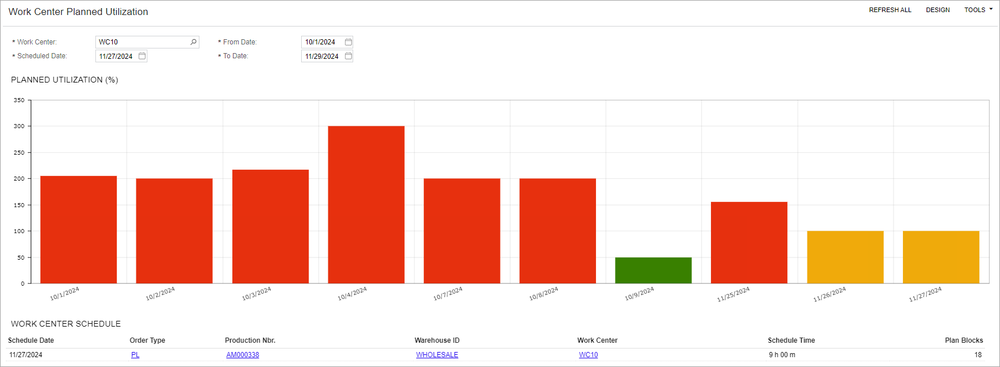

# Advanced Planning and Scheduling: Work Center Planned Utilization {#_fe4716a7-03b0-448e-92ee-91b8605dd1f1 .concept}

You can view a graphical representation of the planned load for a specific work center on the *Work Center Planned Utilization \(AM0044DB\)* dashboard. The dashboard helps manufacturing planners quickly identify overloads and redistribute or reschedule production orders to balance work center loads efficiently.

**Attention:** The dashboard is available only if the *Advanced Planning and Scheduling* feature is enabled on the [Enable/Disable Features](CS_10_00_00.md) \(CS100000\) form. In the out-of-the-box system, you can find the link to it in the **Dashboards** workspace under the **Dashboard: Manufacturing** category.

The **Planned Utilization \(%\)** widget displays a bar graph illustrating work center utilization over time. You can select a work center to analyze and define a time range to display the data on the graph. The planned load is shown as a percentage of the work center's capacity. The graph uses the following color coding to represent planned load:

-   *Green*: Planned load is between 0% and 100%.
-   *Yellow*: Planned load is greater than or equal to 100% and less than 101%.
-   *Orange*: Planned load is greater than or equal to 101% and less than 120%.
-   *Red*: Planned load is greater than or equal to 120%.

The **Work Center Schedule** table below the graph displays information about the production schedule and load details for the date selected in the **Schedule Date** box. The dashboard is shown in the following screenshot.

**Parent topic:**[Advanced Planning and Scheduling](../UserGuide/MFG_APS_Mapref.md)

