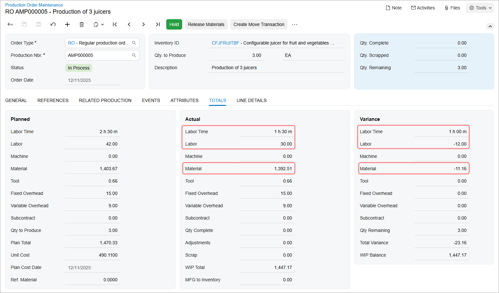
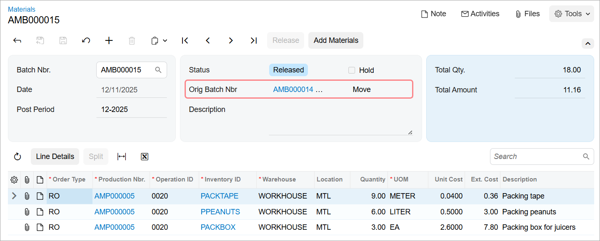
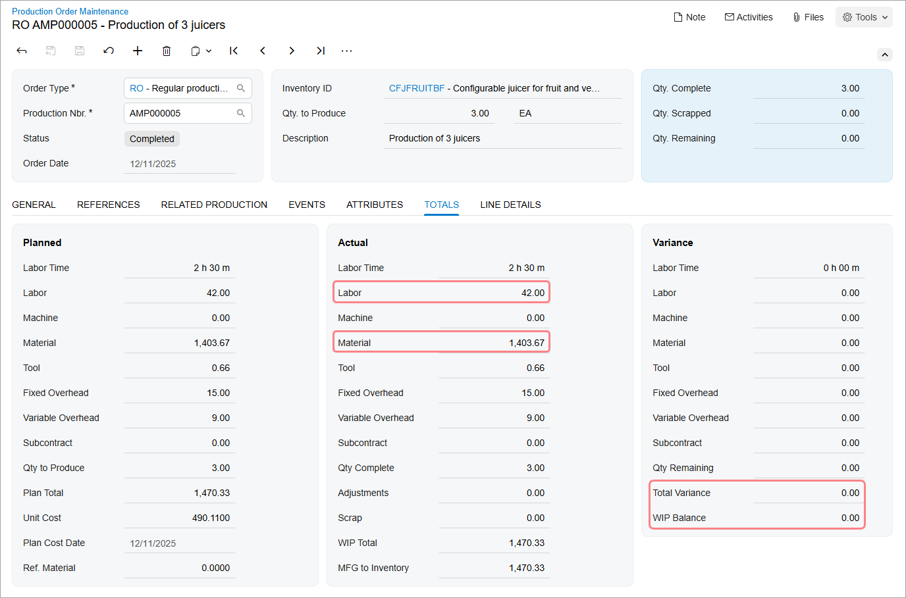

# Production with Backflushing: Process Activity {#_3a6705c8-0dc2-4ff5-a0fd-cb84bcbec174 .task}

The following activity will walk you through the process of producing items with backflushed materials and labor.

## Story { .section}

Suppose that GoodFood One Restaurant has ordered three juicers from the SweetLife Fruits &amp; Jams company. The production process includes the assembly and packing of the juicers. In the production process of SweetLife Fruits &amp; Jams, materials and labor are backflushed for the packing operation. Further suppose that all components required for the juicer assembly and packing are available in SweetLife Fruits &amp; Jams's warehouse.

Acting as a production manager, you will create a production order for producing the juicers and process all transactions related to production.

## Configuration Overview { .section}

In the *U100* dataset, the following tasks have been performed to support this activity:

-   On the [Warehouses](IN_20_40_00.md) \(IN204000\) form, the *WORKHOUSE* warehouse has been defined, and its locations include *MGI* and *MTL*.
-   On the [Stock Items](IN_20_25_00.md) \(IN202500\) form, the *CFJFRUITBF*, *PULPCONT1L*, *JUICECUP05L*, *MRBASE*, *FNSIEVE*, *GRDISC01*, *PACKTAPE*, *PPEANUTS*, and *PACKBOX* stock items have been defined.

## Process Overview { .section}

In this activity, to process the documents and transactions related to the production of the juicers, you will do the following:

1.  On the [Production Order Maintenance](AM_20_15_00.md) \(AM201500\) form, create and release the production order
2.  On the [Materials](AM_30_00_00.md) \(AM300000\) form, issue the materials required for the assembly operation
3.  On the [Labor](AM_30_10_00.md) \(AM301000\) form, record the labor spent on the juicer assembly and the produced quantity
4.  On the [Production Order Maintenance](AM_20_15_00.md) form, review the production order balances after the assembly operation
5.  On the [Move](AM_30_20_00.md) \(AM302000\) form, record the produced items for the packing operation
6.  On the [Materials](AM_30_00_00.md) and [Cost Transactions](AM_30_90_00.md) \(AM309000\) forms, review the transactions that the system created and released when you released the move transaction
7.  On the [Production Order Maintenance](AM_20_15_00.md) form, review the production order balances after you have completed the order
8.  On the [Close Production Orders](AM_50_60_00.md) \(AM506000\) form, close the production order

## System Preparation { .section}

Do the following:

1.  As a prerequisite to the current activity, complete [Configuration of Production with Backflushing: Implementation Activity](../ImplementationGuide/config_MFG_Backflushing_Implem_Activity.md) so that the system is ready for processing the production of juicers with labor and material backflushing.
2.  Launch the Acumatica ERP website, and sign in to the company in which the prerequisite activities have been performed. You should sign in as the production manager by using the *peters* username and the *123* password.
3.  In the info area, in the upper-right corner of the top pane of the Acumatica ERP screen, make sure that the business date in your system is set to today’s date. For simplicity, in this activity, you will create and process all documents in the system on this business date.

## Step 1: Creating the Production Order { .section}

To create the production order for three juicers, do the following:

1.  On the [Production Order Maintenance](AM_20_15_00.md) \(AM201500\) form, add a new record.

    Notice that the production order is assigned a status of *Planned*, and today's date has been automatically selected in the **Order Date** box.

2.  In the Summary area, do the following:
    -   In the **Order Type** box, make sure *RO* is specified.
    -   In the **Inventory ID** box, select *CFJFRUITBF*.

        On the **General** tab, notice that the *WORKHOUSE* warehouse and the *MGI* location have been selected automatically.

    -   In the **Qty. to Produce** box, specify `3`.
    -   In the **Description** box, specify `Production of 3 juicers`.
3.  On the form toolbar, click **Save**.
4.  On the form toolbar, click **Release Order**. The order's status changes to *Released*.

## Step 2: Issuing Materials for the Assembly Operation { .section}

In this step, you will issue the materials for the assembly operation of the production order. Do the following:

1.  While you are still viewing the production order on the [Production Order Maintenance](AM_20_15_00.md) \(AM201500\) form, on the More menu \(under **Transactions**\), click **Release Materials**. The system opens the [Select Materials to Release](AM_30_00_20.md) \(AM300020\) form with the list of materials needed for the assembly operation.
2.  On the form toolbar, click **Select All**. The system creates the material transaction and opens it on the [Materials](AM_30_00_00.md) \(AM300000\) form.
3.  In the Summary area, do the following:
    1.  In the **Description** box, specify `Materials for the assembly operation`.
    2.  Clear the **Hold** check box. The system changes the transaction's status to *Balanced*.
4.  On the form toolbar, click **Release**. The system releases the material transaction and changes the status of the transaction to *Released*.

## Step 3: Recording the Labor and Produced Items for the Assembly Operation { .section}

Suppose that Carlos Cruz, a worker in the work center, spent 30 minutes setting up the working environment for juicer assembly and assembled three juicers for one hour. To record the time spent on juicer assembly and the assembled quantity of juicers, do the following:

1.  On the [Labor](AM_30_10_00.md) \(AM301000\) form, add a new record.
2.  On the table toolbar, click **Add Row**.
3.  In the row, specify the following settings:
    -   **Labor Type**: *Direct*
    -   **Order Type**: *RO*
    -   **Production Nbr.**: The number of the production order that you created earlier in this activity
    -   **Operation**: *0010*
    -   **Employee ID**: *EP00000027* \(Carlos Cruz\)
    -   **Shift**: *0001*
    -   **Labor Time**: *01:30*
    -   **Quantity**: `3`
4.  In the Summary area, do the following:
    1.  Make sure that today's date is specified in the **Date** box.
    2.  In the **Description** box, specify `Recording the time for assembly of 3 juicers and the completed quantity`.
    3.  Clear the **Hold** check box. The system changes the transaction's status to *Balanced*.
5.  On the form toolbar, click **Release**. The system creates and releases a cost transaction to record the labor costs and releases the labor transaction.

## Step 4: Reviewing the Production Order Balance { .section}

To review the production order balance after you have recorded the completion of the assembly operation, do the following:

1.  On the [Production Order Maintenance](AM_20_15_00.md) \(AM201500\) form, open the production order you created earlier in this activity.
2.  On the **Totals** tab, review the production order balance \(shown in the screenshot below\) as follows:

    1.  Notice that in the **Actual** section, the following values are displayed:

        -   **Labor Time**: *1 h 30 m*
        -   **Labor**: *30.00*
        -   **Material**: *1392.51*
        This means that the system applied the labor and material costs of the assembly operation to the production order.

    2.  Notice that in the **Variance** section, the following values are displayed:

        -   **Labor Time**: *1 h 00 m*
        -   **Labor**: *-12.00*
        -   **Material**: *-11.16*
        These costs relate to the packing operation and the system has not applied the costs to the production order yet.

    

## Step 5: Recording the Produced Items for the Packing Operation { .section}

Suppose that a worker in the packing work center has packed all three assembled juicers. To record the completion of the packing operation, do the following:

1.  While you are still viewing the production order on the [Production Order Maintenance](AM_20_15_00.md) \(AM201500\) form, on the form toolbar, click **Create Move Transaction**. The system creates a move transaction for the *0020* operation and opens it on the [Move](AM_30_20_00.md) \(AM302000\) form.
2.  In the Summary area, do the following:
    1.  Make sure that today's date is specified in the **Date** box.
    2.  In the **Description** box, enter `Recording the completion of packing 3 juicers`.
    3.  Clear the **Hold** check box. The system changes the transaction's status to *Balanced*.
3.  On the form toolbar, click **Release**. The system releases the move transaction.

## Step 6: Reviewing the Transactions for the Packing Operation { .section}

In this step, you will review the transactions that the system created and released when you released the move transaction for the packing operation. Do the following:

1.  On the [Materials](AM_30_00_00.md) \(AM300000\) form, open the transaction for the materials needed for the packing operation with the total amount of $11.16 \(shown in the following screenshot\).
2.  Notice that in the **Orig. Batch Nbr.** box, the reference number of the move transaction, which caused the creation of the material transaction, is displayed.

    

3.  On the [Cost Transactions](AM_30_90_00.md) \(AM309000\) form, open the transaction with the total amount of $1482.33.
4.  Notice that in the **Orig. Batch Nbr.** box, the reference number of the move transaction, which triggered the creation of the cost transaction, is displayed.
5.  In the table of the form, notice that the transaction contains rows with the following **Tran. Type** values:
    -   *Backflush Labor*: The system added the labor cost of $12.00 for the packing operation to the *51000 - Direct Labor Costs* account. This was issued because quantity was reported.
    -   *Operation MFG to Inventory* for an extended cost of $23.16: The receipt took the cost from the *0020* operation and applied it to the inventory receipt cost.
    -   *Operation MFG to Inventory* for an extended cost of $1447.17: The receipt took the cost from the *0010* operation and applied it to the inventory receipt cost.

## Step 7: Reviewing the Production Order Balance { .section}

To review the production order balance after you have recorded the completion of the packing operation, do the following:

1.  On the [Production Order Maintenance](AM_20_15_00.md) \(AM201500\) form, open the production order you created earlier in this activity.
2.  On the **Totals** tab, review the production order balance after the completion of the order \(shown in the following screenshot\) as follows:

    1.  Notice that in the **Actual** section, the **Labor** box contains *42.00*, which is the full labor cost for two operations.
    2.  Notice that the **Material** box contains *1403.67*, which is the full cost of the materials for two operations.
    3.  Notice that in the **Variance** section, the values in the **Total Variance** and **WIP Balance** boxes are *0.00*.
    

## Step 8: Closing the Production Order { .section}

Now you will close the production order. Do the following:

1.  On the [Close Production Orders](../Shared/../UserGuide/AM_50_60_00.md) \(AM506000\) form, select the production order.
2.  On the form toolbar, click **Process**. In the **Processing** dialog box, which opens, review the processing details, and when the processing is completed, click **Close**.
3.  Go to the [Production Order Maintenance](../Shared/../UserGuide/AM_20_15_00.md) form, and notice that the status of the production order has changed to *Closed*.

You have successfully created the production order for the assembly and packing of three juicers and have processed all the transactions related to the production.

**Parent topic:**[Producing Items with Backflushing](../UserGuide/MFG_Backflushing_Mapref.md)

