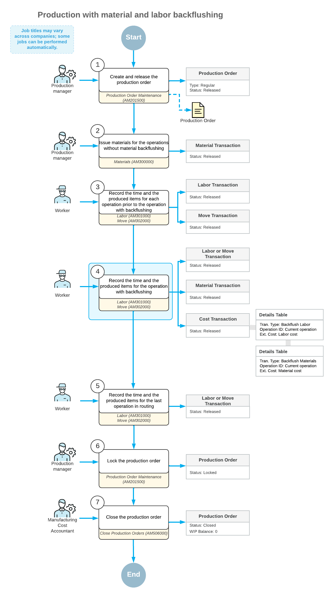

# Production with Backflushing: General Information {#_4e5d9c24-fdd3-49fa-b8f9-2629b73525c9 .concept}

Backflushing is a method for issuing materials or applying labor costs to production orders when workers record the items produced at a specific operation. Acumatica ERP Manufacturing Edition gives you the ability to backflush material and labor costs during item production, as described in the following sections.

## Learning Objectives { .section}

In this chapter, you will learn how to process production orders with operations for which material and labor costs will be backflushed.

## Applicable Scenarios { .section}

You process production orders with operations for which material and labor costs are backflushed in the following cases:

-   Bills of material contain floor stock items whose costs are not significant; examples of such items include lubricants, labels, hardware, wiring, and packing materials. In this case, a production or warehouse manager periodically reconciles the on-hand balance of the items in stock.
-   Your organization uses bulk materials, such as bar stock, roll stock, sheet goods, and dry goods or liquids in bulk containers. The exact quantity of these materials cannot be specified.
-   In production operations, scrap is common in the finished product. Workers continue to produce the item until they have produced items whose quality is acceptable in a quantity equal to the quantity to produce in the production order.
-   Workers record production at milestone operations but would like to also record materials being consumed at operations that are not milestones.
-   Workers perform operations for multiple production orders simultaneously or in a continuous run. These operations might include cleaning, painting, or plating. In this case, it would be difficult to post labor costs to individual orders. A similar situation occurs in production areas—such as filling, testing, packing, or assembly—where multiple operators work on any item that appears at their work station, and these operators do not record their time against specific production orders.

## Backflushing in Production { .section}

Backflushing is commonly referred to as *postproduction issuing*. This approach differs from *preproduction issuing*, for which materials are pulled from stores and issued to production orders prior to the start of an operation, and labor is directly reported for each operation.

With backflushing, material and labor costs are flushed backwards through operations to assign costs to products based on the quantity produced at the operations. This eliminates detailed tracking of costs. With backflushing, employees involved in production can save time on preliminary issue of materials, on recording the labor amount and produced items for each operation, and on recording returns of any unused materials.

Backflushing can ensure that the full cost of production is recognized when workers record the quantity of produced items for the final operation in the routing. In the backflushing process, the system automatically issues the materials consumed based on the item quantity reported for an operation. Thus, you can make the cost of the product more representative and minimize cost variances.

Backflushing is not appropriate if any of the following conditions are met:

1.  The amount of labor recorded for operations may vary from one production run to another. This amount may represent a significant cost of the product.
2.  Your organization tracks employees for the product being produced.
3.  You use lot- or serial-tracked materials in production. Although the system can automatically issue lot- or serial-tracked items during backflushing, in this case, backflushing is generally not recommended.
4.  Material consumption is variable, or significant waste of materials may occur.
5.  Material substitutions are common and allowed during the production process.
6.  Labor transactions for each employee need to be reconciled with time and attendance for payroll purposes, or a shop data collection system is used.

## The Production Process with Material and Labor Backflushing { .section}

Suppose that a production order has the operations defined in the Operations table of the [Production Order Details](AM_20_90_00.md) \(AM209000\) form with the settings shown in the following table.

|Operation ID|Backflush Labor|Backflush Materials|
|------------|---------------|-------------------|
|0010|Cleared|Cleared|
|0020|Selected|Selected|
|0030|Selected|N/A|

In the following diagram, you can view the actions and generated documents for this production order.

The employees involved do the following to process the production order and the related transactions:

1.  *Create and release the production order.*

    On the [Production Order Maintenance](AM_20_15_00.md) \(AM201500\) form, the production manager creates and releases the production order.

2.  *Issue the materials for the first operation*

    On the [Materials](AM_30_00_00.md) \(AM300000\) form, the production manager issues the materials required for the first operation.

    **Note:** If a material has the **Backflush Materials** check box selected in the production order settings, it does not need to be issued before employees record the quantity of the item that is produced.

3.  *Record the time spent and the quantity of completed items for the first operation.*

    On the [Labor](AM_30_10_00.md) \(AM301000\) form, workers record the time they spent on the first operation and the item quantity they produced during the operation.

4.  *Record the quantity of the completed items for the second operation.*

    On the [Move](AM_30_20_00.md) \(AM302000\) form, a worker records the completion of the items for the second operation. When the worker releases the move transaction, the system also does the following:

    -   Creates and releases the material transaction on the [Materials](AM_30_00_00.md) form with the backflushed materials.
    -   Creates and releases the cost transaction on the [Cost Transactions](AM_30_90_00.md) \(AM309000\) form. The transaction includes the cost of the backflushed labor and the cost of the backflushed materials.
    **Note:** If the worker also records the time for the operation, they use the [Labor](AM_30_10_00.md) form instead of the [Move](AM_30_20_00.md) form.

5.  *Record the time spent and the quantity of completed items for the last operation.*

    On the [Labor](AM_30_10_00.md) form, the worker records the time they spent on the last operation and the item quantity they produced during the operation.

6.  *Lock the production order.*

    On the [Production Order Maintenance](AM_20_15_00.md) form, the production manager locks the production order.

7.  *Close the production order.*

    On the [Close Production Orders](AM_50_60_00.md) \(AM506000\) form, the production cost accountant closes the production order.

## Material Transaction for Backflushed Materials { .section}

When the system creates the material transaction for backflushed materials on the [Materials](AM_30_00_00.md) \(AM300000\) form, the system issues each material from the warehouse or warehouse location specified in the material row of the production order. If the warehouse or location is not specified, the system issues the items from the default issue location specified for each stock item that represents the material. For more information, see [Production Processing: Selection of Warehouse Locations](MFG_PM_BinLocations.md).

If the on-hand quantity of any material in stock is less than the recorded quantity of the produced item, the system will not release the material transaction and will display an error message. If you want the system to be able to release transactions that will cause a negative quantity in stock, you should select the **Allow Negative Quantity** check box on the [Item Classes](IN_20_10_00.md) \(IN201000\) form for the item class selected on the [Stock Items](IN_20_25_00.md) \(IN202500\) form for the stock item that represents the material.

## Material and Labor Cost Adjustments { .section}

The purpose of the material and labor cost adjustments is to reconcile the costs charged to the production order accordingly.

If any previous operations contain backflushed materials, the system calculates the material quantity to be issued considering the completed quantity for the previous operations and for the current operation.

If labor should be backflushed for any previous operations, the system adjusts the labor hours, if necessary, to agree with the quantity recorded at the current operation.

**Parent topic:**[Producing Items with Backflushing](../UserGuide/MFG_Backflushing_Mapref.md)

