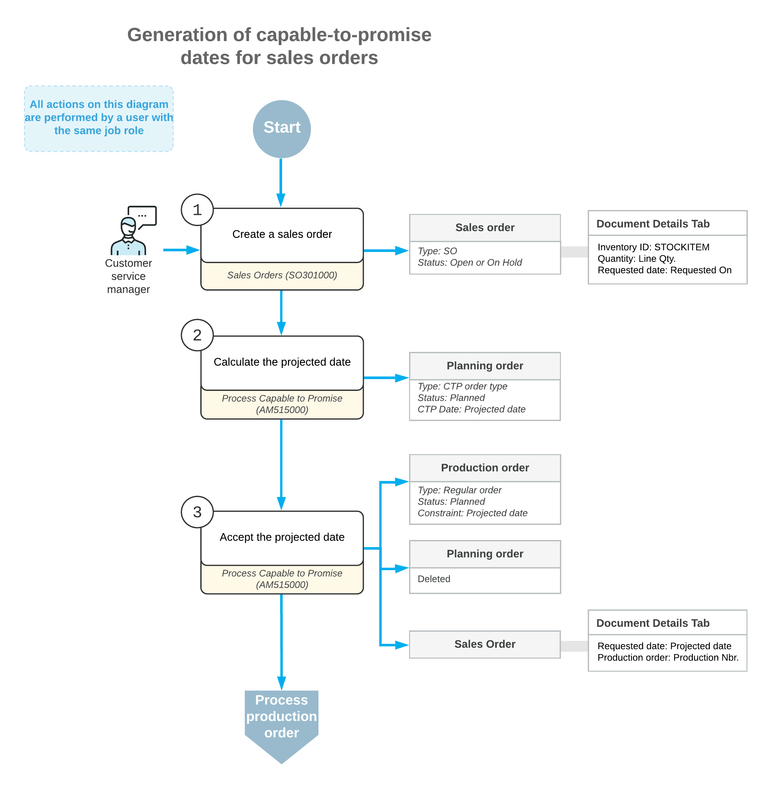

# Capable to Promise: General Information {#_64db8cea-c90b-4c8b-89bd-e1bfcff24a28 .concept}

Acumatica ERP Manufacturing Edition provides the capable-to-promise \(CTP\) functionality, which is valuable for your organization if you use advanced planning and scheduling. This functionality provides you with the ability to commit to shipping dates for customer orders with the system taking into account production and on resource capacity and inventory on production, resource capacity, and inventory.

When you use the CTP functionality, the system determines when shipping will be possible by using finite scheduling. The system takes into consideration the constraints of the manufacturing system that might hinder production, such as the accessibility of necessary resources, the lead times for acquiring raw materials or purchased parts, and the ability to acquire the resources needed for subassemblies or lower-level components.

This functionality is available only when the *Advanced Planning and Scheduling* feature is enabled on the [Enable/Disable Features](CS_10_00_00.md) \(CS100000\) form.

## Learning Objectives { .section}

In this chapter, you will learn how to do the following:

-   Prepare the system for using the capable-to-promise functionality
-   Perform the calculation of projected dates \(also referred to as *CTP dates*\) for items in sales orders

## Applicable Scenario { .section}

You may need to calculate the CTP dates for items of a sales order when your organization uses the advanced planning and scheduling functionality of Acumatica ERP Manufacturing Edition and wants be able to give the customers a realistic projected shipping date during sales order creation.

## Calculation of Projected Dates for a Sales Order { .section}

When you create a sales order on the [Sales Orders](SO_30_10_00.md) \(SO301000\) form with items to be produced, you can specify the date by which the customer expects to receive each item in the **Requested On** column of the **Document Details** tab. You can then estimate the projected date when the requested quantity of items can be shipped to the customer. To do this, you click **Process CTP** on the More menu, which causes the system to open the [Process Capable to Promise](AM_51_50_00.md) \(AM515000\) form with the lines of the sales order whose items have the **CTP Item** check box selected on the **Manufacturing** tab of the [Stock Items](IN_20_25_00.md) \(IN202500\) form.

**Attention:** The **Process CTP** command is available when all of the following conditions are met:

-   The *Advanced Planning and Scheduling* feature is enabled on the [Enable/Disable Features](CS_10_00_00.md) \(CS100000\) form.
-   The type of the sales order has the **Enable Linking to Production Orders** check box selected and the *Open* and *On Hold* statuses should be specified in the **Linkable Sales Order Statuses** list on the **General** tab on the [Order Types](SO_20_10_00.md) \(SO201000\) form.
-   The sales order has the *On Hold* or *Open* status.

On the [Process Capable to Promise](AM_51_50_00.md) form, you can select one line or multiple lines of the sales order \(by selecting the unlabeled Included check box for each line\), select *Process CTP* in the **Action** box, and click **Process** on the form toolbar to calculate the projected dates for the items in the selected lines. When the system finishes the calculation, the projected dates are displayed in the **CTP Date** column. During the calculation of the projected date, the system creates a planning order, which can be viewed on the [Production Order Details](AM_20_90_00.md) \(AM209000\) form.

The system also inserts the planning order’s type and number in the **Prod. Order Type** and **Prod. Order Nbr.** columns, respectively, of the [Process Capable to Promise](AM_51_50_00.md) form. On the form, you can accept the dates by selecting the needed lines of the sales order \(using the Included check boxes\), selecting the *Accept* action, and clicking **Process** on the form toolbar. For each accepted line, the system deletes the planning order, creates a production order \(whose type and number are displayed in the **Prod. Order Type** and **Prod. Order Number** columns, respectively\), and selects the check box in the **CTP Accepted** column.

If any CTP dates do not meet the date requested by the customer, you can reject the dates by selecting the needed lines of the sales order \(using the Included check boxes\), selecting the *Reject* action, and clicking **Process** on the form toolbar. For each rejected line, the system deletes the planning order. In this case, you can negotiate with the customer to agree on new dates when the items in the order can be shipped; you can then update the requested dates in the sales order.

Also, you may want to find out how many of the item you can actually ship to the customer by the requested date. You can click the quantity in the **Open Qty.** column of the needed line to open the **Quantity Available** dialog box, which displays the available quantities of the item.

## Workflow of Generating Capable-to-Promise Dates for Sales Orders { .section}

The typical workflow of generating capable-to-promise dates for sales orders involves the actions and generated documents shown in the following diagram.

**Parent topic:**[Processing Capable to Promise](../UserGuide/MFG_CTP_Mapref.md)

