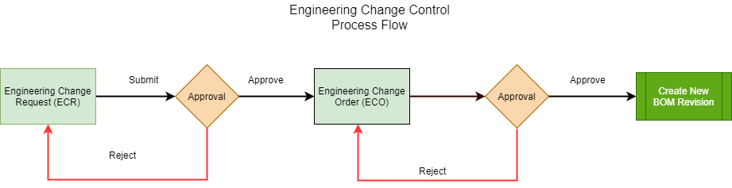

# Engineering Change Control: General Information {#_89fd2c92-bdd9-43ac-8cd7-d5d6f9fac64c .concept}

Engineering change control \(ECC\) is an essential requirement for maintaining control of manufacturing master data in a rapidly changing world. The primary purpose of ECC is to control changes to bills of material. For a rapidly changing or heavily regulated manufacturing company, ECC will assist and monitor the process of changing a bill of material \(BOM\) and gaining approval if required.

You can use engineering change control functionality only if the *Engineering Change Control* feature in the *Manufacturing* group of features is enabled on the [Enable/Disable Features](CS_10_00_00.md) \(CS100000\) form.

In this topic, you will read about ECC in Acumatica ERP.

## ECC Functionality { .section}

Engineering change control provides the following abilities:

-   Automates, controls, and organizes all change requests, plans, and actual changes to a bill of material.
-   Full control from an engineering change request \(ECR\) to an engineering change order \(ECO\) to updating the bill of material.
-   The ability to create multiple engineering change orders from multiple approved engineering change requests with the option to merge ECRs for the same bill of material and revision to a single ECO.
-   The ability to use approval and assignment maps to control the approval process for both change requests and change orders. You can specify if approvals are required for either ECRs or ECOs, or for both.
-   Create notification templates on the [Email Templates](SM_20_40_03.md#) \(SM204003\) form to inform users of the statuses of an ECR, ECO, and bill of material updates.

The following restrictions apply if the **Require ECR/ECO for New BOM Revisions** check box is selected on the [BOM Preferences](AM_10_10_00.md) \(AM101000\) form:

-   You cannot select the **Hold** check box for a bill of material \(BOM\) to edit it directly. You must use the ECR or ECO process to update the BOM once an ECR is created for the BOM.
-   You can optionally forbid manual creation of a new revision for a bill of material and force all new revisions to be created by the ECC process.

## Direct Creation of Engineering Change Orders { .section}

If you organization has a small engineering team, you may find it undesirable to create an engineering change request as a prerequisite to creating an engineering change order. The team may want to eliminate the extra step of reviewing and generating the ECO and avoid storing unnecessary data in the system.

To allow the direct creation of ECOs, you clear the **Require ECR before Creating ECO** check box on the [BOM Preferences](AM_10_10_00.md) \(AM101000\) form. After that, you can create an ECO directly on the [Engineering Change Order](AM_21_50_00.md) \(AM215000\) form by clicking **Add New Record** on the form toolbar.

**Attention:** Once the check box has been cleared, we do not recommend selecting it again because this may cause the engineering change control functionality to work improperly.

## ECC Workflow { .section}

In the following diagram, you can view the workflow of engineering change control with the following settings on the [BOM Preferences](AM_10_10_00.md) \(AM101000\) form:

-   **Require ECR before Creating ECO**: Selected
-   **ECR Require Approval**: Selected
-   **ECO Require Approval**: Selected

To initiate changes in an existing bill of material, you perform the following steps:

1.  Create an ECR by using the [Engineering Change Request](AM_21_00_00.md) \(AM210000\) form. The ECR status is *On Hold*.
2.  Submit the ECR. The ECR status is changed to *Pending Approval*.
3.  Acting as an approver, approve the ECR. The ECR status is changed to *Approved*.
4.  Initiate the creation of the ECO based on the ECR. The ECR status is changed to *Completed*.
5.  Open the created ECO on the [Engineering Change Order](AM_21_50_00.md) \(AM215000\) form.
6.  Review the ECO details and submit the ECO. The ECO status is changed to *Pending Approval*.
7.  Acting as an approver, approve the ECO. The ECO status is changed to *Approved*.
8.  Initiate the creation of the bill of material revision from the ECO. The ECO status is changed to *Completed*.

**Parent topic:**[Engineering Change Control](../UserGuide/MFG_ECC_Mapref.md)

