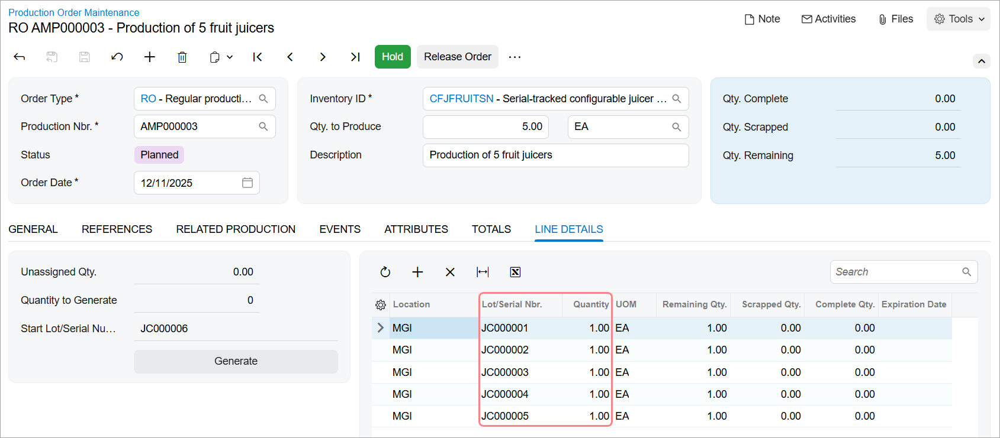
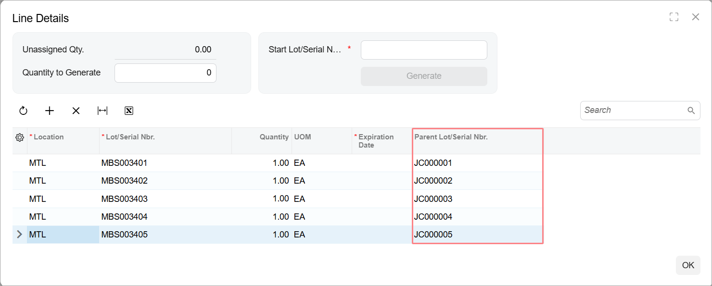
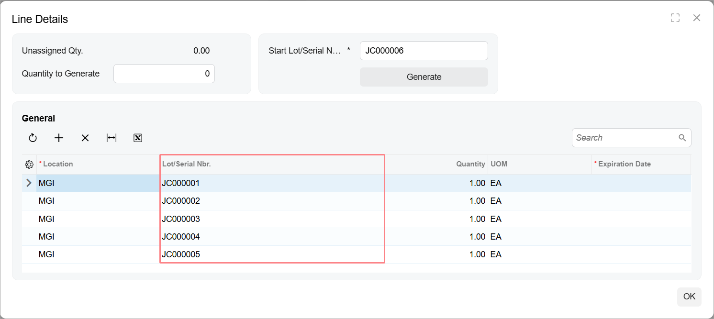
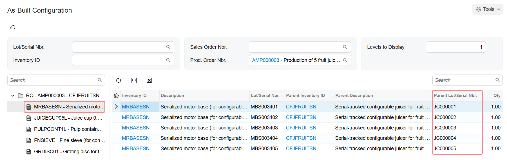

# Production of Lot- or Serial-Tracked Items: To Assign Parent Serial Numbers to Materials on Issue {#_dc3e61a7-eda1-43f7-bbcc-76ad47119100 .task}

The following activity will walk you through the process of creating and processing a production order with a serial-tracked item and serial-tracked material. During processing, you will assign the serial numbers of the item to be produced \(the parent item\) to the units of serial-tracked materials when the materials are issued.

## Story { .section}

Suppose that based on the analyzed sales demand from previous periods, the sales department of SweetLife has asked the production department to produce five juicers. These juicers are serial-tracked and include a serial-tracked motor base as one of the materials, according to the bill of material dedicated to the juicer's production. Further suppose that the serial number of each motor base must be assigned to the serial number of a juicer for whose assembly the motor base was used. The production manager should assign the serial numbers when the materials for a production order are issued. The information about the serial numbers must be stored in the system because SweetLife provides services for juicer repairing and replacement. They must be able to confirm that the juicer and its parts were bought from SweetLife and to track the components that were used in the production of this specific juicer.

The materials required for the juicer's production are in stock; you do not need to purchase any of them. Also suppose that the scheduling priority is standard \(that is, you do not need to produce the juicers more quickly or more slowly than the other items in the queue\).

Acting as a production manager, you will create a production order for producing five juicer units, generate serial numbers for the juicer units, issue the materials required for the juicer's production, assign the generated serial numbers to the motor base units, and process the other related transactions.

## Configuration Overview { .section}

In the *U100* dataset, the following tasks have been performed to support this activity:

-   On the [Warehouses](IN_20_40_00.md) \(IN204000\) form, the *WORKHOUSE* warehouse has been defined, and its locations include *MGI* and *MTL*.
-   On the [Stock Items](IN_20_25_00.md) \(IN202500\) form, the *CFJFRUITSN*, *PULPCONT1L*, *JUICECUP05L*, *MRBASESN*, *FNSIEVE*, and *GRDISC01* stock items have been defined.
-   On the [Lot/Serial Classes](IN_20_70_00.md) \(IN207000\) form, the *SNJCRPRT* and *ASNCFGJCR* serial classes have been created.

## Process Overview { .section}

In this activity, to process the documents and transactions related to the production of the juicers, you will do the following:

1.  On the [Production Order Maintenance](AM_20_15_00.md) \(AM201500\) form, create the production order for the serialized item and specify the serial number tracking settings
2.  On the [Materials](AM_30_00_00.md) \(AM300000\) form, issue the components required for the production order and assign the serial numbers of the parent item to the serial-tracked material units
3.  On the [Move](AM_30_20_00.md) \(AM302000\) form, record the produced quantity of the items
4.  On the [Close Production Orders](AM_50_60_00.md) \(AM506000\) form, close the production order
5.  On the [As-Built Configuration](AM_40_17_00.md) \(AM401700\) form, review the serial numbers of the produced units assigned to the serial-tracked material units

## System Preparation { .section}

Do the following:

1.  As a prerequisite to the current activity, complete [Configuration for the Production of Lot- or Serial-Tracked Items: Implementation Activity](../ImplementationGuide/config_MFG_Lot_Serial_Tracked_Items_Implem_Activity.md) so that the system is ready for processing the production of serial-tracked items.
2.  Launch the Acumatica ERP website, and sign in to the company in which the prerequisite activities have been performed. You should sign in as the production manager by using the *peters* username and the *123* password.
3.  In the info area, in the upper-right corner of the top pane of the Acumatica ERP screen, make sure that the business date in your system is set to today’s date. For simplicity, in this activity, you will create and process all documents in the system on this business date.

## Step 1: Creating the Production Order { .section}

To create the production order for five juicers and specify the serial number tracking settings, do the following:

1.  On the [Production Order Maintenance](AM_20_15_00.md) \(AM201500\) form, add a new record.

    Notice that the production order is assigned a status of *Planned*, and today's date has been automatically selected in the **Order Date** box.

2.  In the Summary area, do the following:
    1.  In the **Order Type** box, make sure *RO* is specified.
    2.  In the **Inventory ID** box, select *CFJFRUITSN*.

        On the **General** tab, notice that the *WORKHOUSE* warehouse and the *MGI* location have been selected automatically.

    3.  In the **Qty. to Produce** box, specify `5`.
    4.  In the **Description** box, specify `Production of 5 fruit juicers`.
3.  On the **General** tab, set **Require Parent Lot/Serial Number** to *On Issue*.
4.  On the form toolbar, click **Save**.
5.  Go to the **Line Details** tab, and notice that the system has generated five serial numbers \(one for each unit to be produced\), as shown below.

    

6.  On the form toolbar, click **Release Order**. The order status is changed to *Released*.

## Step 2: Issuing the Components for the Production Order { .section}

In this step, you will issue the components for the production order and assign the serial numbers of the juicer units to the motor base units. Do the following:

1.  While you are still viewing the production order you have created on the [Production Order Maintenance](AM_20_15_00.md) \(AM201500\) form, on the More menu \(under **Transactions**\), click **Release Materials**. The system opens the [Select Materials to Release](AM_30_00_20.md) \(AM300020\) form with the list of components from the production order.
2.  On the form toolbar, click **Select All**. The system creates a material transaction, adds the selected components to the transaction, and opens the transaction on the [Materials](AM_30_00_00.md) \(AM300000\) form.
3.  In the **Description** box of the Summary area, enter `Materials for 5 fruit juicers`.
4.  Try to release the material transaction as follows:
    1.  In the Summary area, clear the **Hold** check box. The system changes the transaction's status to *Balanced*.
    2.  On the form toolbar, click **Release**. The system returns an error message stating that you need to assign parent serial numbers to the serial-tracked materials before releasing the material transaction.
5.  In the Summary area, select the **Hold** check box. The system changes the transaction's status to *On Hold*.
6.  In the table, click the row with the *MRBASESN* item.
7.  On the table toolbar, click **Line Details**.
8.  In the **Line Details** dialog box, which opens, do the following:
    1.  In the **Parent Lot/Serial Nbr.** column of each row, select a serial number from the list of numbers that have been preassigned to the production order, as shown in the following screenshot. You must assign a unique parent serial number to each material row.

        

    2.  Click **OK** to save your changes and close the dialog box.
9.  Notice that in the **Lot/Serial Nbr.** and **Parent Lot/Serial Nbr.** columns of the row with the *MRBASESN* item, *&lt;SPLIT&gt;* is specified. This means that multiple serial numbers have been selected for the material units.
10. In the Summary area, clear the **Hold** check box.
11. On the form toolbar, click **Release**. The system successfully releases the material transaction and changes the status of the transaction to *Released*.

## Step 3: Recording the Produced Items { .section}

Suppose that warehouse workers have assembled all five juicers and moved them to the *MGI* location of the *WORKHOUSE* warehouse. In the production environment, you would record the workers' time spent on juicer assembly, but in this activity, for simplicity, you will record only the movement of the assembled juicers. Do the following:

1.  On the [Production Order Maintenance](AM_20_15_00.md) \(AM201500\) form, open the production order that you created earlier in this activity.
2.  On the form toolbar, click **Create Move Transaction**. The system opens the [Move](AM_30_20_00.md) \(AM302000\) form with the row for the production order added to the table.
3.  On the table toolbar, click **Line Details**. The system opens the **Line Details** dialog box.

    Notice that in each table row, in the **Lot/Serial Nbr.** column, the system selected a serial number from the list of numbers that have been generated for the production order, as shown below.

    

4.  Click **OK** to close the dialog box.
5.  In the Summary area, do the following:
    1.  Make sure that today's date is specified in the **Date** box.
    2.  In the **Description** box, enter `Recording the movement of 5 fruit juicers`.
    3.  Clear the **Hold** check box. The system changes the transaction's status to *Balanced*.
6.  On the form toolbar, click **Release**. The system releases the move transaction.
7.  Open the production order on the [Production Order Maintenance](AM_20_15_00.md) form and notice that it is assigned the *Completed* status.

## Step 4: Closing the Production Order { .section}

Now you will close the production order. Do the following:

1.  On the [Close Production Orders](../Shared/../UserGuide/AM_50_60_00.md) \(AM506000\) form, select the production order.
2.  On the form toolbar, click **Process**. In the **Processing** dialog box, which opens, review the processing details, and when the processing is completed, click **Close**.
3.  Go to the [Production Order Maintenance](../Shared/../UserGuide/AM_20_15_00.md) form, and notice that the status of the production order has changed to *Closed*.

You have processed the production order with the serialized item and assigned the parent serial numbers to the serialized material units.

## Step 5: Reviewing the Serial Numbers Specified in the Production Order { .section}

You will review the list of serial numbers specified for the juicer units and the motor base units in the production order you created earlier in this activity. Do the following:

1.  Open the [As-Built Configuration](AM_40_17_00.md) \(AM401700\) form.
2.  In the **Prod. Order Nbr.** box of the Selection area, select the production order that you created earlier in this activity.
3.  In the tree, click the *MRBASESN* node.

    In the **Parent Lot/Serial Nbr.** column on the Item Details pane, review the serial numbers of juicer units assigned to the motor base items \(shown below\).

    

**Parent topic:**[Producing Lot- or Serial-Tracked Items](../UserGuide/MFG_Lot_Serial_Tracked_Items_Mapref.md)

