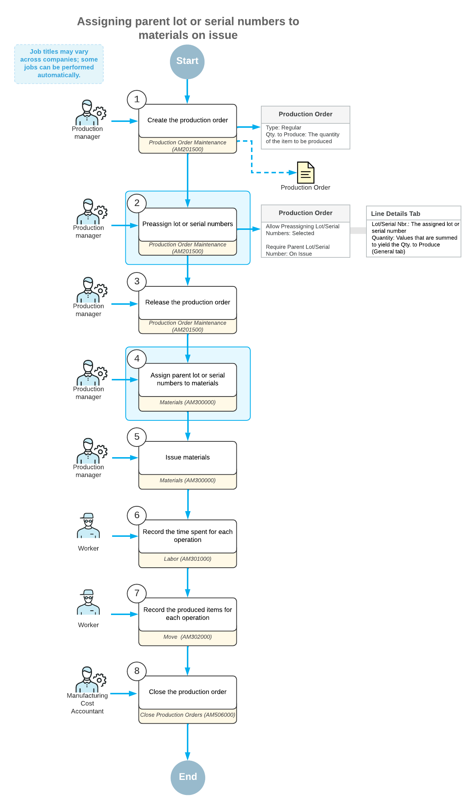
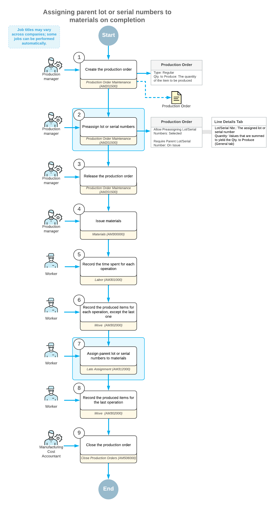

# Production of Lot- or Serial-Tracked Items: General Information {#_c3a3ea21-4cb2-4943-bb40-5c6d775f9cc8 .concept}

Acumatica ERP Manufacturing Edition provides you with the ability to record the production of lot- or serial-tracked items and the usage of lot- or serial-tracked materials in production, as described in this topic.

For more information about lot- or serial-tracked items, see [Items with Lot and Serial Numbers: General Information](Lot_and_Serial_Numbers_GeneralInfo.md).

## Learning Objectives { .section}

In this chapter, you will learn how to do the following:

-   Preassign lot or serial numbers to produced items
-   Assign the lot or serial numbers of the produced item to the lot- or serial-tracked materials used for this item
-   View the hierarchy of lot or serial numbers for produced items

## Applicable Scenarios { .section}

You track the production of lot- or serial-tracked items in the following cases:

-   When you want the units of items to be traceable through the whole lifecycle, from production to the people who consume or use the units of the item
-   When you guarantee the quality of produced items, with replacement if the customer is not satisfied, and thus need these numbers to track quality issues and ensure that the items were produced by your organization
-   When you produce items with expiration dates
-   When you organize the produced items in lots

## Assignment of Lot or Serial Numbers to Produced Items { .section}

Depending on the lifecycle of the lot- or serial-tracked items that your organization produces, you can assign lot or serial numbers to items at the following stages:

-   After the item is produced and moved to stock, such as when you sell the item: You assign the lot or serial number when receiving the item in a warehouse or shipping the item for a sales order. For details, see [Items with Lot and Serial Numbers: General Information](Lot_and_Serial_Numbers_GeneralInfo.md).
-   Before the item is produced: You assign the lot or serial number before you release a production order. For details, see the *Preassignment of Lot or Serial Numbers to Produced Items* section below.

    Also, during the processing of production transactions, you can assign the lot or serial numbers of produced items \(which have been preassigned\) to lot- or serial-tracked materials. For more information, see the *Assignment of Parent Lot or Serial Numbers to Materials* section below.

## Preassignment of Lot or Serial Numbers to Produced Items { .section}

To assign lot or serial numbers to the units of a produced item in a production order, on the [Production Order Maintenance](AM_20_15_00.md) \(AM201500\) form, you do the following:

1.  Create a production order for the lot- or serial-tracked item.
2.  On the **General** tab, make sure that the **Allow Preassigning Lot/Serial Numbers** check box is selected.

    **Note:** The system copies the state of this check box from the settings of the production order type selected in the **Order Type** box.

3.  If the item is serialized, on the **Line Details** tab, add a row for each unit of the item to be produced, and specify its serial number in the **Lot/Serial Nbr.** column. When you finish entering this data, the number of rows on this tab must be equal to the **Qty. to Produce** value on the **General** tab.

    **Tip:** If the **Auto-Generate Next Number** check box is selected on the [Lot/Serial Classes](IN_20_70_00.md) \(IN207000\) form for the serial class assigned to the item, the system generates the needed quantity of serial numbers automatically when you save your changes to the production order.

4.  If the item is tracked by lot, on the **Line Details** tab, add one row for each lot number \(and enter this number in the **Lot/Serial Nbr.** column\) to which units are assigned, and specify the quantity of units to which this lot number is assigned. The total sum in the **Quantity** column of all rows must be equal to the **Qty. to Produce** value on the **General** tab.

You can release the production order only when you have assigned lot or serial numbers to all units of the produced item. Otherwise, the system displays an error message and does not release the order.

## Assignment of Parent Lot or Serial Numbers to Materials { .section}

You can assign the lot or serial number of the item being produced \(the *parent item*\) to lot- or serial-tracked materials when processing production transactions. You can also set up the system so that it verifies that the parent lot or serial number has been assigned to materials. To do this, you select the needed option in the **Require Parent Lot/Serial Number** box of the [Production Order Maintenance](AM_20_15_00.md) \(AM201500\) form as follows:

-   If you do not want the system to verify that the lot or serial numbers of a parent item have been assigned to lot- or serial-tracked materials, you select *Never*. With this option selected for the production order, you still can assign the parent lot or serial numbers to materials on the [Materials](AM_30_00_00.md) \(AM300000\) or [Late Assignment](AM_31_20_00.md)\(AM312000\) forms, but the system does not require this.
-   If you want the system to verify that the lot or serial numbers of a produced item have been assigned to lot- or serial-tracked materials when a user releases a material transaction on the [Materials](AM_30_00_00.md) form, you select *On Issue*. The system will not release the transaction until the user assigns the lot or serial number of the produced item to each material. For more information, see the *Assignment of Parent Lot or Serial Numbers on the Issue of Materials* section below.

    **Note:** With this option, backflushing of lot- or serial-tracked materials is not supported, because this setting requires a lot or serial number to be assigned to the parent item at the moment when the materials are issued.

-   If you want the system to verify that the lot or serial numbers of a produced item have been specified for lot- or serial-tracked materials before users move the produced items into stock \(by releasing the appropriate transaction on the last operation\), you select *On Completion*. For details, see the *Assignment of Parent Lot or Serial Numbers to Materials on Completion* section below.

For a production order type, you can also specify the default option in the **Require Parent Lot/Serial Number** box on the [Production Order Types](AM_20_11_00.md) \(AM201100\) form; the system will initially insert this option for each production order of the type.

## Assignment of Parent Lot or Serial Numbers on the Issue of Materials { .section}

To assign the lot or serial numbers of the item being produced to lot- or serial-tracked materials when you issue materials for a production order—which you do when the *On Issue* value is specified in the **Require Parent Lot/Serial Number** box of the [Production Order Maintenance](AM_20_15_00.md) \(AM201500\) form for the production order—you do the following:

1.  On the [Materials](AM_30_00_00.md) \(AM300000\) form, add the materials required for producing the lot- or-serial tracked item for a particular production order.
2.  Click the row with the lot- or serial-tracked material, and click **Line Details** on the table toolbar. The system opens the **Line Details** dialog box.
3.  If the material is serialized, add a row in the dialog box for each unit of the material item and either specify its serial number in the **Lot/Serial Nbr.** column or make sure that the serial numbers have been generated automatically, depending on the settings of the serial class.
4.  If the material is tracked by lot, add one row for each lot number to which units are assigned and specify the quantity of units to which this lot number is assigned.
5.  In the **Parent Lot/Serial Nbr.** column, specify the lot or serial number of the parent item to be assigned to each row.
6.  Click **OK** to save the changes and close the dialog box.
7.  Release the material transaction by clicking **Release** on the form toolbar.

If you do not assign the lot or serial numbers of the parent item to any lot- or serial-tracked materials, the system displays an error message and does not release the transaction.

## Workflow of the Assignment of Parent Lot or Serial Numbers to Materials on Issue {#section_vv2_1y4_y4b .section}

For preassigning lot or serial numbers to parent items and assigning parent lot or serial numbers to materials on issue of the materials, the typical process involves the actions and generated documents shown in the following diagram.

## Assignment of Parent Lot or Serial Numbers to Materials on Completion { .section}

To assign the lot or serial numbers of the item to be produced to lot- or serial-tracked materials before you record movement of the produced parent item to stock—that is, when the *On Completion* value is specified in the **Require Parent Lot/Serial Number** box of the [Production Order Maintenance](AM_20_15_00.md) \(AM201500\) form for the production order—you do the following:

1.  On the [Materials](AM_30_00_00.md) \(AM300000\) form, release the material transaction with the materials required for producing the item in a particular production order, including the lot- or serial-tracked materials.
2.  On the [Labor](AM_30_10_00.md) \(AM301000\) or [Move](AM_30_20_00.md) \(AM302000\) form, record the movement of the produced items between the operations involved in production, except the last operation.
3.  When you record the movement of the produced items for the last operation on the [Labor](AM_30_10_00.md) or [Move](AM_30_20_00.md) form, click **Late Assignment** on the table toolbar to open the [Late Assignment](AM_31_20_00.md) \(AM312000\) form.
4.  Assign the parent lot or serial number to each material as follows:
    1.  In the **Lot/Serial Nbr.** box of the Summary area, select the lot or serial number of the parent that will be assigned to materials.
    2.  In the **Unallocated Components** table, click the material row to be assigned.
    3.  On the form toolbar, click **Allocate**. The system assigns the lot or serial number to the material and moves the material row to the **Allocated Components** table.
    4.  Repeat the previous subinstructions for each material to be allocated to the lot or serial number you have selected in the **Lot/Serial Nbr.** box.
5.  When you have allocated all needed materials to parent lot or serial numbers, open the [Labor](AM_30_10_00.md) or [Move](AM_30_20_00.md) form, and release the transaction for the last operation.

## Workflow of the Assignment of Parent Lot or Serial Numbers to Materials on Completion { .section}

For preassigning lot or serial numbers to parent items and assigning parent lot or serial numbers to materials on completion of a production order with the parent items, the typical process involves the actions and generated documents shown in the following diagram.

## Assigning Lot and Serial Attribute Values to Finished Items { .section}

You can capture lot or serial attribute values as you receive produced units of a lot- or serial-tracked item into stock on the [Move](AM_30_20_00.md) \(AM302000\) form.

**Attention:** This capability is available if the *Lot/Serial Attributes* feature is enabled on the [Enable/Disable Features](CS_10_00_00.md) \(CS100000\) form and lot or serial attributes have been configured for a lot- or serial-tracked item being produced. For details about configuring lot and serial attributes, see [Items with Lot and Serial Numbers: Lot and Serial Attributes](Lot_and_Serial_Numbers_Lot_Serial_Attributes.md).

To assign lot and serial attribute values, open the **Line Details** dialog box by clicking **Line Details** on the table toolbar; then select a line with a lot or serial number, and enter the attribute values in the **Lot/Serial Attributes** table.

Each lot or serial number can have its own attribute values. If all listed units share the same values, you can click **Use Attributes from First Line** on the table toolbar to assign the attribute values from the first line to all the units in the table.

## Issuing Materials with Particular Lot or Serial Attribute Values { .section}

You can search for and select lot or serial numbers by their attribute values when issuing materials to a production order on the [Materials](AM_30_00_00.md) \(AM300000\) form.

**Attention:** This capability is available if the *Lot/Serial Attributes* feature is enabled on the [Enable/Disable Features](CS_10_00_00.md) \(CS100000\) form and lot or serial attributes have been configured for lot- or serial-tracked materials. For details about configuring lot and serial attributes, see [Items with Lot and Serial Numbers: Lot and Serial Attributes](Lot_and_Serial_Numbers_Lot_Serial_Attributes.md).

To search for a material with a particular lot or serial number, click **Add Lot/Serial Nbr.** on the table toolbar. In the **Add Lot/Serial Nbr.** dialog box, which opens, you can view item availability and select materials. The table in the dialog box displays columns with the attribute values of each material with a particular lot or serial number. To search for materials, type a text string in the **Search** box. The system searches across attribute values and other columns with information about the item to find matching materials. You can also filter the list by columns with attribute values.

**Parent topic:**[Producing Lot- or Serial-Tracked Items](../UserGuide/MFG_Lot_Serial_Tracked_Items_Mapref.md)

