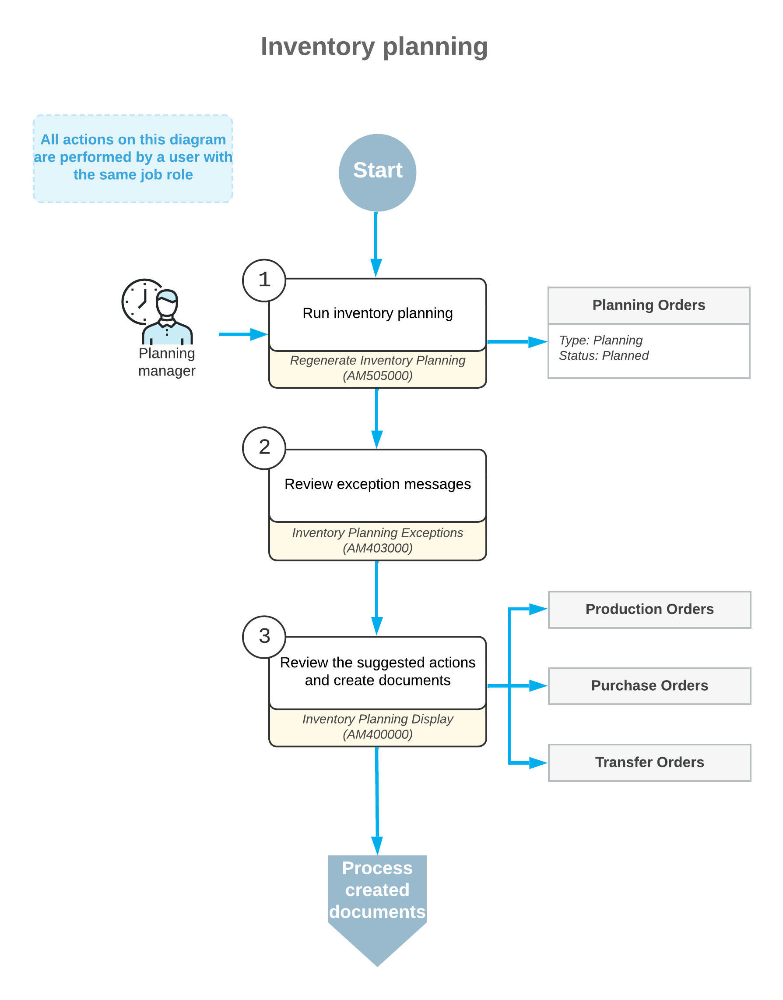

# Inventory Planning with MRP: General Information {#_b47187f3-3102-4b7e-af80-b4ed6d394850 .concept}

Inventory planning helps your organization to balance item quantities on demand and supply documents by managing production based on data analysis. Acumatica ERP Manufacturing Edition provides you with the tools to maintain the data underlying inventory planning, run inventory planning, and analyze the results. This topic describes the inventory planning process and the related processes.

For details about configuring inventory planning, see [Inventory Planning Configuration: General Information](../ImplementationGuide/config_Inventory_Planning_GeneralInfo.md).

The inventory planning functionality is available only if one of the following features is enabled on the [Enable/Disable Features](CS_10_00_00.md) \(CS100000\) form:

-   *Material Requirements Planning*
-   *Distribution Requirements Planning*

This topic describes how to perform inventory planning when the *Material Requirements Planning* is enabled on the [Enable/Disable Features](CS_10_00_00.md) form.

## Learning Objectives { .section}

In this chapter, you will learn how to run inventory planning, analyze its results, and create production orders, purchase orders, and transfer orders based on the results.

## Applicable Scenarios { .section}

You perform inventory planning when you would like to plan production based on demand and supply data.

## Performing of Inventory Planning { .section}

Generally, it is recommended that you run inventory planning before each business day, after all of the previous day's sales and purchase orders have been entered and their transactions affecting inventory have been posted. Because this is a very resource-dependent process, it should be run in a time frame that does not conflict with database maintenance processes.

You do the following to perform inventory planning:

1.  Process and release all documents and transactions that affect inventory, such as sales invoices, purchase receipts, and production orders.
2.  Run inventory planning regeneration by using the [Regenerate Inventory Planning](AM_50_50_00.md) \(AM505000\) form. \(We recommend that you schedule the running of inventory planning. For details, see [Inventory Planning Configuration: General Information](../ImplementationGuide/config_Inventory_Planning_GeneralInfo.md).\)
3.  Review exceptions by using the [Inventory Planning Exceptions](AM_40_30_00.md) \(AM403000\) form.
4.  Correct the planned dates of documents, if needed.
5.  Review the results of inventory planning regeneration by using the [Inventory Planning Display](AM_40_00_00.md) \(AM400000\) form.
6.  Create the required documents \(such as production orders, purchase orders, or transfer orders\) by using the same form.

## Workflow of Inventory Planning { .section}

The typical process of inventory planning that includes production orders involves the actions and documents shown in the following diagram.

## Inventory Planning Exception Analysis { .section}

Exception messages provide the reason for the exception according to inventory planning settings or suggest actions that you should take to balance supply and demand. You can view the exception messages on the [Inventory Planning Exceptions](AM_40_30_00.md) \(AM403000\) form after inventory planning has been regenerated. The types of exception messages that the system displays on this form are the following:

-   *Defer*: You can defer the supply document \(which can be a production order, a purchase order, or a transfer order\) to a later date because the order date is outside the period specified in the **Days Before** box but still within the period specified in the **Grace Period** box on the [Inventory Planning Preferences](AM_10_00_00.md) \(AM100000\) form.
-   *Delete*: You can delete the supply document; the document date does not fall within the grace period specified on the [Inventory Planning Preferences](AM_10_00_00.md) form, so the order is not needed.
-   *Expedite*: You should expedite the supply document so that it meets the ship dates because the document date is within the period specified in the **Grace Period** box but outside the period specified in the **Days After** box on the [Inventory Planning Preferences](AM_10_00_00.md) form.
-   *Order on Hold*: You may want to consider the supply document that is on hold to be a supply document.
-   *Late Order*: You may want to exclude this document from the potential supply because the document date is outside of the grace period defined on the [Inventory Planning Preferences](AM_10_00_00.md) form.
-   *Transfer Available*: You can create a transfer order to move the items required for shipping from another warehouse. This exception message is displayed when the needed item quantity is unavailable in the warehouse that is specified in the demand document but is available in that warehouse and only for past due demand documents.
-   *Order Without Sched. Shipment Date*: You may want to consider the blanket sales order to be a supply document even though the scheduled shipment date is unspecified either in any line of the order or in any line detail \(if details have been added to any order lines\).
-   *Transfer without Repl. Warehouse*: You need to specify a warehouse in the **Source Warehouse** box on the **Inventory Planning** tab of the [Item Warehouse Details](IN_20_45_00.md) \(IN204500\) form for the item and source warehouse combination if you want to create a transfer order for the item.
-   *Circular Transfer*: You need to change the transfer settings for the item on the [Item Warehouse Details](IN_20_45_00.md) form so that one or more warehouses do not make a closed loop for transferring the item.

## Creation of Documents Suggested by Inventory Planning { .section}

When inventory planning is regenerated \(manually or automatically\), the system creates a list of potential supply orders to meet the demand, or planning recommendations, which you then can convert to supply documents—that is, purchase, production, or transfer orders. Planning recommendations are temporary documents; the system deletes them once you convert them to supply documents. You can view the list of planning recommendations and create the supply documents by using the [Inventory Planning Display](AM_40_00_00.md) \(AM400000\) form.

You can create any type of supply document regardless of the source \(*Purchase* or *Manufacturing*\) specified for the planning recommendations. That is, you can create a purchase order or transfer order for an item with a source of *Manufacturing*.

**Parent topic:**[Inventory Planning with MRP](../UserGuide/MFG_MRP_Mapref.md)

