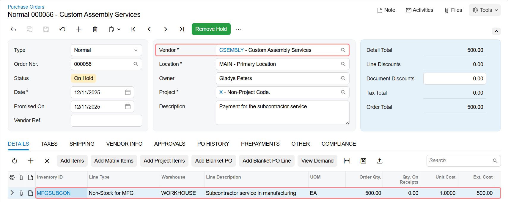
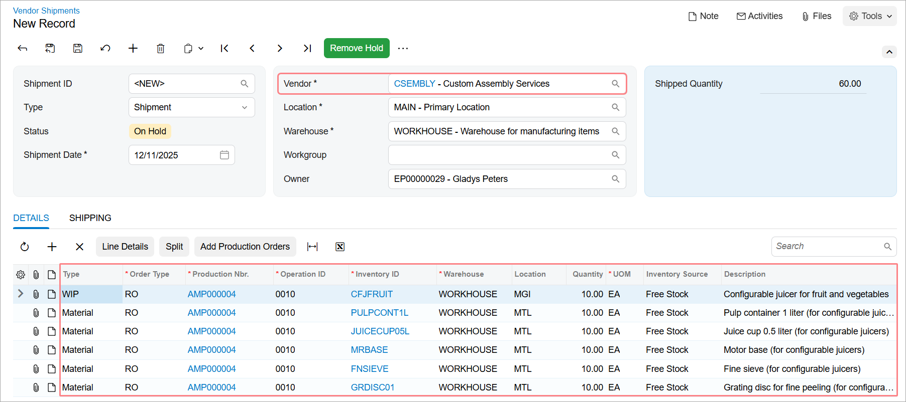
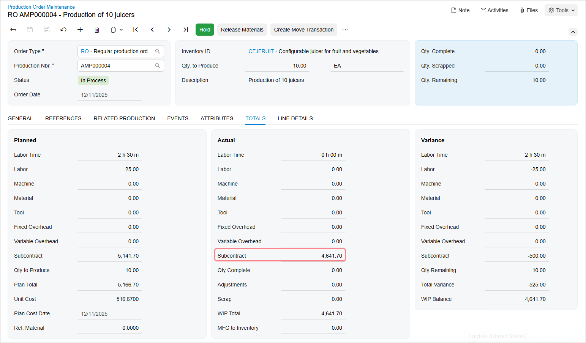
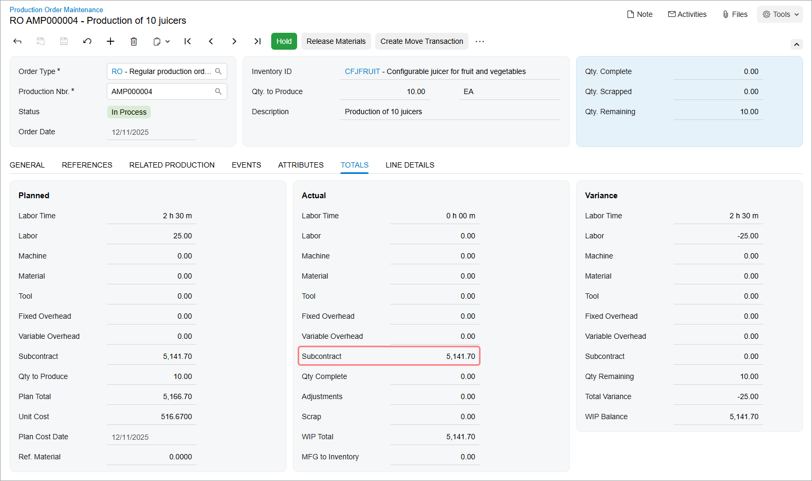
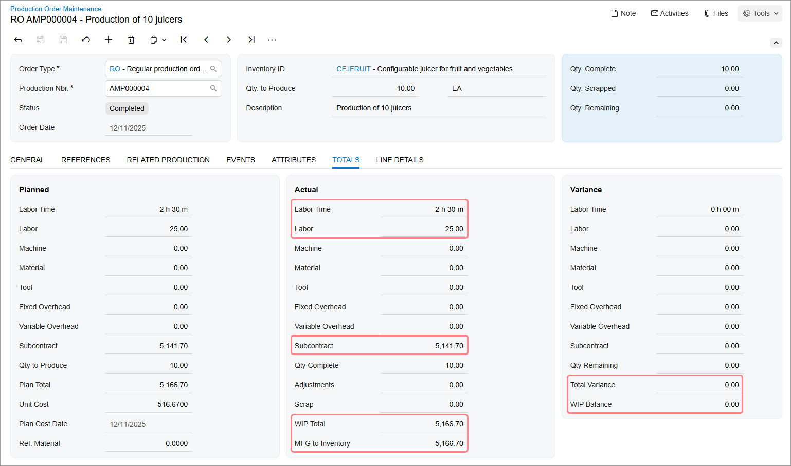

# Outside Processing: Process Activity {#_e2759030-a424-4b66-9261-69455dc5adfd .task}

The following activity will walk you through the process of creating and processing a production order that contains an outside processing operation.

## Story { .section}

Suppose that GoodFood One Restaurant has ordered 10 juicers from the SweetLife Fruits &amp; Jams company. Production managers have analyzed the workload of the production department and decided to outsource the assembly of these juicers to a subcontractor, Custom Assembly Services. Further suppose that all components required for the assembly of the juicer are available in SweetLife Fruits &amp; Jams's warehouse and will be shipped to the subcontractor. Also, SweetLife Fruits &amp; Jams will pay $50 per juicer for the subcontractor's services by using a purchase order.

Acting as a production manager, you will create a production order for producing 10 juicers, create a purchase order for the subcontractor's services, create a vendor shipment with the required materials for the juicer assembly, and process all transactions related to the production order.

## Configuration Overview { .section}

In the *U100* dataset, the following tasks have been performed to support this activity:

-   On the [Warehouses](IN_20_40_00.md) \(IN204000\) form, the *WORKHOUSE* warehouse has been defined, and its locations include *MGI* and *MTL*.
-   On the [Stock Items](IN_20_25_00.md) \(IN202500\) form, the *CFJFRUIT*, *PULPCONT1L*, *JUICECUP05L*, *MRBASE*, *FNSIEVE*, and *GRDISC01* stock items have been defined.
-   On the [Vendors](AP_30_30_00.md) \(AP303000\) form, the *CSEMBLY* vendor \(which provides the subcontractor services for juicer assembly\) has been defined.
-   On the [Non-Stock Items](IN_20_20_00.md) \(IN202000\) form, the *MFGSUBCON* non-stock item has been created.

## Process Overview { .section}

In this activity, to process the documents and transactions related to the production of the juicers, you will do the following:

1.  On the [Production Order Maintenance](AM_20_15_00.md) \(AM201500\) form, create a production order for the juicer assembly
2.  On the [Purchase Orders](PO_30_10_00.md) \(PO301000\) form, create and process the purchase order for the subcontractor service
3.  On the [Vendor Shipments](AM_31_00_00.md) \(AM310000\) form, create and process the vendor shipment, which records the delivery of the materials required for the juicer assembly to the subcontractor
4.  On the [Purchase Receipts](PO_30_20_00.md) \(PO302000\) form, create and process the related purchase receipt
5.  On the [Move](AM_30_20_00.md) \(AM302000\) form, record the receipt of the assembled juicers from the subcontractor to the dedicated warehouse location
6.  On the same form, you will record the movement of the inspected juicers to the warehouse location
7.  On the [Production Order Maintenance](AM_20_15_00.md) form, review the production order's balance
8.  On the [Close Production Orders](AM_50_60_00.md) \(AM506000\) form, close the production order

## System Preparation { .section}

Do the following:

1.  As a prerequisite to the current activity, complete [Outside Processing: Implementation Activity](MFG_Outside_Processing_Implem_Activity.md) so that the system is ready for processing the production of juicers that includes an outside operation.
2.  Launch the Acumatica ERP website, and sign in to the company in which the prerequisite activities have been performed. You should sign in as the production manager by using the *peters* username and the *123* password.
3.  In the info area, in the upper-right corner of the top pane of the Acumatica ERP screen, make sure that the business date in your system is set to today’s date. For simplicity, in this activity, you will create and process all documents in the system on this business date.

## Step 1: Creating the Production Order { .section}

To create the production order for 10 juicers, do the following:

1.  On the [Production Order Maintenance](AM_20_15_00.md) \(AM201500\) form, add a new record.

    Notice that the production order is assigned a status of *Planned*, and today's date has been automatically selected in the **Order Date** box.

2.  In the Summary area, do the following:
    -   In the **Order Type** box, make sure *RO* is specified.
    -   In the **Inventory ID** box, select *CFJFRUIT*.

        On the **General** tab, notice that the *WORKHOUSE* warehouse and the *MGI* location have been selected automatically.

    -   In the **Qty. to Produce** box, specify `10`.
    -   In the **Description** box, specify `Production of 10 juicers`.
3.  On the form toolbar, click **Save**.
4.  On the form toolbar, click **Release Order**. The order status changes to *Released*.

## Step 2: Creating a Purchase Order for the Subcontractor's Service { .section}

To create a purchase order for the subcontractor service, do the following:

1.  On the [Production Order Details](AM_20_90_00.md) \(AM209000\) form, open the production order you created earlier in this activity.
2.  In the Operations table, click the row with the *OUTPROC* work center.
3.  On the table toolbar, click **Create Purchase Order**. The system creates the purchase order for the CSEMBLY subcontractor, which is specified on the **Outside Process** tab, and opens the document on the [Purchase Orders](PO_30_10_00.md) \(PO301000\) form.

    Review the purchase order details \(shown in the following screenshot\). Notice that *CSEMBLY*, which is the subcontractor, is specified in the **Vendor** box of the Summary area. On the **Details** tab, make sure that the system has added one row of the *Non-Stock for MFG* type for the *MFGSUBCON* item with a unit cost of 1 and an extended cost of $500.

4.  In the **Description** box of the Summary area, enter `Payment for the subcontractor service`.

    

5.  On the form toolbar, click **Remove Hold**. The system changes the status of the purchase order to *Open*.

## Step 3: Creating a Vendor Shipment { .section}

To create a vendor shipment for the materials required for the juicer assembly, do the following:

1.  On the [Production Order Details](AM_20_90_00.md) \(AM209000\) form, open the production order you created earlier in this activity.
2.  In the Operations table, click the row with the *OUTPROC* work center.
3.  On the table toolbar, click **Create Vendor Shipment**. The system creates the vendor shipment for the CSEMBLY subcontractor, which is specified on the **Outside Process** tab, and opens the shipment on the [Vendor Shipments](AM_31_00_00.md) \(AM310000\) form.

    Review the details of the vendor shipment \(shown in the screenshot below\) as follows. Notice that *CSEMBLY*, which is the subcontractor, is specified in the **Vendor** box of the Summary area. On the **Details** tab, notice that the system has added one row of the *WIP* type for the *CFJFRUIT* item and five rows of the *Material* type for each of the materials required for the juicer assembly.

    

4.  On the form toolbar, click **Remove Hold**. The system changes the status to *Open*.
5.  On the form toolbar, click **Confirm**. The system changes the status to *Completed*.
6.  On the [Production Order Maintenance](AM_20_15_00.md) \(AM201500\) form, open the production order that you created earlier in this activity.

    On the **Totals** tab, notice that in the **Subcontract** box of the **Actual** section, *4,641.70* is specified, as shown in the following screenshot. This amount is the cost of the materials that have been shipped to the subcontractor.

    

## Step 4: Receiving Items from the Subcontractor { .section}

Suppose that the subcontractor has assembled the juicers and delivered them to the warehouse. To record the receipt of the juicers, you will create the purchase receipt for the purchase order. Do the following:

1.  On the [Purchase Orders](PO_30_10_00.md) \(PO301000\) form, open the purchase order you created earlier in this activity.
2.  On the form toolbar, click **Enter PO Receipt**. The system creates a purchase receipt and opens it on the [Purchase Receipts](PO_30_20_00.md) \(PO302000\) form.
3.  On the form toolbar, click **Release**. The system changes the status of the purchase receipt to *Released*.

## Step 5: Recording the Completion of the Outside Operation { .section}

To record the completion of the outside operation, create and release a move transaction as follows:

1.  On the [Production Order Maintenance](AM_20_15_00.md) \(AM201500\) form, open the production order that you created earlier in this activity.
2.  On the form toolbar, click **Create Move Transaction**. The system creates a move transaction for the *0010* operation and opens it on the [Move](AM_30_20_00.md) \(AM302000\) form.
3.  In the Summary area, do the following:
    1.  Make sure that today's date is specified in the **Date** box.
    2.  In the **Description** box, enter `Recording the receipt of 10 juicers from the subcontractor`.
    3.  Clear the **Hold** check box. The system changes the transaction's status to *Balanced*.
4.  On the form toolbar, click **Release**. The system releases the move transaction.
5.  Close the window with the [Move](AM_30_20_00.md) form.
6.  Go to the **Totals** tab of the [Production Order Maintenance](AM_20_15_00.md) form, and notice that in the **Subcontract** box of the **Actual** section, *5,141.70* is specified \(as shown in the following screenshot\), which is the cost of the materials that have been shipped to the subcontractor plus the cost of the services. Because the material used for subcontractor services was set up to be backflushed, the system has created and released the material transaction for the subcontracting non-stock item and added the amount to the actual subcontract amount when you recorded the operation completion.

    

## Step 6: Recording the Inspected Items { .section}

Suppose that a warehouse worker has inspected all 10 juicers and moved them to the *MGI* location of the *WORKHOUSE* warehouse. Labor is backflushed for this operation so you will record only the movement of the juicers. Do the following:

1.  On the [Production Order Maintenance](AM_20_15_00.md) \(AM201500\) form, open the production order that you created earlier in this activity.
2.  On the form toolbar, click **Create Move Transaction**. The system creates a move transaction for the *0020* operation and opens it on the [Move](AM_30_20_00.md) \(AM302000\) form.
3.  In the Summary area, do the following:
    1.  Make sure that today's date is specified in the **Date** box.
    2.  In the **Description** box, enter `Recording the movement of 10 juicers to the warehouse`.
    3.  Clear the **Hold** check box. The system changes the transaction's status to *Balanced*.
4.  On the form toolbar, click **Release**. The system releases the move transaction.
5.  Close the window with the [Move](AM_30_20_00.md) form.

## Step 7: Reviewing the Production Order's Balance { .section}

Before closing the production order, you will review its balance. Do the following:

1.  On the [Production Order Maintenance](AM_20_15_00.md) \(AM201500\) form, open the production order you created earlier in this activity.

    Notice that the order has been assigned the *Completed* status.

2.  Go to the **Totals** tab. Review the balance of the production order \(shown in the following screenshot\) as follows:
    1.  Notice that in the **Actual** section, the value in the **Labor Time** box is *2 h 30 m* and the value in the **Labor** box is *25.00*. The actual values are the same as the planned values.
    2.  Notice that the value of the **Subcontract** box is *5,141.70* and has not been changed after you created the move transaction for the *0020* operation.
    3.  Notice that the **WIP Total** and **MFG to Inventory** boxes both contain *5,166.70*, which is the sum of the values in the **Labor** and **Subcontract** boxes.
    4.  Notice that in the **Variance** section, the **Total Variance** and **WIP Balance** boxes both contain *0*.

        

All costs have been applied correctly to the production order, so you can close the order.

## Step 8: Closing the Production Order { .section}

Now you will close the production order. Do the following:

1.  On the [Close Production Orders](../Shared/../UserGuide/AM_50_60_00.md) \(AM506000\) form, select the production order.
2.  On the form toolbar, click **Process**. In the **Processing** dialog box, which opens, review the processing details, and when the processing is completed, click **Close**.
3.  Go to the [Production Order Maintenance](../Shared/../UserGuide/AM_20_15_00.md) form, and notice that the status of the production order has changed to *Closed*.

You have created the production order that includes an outside processing operation, created a purchase order to pay for the subcontractor services, created a vendor shipment for materials provided to the subcontractor, and processed the production order to the closing.

**Parent topic:**[Producing Items with Outside Processing](../UserGuide/MFG_Outside_Processing_Mapref.md)

