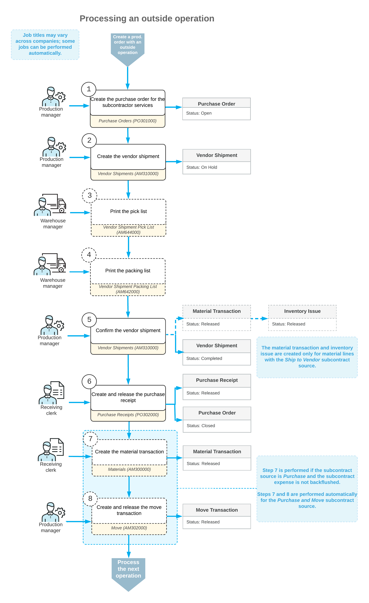

# Outside Processing: Processing Workflow {#_db9db047-d6f4-40b0-b1bf-917082b970f8 .concept}

Suppose that you use production orders for tracking outside processing performed by a subcontractor. Further suppose that you have created a non-stock item in Acumatica ERP Manufacturing Edition for this subcontractor's charges, and you will process vendor shipments in the system when you ship materials to the subcontractor. You have created and released the production order with an outside operation on the [Production Order Maintenance](AM_20_15_00.md) \(AM201500\) form. To process the outside operation, you perform the following general steps:

1.  Create a purchase order to pay the subcontractor for the services by clicking the **Create Purchase Order** button on the [Production Order Details](AM_20_90_00.md) \(AM209000\) form.

    The system creates a purchase order on the [Purchase Orders](PO_30_10_00.md) \(PO301000\) form for the vendor specified on the **Outside Process** tab \(if no vendor is specified on the tab, you must specify the vendor manually\) and adds items with the *Purchase* or *Purchase and Move* subcontract source to the order. The system inserts the purchase order number in the **PO Order Nbr.** box on the **Outside Process** tab of the [Production Order Details](AM_20_90_00.md) form.

2.  Create a vendor shipment for the materials required for the outside operation, which are stored in a warehouse at your facility. You do this by clicking the **Create Vendor Shipment** button on the [Production Order Details](AM_20_90_00.md) form.

    The system creates a vendor shipment for the vendor specified on the **Outside Process** tab and opens it on the [Vendor Shipments](AM_31_00_00.md) \(AM310000\) form. \(If no vendor is specified on the tab, you must specify the vendor manually.\) It also adds the following rows to the vendor shipment:

    -   A row for the item to be produced, which has the *WIP* type
    -   A row for each material to be shipped \(that is, each item with the *Ship to Vendor* subcontract source in the production order\), which has the *Material* type
3.  Optional: Print the pick list by using the [Vendor Shipment Pick List](AM_64_40_00.md) \(AM644000\) report.
4.  Optional: By using the [Vendor Shipment Packing List](AM_64_20_00.md) \(AM642000\) form, print the packing lists that will accompany the items being sent to the subcontractor.
5.  On the [Vendor Shipments](AM_31_00_00.md) form, confirm the vendor shipment.

    For material lines with the *Ship to Vendor* subcontract source, the system creates the material transaction on the [Materials](AM_30_00_00.md) \(AM300000\) form, issues the materials from the warehouse by creating an inventory issue on the [Issues](IN_30_20_00.md) \(IN302000\) form, and updates the cost in the **Subcontractor** box of the **Actual** section on the **Totals** tab of the [Production Order Maintenance](AM_20_15_00.md) form. You can also view the quantity of items shipped to the vendor on the **Outside Process** tab of the [Production Order Details](AM_20_90_00.md) form.

6.  Create and release a purchase receipt for the purchase order on the [Purchase Receipts](PO_30_20_00.md) \(PO302000\) form.
7.  Optional: For material lines with the *Purchase* subcontract source, create and release a material transaction on the [Materials](AM_30_00_00.md) form to apply the subcontracting costs.

    You must perform this step only if the material is not backflushed.

8.  Optional: For material lines with the *Purchase* subcontract source, create and release the move transaction for the outside service operation by using the [Move](AM_30_20_00.md) form to record the movement of the items from the outside operation.

    To make the system automatically generate and release the move transaction, you can specify the *Purchase and Move* subcontract source for the material line.

You then proceed to process the remaining operations in the production order.

The following diagram illustrates the actions and documents that are typically involved in the processing of an outside operation.

**Parent topic:**[Producing Items with Outside Processing](../UserGuide/MFG_Outside_Processing_Mapref.md)

