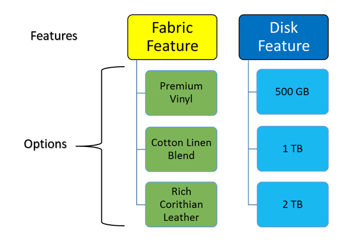

# Product Configurator: General Information {#_50eb4287-5085-4507-ae61-4634e653f7c4 .concept}

The product configurator translates product knowledge into a set of rules to guide an end user through all of the steps necessary to produce a valid product and its options. You can use the configurator in both sales orders and production orders. A configure to order \(CTO\) item must be a stock item. The [Configuration Maintenance](AM_20_75_00.md) \(AM207500\) form is used to define configurations.

This functionality is available if the *Product Configurator* feature in the *Manufacturing* group of features is enabled on the [Enable/Disable Features](CS_10_00_00.md) \(CS100000\) form.

## Revision Control { .section}

Configuration definitions are stored as non-date driven configuration revisions. This provides you with the ability to work on a new configuration definition for the same inventory item while the active revision is being used by end users.

## Features { .section}

Features are lists of options available for user selection. Labels are used to identity the feature. You can navigate whatever way you choose by using the Features pane of the [Configuration Entry](AM_30_60_00.md) \(AM306000\) form.

A feature can specify the minimum and maximum options a user can select. Rules are used when an option selected for a feature may restrict the options available for another feature. For example, selecting a fabric option may restrict the available options for the color feature. Features can also be hidden when user selection is not required. For example, once the options for the color and fabric features are selected, the inventory item to use is determined in a hidden feature.

## Options { .section}

Options can be either a list of selections, stock items, or non-stock items. An inventory item associated with an option becomes a material component of the configuration. You can use subassemblies as options and mark an item as phantom; the subassembly, and optionally its routing, is exploded during production order creation and added to the list of components.

In the following diagram, you can see the relationships between options and features.

## Attributes { .section}

You can add attributes to features and configurations. Attributes can be used for multiple purposes, such as the following:

-   They can be used as lists of available values in a configuration or a user can enter attribute values manually. Rules can use attribute values to determine allowed options.
-   They can be assigned variables and used in formulas such as a width dimension and a height dimension used to calculate the area of material required.
-   They can be used to gather information used in the manufacturing or assembly process, for example, switch settings or dimensions.
-   You enter a formula in the list of attributes that you wish to display during configuration entry and forbid manual typing of values.

## Configuration Rules { .section}

Configuration rules apply to and drive both quantity \(that is, dimensions\) and features \(that is, options\). Rules are used to present the user with option choices based on other options they have selected. For example, the options for fabric change based on the color option selection. Option selection can be enforced by minimum and maximum criteria for the number of options a user can select. Rules can specify minimum quantity, maximum quantity, or lot sizes.

Rules can also be used with attributes to include or exclude features or options.

Rules are optional; a feature might just require a user to select from a list such as storage or memory options.

## Formula Support { .section}

Dimensions are handled by using formulas for designated fields, such as computing the square meters of fabric required based on the entered linear dimensions. Formulas can be expressed for any numeric field including quantities and attributes.

## Configuration Keys { .section}

A configuration key identifies what values out of a configuration define its uniqueness compared to other completed configurations of the same configuration ID. A key value is an output of a completed configuration entry which can be preselected before entering a configuration to bring up the same configuration completed in the past using the same key. The key can be a numbering sequence unique to each configuration result or a formula using attribute values.

Additionally, formulas may be used to create a key description and a transaction description.

## Completion { .section}

A configuration is completed when all required features have been selected and all rules are validated and the user indicates that they are finished. This provides the user with the ability to save a configuration in progress without having to abandon data entry.

## Output { .section}

The output of a configuration consists of the selected features and quantities, attributes and values, and configured item price. The options are combined with the template bill of material of the CTO item to build the production order details.

**Parent topic:**[Product Configurator](../UserGuide/MFG_Product_Configurator_Mapref.md)

