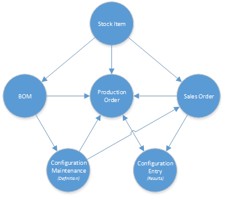

# Product Configurator: Production Management Integration {#_5def102e-942e-4fc2-803f-878b7f086672 .concept}

Production orders are used to build the configured product. The production order can be created directly from a sales order, as described in [Production Processing: Production for Sales](MFG_Production_Order_Processing_Link_to_SO.md), or directly by using the [Production Order Maintenance](AM_20_15_00.md) \(AM201500\) form. Production orders can also be created by using the [Inventory Planning Display](AM_40_00_00.md) \(AM400000\) or [Critical Materials](AM_40_10_00.md) \(AM401000\) form. However, they will contain only the template bill of material and must be configured by using the [Configuration Entry](AM_30_60_00.md) \(AM306000\) form that can be accessed by clicking the **Configure** button on the **References** tab of the [Production Order Maintenance](AM_20_15_00.md) form.

You can plan bills of material, as described in [Bills of Material: Planning BOMs](MFG_PlanningBills.md), for configure to order \(CTO\) inventory items.

The following diagram illustrates how production orders are integrated with the order management functionality and other parts of Acumatica ERP.

The process of creating a production order combines the template bill of material with the material options selected during the configuration process. As with standard bills of material, a material option can be a phantom and accordingly the components of the phantom replace the phantom in the production order details and optionally insert the operations of the phantom.

**Parent topic:**[Product Configurator](../UserGuide/MFG_Product_Configurator_Mapref.md)

