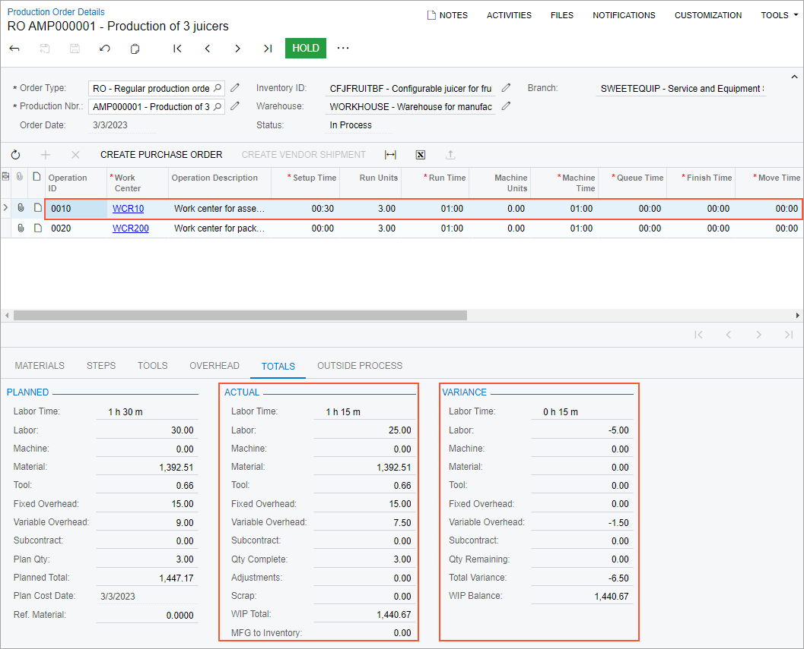
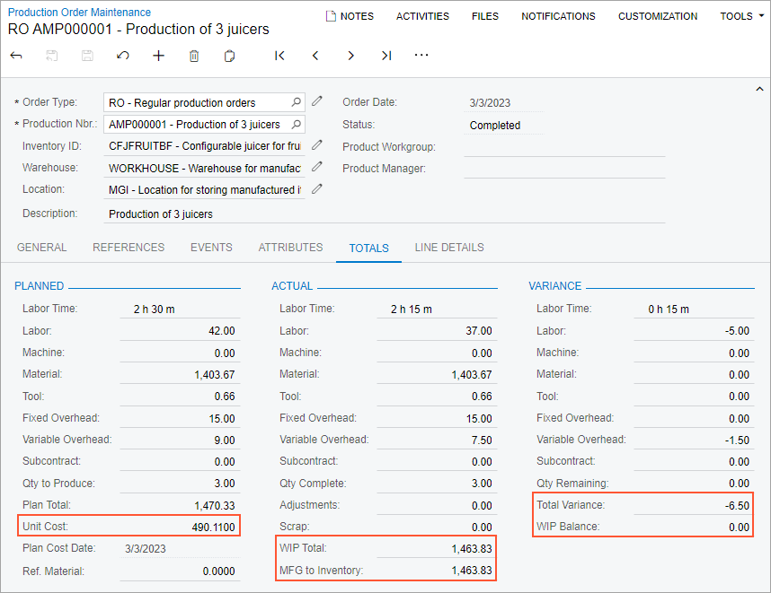

# Cost Calculation for Produced Items: To Process Production Orders with the Actual Costing Method {#_7ece3bf0-c953-41fd-bb8f-0889f611b513 .task}

The following activity will walk you through the processing of a production order with the *Actual* costing method.

## Story { .section}

Suppose that GoodFood One Restaurant has ordered three juicers from the SweetLife Fruits &amp; Jams company. The production process includes the assembly and packing of the juicers. In the production process of SweetLife Fruits &amp; Jams, materials and labor are backflushed for the packing operation. Further suppose that components for the juicers are available in SweetLife Fruits &amp; Jams's warehouse.

Also suppose that the system should use the *Actual* costing method for calculating the unit cost of the produced juicers because the produced items are moved to stock only when all transactions have been released and all costs have been applied to the production order.

Acting as a production manager, you will create a production order for producing three juicers and process all related transactions. In a production environment, a shop-floor employee would create labor and move transactions on their own. To streamline this activity, you will enter this transaction as a production manager.

Also, acting as a production accountant, you will review the costs applied to the production order and the unit cost of the produced items on inventory receipts.

## Configuration Overview { .section}

In the *U100* dataset, the following tasks have been performed to support this activity:

-   On the [Warehouses](IN_20_40_00.md) \(IN204000\) form, the *WORKHOUSE* warehouse has been defined, and its locations include *MGI* and *MTL*.
-   On the [Stock Items](IN_20_25_00.md) \(IN202500\) form, the *CFJFRUITBF*, *PULPCONT1L*, *JUICECUP05L*, *MRBASE*, *FNSIEVE*, *GRDISC01*, *PACKTAPE*, *PPEANUTS*, and *PACKBOX* stock items have been defined.

## Process Overview { .section}

In this activity, to process the documents and transactions related to the production of the juicers, you will do the following:

1.  On the [Production Order Maintenance](AM_20_15_00.md) \(AM201500\) form, create and release the production order.
2.  On the [Materials](AM_30_00_00.md) \(AM300000\) form, issue the materials required for the assembly operation.
3.  On the [Labor](AM_30_10_00.md) \(AM301000\) form, record the produced quantity and the labor spent on the juicer assembly.
4.  On the [Production Order Details](AM_20_90_00.md) \(AM209000\) form, review the production order balance after the assembly operation.
5.  On the [Move](AM_30_20_00.md) \(AM302000\) form, record the produced items for the packing operation.
6.  On the [Production Order Maintenance](AM_20_15_00.md) form, review the production order balance after you have completed the order.
7.  On the [Close Production Orders](AM_50_60_00.md) \(AM506000\) form, close the production order.

## System Preparation { .section}

Do the following:

1.  As a prerequisite to the current activity, complete [Configuration of Production with Backflushing: Implementation Activity](../ImplementationGuide/config_MFG_Backflushing_Implem_Activity.md) so that the system is ready for processing the production of juicers with labor and material backflushing.
2.  Launch the Acumatica ERP website, and sign in to the company in which the prerequisite activity has been performed. You should sign in as the production manager by using the *peters* username and the *123* password.
3.  In the info area, in the upper-right corner of the top pane of the Acumatica ERP screen, make sure that the business date in your system is set to today’s date. For simplicity, in this activity, you will create and process all documents in the system on this business date.

## Step 1: Creating the Production Order { .section}

To create the production order for the three juicers, do the following:

1.  On the [Production Order Maintenance](AM_20_15_00.md) \(AM201500\) form, add a new record.
2.  In the Summary area, specify the following settings:
    -   **Order Type**: *RO* \(inserted automatically\)
    -   **Inventory ID**: *CFJFRUITBF*
    -   **Warehouse**: *WORKHOUSE* \(inserted automatically\)
    -   **Location**: *MGI* \(inserted automatically\)
    -   **Order Date**: Today's date \(inserted automatically\)
    -   **Description**: `Production of 3 juicers`
3.  On the **General** tab, do the following:
    1.  In the **Qty. to Produce** box, specify `3`.
    2.  In the **Costing Method** box, select *Actual*.
4.  On the form toolbar, click **Save**.
5.  On the More menu \(under **Processing**\), click **Release Order**. The order's status is changed to *Released*.

    **Tip:** You open the More menu by clicking the More button \(…\) on the form toolbar.

## Step 2: Issuing Materials for the Assembly Operation { .section}

In this step, you will issue the materials for the assembly operation of the production order. Do the following:

1.  While you are still viewing the production order on the [Production Order Maintenance](AM_20_15_00.md) \(AM201500\) form, on the More menu \(under **Transactions**\), click **Release Materials**. The system opens the [Select Production Orders](AM_30_00_10.md) \(AM300020\) form with the list of the materials needed for the assembly operation.
2.  On the form toolbar, click **Select All**. The system creates the material transaction and opens it on the [Materials](AM_30_00_00.md) \(AM300000\) form.
3.  In the Summary area, do the following:
    1.  In the **Description** box, specify `Materials for the assembly operation`.
    2.  Clear the **Hold** check box. The system changes the transaction's status to *Balanced*.
4.  On the form toolbar, click **Release**. The system releases the material transaction and changes the status of the transaction to *Released*.

## Step 3: Recording the Labor and Produced Items for the Assembly Operation { .section}

Suppose that Carlos Cruz, a worker in the work center, spent 30 minutes setting up the working environment for juicer assembly and assembled three juicers for 45 minutes. To record the time that he spent on juicer assembly and the assembled quantity of juicers, do the following:

1.  On the [Production Order Maintenance](AM_20_15_00.md) form, open the production order that you created earlier in this activity.
2.  On the More menu \(under **Transactions**\), click **Create Labor Transaction**. The system creates the labor transaction for the *0010* operation and opens it on the [Labor](AM_30_10_00.md) \(AM301000\) form.
3.  In the only row, specify the following settings:
    -   **Employee ID**: *EP00000027* \(Carlos Cruz\)
    -   **Shift**: *0001*
    -   **Labor Time**: *01:15*
    -   **Quantity**: `3`
4.  In the Summary area, do the following:
    1.  In the **Date** box, make sure that the today's date is specified.
    2.  In the **Description** box, specify `Recording the completed quantity and the time for assembly of 3 juicers`.
    3.  Clear the **Hold** check box. The system changes the transaction's status to *Balanced*.
5.  On the form toolbar, click **Release**. The system creates and releases the cost transaction to record the labor costs; it also releases the labor transaction.

## Step 4: Reviewing the Production Order Balance { .section}

In this step, acting as a production accountant, you will review the balance of the production order after you have recorded the completion of the assembly operation. Do the following on the [Production Order Details](AM_20_90_00.md) \(AM209000\) form:

1.  Open the production order that you created earlier in this activity.
2.  In the Operations table, click the row for the *0010* operation.
3.  On the **Totals** tab, review the production order balance as follows \(see the screenshot below\):

    1.  In the **Actual** section, make sure that the following values are displayed:

        -   **Labor Time**: *1 h 15 m*
        -   **Labor**: *25.00*
        -   **Material**: *1392.51*
        -   **Tool**: *0.66*
        -   **Fixed Overhead**: *15.00*
        -   **Variable Overhead**: *7.50*
        -   **WIP Total**: *1440.67* \(which is the sum of the actual costs applied to the production order\)
        -   **MFG to Inventory**: *0.00* \(no items have been moved to stock yet\)
        As you can see, the system has applied the costs of the assembly operation to the production order.

    2.  In the **Variance** section, make sure that the following values are displayed:

        -   **Labor Time**: *0 h 15 m*
        -   **Labor**: *-5.00*
        -   **Variable Overhead**: *-1.50*
        -   **Total Variance**: *-6.50* \(which is the sum of the planned costs that are not applied to the production order\)
        -   **WIP Balance**: *1440.67*
        The variance is caused by the difference between the planned and actual labor hours.

    

## Step 5: Recording the Produced Items for the Packing Operation { .section}

Suppose that a worker in the packing work center has packed the assembled juicers. To record the completion of the packing operation, do the following:

1.  On the [Production Order Maintenance](AM_20_15_00.md) \(AM201500\) form, open the production order that you created earlier in this activity.
2.  On the More menu \(under **Transactions**\), click **Create Move Transaction**. The system creates the move transaction for the *0020* operation and opens it on the [Move](AM_30_20_00.md) \(AM302000\) form.
3.  In the Summary area, do the following:
    1.  In the **Date** box, make sure that today's date is specified.
    2.  In the **Description** box, enter `Recording the completion of packing 3 juicers`.
    3.  Clear the **Hold** check box. The system changes the transaction's status to *Balanced*.
4.  On the form toolbar, click **Release**. The system releases the move transaction. Also, the system creates and releases a cost transaction for backflushed labor and a material transaction for backflushed materials. You can view these transactions on the **Events** tab of the [Production Order Maintenance](AM_20_15_00.md) form.

    The packing operation is the last operation in the routing so the system changes the status of the production order to *Completed*.

5.  On the [Receipts](IN_30_10_00.md) \(IN301000\) form, open the receipt with today's date, a total quantity of three *CFJFRUITBF* items, and a total cost of 1463.83.
6.  In the **Unit Cost** column of the only row, make sure that *487.9433* is specified.

## Step 6: Reviewing the Balance of the Completed Production Order { .section}

In this step, again acting as a production accountant, you will review the production order balance after you have recorded the completion of the packing operation. Do the following on the [Production Order Maintenance](AM_20_15_00.md) \(AM201500\) form:

1.  Open the production order that you created earlier in this activity.
2.  On the **Totals** tab, review the production order balance as follows \(see the following screenshot\):

    1.  In the **Planned** section, make sure that the value of the **Unit Cost** box is *490.1100*.
    2.  In the **Actual** section, make sure that the values of the **WIP Total** and **MFG to Inventory** boxes are *1463.83*, which is the cost of three produced items. The cost of one item is *487.9433*, which equals the unit cost in the inventory receipt. To calculate the unit cost, the system used the actual costs applied to the production order.
    3.  In the **Variance** section, make sure that the value in the **Total Variance** box is *-6.50*.
    4.  Make sure that the value of the **WIP Balance** box is *0.00*, which means that the actual costs of the production order have been fully applied to the cost of the produced items. The fluctuations of the labor time do not affect the WIP balance and the cost difference is not posted to the WIP variance account.
    

## Step 7: Closing the Production Order { .section}

Now you will close the production order. Do the following:

1.  On the [Close Production Orders](../Shared/../UserGuide/AM_50_60_00.md) \(AM506000\) form, select the production order.
2.  On the form toolbar, click **Process**. In the **Processing** dialog box, which opens, review the processing details, and when the processing is completed, click **Close**.
3.  Go to the [Production Order Maintenance](../Shared/../UserGuide/AM_20_15_00.md) form, and notice that the status of the production order has changed to *Closed*.

You have successfully created the production order for the assembly and packing of three juicers, processed all the transactions related to the production, and reviewed the costs of the production order.

**Parent topic:**[Calculating the Costs of Produced Items](../UserGuide/MFG_Production_Cost_Calculation_Mapref.md)

