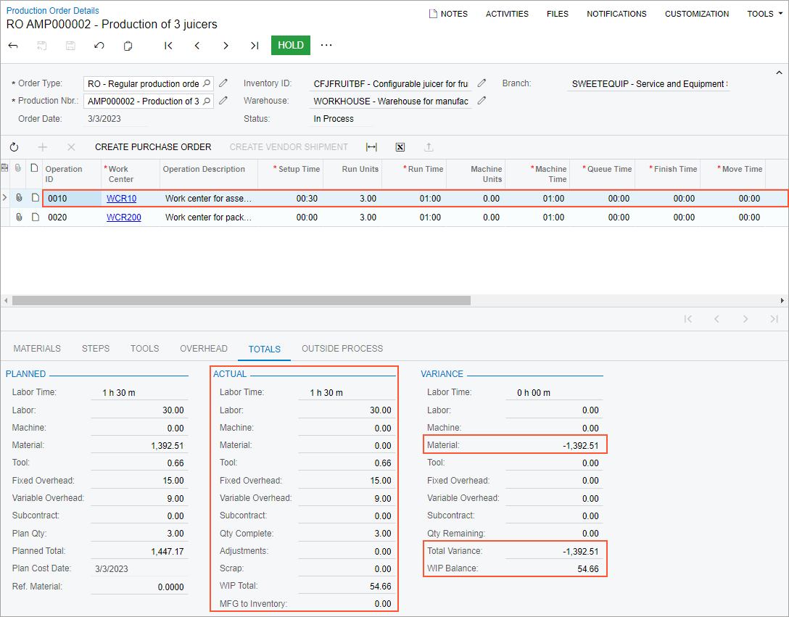
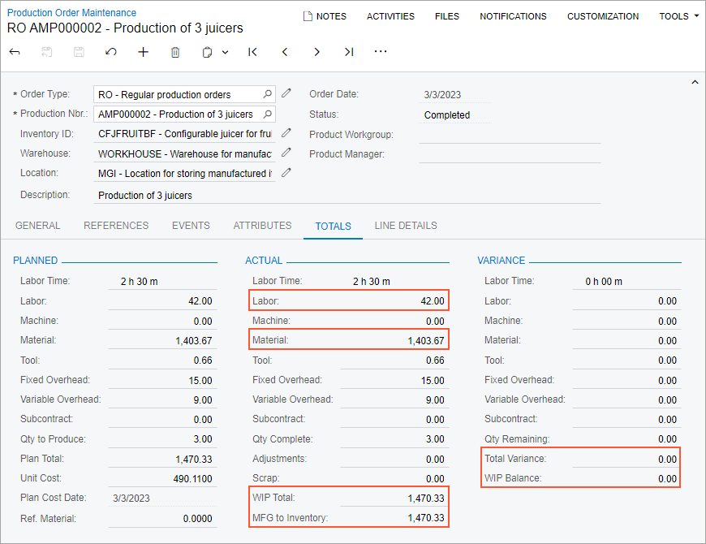

# Cost Calculation for Produced Items: To Process Production Orders with the Estimated Costing Method {#_42515992-a418-4ae9-9cc1-3bbe6afd2587 .task}

The following activity will walk you through the processing of a production order with the *Estimated* costing method.

## Story { .section}

Suppose that GoodFood One Restaurant has ordered three juicers from the SweetLife Fruits &amp; Jams company. The production process includes the assembly and packing of the juicers. In the production process of SweetLife Fruits &amp; Jams, materials and labor are backflushed for the packing operation. Further suppose that the components for two juicers are available in SweetLife Fruits &amp; Jams's warehouse but the components for one juicer will be received later.

Also suppose that the system should use the *Estimated* costing method for calculating the unit cost of the produced juicers because the materials for the assembly operation can be recorded after the produced items are moved to stock. In addition, a worker in the packing work center can record the packed materials in parts.

Acting as a production manager, you will create a production order for producing three juicers and process all related transactions. In a production environment, a shop-floor employee would create labor and move transactions on their own. To streamline this activity, you will enter this transaction as a production manager.

Also, acting as a production accountant, you will review the costs applied to the production order and the unit cost of the produced items on inventory receipts.

## Configuration Overview { .section}

In the *U100* dataset, the following tasks have been performed to support this activity:

-   On the [Warehouses](IN_20_40_00.md) \(IN204000\) form, the *WORKHOUSE* warehouse has been defined, and its locations include *MGI* and *MTL*.
-   On the [Stock Items](IN_20_25_00.md) \(IN202500\) form, the *CFJFRUITBF*, *PULPCONT1L*, *JUICECUP05L*, *MRBASE*, *FNSIEVE*, *GRDISC01*, *PACKTAPE*, *PPEANUTS*, and *PACKBOX* stock items have been defined.

## Process Overview { .section}

In this activity, to process the documents and transactions related to the production of the juicers, you will do the following:

1.  On the [Production Order Maintenance](AM_20_15_00.md) \(AM201500\) form, create and release the production order.
2.  On the [Labor](AM_30_10_00.md) \(AM301000\) form, record the produced quantity and the labor spent on the juicer assembly.
3.  On the [Production Order Details](AM_20_90_00.md) \(AM209000\) form, review the production order balance after the assembly operation.
4.  On the [Move](AM_30_20_00.md) \(AM302000\) form, record two produced items for the packing operation.
5.  On the [Materials](AM_30_00_00.md) \(AM300000\) form, issue the materials required for the assembly operation.
6.  On the [Move](AM_30_20_00.md) \(AM302000\) form, record the remaining produced item for the packing operation.
7.  On the [Production Order Maintenance](AM_20_15_00.md) form, review the production order balance after you have completed the order.
8.  On the [Close Production Orders](AM_50_60_00.md) \(AM506000\) form, close the production order.

## System Preparation { .section}

Do the following:

1.  As a prerequisite to the current activity, complete [Configuration of Production with Backflushing: Implementation Activity](../ImplementationGuide/config_MFG_Backflushing_Implem_Activity.md) so that the system is ready for processing the production of juicers with labor and material backflushing.
2.  Launch the Acumatica ERP website, and sign in to the company in which the prerequisite activity have been performed. You should sign in as the production manager by using the *peters* username and the *123* password.
3.  In the info area, in the upper-right corner of the top pane of the Acumatica ERP screen, make sure that the business date in your system is set to today’s date. For simplicity, in this activity, you will create and process all documents in the system on this business date.

## Step 1: Creating the Production Order { .section}

To create the production order for three juicers, do the following:

1.  On the [Production Order Maintenance](AM_20_15_00.md) \(AM201500\) form, add a new record.
2.  In the Summary area, specify the following settings:
    -   **Order Type**: *RO*
    -   **Inventory ID**: *CFJFRUITBF*
    -   **Warehouse**: *WORKHOUSE* \(inserted automatically\)
    -   **Location**: *MGI* \(inserted automatically\)
    -   **Order Date**: Today's date \(inserted automatically\)
    -   **Description**: `Production of 3 juicers`
3.  On the **General** tab, do the following:
    1.  In the **Qty. to Produce** box, specify `3`.
    2.  In the **Costing Method** box, make sure that *Estimated* is specified.
4.  On the form toolbar, click **Save**.
5.  On the More menu \(under **Processing**\), click **Release Order**. The order's status is changed to *Released*.
6.  On the **Totals** tab, make sure that *490.11* is specified in the **Unit Cost** box of the **Planned** section.

## Step 2: Recording the Labor and Produced Items for the Assembly Operation { .section}

Suppose that Carlos Cruz, a worker in the assembly work center, spent 30 minutes setting up the working environment for juicer assembly and assembled three juicers for one hour. To record the time that he spent on juicer assembly and the assembled quantity of juicers, do the following:

1.  On the [Production Order Maintenance](AM_20_15_00.md) form, open the production order that you created earlier in this activity.
2.  On the More menu \(under **Transactions**\), click **Create Labor Transaction**. The system creates the labor transaction for the *0010* operation and opens it on the [Labor](AM_30_10_00.md) \(AM301000\) form.
3.  In the only row, specify the following settings:
    -   **Employee ID**: *EP00000027* \(Carlos Cruz\)
    -   **Shift**: *0001*
    -   **Labor Time**: *01:30*
    -   **Quantity**: `3`
4.  In the Summary area, do the following:
    1.  In the **Date** box, make sure that today's date is specified.
    2.  In the **Description** box, specify `Recording the completed quantity and the time for assembly of 3 juicers`.
    3.  Clear the **Hold** check box. The system changes the transaction's status to *Balanced*.
5.  On the form toolbar, click **Release**. The system creates and releases the cost transaction to record the labor costs; it also releases the labor transaction.

## Step 3: Reviewing the Production Order Balance { .section}

In this step, acting as a production accountant, you will review the production order balance after you have recorded the completion of the assembly operation. Do the following on the [Production Order Details](AM_20_90_00.md) \(AM209000\) form:

1.  Open the production order that you created earlier in this activity.
2.  In the Operations table, click the row for the *0010* operation.
3.  On the **Totals** tab, review the production order balance as follows \(see the screenshot below\):

    1.  In the **Actual** section, make sure that the following values are displayed:

        -   **Labor Time**: *1 h 30 m*
        -   **Labor**: *30*
        -   **Material**: *0.00*
        -   **Tool**: *0.66*
        -   **Fixed Overhead**: *15.00*
        -   **Variable Overhead**: *9.00*
        -   **WIP Total**: *54.66* \(which is the sum of the actual costs applied to the production order\)
        -   **MFG to Inventory**: *0.00* \(no items have been completed and moved to stock yet\)
        As you can see, the system has applied the labor, tool, and overhead costs of the assembly operation to the production order. The material cost has not been applied because you have not released the materials for the operation yet.

    2.  In the **Variance** section, make sure that the following values are displayed:

        -   **Material**: *-1392.51*
        -   **Total Variance**: *-1392.51* \(which is the sum of the expected costs that have not been applied to the production order yet\)
        -   **WIP Balance**: *54.66* \(which is the difference between the sum of actual costs and the cost of items moved to stock\)
        The variance is caused by the materials that have not been issued for the operation. Thus the system has applied partial costs to the production order.

    

## Step 4: Recording the Produced Items for the Packing Operation { .section}

Suppose that a worker in the packing work center has packed only two assembled juicers because of a lack of packing materials. To record the completed items for the packing operation, do the following:

1.  On the [Production Order Maintenance](AM_20_15_00.md) \(AM201500\) form, open the production order that you created earlier in this activity.
2.  On the More menu \(under **Transactions**\), click **Create Move Transaction**. The system creates the move transaction for the *0020* operation and opens it on the [Move](AM_30_20_00.md) \(AM302000\) form.
3.  In the **Quantity** column of the only row, specify `2`.
4.  In the Summary area, do the following:
    1.  In the **Date** box, make sure that today's date is specified.
    2.  In the **Description** box, enter `Recording the completion of packing 2 juicers`.
    3.  Clear the **Hold** check box. The system changes the transaction's status to *Balanced*.
5.  On the form toolbar, click **Release**. The system releases the move transaction. Also, the system creates and releases a cost transaction for backflushed labor and a material transaction for backflushed materials. You can view these transactions on the **Events** tab of the [Production Order Maintenance](AM_20_15_00.md) \(AM201500\) form.
6.  On the [Receipts](IN_30_10_00.md) \(IN301000\) form, open the receipt with today's date, a total quantity of two *CFJFRUITBF* items, and a total cost of 980.22.
7.  In the **Unit Cost** column of the only row, make sure that *490.11* is specified. As you can see, the unit cost in the receipt equals the planned unit cost, which means that the system included the planned cost of the materials for the assembly operation in the unit cost of the produced items.

## Step 5: Issuing Materials for the Assembly Operation { .section}

Suppose that you were informed that materials for the assembly operation have been issued from the warehouse. Do the following to record the issuing of the materials:

1.  On the [Production Order Maintenance](AM_20_15_00.md) \(AM201500\) form, open the production order that you created earlier in this activity.
2.  On the More menu \(under **Transactions**\), click **Release Materials**. The system opens the [Select Production Orders](AM_30_00_10.md) \(AM300020\) form with the list of materials needed for the assembly operation.
3.  On the form toolbar, click **Select All**. The system creates the material transaction and opens it on the [Materials](AM_30_00_00.md) \(AM300000\) form.
4.  In the Summary area, do the following:
    1.  In the **Description** box, specify `Materials for the assembly operation`.
    2.  Clear the **Hold** check box. The system changes the transaction's status to *Balanced*.
5.  On the form toolbar, click **Release**. The system releases the material transaction and changes the status of the transaction to *Released*.
6.  On the [Production Order Details](AM_20_90_00.md) \(AM209000\) form, open the production order.
7.  In the Operations table, click the row for the *0010* operation.
8.  In the **Actual** section of the **Totals** tab, make sure that the value of the **Material** box is *1392.51*. This means that the system has applied the cost of the materials to the production order.

## Step 6: Recording the Packing of the Remaining Item { .section}

Suppose that package materials were delivered to the packing work center, and the worker has packed the remaining juicer. To record the completion of the packing operation, do the following:

1.  On the [Production Order Maintenance](AM_20_15_00.md) \(AM201500\) form, open the production order that you created earlier in this activity.
2.  On the More menu \(under **Transactions**\), click **Create Move Transaction**. The system creates the move transaction for the *0020* operation and opens it on the [Move](AM_30_20_00.md) \(AM302000\) form.
3.  In the only row, make sure that the quantity in the **Quantity** column is *1.00*.
4.  In the Summary area, do the following:
    1.  In the **Date** box, make sure that today's date is specified.
    2.  In the **Description** box, enter `Recording the completion of packing one juicer`.
    3.  Clear the **Hold** check box. The system changes the transaction's status to *Balanced*.
5.  On the form toolbar, click **Release**. The system releases the move transaction. Also, the system creates and releases a cost transaction for backflushed labor and a material transaction for backflushed materials. You can view these transactions on the **Events** tab of the [Production Order Maintenance](AM_20_15_00.md) \(AM201500\) form.
6.  On the [Receipts](IN_30_10_00.md) \(IN301000\) form, open the receipt with today's date, a total quantity of one *CFJFRUITBF* item, and a total cost of 490.11.
7.  In the **Unit Cost** column of the only row, make sure that *490.11* is specified, which is the same unit cost as for the two juicers that were completed earlier.

## Step 7: Reviewing the Balance of the Completed Production Order { .section}

In this step, again acting as a production accountant, you will review the production order balance after you have recorded the completion of the packing operation for the remaining juicer. Do the following on the [Production Order Maintenance](AM_20_15_00.md) \(AM201500\) form:

1.  Open the production order that you created earlier in this activity.
2.  On the **Totals** tab, review the production order balance as follows \(see the screenshot below\):

    1.  In the **Actual** section, make sure that the following values are displayed:
        -   **Labor**: *42.00* \(which is the full labor cost for two operations\)
        -   **Material**: *1403.67* \(which is the full cost of the materials for two operations\)
        -   **WIP Total**: *1470.33* \(which is the sum of the actual costs\)
        -   **MFG to Inventory**: *1470.33* \(which is the cost of three juicers moved to stock\).
    2.  In the **Variance** section, make sure that the values in the **Total Variance** box and in the **WIP Balance** box is *0.00*, which means that the actual costs equal the planned costs and the cost of items received in stock equals the sum of the actual costs.
    

## Step 8: Closing the Production Order { .section}

Now you will close the production order. Do the following:

1.  On the [Close Production Orders](../Shared/../UserGuide/AM_50_60_00.md) \(AM506000\) form, select the production order.
2.  On the form toolbar, click **Process**. In the **Processing** dialog box, which opens, review the processing details, and when the processing is completed, click **Close**.
3.  Go to the [Production Order Maintenance](../Shared/../UserGuide/AM_20_15_00.md) form, and notice that the status of the production order has changed to *Closed*.

You have successfully created the production order for the assembly and packing of three juicers, processed all the transactions related to the production, and reviewed the costs of the production order.

**Parent topic:**[Calculating the Costs of Produced Items](../UserGuide/MFG_Production_Cost_Calculation_Mapref.md)

