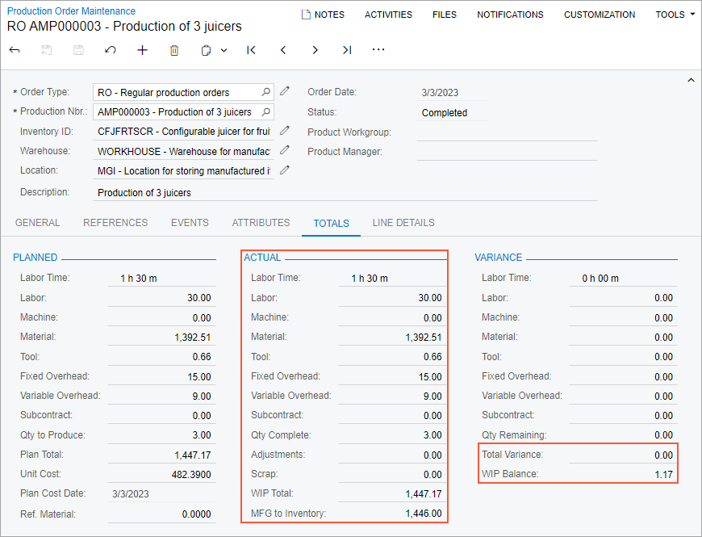

# Cost Calculation for Produced Items: To Process Production Orders with the Standard Costing Method {#_55f31729-a24b-46c2-bda7-51772f9ea7d3 .task}

The following activity will walk you through the processing of a production order with the *Standard* costing method.

## Story { .section}

Suppose that GoodFood One Restaurant has ordered three juicers from the SweetLife Fruits &amp; Jams company. The production process includes the assembly of the juicers. Further suppose that the system uses the standard cost for calculating the unit cost of the produced juicers because the costs of juicer production do not fluctuate. For items with the standard cost, the system uses the *Standard* costing method for calculating the costs of production orders.

Acting as a production manager, you will create a production order for producing three juicers and process all related transactions. In a production environment, a shop-floor employee would create labor and move transactions on their own. To streamline this activity, you will enter this transaction as a production manager.

Also, acting as a production accountant, you will review the costs applied to the production order and the unit cost of the produced items on inventory receipts.

## Configuration Overview { .section}

In the *U100* dataset, the following tasks have been performed to support this activity:

-   On the [Warehouses](IN_20_40_00.md) \(IN204000\) form, the *WORKHOUSE* warehouse has been defined, and its locations include *MGI* and *MTL*.
-   On the [Stock Items](IN_20_25_00.md) \(IN202500\) form, the *CFJFRTSCR*, *PULPCONT1L*, *JUICECUP05L*, *MRBASE*, *FNSIEVE*, and *GRDISC01* stock items have been defined.

## Process Overview { .section}

In this activity, to process the documents and transactions related to the production of the juicers, you will do the following:

1.  On the [Stock Items](IN_20_25_00.md) \(IN202500\) form, change the cost settings of the item to be produced.
2.  On the [Production Order Maintenance](AM_20_15_00.md) \(AM201500\) form, create and release the production order.
3.  On the [Materials](AM_30_00_00.md) \(AM300000\) form, issue the materials required for the assembly operation.
4.  On the [Labor](AM_30_10_00.md) \(AM301000\) form, record the produced quantity and the labor spent on the juicer assembly.
5.  On the [Production Order Maintenance](AM_20_15_00.md) form, review the production order balance after you have completed the order.
6.  On the [Close Production Orders](AM_50_60_00.md) \(AM506000\) form, close the production order.

## System Preparation { .section}

Do the following:

1.  As a prerequisite to the current activity, complete [Configuration of Scrap, Waste, and By-Products in Production: Implementation Activity](../ImplementationGuide/config_MFG_Scrap_Implem_Activity.md) so that the system is ready for processing the production of juicers.
2.  Launch the Acumatica ERP website, and sign in to the company in which the prerequisite activities have been performed. You should sign in as the production manager by using the *peters* username and the *123* password.
3.  In the info area, in the upper-right corner of the top pane of the Acumatica ERP screen, make sure that the business date in your system is set to today’s date. For simplicity, in this activity, you will create and process all documents in the system on this business date.

## Step 1: Updating the Item Cost { .section}

For the purposes of this activity, you will change the valuation method for the *CFJFRTSCR* item. Do the following;

1.  On the [Stock Items](IN_20_25_00.md) \(IN202500\) form, select the *CFJFRTSCR* item.
2.  In the **Valuation Method** box of the **General** tab \(**Item Defaults** section\), select *Standard*.
3.  In the **Pending Cost** box of the **Price/Cost** tab \(**Standard Cost**\), type `482`.
4.  In the **Pending Cost Date** box, select today's date.
5.  On the More menu \(under **Other**\), select **Update Cost**. Make sure that the system has copied the pending cost to the **Current Cost** box of the **Standard Cost** section on the **Price/Cost** tab.

    **Tip:** You open the More menu by clicking the More button \(…\) on the form toolbar.

6.  On the form toolbar, click **Save**.

## Step 2: Creating the Production Order { .section}

To create the production order for three juicers, do the following:

1.  On the [Production Order Maintenance](AM_20_15_00.md) \(AM201500\) form, add a new record.
2.  In the Summary area, specify the following settings:
    -   **Order Type**: *RO*
    -   **Inventory ID**: *CFJFRTSCR*
    -   **Warehouse**: *WORKHOUSE* \(inserted automatically\)
    -   **Location**: *MGI* \(inserted automatically\)
    -   **Order Date**: Today's date \(inserted automatically\)
    -   **Description**: `Production of 3 juicers`
3.  On the **General** tab, do the following:
    1.  In the **Qty. to Produce** box, specify `3`.
    2.  In the **Costing Method** box, make sure that *Standard* is specified and is unavailable.
4.  On the form toolbar, click **Save**.
5.  On the More menu \(under **Processing**\), click **Release Order**. The order's status is changed to *Released*.
6.  On the **Totals** tab, make sure that *482.39* is specified in the **Unit Cost** box of the **Planned** section.

## Step 3: Issuing Materials for the Operation { .section}

In this step, you will issue the materials for the assembly operation of the production order. Do the following:

1.  While you are still viewing the production order on the [Production Order Maintenance](AM_20_15_00.md) \(AM201500\) form, on the More menu \(under **Transactions**\), click **Release Materials**. The system opens the [Select Production Orders](AM_30_00_10.md) \(AM300020\) form with the list of materials needed for the assembly operation.
2.  On the form toolbar, click **Select All**. The system creates the material transaction and opens it on the [Materials](AM_30_00_00.md) \(AM300000\) form.
3.  In the Summary area, do the following:
    1.  In the **Description** box, specify `Materials for the assembly operation`.
    2.  Clear the **Hold** check box. The system changes the transaction's status to *Balanced*.
4.  On the form toolbar, click **Release**. The system releases the material transaction and changes the status of the transaction to *Released*.

## Step 4: Recording the Labor and Produced Items for the Operation { .section}

Suppose that Carlos Cruz, a worker in the assembly work center, spent 30 minutes setting up the working environment for juicer assembly and assembled three juicers for one hour. To record the time that he spent on juicer assembly and the assembled quantity of juicers, do the following:

1.  On the [Production Order Maintenance](AM_20_15_00.md) \(AM201500\) form, open the production order that you created earlier in this activity.
2.  On the More menu \(under **Transactions**\), click **Create Labor Transaction**. The system creates the labor transaction for the *0010* operation and opens it on the [Labor](AM_30_10_00.md) \(AM301000\) form.
3.  In the only row, specify the following settings:
    -   **Employee ID**: *EP00000027* \(Carlos Cruz\)
    -   **Shift**: *0001*
    -   **Labor Time**: *01:30*
    -   **Quantity**: `3`
4.  In the Summary area, do the following:
    1.  In the **Date** box, make sure that the today's date is specified.
    2.  In the **Description** box, specify `Recording the completed quantity and the time for juicer assembly`.
    3.  Clear the **Hold** check box. The system changes the transaction's status to *Balanced*.
5.  On the form toolbar, click **Release**. The system creates and releases the cost transaction to record the labor costs; it also releases the labor transaction.
6.  On the [Receipts](IN_30_10_00.md) \(IN301000\) form, open the receipt with today's date, a total quantity of three *CFJFRTSCR* items, and a total cost of 1446.00.
7.  In the **Unit Cost** column of the only row, make sure that *482.00* is specified, which is the standard cost of the item.

## Step 5: Reviewing the Production Order Balance { .section}

In this step, acting as a production accountant, you will review the production order balance after you have recorded the completion of the assembly operation. Do the following on the [Production Order Maintenance](AM_20_15_00.md) \(AM201500\) form:

1.  Open the production order that you created earlier in this activity.
2.  On the **Totals** tab, review the production order balance as follows \(see the screenshot below\):

    1.  In the **Actual** section, make sure that the following values are displayed:
        -   **Labor Time**: *1 h 30 m*
        -   **Labor**: *30.00*
        -   **Material**: *1392.51*
        -   **Tool**: *0.66*
        -   **Fixed Overhead**: *15.00*
        -   **Variable Overhead**: *9.00*
        -   **WIP Total**: *1447.17* \(which is the sum of the actual costs applied to the production order\)
        -   **MFG to Inventory**: *1446.00* \(which is the cost of the completed items that were moved to stock\)
    2.  In the **Variance** section, make sure that the value of the total variance is 0.00, which means that the actual costs equal the planned costs of the production order.
    3.  Make sure that the value of the **WIP Balance** box is *1.17*, which is the difference between the values of the **WIP Total** and **MFG to Inventory** boxes. This difference appeared because the system calculated the item cost in an inventory receipt by using the standard cost of the item but not the sum of actual costs, which were applied to the production order.
    

## Step 6: Closing the Production Order { .section}

In this step, you will close the production order and review the resulting GL transactions. Do the following:

1.  While you are still viewing the production order on the [Production Order Maintenance](AM_20_15_00.md) \(AM201500\) form, on the More menu \(under **Processing**\), click **Close Order**. The system opens the [Close Production Orders](AM_50_60_00.md) \(AM506000\) form with a row for the production order added.
2.  In the unlabeled column of this row, make sure that the Included check box is selected.
3.  On the form toolbar, click **Process**. In the **Processing** dialog box, which opens, view the processing details, and when the processing is completed, click **Close**.
4.  On the [Production Order Maintenance](AM_20_15_00.md) form, make sure that the status of the production order has been changed to *Closed*.
5.  On the [Journal Transactions](GL_30_10_00.md) \(GL301000\) form, open the transaction with the *WIP Variance* description and a control total of 1.17. As you can see, to clear the balance of the Work in Progress for Manufacturing GL account, the system credited this account and debited the COGS - WIP Inventory Variance GL account, which is dedicated for storing cost variances in production orders.

You have successfully created the production order for the assembly and packing of three juicers, processed all the transactions related to the production, and reviewed the costs of the production order.

**Parent topic:**[Calculating the Costs of Produced Items](../UserGuide/MFG_Production_Cost_Calculation_Mapref.md)

