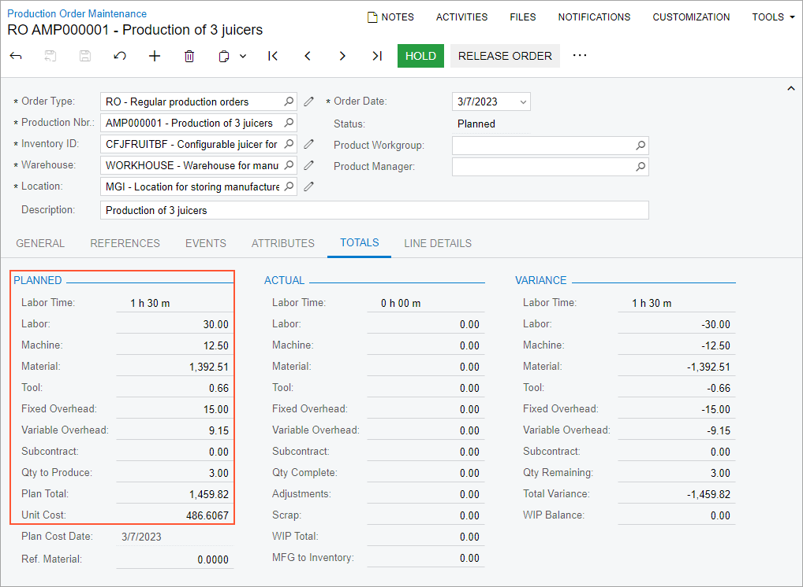
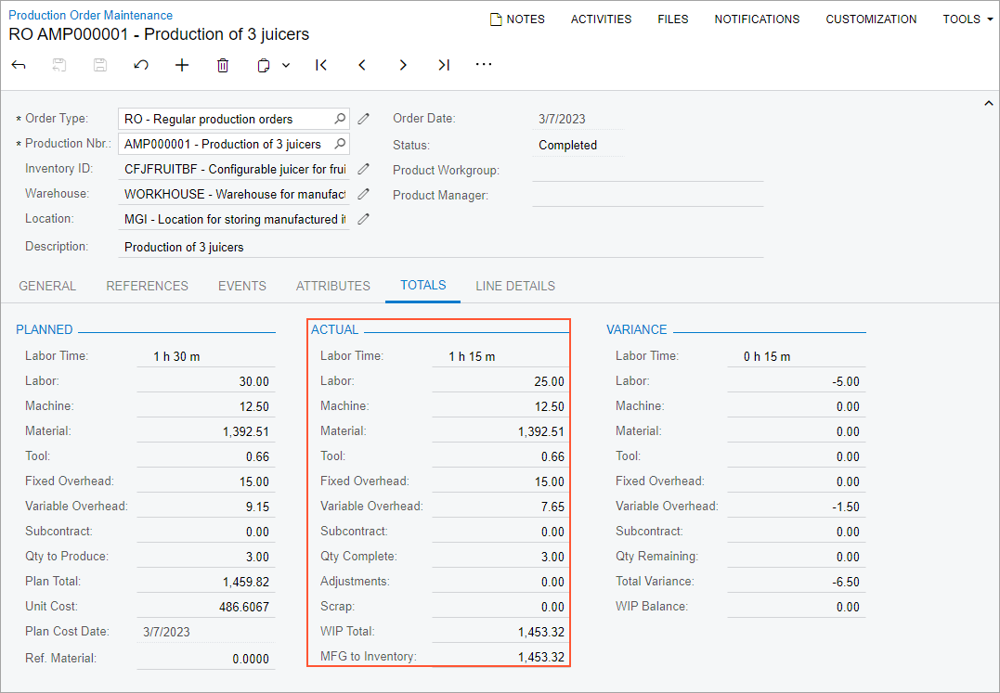

# Production Cost Drivers: To Review Planned and Actual Costs of a Production Order {#_3db54b13-dbe5-441c-a845-47e6bf1033f3 .task}

The following activity will walk you through the process of creating a production order and reviewing its planned and actual costs.

## Story { .section}

Suppose that GoodFood One Restaurant has ordered three juicers from the SweetLife Fruits &amp; Jams company. Initially, the production process includes the assembly and packing of the juicers. But the customer requested plastic lids for juice cups and said that they do not need the juicers to be packed. Further suppose that the plastic lids must be produced by using the injection molding machine specifically for this order. For simplicity, this operation will be included in the production order instead of creating a separate production order for producing the lids. Also suppose that other components for the juicers are available in SweetLife Fruits &amp; Jams's warehouse.

In addition, suppose that the system should use the *Actual* costing method for calculating the unit cost of produced juicers because produced items are moved to stock only when all transactions have been released and all costs have been applied to a production order.

Acting as a production manager, you will create a production order for producing three juicers and process all related transactions. In a production environment, a shop-floor employee would create labor and move transactions on their own. To streamline this activity, you will enter this transaction as a production manager.

Also, acting as a production accountant who wants to get to know how the production costs are calculated, you will review the planned and actual costs of the production order.

## Configuration Overview { .section}

In the *U100* dataset, the following tasks have been performed to support this activity:

-   On the [Warehouses](IN_20_40_00.md) \(IN204000\) form, the *WORKHOUSE* warehouse has been defined, and its locations include *MGI* and *MTL*.
-   On the [Stock Items](IN_20_25_00.md) \(IN202500\) form, the *CFJFRUITBF*, *PULPCONT1L*, *JUICECUP05L*, *MRBASE*, *FNSIEVE*, and *GRDISC01* stock items have been defined.

## Process Overview { .section}

In this activity, to process the documents and transactions related to the production of the juicers, you will do the following:

1.  On the [Production Order Maintenance](AM_20_15_00.md) \(AM201500\) form, create and release the production order.
2.  On the [Production Order Details](AM_20_90_00.md) \(AM209000\) form, edit the list of operations.
3.  On the [Production Order Maintenance](AM_20_15_00.md) form, review the planned costs of the production order.
4.  On the [Move](AM_30_20_00.md) \(AM302000\) form, record the completed items for the machine operation.
5.  On the [Materials](AM_30_00_00.md) \(AM300000\) form, issue the materials required for the assembly operation.
6.  On the [Labor](AM_30_10_00.md) \(AM301000\) form, record the labor spent on the juicer assembly and the produced quantity.
7.  On the [Production Order Maintenance](AM_20_15_00.md) form, review the actual costs applied to the production order after you have completed the order.
8.  On the [Close Production Orders](AM_50_60_00.md) \(AM506000\) form, close the production order.

## System Preparation { .section}

Do the following:

1.  As a prerequisite to the current activity, complete [Configuration of Production with Backflushing: Implementation Activity](../ImplementationGuide/config_MFG_Backflushing_Implem_Activity.md) so that the system is ready for processing the production of juicers with labor and material backflushing.
2.  Launch the Acumatica ERP website, and sign in to the company in which the prerequisite activities have been performed. You should sign in as the production manager by using the *peters* username and the *123* password.
3.  In the info area, in the upper-right corner of the top pane of the Acumatica ERP screen, make sure that the business date in your system is set to today’s date. For simplicity, in this activity, you will create and process all documents in the system on this business date.

## Step 1: Creating the Production Order { .section}

To create the production order for three juicers, do the following:

1.  On the [Production Order Maintenance](AM_20_15_00.md) \(AM201500\) form, add a new record.
2.  In the Summary area, specify the following settings:
    -   **Order Type**: *RO*
    -   **Inventory ID**: *CFJFRUITBF*
    -   **Warehouse**: *WORKHOUSE* \(selected automatically\)
    -   **Location**: *MGI* \(selected automatically\)
    -   **Order Date**: Today's date \(selected automatically\)
    -   **Description**: `Production of 3 juicers`
3.  On the **General** tab, do the following:
    1.  In the **Qty. to Produce** box, specify `3`.
    2.  In the **Costing Method** box, select *Actual*.
4.  On the form toolbar, click **Save**.

## Step 2: Editing the Operations of the Production Order { .section}

In this step, you will edit the list of operations so that to add the operation for producing lids for juice cups and remove the packing operation. Do the following:

1.  While you are still viewing the production order on the [Production Order Maintenance](AM_20_15_00.md) \(AM201500\) form, on the More menu \(under **Other**\), click **Production Detail**. The system opens the production order on the [Production Order Details](AM_20_90_00.md) \(AM209000\) form.
2.  In the Operations table, remove the packing operation as follows:
    1.  Click the row for the *0020* operation.
    2.  On the table toolbar, click **Delete Row**.
3.  On the form toolbar, click **Save**.
4.  In the same table, add the operation for the injection molding machine as follows:
    1.  On the table toolbar, click **Add Row**.
    2.  In the new row, specify the following settings:
        -   **Operation ID**: *0005*
        -   **Work Center**: *WCR20*
        -   **Machine Units**: *6.00*
        -   **Machine Time**: *01:00* \(specified automatically\)
    3.  On the form toolbar, click **Save**.
    4.  Make sure that the system moved the *0005* operation up.

## Step 3: Reviewing Planned Costs of the Production Order { .section}

In this step, acting as a production accountant, you will review planned costs of the production order. Do the following on the [Production Order Maintenance](AM_20_15_00.md) \(AM201500\) form:

1.  Open the production order you created earlier in this activity.
2.  In the **Planned** section of the **Totals** tab, make sure that the following costs are displayed \(see the screenshot below\):
    -   In the **Labor** box, the labor cost is *30.00*, which is calculated as follows: `Labor Hours (1.5h) * Work Center Standard Cost (20.00) = 30.00`
    -   In the **Machine** box, the machine cost is *12.50*, which is calculated as follows: `Machine Standard Cost (25.00) * Quantity to Produce (3) * Machine Hours (0.5h) = 12.50`
    -   In the **Material** box, the cost of materials is *1392.51*, which is the sum of the material costs for all operations. The cost of each material is calculated as follows:
        -   *PULPCONT*: `Quantity to Produce (3) * Material Unit Cost (17.59) * Required Material Quantity (1.00) = 52.77`
        -   *JUICECUP05L*: `Quantity to Produce (3) * Material Unit Cost (16.79) * Required Material Quantity (1.00) = 50.37`
        -   *MRBASE*: `Quantity to Produce (3) * Material Unit Cost (325.89) * Required Material Quantity (1.00) = 977.67`
        -   *FNCIEVE*: `Quantity to Produce (3) * Material Unit Cost (60.95) * Required Material Quantity (1.00) = 182.85`
        -   *GRDISC01*: `Quantity to Produce (3) * Material Unit Cost (42.95) * Required Material Quantity (1.00) = 128.85`
    -   In the **Tool** box, the cost of tools is *0.66*, which is the sum of the tool costs for the 0010 operation. The cost of each tool is calculated as follows:
        -   *HAMMER*: `Quantity to Produce (3) * Tool Unit Cost (0.02) * Required Tool Quantity (1.00) = 0.06`
        -   *SCREWDRIVER*: `Quantity to Produce (3) * Tool Unit Cost (0.20) * Required Tool Quantity (1.00) = 0.60`
    -   In the **Fixed Overhead** box, the cost is *15.00*, which is the cost rate for the *ADMIN* overhead.
    -   In the **Variable Overhead** box, the cost is *9.15*, which is the sum of variable overhead costs. The cost of each overhead is calculated as follows:
        -   *FLOOR* \(variable overhead by completed quantity for the 0005 operation\): `Quantity to Produce (3) * Overhead Cost Rate (0.05) = 0.15`
        -   *PAYROLL* \(variable overhead by labor cost for the 0010 operation\): `Labor Cost (30.00) * Overhead Cost Rate (0.3) = 9.00`
    -   In the **Plan Total** box, the total planned cost is *1459.82*, which is the sum of all planned costs.
    -   In the **Unit Cost** box, the cost is *486.6067*, which is calculated as follows: `Planned Total Costs (*1459.82*) / Quantity to Produce (3)`.

## Step 4: Recording Completed Items for the Machine Operation { .section}

Suppose that three lids for juice cups have been produced by using the injection molding machine. To record the completion of this operation, do the following:

1.  While you are still viewing the production order on the [Production Order Maintenance](AM_20_15_00.md) \(AM201500\) form, on the More menu \(under **Processing**\), click **Release Order**. The order's status is changed to *Released*.
2.  On the More menu \(under **Transactions**\), click **Create Move Transaction**. The system creates the move transaction for the *0005* operation and opens it on the [Move](AM_30_20_00.md) \(AM302000\) form.
3.  In the Summary area, do the following:
    1.  In the **Date** box, make sure that the today's date is specified.
    2.  In the **Description** box, enter `Recording the completion of 3 juice cup lids`.
    3.  Clear the **Hold** check box. The system changes the transaction's status to *Balanced*.
4.  On the form toolbar, click **Release**. The system releases the move transaction. Also, the system creates and releases a cost transaction for the machine cost, which is always backflushed, and for the variable overhead for the operation. You can view this transaction on the **Events** tab of the [Production Order Maintenance](AM_20_15_00.md) form.

## Step 5: Issuing Materials for the Assembly Operation { .section}

In this step, you will issue the materials for the assembly operation of the production order. Do the following:

1.  On the [Production Order Maintenance](AM_20_15_00.md) \(AM201500\) form, open the production order you created earlier in this activity.
2.  On the More menu \(under **Transactions**\), click **Release Materials**. The system opens the [Select Production Orders](AM_30_00_10.md) \(AM300020\) form with the list of materials needed for the assembly operation.
3.  On the form toolbar, click **Select All**. The system creates the material transaction and opens it on the [Materials](AM_30_00_00.md) \(AM300000\) form.
4.  In the Summary area, do the following:
    1.  In the **Description** box, specify `Materials for the assembly operation`.
    2.  Clear the **Hold** check box. The system changes the transaction's status to *Balanced*.
5.  On the form toolbar, click **Release**. The system releases the material transaction and changes the status of the transaction to *Released*.

## Step 6: Recording the Labor and Produced Items for the Assembly Operation { .section}

Suppose that Carlos Cruz, a worker in the work center, spent 30 minutes setting up the working environment for juicer assembly and assembled three juicers for 45 minutes. To record the time spent on juicer assembly and the assembled quantity of juicers, do the following:

1.  On the [Production Order Maintenance](AM_20_15_00.md) \(AM201500\) form, open the production order you created earlier in this activity.
2.  On the More menu \(under **Transactions**\), click **Create Labor Transaction**. The system creates the labor transaction for the *0010* operation and opens it on the [Labor](AM_30_10_00.md) \(AM301000\) form.
3.  In the only row, specify the following settings:
    -   **Employee ID**: *EP00000027* \(Carlos Cruz\)
    -   **Shift**: *0001*
    -   **Labor Time**: *01:15*
    -   **Quantity**: `3`
4.  In the Summary area, do the following:
    1.  In the **Date** box, make sure that the today's date is specified.
    2.  In the **Description** box, specify `Recording the time for assembly of 3 juicers and the completed quantity`.
    3.  Clear the **Hold** check box. The system changes the transaction's status to *Balanced*.
5.  On the form toolbar, click **Release**. The system creates and releases the cost transaction to record the labor costs and releases the labor transaction.

## Step 7: Reviewing Actual Costs for the Production Order { .section}

In this step, again acting as a production accountant, you will review actual costs of the production order after you have recorded the labor time and the completed items for the assembly operation. Do the following:

1.  On the [Production Order Maintenance](AM_20_15_00.md) \(AM201500\) form, open the production order you created earlier in this activity.
2.  In the **Actual** section of the **Totals** tab, make sure that the following costs are displayed \(see the following screenshot\):
    -   In the **Labor** box, the labor cost is *25.00*, which is calculated as follows: `Recorded Labor Time (1:15) * Work Center Standard Cost (20.00)`
    -   In the **Machine** box, the machine cost is *12.50*, which has been backflushed and equals the planned machine cost.
    -   In the **Material** box, the cost of materials is *1392.51*, which equals the planned material cost because the materials have been issued in full.
    -   In the **Tool** box, the cost of tools is *0.66*, which is the sum of the actual tool costs and depends on the quantity of completed items. The cost of each tool is calculated as follows:
        -   *HAMMER*: `Completed Quantity (3) * Tool Unit Cost (0.02) * Required Tool Quantity (1.00) = 0.06`
        -   *SCREWDRIVER*: `Completed Quantity (3) * Tool Unit Cost (0.20) * Required Tool Quantity (1.00) = 0.60`
    -   In the **Fixed Overhead** box, the cost is *15.00*, which equals the planned cost.
    -   In the **Variable Overhead** box, the cost is *7.65*, which is the sum of actual variable overhead costs. The cost of each overhead is calculated as follows:
        -   *FLOOR* \(variable by completed quantity for the 0005 operation\): `Completed Quantity (3) * Overhead Cost Rate (0.05) = 0.15`
        -   *PAYROLL* \(variable by labor cost for the 0010 operation\): `Labor Cost (25.00) * Overhead Cost Rate (0.3) = 7.5`
    -   In the **WIP Total** box, the total actual cost is *1453.32*, which is the sum of all actual costs.
    -   In the **MFG to Inventory** box, the cost is *1453.32*, which is the cost of the produced items that have been moved to stock. This cost differs from the planned item cost because the production employee spent less time for the juicer assembly. The system calculated this cost by using the *Actual* costing method so that it included only actual costs in the cost of produced items.

## Step 8: Closing the Production Order { .section}

Now you will close the production order. Do the following:

1.  On the [Close Production Orders](../Shared/../UserGuide/AM_50_60_00.md) \(AM506000\) form, select the production order.
2.  On the form toolbar, click **Process**. In the **Processing** dialog box, which opens, review the processing details, and when the processing is completed, click **Close**.
3.  Go to the [Production Order Maintenance](../Shared/../UserGuide/AM_20_15_00.md) form, and notice that the status of the production order has changed to *Closed*.

You have processed the production order for assembly of three juicers and reviewed the planned and actual costs of the production order.

**Parent topic:**[Managing Production Cost Drivers](../UserGuide/MFG_Production_Cost_Drivers_Mapref.md)

