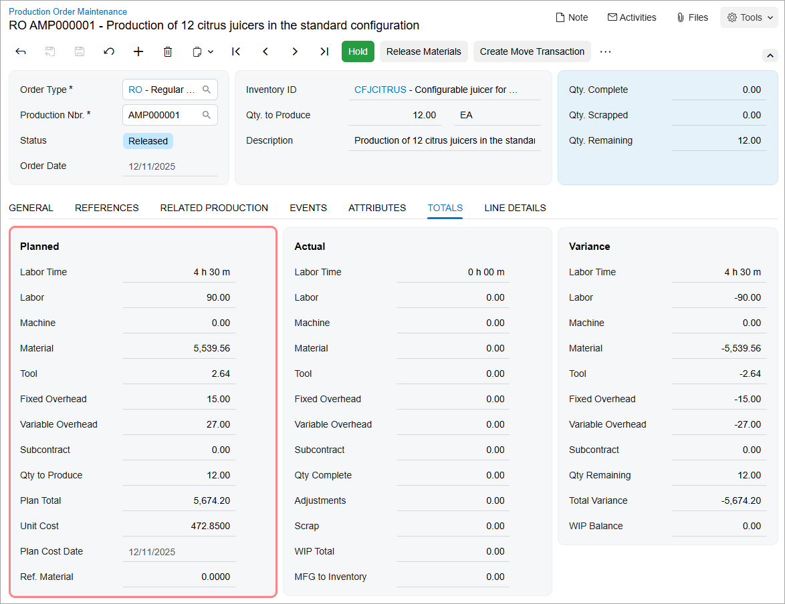
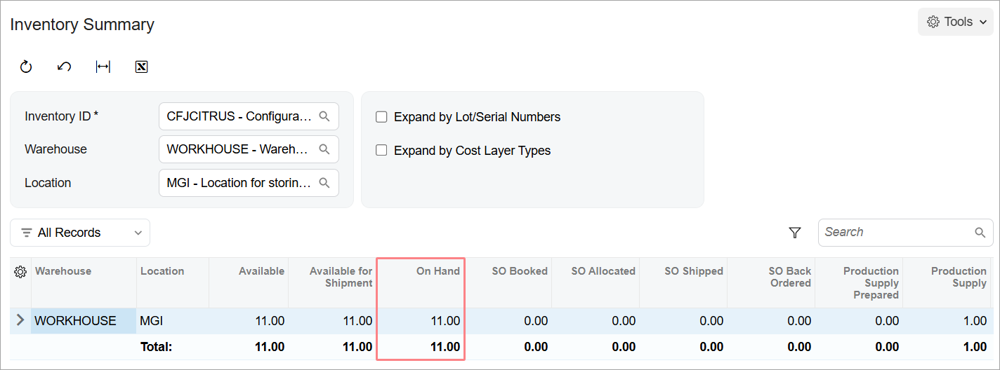
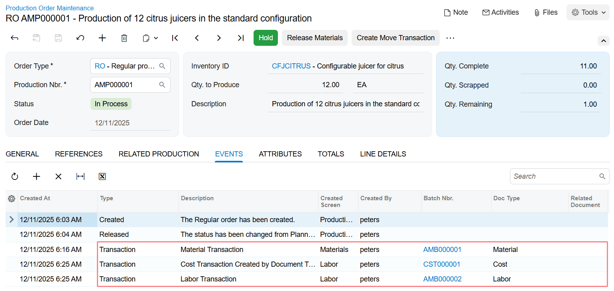
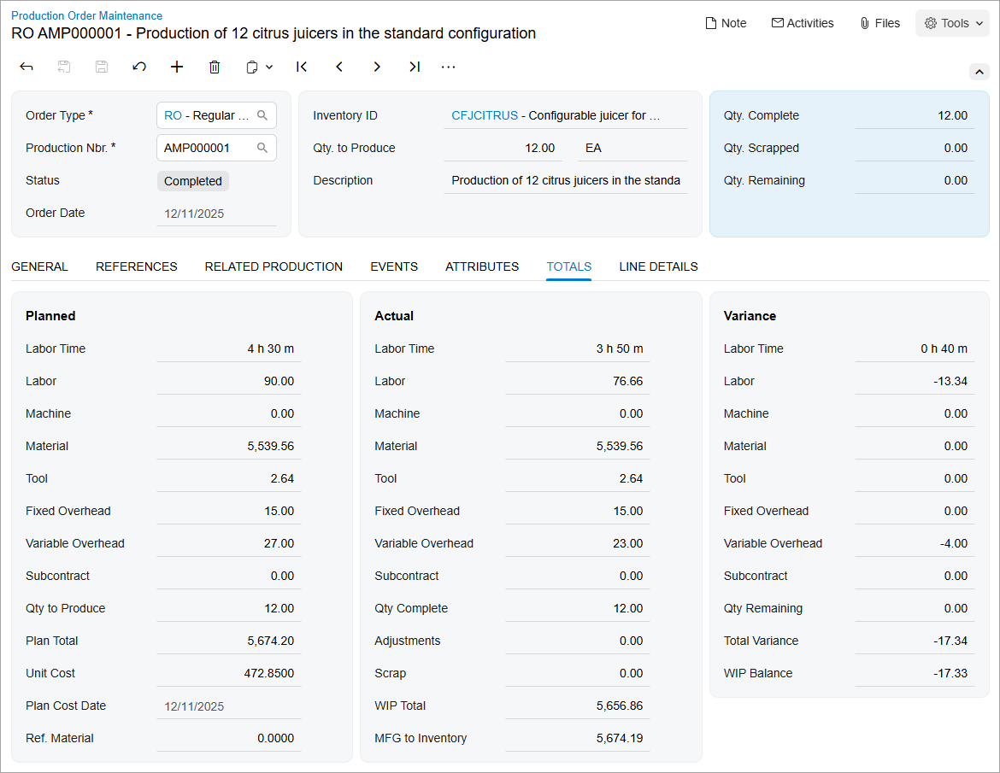

# Production Processing: To Process Production-Related Documents and Transactions {#_cf1dfe9e-7ae6-40ef-8e41-5aaa5324e1a1 .task}

The following activity will walk you through the creating and processing of a production order and the related documents and transactions.

## Story { .section}

Suppose that based on the analyzed demand from previous periods of sales, the sales department of SweetLife has asked the production department to produce 12 juicers for citrus. Acting as a production manager, you will create a production order for producing 12 citrus juicers, order the juicer parts that are out of stock from the vendor, and process all related transactions. Further suppose that the production of juicers should start on today's date and the scheduling priority is standard \(you do not need to produce the juicers faster or slower than the other items in the queue\).

## Configuration Overview { .section}

In the *U100* dataset, the following tasks have been performed to support this activity:

-   On the [Warehouses](IN_20_40_00.md) \(IN204000\) form, the *WORKHOUSE* warehouse and the *MGI* and *MTL* locations have been defined.
-   On the [Stock Items](IN_20_25_00.md) \(IN202500\) form, the *CFJCITRUS*, *JCREAMER*, *JUICECUP1L*, *MRBASEHIGH*, *STRBASKET*, and *SPLGUARD* stock items have been defined.
-   On the [Vendors](AP_30_30_00.md) \(AP303000\) form, the *JALOOZA* vendor has been created.

## Process Overview { .section}

In this activity, to process the documents and transactions related to the production of the citrus juicers, you will do the following:

1.  On the [Production Order Maintenance](AM_20_15_00.md) \(AM201500\) form, create and release the production order
2.  On the [Critical Materials](AM_40_10_00.md) \(AM401000\) form, view the list of components that are out of stock and create a purchase order for the components
3.  On the [Purchase Receipts](PO_30_20_00.md) \(PO302000\) form, create a purchase receipt to record the receipt of the components from the vendor
4.  On the [Materials](AM_30_00_00.md) \(AM300000\) form, issue the components required for the production order
5.  On the [Labor](AM_30_10_00.md) \(AM301000\) form, record the labor spent for the juicer assembly and the produced quantity
6.  On the [Storage Summary](IN_40_90_10.md) \(IN409010\) form, view the quantity of juicers available in the warehouse
7.  On the [Production Order Maintenance](AM_20_15_00.md) form, view the changes in the production order
8.  On the [Move](AM_30_20_00.md) \(AM302000\) form, record the receipt of one more juicer to the warehouse
9.  On the [Production Order Maintenance](AM_20_15_00.md) form, view the labor and costs recorded for the production order
10. On the [Close Production Orders](AM_50_60_00.md) \(AM506000\) form, close the production order

## System Preparation { .section}

Do the following:

1.  As prerequisites to the current activity, perform the following activities in the listed order:
    1.  [Bills of Material: Implementation Activity](BOM_Implem_Activity.md) so that the needed bill of material has been created in a company with the *U100* dataset preloaded.
    2.  [Production Order Types: To Create a Regular Production Order Type](../ImplementationGuide/config_MFG_Production_Order_Types_Implem_Activity_RO.md) so that a production order type for regular orders has been created in this company.
2.  Launch the Acumatica ERP website, and sign in to the company in which the prerequisite activities have been performed. You should sign in as the production manager by using the *peters* username and the *123* password.
3.  In the info area, in the upper-right corner of the top pane of the Acumatica ERP screen, make sure that the business date in your system is set to today’s date. For simplicity, in this activity, you will create and process all documents in the system on this business date.

## Step 1: Creating the Production Order { .section}

To create the production order for 12 citrus juicers, do the following:

1.  On the [Production Order Maintenance](AM_20_15_00.md) \(AM201500\) form, add a new record.

    Notice that the production order is assigned a status of *Planned*, and today's date has been automatically selected in the **Order Date** box.

2.  In the Summary area, do the following:
    1.  In the **Order Type** box, make sure *RO* is specified.
    2.  In the **Inventory ID** box, select *CFJCITRUS*.

        On the **General** tab, notice that the *WORKHOUSE* warehouse and the *MGI* location have been selected automatically.

    3.  In the **Qty. to Produce** box, specify `12`. Notice that this quantity is copied to the **Qty. Remaining** box.
    4.  In the **Description** box, specify `Production of 12 citrus juicers in the standard configuration`.
3.  On the form toolbar, click **Save**.
4.  On the form toolbar, click **Release Order**. The order status changes to *Released*.

    In the **Planned** section of the **Totals** tab, review the planned labor time and the planned costs for production of the juicers \(see the following screenshot\). The system calculates the planned time based on the values you have specified in the bill of material on the [Bill of Material](AM_20_80_00.md) \(AM208000\) form. The planned costs are calculated based on the planned time and on the settings of the production cost drivers. \(See [Configuring Production Cost Drivers: Implementation Activity](../ImplementationGuide/config_MFG_Production_Cost_Drivers_Implem_Activity.md) for details.\)

    

The production order is ready to be processed further.

## Step 2: Creating a Purchase Order for Out-of-Stock Components { .section}

In this step, you will view the list of components that are required for the production of the juicers and are out of stock, and you will create a purchase order to purchase the components from the *JALOOZA* vendor. Do the following:

1.  While you are still viewing the production order on the [Production Order Maintenance](AM_20_15_00.md) \(AM201500\) form, click **Critical Material** \(under **Materials**\) on the More menu. The [Critical Materials](AM_40_10_00.md) \(AM401000\) form opens with the production order number selected in the **Production Nbr.** box.

    Notice that zeros are specified in all rows in the **Qty. On Hand** column. This means that all the components required to assemble the juicers are out of stock and must be purchased.

2.  In the column header with the unlabeled check box, select this check box to select all rows.
3.  On the form toolbar, click **Purchase**.
4.  In the **Create Purchase Order** dialog box, which opens, review the settings, and click **Create**. The system creates a purchase order and opens it on the [Purchase Orders](PO_30_10_00.md) \(PO301000\) form.
5.  On the form toolbar, click **Remove Hold**. The status of the purchase order changes to *Open*.

## Step 3: Receiving the Components in a Warehouse { .section}

Suppose that you have received the ordered components from the *JALOOZA* vendor and need to create a purchase receipt. The items have been received to the *MTL* location in the *WORKHOUSE* warehouse \(this location is dedicated to the storing of components\). Do the following:

1.  While you are still viewing the purchase order on the [Purchase Orders](PO_30_10_00.md) \(PO301000\) form, on the form toolbar, click **Enter PO Receipt**.

    The system creates the purchase receipt and opens it on the [Purchase Receipts](PO_30_20_00.md) \(PO302000\) form.

    On the **Details** tab, review the list of the received components. Notice that *MTL* is specified for each row in the **Location** column.

2.  On the form toolbar, click **Release**.

    The system releases the purchase receipt and changes its status to *Released*. On the **Orders** tab, notice that *Completed* is specified in the **Status** column of the only row.

You have received the required components into stock and now you can continue processing the production order.

## Step 4: Issuing the Components for the Production Order { .section}

In this step, you will issue the components for the production order. Do the following:

1.  On the [Production Order Maintenance](AM_20_15_00.md) \(AM201500\) form, open the production order that you created earlier in this activity.
2.  On the More menu \(under **Transactions**\), click **Release Materials**. The system opens the [Select Materials to Release](AM_30_00_20.md) \(AM300020\) form with the list of components from the production order.
3.  On the form toolbar, click **Select All**. The system creates a material transaction and opens it on the [Materials](AM_30_00_00.md) \(AM300000\) form.
4.  In the Summary area, do the following:
    1.  In the **Description** box, specify `Materials for 12 citrus juicers`.
    2.  Clear the **Hold** check box. The system changes the transaction status to *Balanced*.
5.  On the form toolbar, click **Release**. The system releases the material transaction and changes the status of the transaction to *Released*.
6.  On the [Issues](IN_30_20_00.md) \(IN302000\) form, make sure that the inventory issue with the components from the production order has been created and released.

## Step 5: Recording the Labor and Produced Items { .section}

Suppose that Carlos Cruz, a worker in the work center, spent 30 minutes setting up the working environment for juicer assembly and assembled 5 juicers for 1 hour and 40 minutes. Another work center worker, Casey Burrows, assembled 6 juicers for the same amount of time. The assembled juicers have been moved to the *MGI* location of the *WORKHOUSE* warehouse. To record the time spent on juicer assembly and the movement of the assembled juicers, do the following:

1.  On the [Labor](AM_30_10_00.md) \(AM301000\) form, add a new record.
2.  On the table toolbar, click **Add Row**.
3.  In the row, specify the following settings:
    -   **Labor Type**: *Direct*
    -   **Order Type**: *RO*
    -   **Production Nbr.**: The number of the production order that you created earlier in this activity
    -   **Operation ID**: *0010*
    -   **Employee ID**: *EP00000027* \(Carlos Cruz\)
    -   **Shift**: *0001*
    -   **Labor Time**: *02:10*
    -   **Quantity**: `5`
4.  On the table toolbar, click **Add Row**.
5.  In the row, specify the following settings:
    -   **Labor Type**: *Direct*
    -   **Order Type**: *RO*
    -   **Production Nbr.**: The number of the production order that you created earlier in this activity
    -   **Operation ID**: *0010*
    -   **Employee ID**: *EP00000028* \(Casey Burrows\)
    -   **Shift**: *0001*
    -   **Labor Time**: *01:40*
    -   **Quantity**: `6`
6.  In the Summary area, do the following:
    1.  In the **Date** box, make sure that today's date is specified.
    2.  In the **Description** box, specify `Recording the time for assembly of 11 citrus juicers`.
    3.  Clear the **Hold** check box. The system changes the transaction status to *Balanced*.
7.  On the form toolbar, click **Release**. The system creates and releases the cost transaction to record labor costs, the inventory receipt to record the movement of the assembled juicers to the warehouse location, and the labor transaction itself.

## Step 6: Viewing the Availability of Juicers { .section}

To make sure that the assembled juicers have been moved to the *MGI* warehouse location, do the following:

1.  On the [Receipts](IN_30_10_00.md) \(IN301000\) form, open the inventory receipt with the 11 juicers.

    Notice that the receipt has the *Released* status.

2.  On the [Inventory Summary](IN_40_10_00.md) \(IN401000\) form, specify the following settings in the Selection area:

    -   **Inventory ID**: *CFJCITRUS*
    -   **Warehouse**: *WORKHOUSE*
    -   **Location**: *MGI*
    Notice that the value in the **On Hand** column of the only row listed in the table is *11*, as shown below.

    

## Step 7: Viewing the Changes to the Production Order { .section}

In this step, you will view the changes the system made to the production order as a result of the previous steps. Do the following:

1.  On the [Production Order Maintenance](AM_20_15_00.md) \(AM201500\) form, open the production order that you created earlier in this activity.

    In the Summary area, notice that the value of the **Qty. Complete** box is *11* and the value of the **Qty. Remaining** box is *1*. This means that 11 out of 12 juicers have been assembled and are available in the warehouse.

2.  Go to the **Events** tab.

    Notice that records for material, cost, and labor transactions are displayed in the table.

    

## Step 8: Recording the Produced Items { .section}

Suppose that you have been informed that Carlos Cruz produced 6 juicers— not 5, as you recorded earlier in this activity. To record the receipt of one more juicer to the warehouse location, create a move transaction as follows:

1.  While you are still viewing the production order on the [Production Order Maintenance](AM_20_15_00.md) \(AM201500\) form, on the form toolbar, click **Create Move Transaction**. The system opens the [Move](AM_30_20_00.md) \(AM302000\) form with the row for the production order added to the table.

    Notice that *1* is specified in the **Quantity** column.

2.  In the Summary area, clear the **Hold** check box.
3.  On the form toolbar, click **Release**. The system creates and releases the inventory receipt and the cost transaction; it also changes the status of the move transaction to *Released*.
4.  On the [Inventory Summary](IN_40_10_00.md) \(IN401000\) form, specify the following settings in the Selection area:

    -   **Inventory ID**: *CFJCITRUS*
    -   **Warehouse**: *WORKHOUSE*
    -   **Location**: *MGI*
    Notice that the value in the **On Hand** column of the only row is *12*.

5.  On the [Production Order Maintenance](AM_20_15_00.md) form, open the production order that you created earlier in this activity.

    In the Summary area, notice that the **Qty. Complete** box contains *12* and the **Qty. Remaining** box contains *0*, and the status of the order is *Completed*.

## Step 9: Viewing Production Order Totals { .section}

Before closing the production order, you will view the actual recorded labor time and costs on the [Production Order Maintenance](AM_20_15_00.md) \(AM201500\) form, as follows:

1.  Notice that the following values are specified in the **Actual** section of the **Totals** tab, as shown in the screenshot below:

    -   **Labor Time**: *3 h 50 m*
    -   **Labor**: *76.66*
    -   **Variable Overhead**: *23.00*
    The other values of the cost boxes are the same as in the **Planned** section. These costs are fixed and do not depend on the recorded labor.

2.  Review the difference between the planned and actual labor time and costs in the **Variance** section, which is shown in the following screenshot. Notice that the workers spent 40 minutes of work less than the planned time.

    

## Step 10: Closing the Production Order { .section}

Now you will close the production order. Do the following:

1.  On the [Close Production Orders](../Shared/../UserGuide/AM_50_60_00.md) \(AM506000\) form, select the production order.
2.  On the form toolbar, click **Process**. In the **Processing** dialog box, which opens, review the processing details, and when the processing is completed, click **Close**.
3.  Go to the [Production Order Maintenance](../Shared/../UserGuide/AM_20_15_00.md) form, and notice that the status of the production order has changed to *Closed*.

You have successfully processed the production order for 12 citrus juicers.

**Parent topic:**[Producing Items](../UserGuide/MFG_Production_Order_Processing_Mapref.md)

