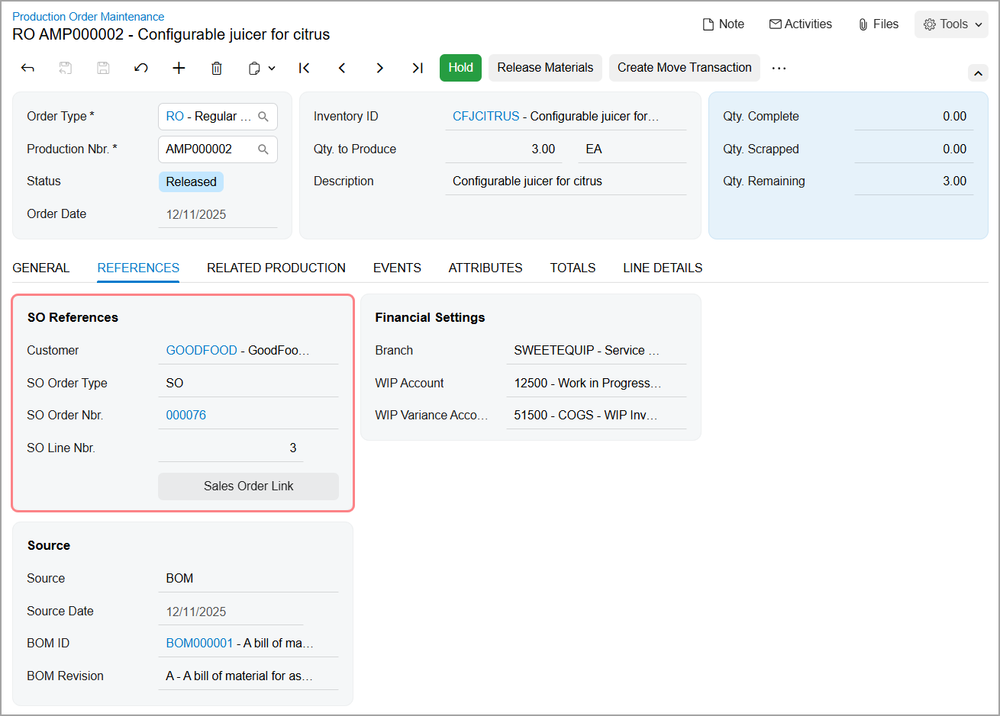
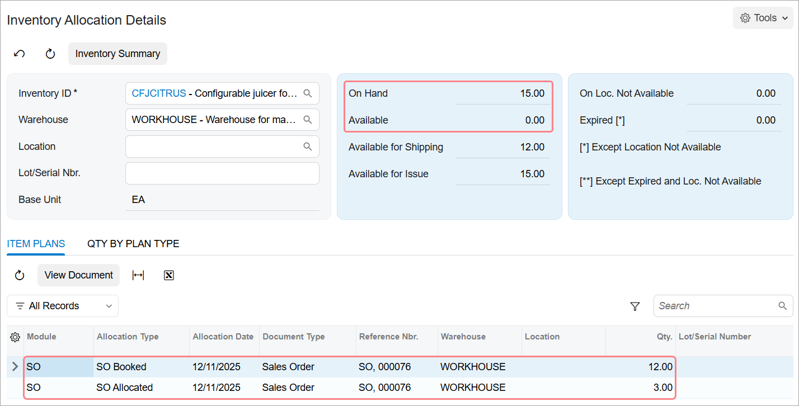

# Production Processing: To Process Production for Sales {#_101e2921-498f-4932-aa61-743c4674a282 .task}

The following activity will walk you through the creation and processing of production documents related to sales documents.

## Story { .section}

Suppose that the GoodFood One Restaurant has ordered 15 juicers for citrus from the SweetLife Fruits &amp; Jams company. The 15 juicers include 12 juicers with the 1-liter cup and 3 juicers with the 0.5-liter cup. Further suppose that SweetLife has the 12 juicers with the 1-liter cup in stock, but the 3 juicers with the 0.5-liter cup must be produced. Acting as a production manager, you need to create a sales order for the GoodFood One Restaurant, create a production order for the 3 juicers with the 0.5-liter cup, and process all the related documents and transactions.

## Configuration Overview { .section}

In the *U100* dataset, the following tasks have been performed to support this activity:

-   On the [Warehouses](IN_20_40_00.md) \(IN204000\) form, the *WORKHOUSE* warehouse and the *MGI* and *MTL* locations have been defined.
-   On the [Stock Items](IN_20_25_00.md) \(IN202500\) form, the *CFJCITRUS*, *JCREAMER*, *JUICECUP1L*, *JUICECUP05L*, *MRBASEHIGH*, *STRBASKET*, and *SPLGUARD* stock items have been predefined.
-   On the [Vendors](AP_30_30_00.md) \(AP303000\) form, the *JALOOZA* vendor has been created.

## Process Overview { .section}

In this activity, to process the documents and transactions related to the sales and production of the citrus juicers, you will do the following:

1.  On the [Sales Orders](SO_30_10_00.md) \(SO301000\) form, create a sales order for the 15 juicers
2.  On the same form, create the production order for 3 of the citrus juicers
3.  On the [Inventory Allocation Details](IN_40_20_00.md) \(IN402000\) form, view the item plans for the sales order and the production order
4.  On the [Production Order Details](AM_20_90_00.md) \(AM209000\) form, replace the juicer components
5.  On the [Production Order Maintenance](AM_20_15_00.md) form, release the production order and view the link to the sales order
6.  On the [Critical Materials](AM_40_10_00.md) \(AM401000\) form, view the list of components that are out of stock and create a purchase order for the components
7.  On the [Purchase Receipts](PO_30_20_00.md) \(PO302000\) form, create a purchase receipt to record the receipt of the components from the vendor
8.  On the [Materials](AM_30_00_00.md) \(AM300000\) form, issue the components required for the production order
9.  On the [Labor](AM_30_10_00.md) \(AM301000\) form, record the labor spent for the juicer assembly and the produced quantity
10. On the [Close Production Orders](AM_50_60_00.md) \(AM506000\) form, close the production order
11. On the [Inventory Allocation Details](IN_40_20_00.md) \(IN402000\) form, view the changes to the item plans
12. On the [Sales Orders](SO_30_10_00.md) form, process the documents related to shipping the items to the customer

## System Preparation { .section}

Do the following:

1.  As prerequisites to the current activity, perform the following activities in the listed order:
    1.  [Bills of Material: Implementation Activity](BOM_Implem_Activity.md) so that the needed bill of material has been created in a company with the *U100* dataset preloaded.
    2.  [Production Order Types: To Create a Regular Production Order Type](../ImplementationGuide/config_MFG_Production_Order_Types_Implem_Activity_RO.md) so that a production order type for regular orders has been created in this company.
2.  Launch the Acumatica ERP website, and sign in to the company in which the prerequisite activities have been performed. You should sign in as the production manager by using the *peters* username and the *123* password.
3.  In the info area, in the upper-right corner of the top pane of the Acumatica ERP screen, make sure that the business date in your system is set to today’s date. For simplicity, in this activity, you will create and process all documents in the system on this business date.

## Step 1: Creating the Sales Order { .section}

To create the sales order for the 15 juicers that the GoodFood One Restaurant has ordered, do the following:

1.  On the [Sales Orders](SO_30_10_00.md) \(SO301000\) form, add a new record.
2.  In the Summary area, specify the following settings:
    -   **Order Type**: *SO* \(automatically selected\)
    -   **Date**: Today's date \(automatically selected\)
    -   **Customer**: *GOODFOOD*
    -   **Description**: `Sale of 15 citrus juicers`
3.  On the **Details** tab, add a new row for the citrus juicer with the 1-liter cup, and specify the following settings in the row:
    -   **Inventory ID**: *CFJCITRUS*
    -   **Quantity**: `12`
    -   **Unit Price**: `2000.00`
    -   **Mark for Production**: Cleared
4.  Add another row for the citrus juicer with the 0.5-liter cup to be produced, and specify the following settings:
    -   **Inventory ID**: *CFJCITRUS*
    -   **Quantity**: `3`
    -   **Unit Price**: `1900.00`
    -   **Mark for Production**: Selected
5.  On the form toolbar, click **Save**.

## Step 2: Creating the Production Order { .section}

To create the production order for the three ordered citrus juicers with the 0.5-liter cup, while you are still viewing the sales order on the [Sales Orders](SO_30_10_00.md) \(SO301000\) form, do the following:

1.  On the More menu \(under **Manufacturing**\), click **Create Production Orders**.

    **Tip:** You open the More menu by clicking the More button \(…\) on the form toolbar.

2.  In the **Production Orders** dialog box, which opens, do the following:

    1.  Select the check box in the unlabeled column in the row with three *CFJCITRUS* items.
    2.  Click **Create**.
    The system creates a production order and closes the dialog box.

    On the **Details** tab, notice that the link to the production order has been added to the **Production Nbr.** column in the line with three *CFJCITRUS* items.

## Step 3: Viewing the Allocation of Items { .section}

To view the allocation of items for the sales order and the production order, do the following:

1.  While you are still viewing the sales order on the [Sales Orders](SO_30_10_00.md) \(SO301000\) form, click the row with three juicers and on the table toolbar of the **Details** tab, click **Item Availability**. The system opens the [Inventory Allocation Details](IN_40_20_00.md) \(IN402000\) form with the *CFJCITRUS* item and *WORKHOUSE* warehouse selected in the Summary area.
2.  Go to the **Item Plans** tab, and notice that the following plans are displayed:
    -   *SO Booked* for 12 items: This quantity is allocated for the sales order.
    -   *SO to Production* for 3 items: This quantity of the items to be produced is allocated for the sales order.
    -   *Production for SO Prepared* for 3 items: This quantity on the production order is allocated for the sales order.

## Step 4: Changing the List of Components { .section}

In the bill of materials assigned to the *CFJCITRUS* item, the 1-liter juice cup is specified as one of the components, but the customer has ordered three juicers with the 0.5-liter juice cup. You need to change the set of components for the *CFJCITRUS* item in this order only. Do the following:

1.  On the [Production Order Details](AM_20_90_00.md) \(AM209000\) form, open the production order that the system created earlier in this activity, which is assigned the *Planned* status and contains three *CFJCITRUS* items.
2.  In the table of the **Materials** tab in the lower part of the form, remove the *JUICECUP1L* item.
3.  Add a row for the *JUICECUP05L* item, and make sure that *1* is specified in the **Qty. Required** column.
4.  On the form toolbar, click **Save**.

You have replaced the 1-liter juice cup with the 0.5-liter juice cup in the list of components of the production order.

## Step 5: Releasing the Production Order { .section}

Before you start processing the production order, you need to release it. Do the following:

1.  On the [Production Order Maintenance](AM_20_15_00.md) \(AM201500\) form, open the production order that the system created earlier in this activity.
2.  On the form toolbar, click **Release Order**. The order's status changes to *Released*.

    On the **References** tab, notice that information about the linked sales order is displayed in the **SO References** section, as shown below.

    

## Step 6: Creating a Purchase Order for Components { .section}

In this step, you will view the list of components that are required for the production of the juicers and are out of stock, and you will create a purchase order to purchase the materials from the *JALOOZA* vendor. Do the following:

1.  While you are still viewing the production order on the [Production Order Maintenance](AM_20_15_00.md) \(AM201500\) form, on the More menu \(under **Materials**\), click **Critical Material**. The [Critical Materials](AM_40_10_00.md) \(AM401000\) form opens with the production order number selected in the **Production Nbr.** box.

    Notice that zeros are specified in all rows in the **Qty. On Hand** column. This means that the components required to assemble the juicers \(except *JUICECUP05L*\) are out of stock and must be purchased.

2.  In the column header with the unlabeled check box, select this check box to select all rows.
3.  On the form toolbar, click **Purchase**.
4.  In the **Create Purchase Order** dialog box, which opens, review the settings, and click **Create**. The system creates a purchase order and opens it on the [Purchase Orders](PO_30_10_00.md) \(PO301000\) form.
5.  On the form toolbar, click **Remove Hold**. The status of the purchase order changes to *Open*.

## Step 7: Receiving the Components in a Warehouse { .section}

Suppose that you have received the ordered components from the *JALOOZA* vendor and need to create a purchase receipt. The items have been received to the *MTL* location in the *WORKHOUSE* warehouse \(this location is dedicated to the storing of materials and components\). Do the following:

1.  While you are still viewing the purchase order on the [Purchase Orders](PO_30_10_00.md) \(PO301000\) form, on the form toolbar, click **Enter PO Receipt**. The system creates a purchase receipt and opens it on the [Purchase Receipts](PO_30_20_00.md) \(PO302000\) form.

    On the **Details** tab, review the list of the received components. Notice that *MTL* is specified for each row in the **Location** column.

2.  On the form toolbar, click **Release**. The system releases the purchase receipt and changes its status to **Released**.

    On the **Orders** tab, notice that *Completed* is specified in the **Status** column of the only row.

You have received the required components into stock, and now you can continue processing the production order.

## Step 8: Issuing the Components for the Production Order { .section}

In this step, you will issue the components for the production order. Do the following:

1.  On the [Production Order Maintenance](AM_20_15_00.md) \(AM201500\) form, open the production order that the system created earlier in this activity.
2.  On the More menu \(under **Transactions**\), click **Release Materials**. The system opens the [Select Materials to Release](AM_30_00_20.md) \(AM300020\) form with the list of components from the production order.
3.  On the form toolbar, click **Select All**. The system creates the material transaction and opens it on the [Materials](AM_30_00_00.md) \(AM300000\) form.
4.  In the Summary area, do the following:
    1.  In the **Description** box, specify `Materials for 3 citrus juicers`.
    2.  Clear the **Hold** check box.
5.  On the form toolbar, click **Release**. The system releases the material transaction and changes the status of the transaction to *Released*.

## Step 9: Recording the Labor and Produced Items { .section}

Suppose that Carlos Cruz, a worker in the work center, spent 30 minutes setting up the working environment for juicer assembly and assembled 3 juicers for 1 hour. The assembled juicers have been moved to the *MGI* location of the *WORKHOUSE* warehouse. To record the time spent on juicer assembly and the movement of the assembled juicers, do the following:

1.  On the [Labor](AM_30_10_00.md) \(AM301000\) form, add a new record.
2.  On the table toolbar, click **Add Row**.
3.  In the row, specify the following settings:
    -   **Labor Type**: *Direct*
    -   **Order Type**: *RO*
    -   **Production Nbr.**: The number of the production order that the system created earlier in this activity
    -   **Operation ID**: *0010*
    -   **Employee ID**: *EP00000027* \(Carlos Cruz\)
    -   **Shift**: *0001*
    -   **Labor Time**: *01:30*
    -   **Quantity**: `3`
4.  In the Summary area, do the following:
    1.  Make sure that today's date is specified in the **Date** box.
    2.  In the **Description** box, specify `Recording the time for assembly of 3 citrus juicers`.
    3.  Clear the **Hold** check box. The system changes the transaction status to *Balanced*.
5.  On the form toolbar, click **Release**. The system creates and releases the cost transaction to record labor costs, the inventory receipt to record the movement of the assembled juicers to the warehouse location, and the labor transaction itself.

## Step 10: Closing the Production Order { .section}

Now you will close the production order. Do the following:

1.  On the [Production Order Maintenance](AM_20_15_00.md) \(AM201500\) form, open the production order that the system created earlier in this activity.

    In the Summary area, notice that *0* is specified in the **Qty. Remaining** box. This means that all juicers have been produced. Also notice that the order status is *Completed*.

2.  On the [Close Production Orders](AM_50_60_00.md) \(AM506000\) form, select the production order.
3.  On the form toolbar, click **Process**. In the **Processing** dialog box, which opens, review the processing details, and when the processing is completed, click **Close**.
4.  On the [Production Order Maintenance](AM_20_15_00.md) form, open the production order again and notice that its status has been changed to *Closed*.

## Step 11: Viewing the Allocation of the Produced Items { .section}

To view the allocation details for the produced juicers, do the following:

1.  On the [Sales Orders](SO_30_10_00.md) \(SO301000\) form, open the sales order that you created earlier in this activity.
2.  On the table toolbar of the **Details** tab, click **Item Availability**. The system opens the [Inventory Allocation Details](IN_40_20_00.md) \(IN402000\) form with the *CFJCITRUS* item and the *WORKHOUSE* warehouse selected in the Summary area.

    On the **Item Plans** tab, notice that the *SO Allocated* item plan for 3 items and the *SO Booked* item plan for 12 items are displayed. Also, notice that the following item plans are no longer listed: the *SO to Production* item plan for 3 items and the *Production for SO Prepared* item plan for 3 items.

    In the Summary area, the **On Hand** value is *15* but the **Available** value is *0*, as shown in the following screenshot. This means that the juicers are allocated for the sales order and are unavailable for other sales orders.

    

## Step 12: Shipping Items to the Customer { .section}

To ship the items to the customer, do the following:

1.  On the [Sales Orders](SO_30_10_00.md) \(SO301000\) form, open the sales order that you created earlier in this activity.
2.  On the form toolbar, click **Quick Process**.
3.  In the **Process Order** dialog box, which opens, select the **Release Invoice** check box in the **Invoicing** section. \(Leave the other settings as they are.\)
4.  Click **OK**, and wait until the system processes the related documents and transactions.
5.  Notice that the status of the sales order has changed to *Completed*.

You have successfully processed the sales order and the related production documents and transactions.

**Parent topic:**[Producing Items](../UserGuide/MFG_Production_Order_Processing_Mapref.md)

