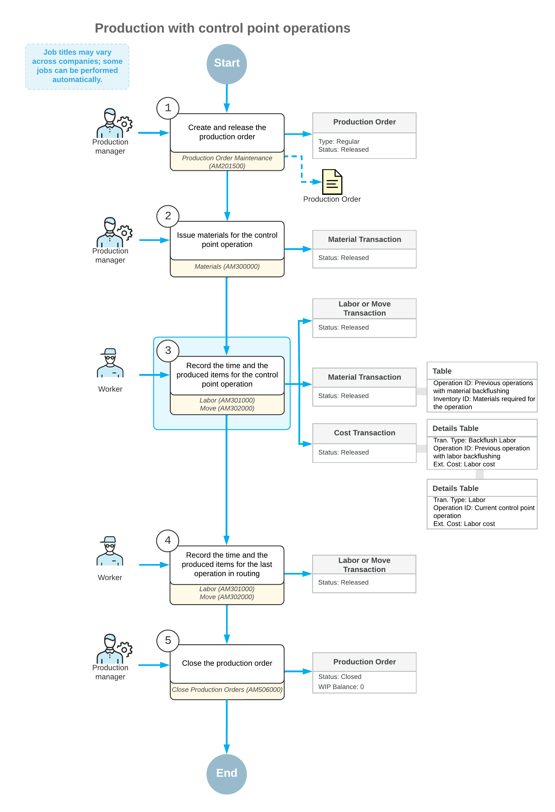

# Production Processing: Control Point Operations {#_34066685-2233-4629-9995-0aa594b447a1 .concept}

Generally, workers who process or produce items according to production orders are not obliged to record the quantity of completed items for each operation except the last one. If you have many operations in production routing and want to make the production progress more visible or improve data recording accuracy for production orders, you can mark particular operations in routing as control points. For these operations, the system will force workers to record the completed quantity by using the [Labor](AM_30_10_00.md) \(AM301000\) or [Move](AM_30_20_00.md) \(AM302000\) form before the workers can record the completed quantity for the last operation.

To mark an operation as a control point, you select the **Control Point** check box in its row of the Operations table on the [Bill of Material](AM_20_80_00.md) \(AM208000\) form. The state of the check box is used as the default state of the **Control Point** check box in the row for this operation on the [Production Order Details](AM_20_90_00.md) \(AM209000\), but you can override this state.

**Attention:** The last routing operation is always a control point because before the production order can be completed, workers must report the labor hours spent for production and the quantity of the completed items.

In the following sections, you will read about operations marked as control points.

## Production Process with Control Point Operations { .section}

Suppose that a production order has the operations defined in the Operations table of the [Production Order Details](AM_20_90_00.md) \(AM209000\) form with the settings shown in the following table.

|Operation ID|Backflush Labor|Control Point|Backflush Materials|
|------------|---------------|-------------|-------------------|
|*0010*|Selected|Cleared|Selected|
|*0020*|Cleared|Selected|Cleared|
|*0030*|Cleared|Selected|Cleared|

In the following diagram, you can view the actions and generated documents for this production order.

The employees involved do the following to process the production order and the related transactions:

1.  *Create and release the production order.*

    On the [Production Order Maintenance](AM_20_15_00.md) \(AM201500\) form, the production manager creates and releases the production order.

2.  *Issue materials for the control point operation.*

    On the [Materials](AM_30_00_00.md) \(AM300000\) form, the production manager issues the materials required for the second operation.

    **Tip:** Materials and labor are backflushed for the first operation, so for this operation, the manager does not need to issue materials, and employees do not need to record labor.

3.  *Record the time and the completed quantity for the control point operation.*

    On the [Labor](AM_30_10_00.md) \(AM301000\) form, a worker records the time they spent on the operation and the item quantity they produced during the second operation. When the worker releases the labor transaction, the system also does the following:

    -   Creates and releases the material transaction on the [Materials](AM_30_00_00.md) form with the backflushed materials for the first operation.
    -   Creates and releases the cost transaction on the [Cost Transactions](AM_30_90_00.md) \(AM309000\) form. The transaction includes the cost of the backflushed labor for the first operation and the cost of the labor for the second operation.
4.  *Record the time and the completed quantity for the last operation.*

    On the [Labor](AM_30_10_00.md) form, the worker records the time they spent on the operation and the item quantity they produced during the third operation.

5.  *Close the production order.*

    On the [Close Production Orders](AM_50_60_00.md) \(AM506000\) form, the production manager closes the production order.

## Verification of Item Quantities { .section}

If multiple routing operations are marked as control points, when a worker enters the quantity of completed items on the [Labor](AM_30_10_00.md) \(AM301000\) or [Move](AM_30_20_00.md) \(AM302000\) form for the control point operations, the system verifies that the quantity entered for the current operation is less than or equal to the quantity recorded for the preceding control point operation. If this condition is not met, the system displays an error message and does not release the labor or move transaction until the worker enters the correct item quantity.

For example, suppose that a production order for producing a base unit contains four operations: *0010 Cutting*, *0020 Form*, *0030 Assembly*, and *0040 Inspection*; the *0010* and *0030* operations are control points. Further suppose that on the [Move](AM_30_20_00.md) form, a worker creates a move transaction for Operation *0010* and enters `7` as the completed quantity. Then another worker, when specifying the completed quantity of the item for Operation *0030* on the same form, mistakenly enters `70` instead of `7` as the quantity. The system does not release the move transaction until the worker enters a quantity of `7` or less.

## Reversal of Item Quantities { .section}

When a worker would like to revert the quantity of completed items for some operation and enters a negative quantity value on the [Move](AM_30_20_00.md) \(AM302000\) form for this operation, the system verifies that the completed quantity after the reversal is more than or equal to the completed quantity recorded for the next operation marked as a control point. If the validation fails, the system displays an error message and does not release the transaction until the worker enters the correct quantity to be reversed.

In the previously considered example of a production order for producing a base unit, suppose that on the [Move](AM_30_20_00.md) form, a worker creates a move transaction for Operation *0010* and enters the completed quantity as `7`. Further suppose that another worker creates a move transaction for Operation *0030* on the same form and enters a quantity of `5`. Then the first worker finds out that the quantity specified for Operation *0010* is incorrect and creates a move transaction with a quantity of –3. The system calculates the new completed quantity for Operation *0010* as 7 – 3 = 4. The new quantity is less than the quantity recorded for Operation *0030*. So the system will not release the move transaction until the worker specifies –2 or –1 as the quantity to be reversed.

**Parent topic:**[Producing Items](../UserGuide/MFG_Production_Order_Processing_Mapref.md)

