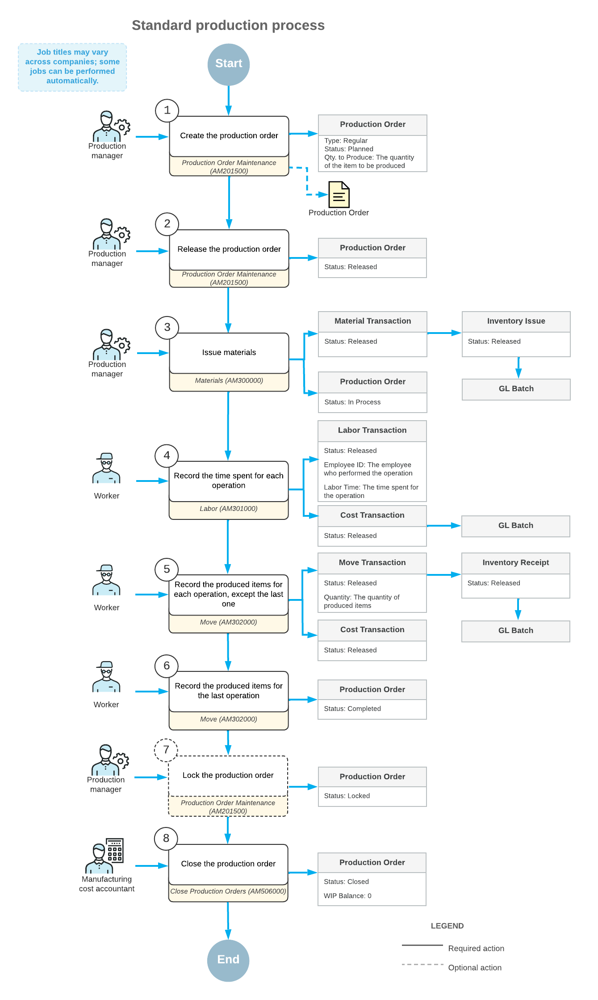

# Production Processing: General Information {#_e71d9d1c-0316-4242-90da-0da67ad0e972 .concept}

The production management functionality of Acumatica ERP Manufacturing Edition is used to control and track the transformation of raw materials and component parts into finished items and subassemblies. You create production orders of a regular type and the related transactions to record the production of items and their costs.

In this topic, you will find details about the standard workflow of processing production orders when backflushing and scrap reporting are not used.

## Learning Objectives { .section}

In this chapter, you will learn how to do the following:

-   Create and process a production order of the regular type
-   View the list of components that are out of stock and create documents for purchasing the components
-   Issue the components required to produce the item
-   Track the produced quantity of items and the employee time spent on producing the items
-   Record the movement of items from a work center to a warehouse

## Applicable Scenarios { .section}

You process production orders of a regular type when you need to produce a certain number of items.

## Standard Production Process { .section}

The standard process of the production of items involves the actions and generated documents shown in the following diagram.

The employees involved do the following to process the production order and the related transactions:

1.  *Create a production order.*

    The production manager creates a production order by using the [Production Order Maintenance](AM_20_15_00.md) \(AM201500\) form, adding the item to be produced and the quantity of the item. When the production manager creates the production order and saves the changes, the system assigns the *Planned* status to the order.

2.  *Release the production order.*

    When the production order is ready for processing, the production manager releases the order on the same form. The order status changes to *Released*.

3.  Optional: *Print the production ticket.*

    If the production manager would like to give the printed production ticket to the workers who will produce the item, the production manager prints the ticket by using the [Production Ticket](AM_62_50_00.md) \(AM625000\) report.

4.  *Make sure that the required materials are available.*

    The production manager makes sure that the quantity of materials required to produce the item is available on hand by using the [Critical Materials](AM_40_10_00.md) \(AM401000\) form. If the production manager finds a shortage of any materials, the production manager creates a purchase order to purchase the required materials from a vendor by using the same form.

5.  *Issue the materials for each operation.*

    The production manager issues the materials required to produce the item by using the [Materials](AM_30_00_00.md) \(AM300000\) form. The production manager either enters the materials manually or uses the [Select Production Orders](AM_30_00_10.md) \(AM300010\) form.

    During the release of materials, the system creates and releases an inventory issue on the [Issues](IN_30_20_00.md) \(IN302000\) form. The system also updates the production order's details and costs, and the balance of the WIP account. The production order's status changes to *In Process*.

6.  *Record the time spent and the quantity of completed items for each operation, except the last operation.*

    When each operation is completed, the worker creates a labor transaction by using the [Labor](AM_30_10_00.md) \(AM301000\) form to record the time that they spent on the operation and the quantity of the completed items. The system also creates a cost transaction on the [Cost Transactions](AM_30_90_00.md) \(AM309000\) form to record the cost of the worker's work.

7.  *Record the quantity of completed items for the last operation.*

    When the produced items are ready to be moved to stock \(usually when the last operation in the routing has been completed\), the worker creates a move transaction by using the [Move](AM_30_20_00.md) \(AM302000\) form. The system also creates an inventory receipt on the [Receipts](IN_30_10_00.md) \(IN301000\) form and a cost transaction on the [Cost Transactions](AM_30_90_00.md) \(AM309000\) form. If the total quantity completed is greater than or equal to the quantity of the item to be produced, the system changes the status of the production order to *Complete*.

    **Tip:** If the worker both records labor hours and the quantity of the completed items during the last operation in the routing, they can use only the [Labor](AM_30_10_00.md) form.

8.  Optional: *Lock the production order.*

    The production manager locks the production order by using the [Production Order Maintenance](AM_20_15_00.md) form. The order status changes to *Locked*. Labor, material, and move transaction costs cannot be applied to a locked production order.

9.  *Close the production order.*

    The manufacturing cost accountant closes the production order by using the [Close Production Orders](AM_50_60_00.md) \(AM506000\) form.

    **Important:** Before closing the production order, we strongly recommend reviewing the balance of the WIP account. A nonzero balance may cause incorrect cost calculations of the finished goods and affect the item cost. For details, see [WIP Balance Correction](MFG_Production_Cost_Calculation_GeneralInfo.md#_1e7957ab-90e8-4ace-903a-8eb9b4ff45d6).

    If the balance of the WIP account is not zero, the system creates the final adjustment to set the balance of the WIP account to zero by creating a cost transaction on the [Cost Transactions](AM_30_90_00.md) form and a GL batch on the [Journal Transactions](GL_30_10_00.md) \(GL301000\) form. The offset is added to the WIP Variance account.

**Parent topic:**[Producing Items](../UserGuide/MFG_Production_Order_Processing_Mapref.md)

