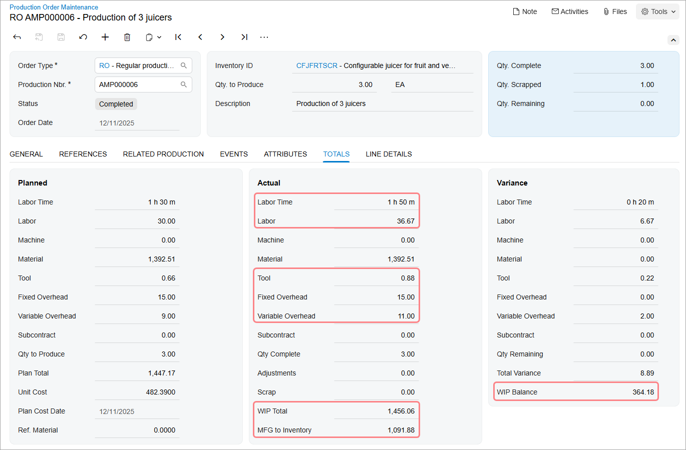
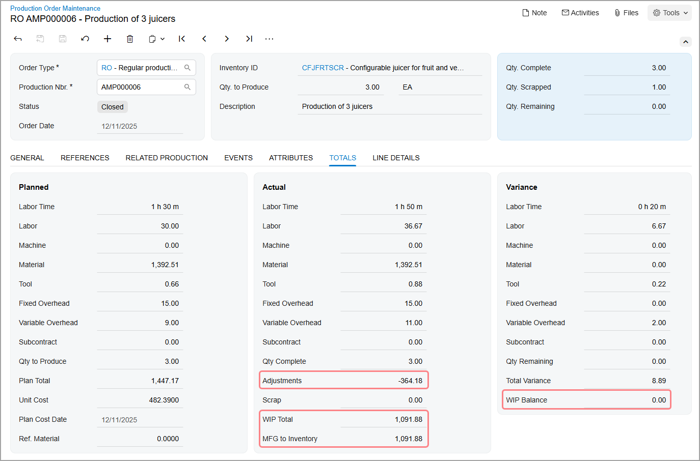

# Scrap and Waste in Production: To Process a Production Order with No Scrap Settings {#_52acbfec-e50d-45c9-b29c-0012e211c0e7 .task}

The following activity will walk you through the process of recording item production that includes scrapped items when no specific actions are required for scrapped items.

## Story { .section}

Suppose that the GoodFood One Restaurant has ordered three juicers from the SweetLife Fruits &amp; Jams company. Further suppose that during juicer assembly, a shop-floor employee assembled one of the juicers but found out that it does not work. The production manager asked the employee to record this juicer as scrap. Because the customer expects to have all three juicers at the same time, the employee assembled one extra juicer because the broken juicer must be scrapped and cannot be used to fulfill the customer's order.

Suppose that scrap is very rare on this shop floor, so scrapped items are not tracked by a warehouse and the scrap cost is applied to the cost of a production order.

Acting as a production manager, you will create a production order for producing three juicers and process all related transactions. In a production environment, a shop-floor employee would create a labor transaction on their own. To streamline this activity, you will enter this transaction as a production manager.

## Configuration Overview { .section}

In the *U100* dataset, the following tasks have been performed to support this activity:

-   On the [Warehouses](IN_20_40_00.md) \(IN204000\) form, the *WORKHOUSE* warehouse has been defined, and its locations include *MGI* and *MTL*.
-   On the [Stock Items](IN_20_25_00.md) \(IN202500\) form, the *CFJFRTSCR*, *PULPCONT1L*, *JUICECUP05L*, *MRBASE*, *FNSIEVE*, and *GRDISC01* stock items have been defined.

## Process Overview { .section}

In this activity, to process the documents and transactions related to the production of the juicers with scrapped items and no scrap action, you will do the following:

1.  On the [Production Order Maintenance](AM_20_15_00.md) \(AM201500\) form, create and release the production order.
2.  On the [Materials](AM_30_00_00.md) \(AM300000\) form, issue the materials required for the assembly operation.
3.  On the [Labor](AM_30_10_00.md) \(AM301000\) form, record the labor spent on the juicer assembly, the quantity of produced items, and the quantity of scrapped items.
4.  On the [Production Order Maintenance](AM_20_15_00.md) form, review the production order balance after you have completed the assembly operation.
5.  On the [Close Production Orders](AM_50_60_00.md) \(AM506000\) form, close the production order.
6.  On the [Production Order Maintenance](AM_20_15_00.md) form, review the production order balance after you have closed the order.

## System Preparation { .section}

Before you start performing the activity, do the following in a company with the U100 dataset preloaded:

1.  As prerequisites to the current activity, perform the [Configuration of Scrap, Waste, and By-Products in Production: Implementation Activity](../ImplementationGuide/config_MFG_Scrap_Implem_Activity.md) so that the system is ready for processing the production of juicers with the recording of scrap.
2.  Launch the Acumatica ERP website, and sign in to the company. You should sign in as the production manager by using the *peters* username and the *123* password.
3.  In the info area, in the upper-right corner of the top pane of the Acumatica ERP screen, make sure that the business date in your system is set to today’s date. For simplicity, in this activity, you will create and process all documents in the system on this business date.

## Step 1: Creating the Production Order { .section}

To create the production order for the three juicers, do the following:

1.  On the [Production Order Maintenance](AM_20_15_00.md) \(AM201500\) form, add a new record.

    Notice that the production order is assigned a status of *Planned*, and today's date has been automatically selected in the **Order Date** box.

2.  In the Summary area, do the following:
    1.  In the **Order Type** box, make sure *RO* is specified.
    2.  In the **Inventory ID** box, select *CFJFRTSCR*.

        On the **General** tab, notice that the *WORKHOUSE* warehouse and the *MGI* location have been selected automatically.

    3.  In the **Qty. to Produce** box, specify `3`.
    4.  In the **Description** box, specify `Production of 3 juicers`.
3.  On the **General** tab, make sure that *Estimated* is selected in the **Costing Method** box.
4.  On the form toolbar, click **Save**.
5.  On the form toolbar, click **Release Order**. The order's status is changed to *Released*.

## Step 2: Issuing Materials for the Operation { .section}

In this step, you will issue the materials for the assembly operation of the production order. Do the following:

1.  While you are still viewing the production order on the [Production Order Maintenance](AM_20_15_00.md) \(AM201500\) form, on the More menu \(under **Transactions**\), click **Release Materials**. The system opens the [Select Materials to Release](AM_30_00_20.md) \(AM300020\) form with the list of materials needed for the assembly operation.
2.  On the form toolbar, click **Select All**. The system creates a material transaction and opens it on the [Materials](AM_30_00_00.md) \(AM300000\) form.
3.  In the Summary area, do the following:
    1.  In the **Description** box, specify `Materials for the assembly operation`.
    2.  Clear the **Hold** check box. The system changes the transaction's status to *Balanced*.
4.  On the form toolbar, click **Release**. The system releases the material transaction and changes the status of the transaction to *Released*.
5.  Open the [Production Order Maintenance](AM_20_15_00.md) form with the production order you created earlier in this activity, and notice that the status of the production order has changed to *In Process*.

## Step 3: Recording the Labor, Produced Items, and Scrapped Items for the Operation { .section}

Suppose that Carlos Cruz, a worker in the work center, spent 30 minutes setting up the working environment for juicer assembly and assembled three juicers for one hour; one of the juicers does not work and must be recorded as scrap. To fulfill the production order, Carlos assembled one more juicer for 20 minutes. To record the time spent on juicer assembly, the assembled quantity of juicers, and the scrapped juicer, do the following:

1.  On the [Labor](AM_30_10_00.md) \(AM301000\) form, add a new record.
2.  Add the columns with scrap settings to the table as follows:
    1.  In the table header, click the Column Configurator icon on the left to open the Column Configurator dialog box.
    2.  Select the check boxes for the following columns:
        -   **Scrap Action**
        -   **Qty. is Scrap**
    3.  Click **OK** to save your changes and close the dialog box.
    4.  Make sure that these columns have appeared in the table.
3.  On the table toolbar, click **Add Row**.
4.  In the row, specify the following settings:
    -   **Labor Type**: *Direct*
    -   **Order Type**: *RO*
    -   **Production Nbr.**: The number of the production order that you created earlier in this activity
    -   **Operation ID**: *0010*
    -   **Employee ID**: *EP00000027* \(Carlos Cruz\)
    -   **Shift**: *0001*
    -   **Labor Time**: *01:50*
    -   **Quantity**: `3`
5.  Enter the scrap quantity as follows:
    1.  In the **Scrap Action** column, select *No Action*.

        You need to change the scrap action for the purposes of this activity because for the assembly operation of the production order, the *Quarantine* action is specified, which is copied from the work center settings.

    2.  In the **Qty Scrapped** column, type `1`.
6.  In the Summary area, do the following:
    1.  Make sure that today's date is specified in the **Date** box.
    2.  In the **Description** box, specify `Recording the time for assembly of 3 juicers, the completed quantity, and the scrapped quantity`.
    3.  Clear the **Hold** check box. The system changes the transaction's status to *Balanced*.
7.  On the form toolbar, click **Release**. The system creates and releases a cost transaction to record the labor costs and releases the labor transaction.

## Step 4: Reviewing the Production Order Balance { .section}

Now that you have recorded the completion of the assembly operation, you will review the production order balance. To do so, open the production order you created earlier in this activity on the [Production Order Maintenance](AM_20_15_00.md) \(AM201500\) form.

In the Summary area, notice that the order status is *Completed*, and the following values are displayed in the listed boxes:

-   **Qty. Complete**: *3*
-   **Qty. Scrapped**: *1*

On the **Totals** tab, review the production order balance \(shown in the screenshot below\) as follows:

-   Notice that in the **Actual** section, the values listed in the following table are displayed.

    |Box|Value|Comment|
    |---|-----|-------|
    |**Labor Time**|*1 h 50 m*|The actual labor time includes the time the worker spent for the scrapped item.|
    |**Labor**|*36.67*|The actual labor cost includes the cost of the extra time spent for the scrapped item.|
    |**Tool**|*0.88*|The actual tool cost includes the cost of the tools applied to the scrapped item.|
    |**Fixed Overhead**|*15.00*|The actual fixed overhead cost does not depend on the quantity and time entered in the labor transaction and is equal to the planned cost.|
    |**Variable Overhead**|*11.00*|The actual variable overhead cost depends on the labor time, and the cost is affected by the increased labor time.|
    |**WIP Total**|*1456.06*|The WIP total is calculated as the cost applied to the production order minus the scrap costs and minus the costs in adjustment transactions that were created manually \(if any\).|
    |**MFG to Inventory**|*1091.88*|This is the total cost of the completed items that is used when the items are moved to stock by using an inventory receipt.|

-   Notice that in the **Variance** section, the **WIP Balance** box contains *364.18* \(as shown in the following screenshot\), which is the difference between the values of the **WIP Total** and **MFG to Inventory** boxes.

    

## Step 5: Closing the Production Order { .section}

Now you will close the production order. Do the following:

1.  On the [Close Production Orders](../Shared/../UserGuide/AM_50_60_00.md) \(AM506000\) form, select the production order.
2.  On the form toolbar, click **Process**. In the **Processing** dialog box, which opens, review the processing details, and when the processing is completed, click **Close**.
3.  Go to the [Production Order Maintenance](../Shared/../UserGuide/AM_20_15_00.md) form, and notice that the status of the production order has changed to *Closed*.

## Step 6: Reviewing the Production Order Balance after Closing { .section}

To review the production order balance after you have closed the production order, while you are still viewing the production order you created earlier in this activity on the [Production Order Maintenance](AM_20_15_00.md) \(AM201500\) form, open the **Totals** tab \(shown in the screenshot below\).

Notice the following:

-   In the **Actual** section, the **WIP Total** value is the same as the **MFG to Inventory** value.
-   In the **Variance** section, the **WIP Balance** box contains *0.00*.
-   In the **Actual** section, the amount of the WIP balance has been moved to the WIP Adjustment GL account and is displayed as a negative value \(*–364.18*\) in the **Adjustments** box.

You have successfully created the production order for the assembly of three juicers, recorded the scrapped item, and processed all the transactions related to the production.

**Parent topic:**[Tracking Scrap and Waste in Production](../UserGuide/MFG_Scrap_Mapref.md)

