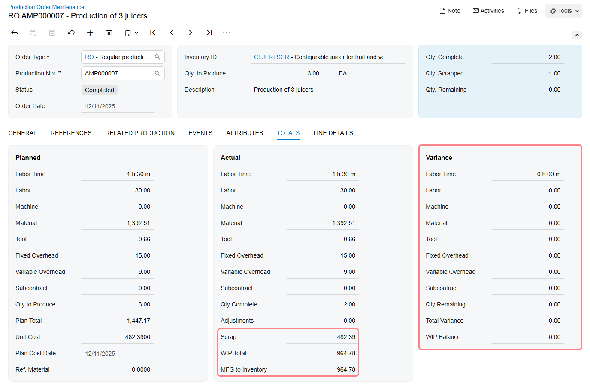

# Scrap and Waste in Production: To Process a Production Order That Includes Quarantined Scrap {#_47589ba7-ca7e-4d08-8cfa-19d20044647a .task}

The following activity will walk you through the process of recording item production that includes scrapped items; the cost of scrapped items must be written off to a specific GL account, and the scrapped items must be moved to a specific warehouse location \(quarantined\).

## Story { .section}

Suppose that based on the analyzed demand from previous periods of sales, the sales department of SweetLife has asked the production department to produce three juicers. Further suppose that during juicer assembly, a shop-floor employee assembled one of the juicers but found out that it does not work. The production manager asked the employee to record this juicer as scrap and to move the juicer to the dedicated warehouse location for quarantined scrap. According to the system settings, the cost of the scrapped item will be moved to a specific GL account.

Also suppose that the quantity of scrapped items can be included in the quantity of completed items because although one of the juicers is defective and must be moved to quarantine to be inspected, a completely new juicer does not need to be produced.

Acting as a production manager, you will create a production order for producing three juicers and process all related transactions. In a production environment, a shop-floor employee would create a labor transaction on their own. To streamline this activity, you will enter this transaction as a production manager.

## Configuration Overview { .section}

In the *U100* dataset, the following tasks have been performed to support this activity:

-   On the [Warehouses](IN_20_40_00.md) \(IN204000\) form, the *WORKHOUSE* warehouse has been defined, and its locations include *MGI* and *MTL*.
-   On the [Stock Items](IN_20_25_00.md) \(IN202500\) form, the *CFJFRTSCR*, *PULPCONT1L*, *JUICECUP05L*, *MRBASE*, *FNSIEVE*, and *GRDISC01* stock items have been defined.

## Process Overview { .section}

In this activity, to process the documents and transactions related to the production of the juicers with quarantined scrap, you will do the following:

1.  On the [Production Preferences](AM_10_20_00.md) \(AM102000\) form, select the check box that causes the scrapped quantity to be added to the completed quantity.
2.  On the [Production Order Maintenance](AM_20_15_00.md) \(AM201500\) form, create and release the production order.
3.  On the [Materials](AM_30_00_00.md) \(AM300000\) form, issue the materials required for the assembly operation.
4.  On the [Labor](AM_30_10_00.md) \(AM301000\) form, record the labor spent on the juicer assembly, the quantity of produced items, and the quantity of scrapped items.
5.  On the [Production Order Maintenance](AM_20_15_00.md) form, review the production order balances after you have completed the assembly operation.
6.  On the [WIP Adjustment](AM_30_80_00.md) \(AM308000\) and [Receipts](IN_30_10_00.md) \(IN301000\) forms, review the scrap-related transactions, which the system generated when you released the labor transaction.
7.  On the [Close Production Orders](AM_50_60_00.md) \(AM506000\) form, close the production order.

## System Preparation { .section}

Before you start performing the activity, do the following in a company with the U100 dataset preloaded:

1.  As prerequisites to the current activity, perform the [Configuration of Scrap, Waste, and By-Products in Production: Implementation Activity](../ImplementationGuide/config_MFG_Scrap_Implem_Activity.md) so that the system is ready for processing the production of juicers with the recording of scrap.
2.  Launch the Acumatica ERP website, and sign in to the company. You should sign in as the production manager by using the *peters* username and the *123* password.
3.  In the info area, in the upper-right corner of the top pane of the Acumatica ERP screen, make sure that the business date in your system is set to today’s date. For simplicity, in this activity, you will create and process all documents in the system on this business date.

## Step 1: Setting Up the Scrapped Quantity to Be Included in the Completed Quantity { .section}

You will select the check box that causes the scrap quantity to be added to the quantity of completed items in production orders. Do the following:

1.  Open the [Production Preferences](AM_10_20_00.md) \(AM102000\) form.
2.  In the **Data Entry Settings** section, select the **Include Scrap in Completions** check box.
3.  On the form toolbar, click **Save**.

## Step 2: Creating the Production Order { .section}

To create the production order for the three juicers, do the following:

1.  On the [Production Order Maintenance](AM_20_15_00.md) \(AM201500\) form, add a new record.

    Notice that the production order is assigned a status of *Planned*, and today's date has been automatically selected in the **Order Date** box.

2.  In the Summary area, do the following:
    1.  In the **Order Type** box, make sure *RO* is specified.
    2.  In the **Inventory ID** box, select *CFJFRTSCR*.

        On the **General** tab, notice that the *WORKHOUSE* warehouse and the *MGI* location have been selected automatically.

    3.  In the **Qty. to Produce** box, specify `3`.
    4.  In the **Description** box, specify `Production of 3 juicers`.
3.  On the **General** tab, do the following:
    1.  Make sure that *Estimated* is selected in the **Costing Method** box.
    2.  Notice that *WORKHOUSE* is selected in the **Scrap Warehouse** box. The system copied this value based on the settings of the *RO* production order type on the [Production Order Types](AM_20_11_00.md) \(AM201100\) form.
    3.  Notice that *SCRAP* is selected in the **Scrap Location** box. The system also copied this value from the settings of the *RO* production order type.
4.  On the form toolbar, click **Save**.
5.  On the form toolbar, click **Release Order**. The order's status is changed to *Released*.

## Step 3: Issuing Materials for the Operation { .section}

In this step, you will issue the materials for the assembly operation of the production order. Do the following:

1.  While you are still viewing the production order on the [Production Order Maintenance](AM_20_15_00.md) \(AM201500\) form, on the More menu \(under **Transactions**\), click **Release Materials**. The system opens the [Select Materials to Release](AM_30_00_20.md) \(AM300020\) form with the list of materials needed for the assembly operation.
2.  On the form toolbar, click **Select All**. The system creates a material transaction and opens it on the [Materials](AM_30_00_00.md) \(AM300000\) form.
3.  In the Summary area, do the following:
    1.  In the **Description** box, specify `Materials for the assembly operation`.
    2.  Clear the **Hold** check box. The system changes the transaction's status to *Balanced*.
4.  On the form toolbar, click **Release**. The system releases the material transaction and changes the status of the transaction to *Released*.
5.  Open the [Production Order Maintenance](AM_20_15_00.md) form with the production order you created earlier in this activity, and notice that the status of the production order has changed to *In Process*.

## Step 4: Releasing a Labor Transaction { .section}

Suppose that Carlos Cruz, a worker in the work center, spent 30 minutes setting up the working environment for juicer assembly, assembled three juicers for one hour, tested the juicers, and found out that one juicer does not work. This item must be entered as a scrapped item. To record the time spent on juicer assembly, the assembled quantity of juicers, and the scrapped juicer, do the following:

1.  On the [Labor](AM_30_10_00.md) \(AM301000\) form, add a new record.
2.  In the table, make sure that the following columns are displayed:

    -   **Scrap Action**
    -   **Qty. is Scrap**
    If the columns are not displayed, add the columns by using the Column Configurator dialog box.

3.  On the table toolbar, click **Add Row**.
4.  In the row, specify the following settings:
    -   **Labor Type**: *Direct*
    -   **Order Type**: *RO*
    -   **Production Nbr.**: The number of the production order that you created earlier in this activity
    -   **Operation ID**: *0010*
    -   **Employee ID**: *EP00000027* \(Carlos Cruz\)
    -   **Shift**: *0001*
    -   **Labor Time**: *01:10*
    -   **Quantity**: `2`
5.  Add another row for the scrapped item, and in the row, specify the following settings:
    -   **Labor Type**: *Direct*
    -   **Order Type**: *RO*
    -   **Production Nbr.**: The number of the production order that you created earlier in this activity
    -   **Operation ID**: *0010*
    -   **Employee ID**: *EP00000027* \(Carlos Cruz\)
    -   **Shift**: *0001*
    -   **Labor Time**: *00:20* \(the time the worker spent on the scrapped juicer\)
    -   **Scrap Action**: *Quarantine* \(inserted automatically\)
    -   **Reason Code**: *SCRAP*
    -   **Quantity**: `1`
    -   **Warehouse**: *WORKHOUSE* \(inserted automatically\)
    -   **Location**: *SCRAP* \(inserted automatically\)
    -   **Qty Scrapped**: *1* \(automatically copied from the **Quantity** column\)
    -   **Qty is Scrap**: Selected \(selected automatically when you specified the reason code and the scrapped quantity\)
6.  In the Summary area, do the following:
    1.  Make sure that today's date is specified in the **Date** box.
    2.  In the **Description** box, specify `Recording the time for assembly of 3 juicers, the completed quantity, and the scrapped quantity`.
    3.  Clear the **Hold** check box. The system changes the transaction's status to *Balanced*.
7.  On the form toolbar, click **Release**. The system creates and releases the cost transaction to record the labor costs and releases the labor transaction.

## Step 5: Reviewing the Production Order Balance { .section}

Now that you have recorded the completion of the assembly operation, you will review the production order balance. To do so, open the production order you created earlier in this activity on the [Production Order Maintenance](AM_20_15_00.md) \(AM201500\) form.

In the Summary area, notice that the order status is *Completed* and that the following values are displayed in the listed boxes:

-   **Qty. Complete**: *2*
-   **Qty. Scrapped**: *1*

    The sum of the completed and scrapped items is 3, which equals the quantity to produce.

On the **Totals** tab, review the production order balance \(shown in the screenshot below\). Notice the following:

-   In the **Actual** section, the **Scrap** box contains *482.39*.
-   The **WIP Total** and **MFG to Inventory** boxes contain *964.78*.
-   All boxes in the **Variance** section contain *0.00*, which means that the planned costs are equal to the actual costs.

## Step 6: Reviewing the Scrap-Related Transactions { .section}

When you released the labor transaction, the system created a WIP adjustment transaction to move the cost of the scrapped item to the *51600* GL account and an inventory receipt transaction to move the scrapped item to the *SCRAP* warehouse location. To review the transactions, do the following:

1.  While you are still viewing the production order on the [Production Order Maintenance](AM_20_15_00.md) \(AM201500\) form, open the **Events** tab.
2.  In the row with the *WIP Adjustment* document type, click the link in the **Batch Nbr.** column. The system opens the [WIP Adjustment](AM_30_80_00.md) \(AM308000\) form in a new window with the WIP adjustment selected.
3.  Notice that the only row contains the following settings:
    -   The **Cost Adj** column contains the cost of the scrapped item.
    -   The **Reason Code** column contains *SCRAP*, which you specified in the labor transaction.
    -   The **Account** column contains *51600*, which is the GL account for scrap costs; the system copied the GL account from the reason code settings.
    -   The **GL Batch Nbr.** column contains the reference number of the GL batch related to this transaction. \(This column is hidden by default.\)
4.  On the [Receipts](IN_30_10_00.md) \(IN301000\) form, open the receipt with today's date and a total quantity of 1.

    On the **Details** tab, notice that the only line contains the following settings

    -   **Warehouse**: *WORKHOUSE*
    -   **Location**: *SCRAP*
    -   **Quantity**: *1*
    -   **Ext. Cost.**: *482.39*
    -   **Reason Code**: *SCRAP*
    On the **Financial** tab, notice that the reference number of the related GL batch is displayed.

## Step 7: Closing the Production Order { .section}

Now you will close the production order. Do the following:

1.  On the [Close Production Orders](AM_50_60_00.md) \(AM506000\) form, select the production order.
2.  On the form toolbar, click **Process**. In the **Processing** dialog box, which opens, review the processing details, and when the processing is completed, click **Close**.
3.  Go to the [Production Order Maintenance](AM_20_15_00.md) form, and notice that the status of the production order has changed to *Closed*.

You have successfully created the production order for the assembly of three juicers, recorded the scrapped item, and processed all the transactions related to the production.

**Parent topic:**[Tracking Scrap and Waste in Production](../UserGuide/MFG_Scrap_Mapref.md)

