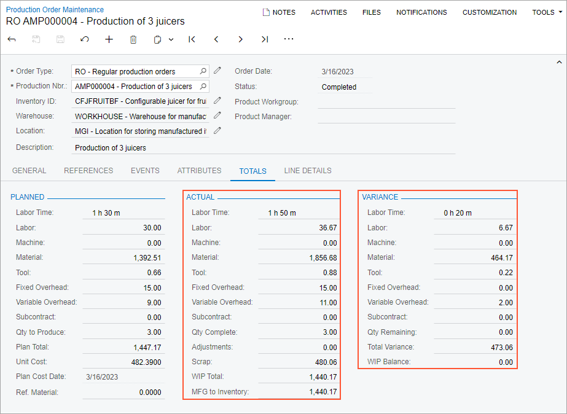
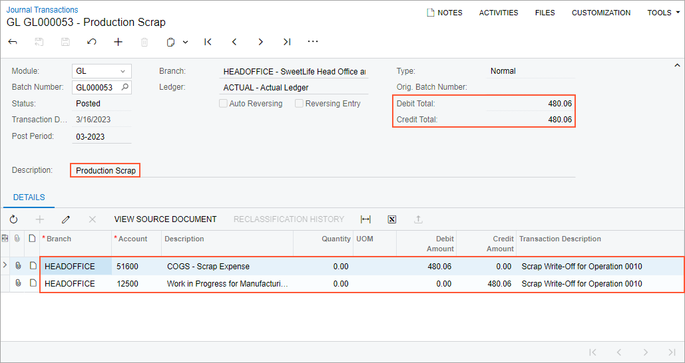

# Scrap Cost Calculation: To Process a Production Order That Includes Written-Off Scrap {#_0681c80e-a777-422c-a5f5-a175be1ecf52 .task}

The following activity will walk you through the process of recording item production that includes scrapped items; the cost of scrapped items must be written off to a specific GL account.

## Story { .section}

Suppose that the GoodFood One Restaurant has ordered three juicers from the SweetLife Fruits &amp; Jams company. Initially, the production process includes the assembly and packing of the juicers but the customer does not need the juicers to be packed. Further suppose that components for the juicers are available in SweetLife Fruits &amp; Jams's warehouse.

Suppose that during juicer assembly, a shop-floor employee assembled one of the juicers but found out that it does not work. The production manager asked the employee to record this juicer as scrap. Because the customer expects to have all three juicers at the same time, the employee assembled one extra juicer because the broken juicer must be scrapped and cannot be used to fulfill the customer's order. According to the system settings, the cost of the scrapped item will be moved to a specific GL account.

Also suppose that the system should use the *Actual* costing method for calculating the unit cost of produced juicers because produced items are moved to stock only when all transactions have been released and all costs have been applied to a production order.

Acting as a production manager, you will create a production order for producing three juicers and process all related transactions. In a production environment, a shop-floor employee would create labor and move transactions on their own. To streamline this activity, you will enter this transaction as a production manager.

Also, acting as a production accountant, you will review the cost of the scrapped juicer.

## Configuration Overview { .section}

In the *U100* dataset, the following tasks have been performed to support this activity:

-   On the [Warehouses](IN_20_40_00.md) \(IN204000\) form, the *WORKHOUSE* warehouse has been defined, and its locations include *MGI* and *MTL*.
-   On the [Stock Items](IN_20_25_00.md) \(IN202500\) form, the *CFJFRUITBF*, *PULPCONT1L*, *JUICECUP05L*, *MRBASE*, *FNSIEVE*, and *GRDISC01* stock items have been defined.

## Process Overview { .section}

In this activity, to process the documents and transactions related to the production of the juicers, you will do the following:

1.  On the [Production Order Maintenance](AM_20_15_00.md) \(AM201500\) form, create and release the production order.
2.  On the [Materials](AM_30_00_00.md) \(AM300000\) form, issue the materials required for the assembly operation.
3.  On the [Labor](AM_30_10_00.md) \(AM301000\) form, record the labor spent on the juicer assembly, the produced quantity, and the scrapped quantity.
4.  On the [Production Order Maintenance](AM_20_15_00.md) form, review the production order balance after you have completed the order and on the [Journal Transactions](GL_30_10_00.md) \(GL301000\) form, review the GL transaction related to scrap costs.
5.  On the [Close Production Orders](AM_50_60_00.md) \(AM506000\) form, close the production order.

## System Preparation { .section}

Do the following:

1.  As a prerequisite to the current activity, complete [Configuration of Production with Backflushing: Implementation Activity](../ImplementationGuide/config_MFG_Backflushing_Implem_Activity.md) so that the system is ready for processing the production of juicers with labor and material backflushing.
2.  Launch the Acumatica ERP website, and sign in to the company in which the prerequisite activities have been performed. You should sign in as the production manager by using the *peters* username and the *123* password.
3.  In the info area, in the upper-right corner of the top pane of the Acumatica ERP screen, make sure that the business date in your system is set to today’s date. For simplicity, in this activity, you will create and process all documents in the system on this business date.

## Step 1: Creating the Production Order { .section}

To create the production order for three juicers, do the following:

1.  On the [Production Order Maintenance](AM_20_15_00.md) \(AM201500\) form, add a new record.
2.  In the Summary area, specify the following settings:
    -   **Order Type**: *RO* \(selected automatically\)
    -   **Inventory ID**: *CFJFRUITBF*
    -   **Warehouse**: *WORKHOUSE* \(selected automatically\)
    -   **Location**: *MGI* \(selected automatically\)
    -   **Order Date**: Today's date \(selected automatically\)
    -   **Description**: `Production of 3 juicers`
3.  On the **General** tab, do the following:
    1.  In the **Qty. to Produce** box, specify `3`.
    2.  In the **Costing Method** box, select *Actual*.
4.  On the form toolbar, click **Save**.
5.  On the More menu \(under **Other**\), click **Production Detail**. The system opens the [Production Order Details](AM_20_90_00.md) \(AM209000\) form with the production order selected.
6.  In the Operations table, remove the packing operation as follows:
    1.  Click the row for the *0020* operation.
    2.  On the table toolbar, click **Delete Row**.
7.  In the **Scrap Action** column of the row for the *0010* operation, select *Write-Off*.
8.  On the form toolbar, click **Save**.
9.  On the [Production Order Maintenance](AM_20_15_00.md) form, open the production order.
10. On the More menu \(under **Processing**\), click **Release Order**. The order's status is changed to *Released*.

    **Tip:** You open the More menu by clicking the More button \(…\) on the form toolbar.

## Step 2: Issuing Materials for the Assembly Operation { .section}

Suppose that you have been informed that the shop-floor worker had to assemble one extra juicer because one of the assembled juicers did not work. Therefore the worker used more materials than it was planned. In this step, you will issue the needed material quantity for the assembly operation of the production order. Do the following:

1.  While you are still viewing the production order on the [Production Order Maintenance](AM_20_15_00.md) \(AM201500\) form, on the More menu \(under **Transactions**\), click **Release Materials**. The system opens the [Select Production Orders](AM_30_00_10.md) \(AM300020\) form with the list of materials needed for the assembly operation.
2.  On the form toolbar, click **Select All**. The system creates the material transaction and opens it on the [Materials](AM_30_00_00.md) \(AM300000\) form.
3.  In the **Quantity** column of each material line, specify `4`. Notice that the system displays the warning that you are going to issue more materials than it is needed to produce the planned item quantity.
4.  In the Summary area, do the following:
    1.  In the **Description** box, specify `Materials for the assembly operation`.
    2.  Clear the **Hold** check box. The system changes the transaction's status to *Balanced*.
5.  On the form toolbar, click **Release**. The system releases the material transaction and changes the status of the transaction to *Released*.

## Step 3: Recording the Labor, Produced Items, and Scrapped Items for the Assembly Operation { .section}

Suppose that Carlos Cruz, a worker in the work center, spent 30 minutes setting up the working environment for juicer assembly and assembled three juicers for one hour; one of the juicers does not work and must be recorded as scrap. To fulfill the production order, Carlos assembled one more juicer for 20 minutes. To record the time spent on juicer assembly, the assembled quantity of juicers, and the scrapped juicer, do the following:

1.  On the [Production Order Maintenance](AM_20_15_00.md) \(AM201500\) form, open the production order you created earlier in this activity.
2.  On the More menu \(under **Transactions**\), click **Create Labor Transaction**. The system creates the labor transaction for the *0010* operation and opens it on the [Labor](AM_30_10_00.md) \(AM301000\) form.
3.  In the table, make sure that the **Scrap Action** column is displayed. If the column is not displayed, add the column by using the **Column Configurator** dialog box.
4.  In the row that the system added for the *0010* operation, specify the following settings:
    -   **Employee ID**: *EP00000027* \(Carlos Cruz\)
    -   **Shift**: *0001*
    -   **Labor Time**: *01:50*
    -   **Quantity**: `3`
5.  Enter the scrap quantity as follows:
    1.  In the **Scrap Action** column, make sure that *Write-Off* is selected.
    2.  In the **Qty Scrapped** column, type `1`.
    3.  In the **Reason Code** column, select *SCRAP*.
6.  In the Summary area, do the following:
    1.  In the **Date** box, make sure that the today's date is specified.
    2.  In the **Description** box, specify `Recording the time for assembly of 3 juicers, the completed quantity, and the scrapped quantity`.
    3.  Clear the **Hold** check box. The system changes the transaction's status to *Balanced*.
7.  On the form toolbar, click **Release**. The system creates and releases the cost transaction to record the labor costs, creates and released the WIP adjustment transaction to move scrap costs to the scrap GL account, and releases the labor transaction.

## Step 4: Reviewing the Production Order Balance and the GL Transaction for Scrap Cost { .section}

In this step, acting as a production accountant, you will review the balance of the completed production order. You will also review the GL transaction that the system created and released when the WIP adjustment transaction has been released. Do the following:

1.  On the [Production Order Maintenance](AM_20_15_00.md) \(AM201500\) form, open the production order you created earlier in this activity.
2.  On the **Totals** tab, review the production order balance as follows \(see the screenshot below\):

    1.  In the **Actual** section, make sure that the following values are displayed:

        -   **Labor Time**: *1 h 50 m*
        -   **Labor**: *36.67*
        -   **Material**: *1856.68*
        -   **Tool**: *0.88*
        -   **Fixed Overhead**: *15.00*
        -   **Variable Overhead**: *11.00*
        -   **Scrap**: *480.06*
        -   **WIP Total**: *1440.17* \(which is the sum of the actual costs minus the scrap cost\)
        -   **MFG to Inventory**: *1440.17*
        According to the *Actual* costing method, the system calculated the scrap cost as follows: `1920.23 (the sum of actual costs) / 4 (the sum of the completed quantity and the scrapped quantity)`.

    2.  In the **Variance** section, make sure that the following values are displayed:

        -   **Labor Time**: *0 h 20 m*
        -   **Labor**: *6.67*
        -   **Material**: *464.17*
        -   **Tool**: *0.22*
        -   **Variable Overhead**: *2.00*
        -   **Total Variance**: *473.06* \(which is the sum of the variance costs\)
        -   **WIP Balance**: *0.00*
        The variance is caused by the costs of the scrapped juicer.

    

3.  On the [Journal Transactions](GL_30_10_00.md) \(GL301000\) form, open the GL transaction with the following settings:
    -   **Module**: *GL*
    -   **Transaction Date**: Today's date
    -   **Description**: *Production Scrap*
    -   **Control Total**: *480.06*
4.  On the **Details** tab, make sure that the *51600 COGS - Scrap Expense* account is debited and the *12500 Work in Progress for Manufacturing* account is credited for the scrap cost.

    The system created and released this transaction when the WIP adjustment transaction for the scrap cost has been released on the [WIP Adjustment](AM_30_80_00.md) \(AM308000\) for the production order.

    

## Step 5: Closing the Production Order { .section}

Now you will close the production order. Do the following:

1.  On the [Close Production Orders](../Shared/../UserGuide/AM_50_60_00.md) \(AM506000\) form, select the production order.
2.  On the form toolbar, click **Process**. In the **Processing** dialog box, which opens, review the processing details, and when the processing is completed, click **Close**.
3.  Go to the [Production Order Maintenance](../Shared/../UserGuide/AM_20_15_00.md) form, and notice that the status of the production order has changed to *Closed*.

You have successfully created the production order for the assembly of three juicers, processed all the transactions related to the production, recorded a scrapped item whose cost must be written off, and reviewed the costs of the production order.

**Parent topic:**[Calculating Costs of Scrapped Items](../UserGuide/MFG_Scrap_Costs_Mapref.md)

