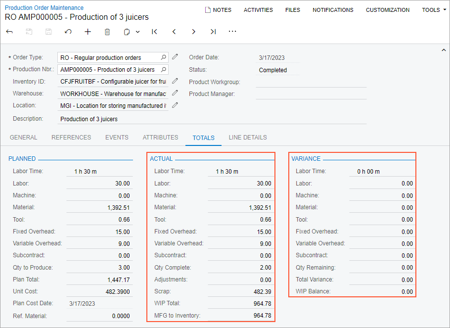
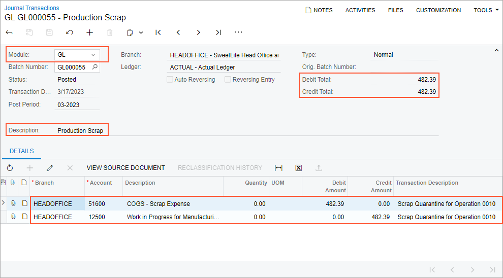
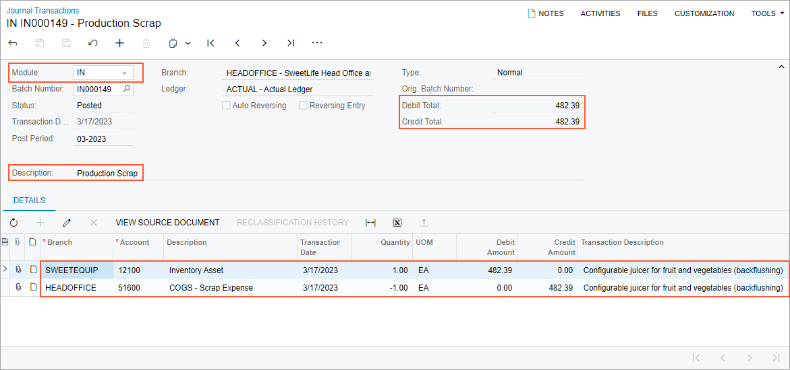

# Scrap Cost Calculation: To Process a Production Order That Includes Quarantined Scrap {#_4a1f3b71-adb9-4755-84f3-1613c596d332 .task}

The following activity will walk you through the process of recording item production that includes scrapped items; the cost of scrapped items must be written off to a specific GL account, and the scrapped items must be moved to a specific warehouse location \(quarantined\).

## Story { .section}

Suppose that based on the analyzed demand from previous periods of sales, the sales department of SweetLife has asked the production department to produce three juicers. Initially, the production process includes the assembly and packing of the juicers but the sales department does not need the juicers to be packed until they are sold. Further suppose that components for the juicers are available in SweetLife Fruits &amp; Jams's warehouse.

Also suppose that during juicer assembly, a shop-floor employee assembled one of the juicers but found out that it does not work. The production manager asked the employee to record this juicer as scrap and to move the juicer to the dedicated warehouse location for quarantined scrap. According to the system settings, the cost of the scrapped item will be moved to a specific GL account.

Further suppose that the quantity of scrapped items can be included in the quantity of completed items because although one of the juicers is defective and must be moved to quarantine to be inspected, a completely new juicer does not need to be produced.

Also suppose that the system should use the *Actual* costing method for calculating the unit cost of produced juicers because produced items are moved to stock only when all transactions have been released and all costs have been applied to a production order.

Acting as a production manager, you will create a production order for producing three juicers and process all related transactions. In a production environment, a shop-floor employee would create labor and move transactions on their own. To streamline this activity, you will enter this transaction as a production manager.

Also, acting as a production accountant, you will review the cost of the scrapped juicer.

## Configuration Overview { .section}

In the *U100* dataset, the following tasks have been performed to support this activity:

-   On the [Warehouses](IN_20_40_00.md) \(IN204000\) form, the *WORKHOUSE* warehouse has been defined, and its locations include *MGI* and *MTL*.
-   On the [Stock Items](IN_20_25_00.md) \(IN202500\) form, the *CFJFRUITBF*, *PULPCONT1L*, *JUICECUP05L*, *MRBASE*, *FNSIEVE*, and *GRDISC01* stock items have been defined.

## Process Overview { .section}

In this activity, to process the documents and transactions related to the production of the juicers, you will do the following:

1.  On the [Production Preferences](AM_10_20_00.md) \(AM102000\) form, select the check box that causes the scrapped quantity to be added to the completed quantity.
2.  On the [Production Order Maintenance](AM_20_15_00.md) \(AM201500\) form, create and release the production order.
3.  On the [Materials](AM_30_00_00.md) \(AM300000\) form, issue the materials required for the assembly operation.
4.  On the [Labor](AM_30_10_00.md) \(AM301000\) form, record the labor spent on the juicer assembly, the produced quantity, and the scrapped quantity.
5.  On the [Production Order Maintenance](AM_20_15_00.md) form, review the production order balance after you have completed the order and on the [Journal Transactions](GL_30_10_00.md) \(GL301000\) form, review the GL transactions related to scrap costs.
6.  On the [Close Production Orders](AM_50_60_00.md) \(AM506000\) form, close the production order.

## System Preparation { .section}

Do the following:

1.  As a prerequisite to the current activity, complete [Configuration of Production with Backflushing: Implementation Activity](../ImplementationGuide/config_MFG_Backflushing_Implem_Activity.md) so that the system is ready for processing the production of juicers with labor and material backflushing.
2.  Launch the Acumatica ERP website, and sign in to the company in which the prerequisite activities have been performed. You should sign in as the production manager by using the *peters* username and the *123* password.
3.  In the info area, in the upper-right corner of the top pane of the Acumatica ERP screen, make sure that the business date in your system is set to today’s date. For simplicity, in this activity, you will create and process all documents in the system on this business date.

## Step 1: Setting Up the Scrapped Quantity to Be Included in the Completed Quantity { .section}

You will select the check box that causes the scrap quantity to be added to the quantity of completed items in production orders. Do the following:

1.  Open the [Production Preferences](AM_10_20_00.md) \(AM102000\) form.
2.  In the **Data Entry Settings** section, select the **Include Scrap in Completions** check box.
3.  On the form toolbar, click **Save**.

## Step 2: Creating the Production Order { .section}

To create the production order for three juicers, do the following:

1.  On the [Production Order Maintenance](AM_20_15_00.md) \(AM201500\) form, add a new record.
2.  In the Summary area, specify the following settings:
    -   **Order Type**: *RO* \(selected automatically\)
    -   **Inventory ID**: *CFJFRUITBF*
    -   **Warehouse**: *WORKHOUSE* \(selected automatically\)
    -   **Location**: *MGI* \(selected automatically\)
    -   **Order Date**: Today's date \(selected automatically\)
    -   **Description**: `Production of 3 juicers`
3.  On the **General** tab, do the following:
    1.  In the **Qty. to Produce** box, specify `3`.
    2.  In the **Costing Method** box, select *Actual*.
4.  On the form toolbar, click **Save**.
5.  On the More menu \(under **Other**\), click **Production Detail**. The system opens the [Production Order Details](AM_20_90_00.md) \(AM209000\) form with the production order selected.
6.  In the Operations table, remove the packing operation as follows:
    1.  Click the row for the *0020* operation.
    2.  On the table toolbar, click **Delete Row**.
7.  In the **Scrap Action** column of the row for the *0010* operation, select *Quarantine*.
8.  On the form toolbar, click **Save**.
9.  On the [Production Order Maintenance](AM_20_15_00.md) form, open the production order.
10. On the More menu \(under **Processing**\), click **Release Order**. The order's status is changed to *Released*.

    **Tip:** You open the More menu by clicking the More button \(…\) on the form toolbar.

## Step 3: Issuing Materials for the Assembly Operation { .section}

In this step, you will issue the materials for the assembly operation of the production order. Do the following:

1.  While you are still viewing the production order on the [Production Order Maintenance](AM_20_15_00.md) \(AM201500\) form, on the More menu \(under **Transactions**\), click **Release Materials**. The system opens the [Select Production Orders](AM_30_00_10.md) \(AM300020\) form with the list of materials needed for the assembly operation.
2.  On the form toolbar, click **Select All**. The system creates the material transaction and opens it on the [Materials](AM_30_00_00.md) \(AM300000\) form.
3.  In the Summary area, do the following:
    1.  In the **Description** box, specify `Materials for the assembly operation`.
    2.  Clear the **Hold** check box. The system changes the transaction's status to *Balanced*.
4.  On the form toolbar, click **Release**. The system releases the material transaction and changes the status of the transaction to *Released*.

## Step 4: Recording the Labor, Produced Items, and Scrapped Items for the Assembly Operation { .section}

Suppose that Carlos Cruz, a worker in the work center, spent 30 minutes setting up the working environment for juicer assembly, assembled three juicers for one hour, tested the juicers, and found out that one juicer does not work. This item must be entered as a scrapped item. To record the time spent on juicer assembly, the assembled quantity of juicers, and the scrapped juicer, do the following:

1.  On the [Production Order Maintenance](AM_20_15_00.md) \(AM201500\) form, open the production order you created earlier in this activity.
2.  On the More menu \(under **Transactions**\), click **Create Labor Transaction**. The system creates the labor transaction for the *0010* operation and opens it on the [Labor](AM_30_10_00.md) \(AM301000\) form.
3.  In the table, make sure that the following columns are displayed:

    -   **Scrap Action**
    -   **Qty is Scrap**
    If the columns are not displayed, add the columns by using the **Column Configurator** dialog box.

4.  In the row, specify the following settings:
    -   **Employee ID**: *EP00000027* \(Carlos Cruz\)
    -   **Shift**: *0001*
    -   **Labor Time**: *01:10*
    -   **Quantity**: `2`
5.  On the table toolbar, click **Add Row**.
6.  In the row, specify the following settings for the scrapped item:
    -   **Labor Type**: *Direct* \(selected automatically\)
    -   **Order Type**: *RO* \(selected automatically\)
    -   **Production Nbr.**: The number of the production order that you created earlier in this activity
    -   **Employee ID**: *EP00000027* \(Carlos Cruz\)
    -   **Shift**: *0001*
    -   **Labor Time**: *00:20* \(the time the worker spent on the scrapped juicer\)
    -   **Scrap Action**: *Quarantine* \(inserted automatically\)
    -   **Reason Code**: *SCRAP*
    -   **Quantity**: `1`
    -   **Warehouse**: *WORKHOUSE* \(inserted automatically\)
    -   **Location**: *SCRAP* \(inserted automatically\)
    -   **Qty Scrapped**: *1* \(copied this value from the **Quantity** column\)
    -   **Qty is Scrap**: Selected \(selected automatically when you specified the reason code and the scrapped quantity\)
7.  In the Summary area, do the following:
    1.  In the **Date** box, make sure that the today's date is specified.
    2.  In the **Description** box, specify `Recording the time for assembly of 3 juicers, the completed quantity, and the scrapped quantity`.
    3.  Clear the **Hold** check box. The system changes the transaction's status to *Balanced*.
8.  On the form toolbar, click **Release**. The system creates and releases the cost transaction to record the labor costs, creates and released the WIP adjustment transaction to move scrap costs to the scrap GL account, and releases the labor transaction.

## Step 5: Reviewing the Production Order Balance { .section}

In this step, acting as a production accountant, you will review the balance of the completed production order. You will also review the GL transactions that the system created and released to reflect movement of the scrap cost to the appropriate GL accounts. Do the following:

1.  On the [Production Order Maintenance](AM_20_15_00.md) \(AM201500\) form, open the production order you created earlier in this activity.
2.  On the **Totals** tab, review the production order balance as follows \(see the screenshot below\):

    1.  In the **Actual** section, make sure that the following values are displayed:

        -   **Labor Time**: *1 h 30 m*
        -   **Labor**: *30.00*
        -   **Material**: *1392.51*
        -   **Tool**: *0.66*
        -   **Fixed Overhead**: *15.00*
        -   **Variable Overhead**: *9.00*
        -   **Scrap**: *482.39*
        -   **WIP Total**: *964.78* \(which is the sum of the actual costs minus the scrap cost\)
        -   **MFG to Inventory**: *964.78*
        According to the *Actual* costing method, the system calculated the scrap cost as follows: `1447.17 (the sum of actual costs) / 3 (the sum of the completed quantity and the scrapped quantity)`.

    2.  In the **Variance** section, make sure that all boxes contain *0.00*, which means that the planned costs are equal to the actual costs.
    

3.  On the [Journal Transactions](GL_30_10_00.md) \(GL301000\) form, do the following:
    1.  Open the GL transaction that has the following settings:
        -   **Module**: *GL*
        -   **Transaction Date**: Today's date
        -   **Description**: *Production Scrap*
        -   **Control Total**: *482.39*
    2.  On the **Details** tab, make sure that the *51600 COGS - Scrap Expense* account was debited and the *12500 Work in Progress for Manufacturing* account was credited for the scrap cost \(see the following screenshot\).

        The system created and released this transaction when the WIP adjustment transaction for the scrap cost was released on the [WIP Adjustment](AM_30_80_00.md) \(AM308000\) for the production order.

        

    3.  Open the GL transaction that has the following settings:
        -   **Module**: *IN*
        -   **Transaction Date**: Today's date
        -   **Description**: *Production Scrap*
        -   **Control Total**: *482.39*
    4.  On the **Details** tab, make sure that the *12100 Inventory Asset* account was debited and the *51600 COGS - Scrap Expense* account was credited for the scrap cost \(see the following screenshot\).

        The system created and released this transaction when the inventory receipt that reflected movement of the scrapped item to the scrap location has been released on the [Receipts](IN_30_10_00.md) \(IN301000\) form.

        

## Step 6: Closing the Production Order { .section}

Now you will close the production order. Do the following:

1.  On the [Close Production Orders](../Shared/../UserGuide/AM_50_60_00.md) \(AM506000\) form, select the production order.
2.  On the form toolbar, click **Process**. In the **Processing** dialog box, which opens, review the processing details, and when the processing is completed, click **Close**.
3.  Go to the [Production Order Maintenance](../Shared/../UserGuide/AM_20_15_00.md) form, and notice that the status of the production order has changed to *Closed*.

You have successfully created the production order for the assembly of three juicers, processed all the transactions related to the production, recorded a scrapped item to be quarantined, and reviewed the costs of the production order.

**Parent topic:**[Calculating Costs of Scrapped Items](../UserGuide/MFG_Scrap_Costs_Mapref.md)

