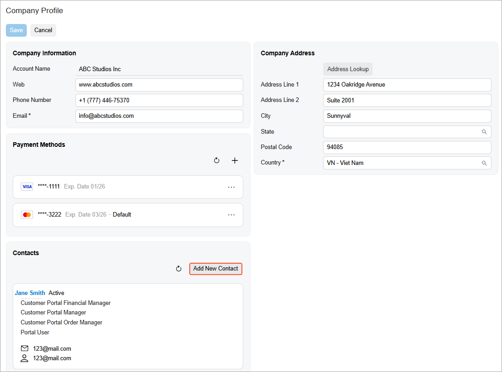
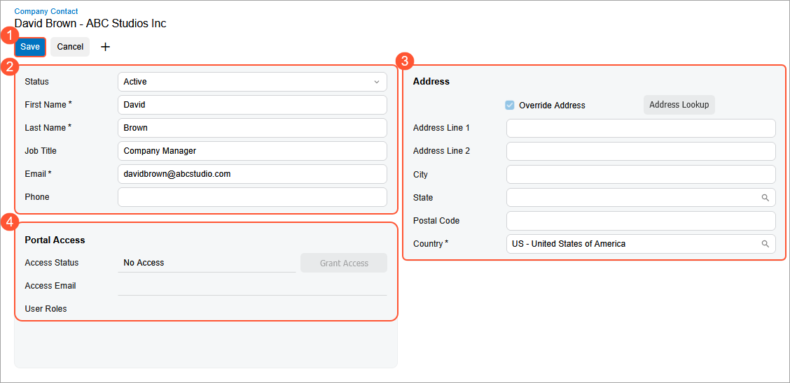

# Modern Customer Portal: Contact Creation {#_fd0ba4c4-9db6-4d0d-8f1d-5dc7f8bc7de3 .concept}

You may need to give more employees in your company access to the Modern Customer Portal. To do this, you create *contacts*—records for your employees who will use the portal. After roles are assigned to these contacts, they can use the portal.

In this topic, you’ll learn how to create these contacts in the Modern Customer Portal.

**Who does this:** An authorized portal user in your company with the *Customer Portal Manager* or *Customer Portal Contact Manager* role.

## Adding a Contact { .section}

To create a contact who will use the portal:

1.  Open the [Company Profile](SP_20_10_00.md) \(SP201000\) form in the Modern Customer Portal.
2.  In the **Contacts** section, click **Add New Contact**.

    

    This section may show contacts that have been entered for your company by the portal owner.

3.  On the Company Contact \(SP201020\) form, which opens, enter the contact’s basic information—the portal user's first and last name, email address, and phone number—and save your changes \(Items 1–2 below\). If needed, enter address settings \(Item 3\); these are used when this contact places orders and the items are shipped.

    

    When you save the contact:

    -   The system creates the contact in Acumatica ERP and makes it available in both Acumatica ERP and the Modern Customer Portal.
    -   The **Portal Access** section becomes available \(Item 4\). You can use it to assign roles to the contact or request the role assignment from the Acumatica ERP administrator.

        **Tip:** You can assign roles to contacts only if you have the *Customer Portal Manager* or *Customer Portal Contact Manager* access rights.

## What's Next? { .section}

Now that you’ve created a contact for the portal user, you can assign one or more portal roles to them directly in the Modern Customer Portal. For more information, see [Modern Customer Portal: Role Assignment in the Portal](Modern_Customer_Portal_Creating_Granting_Roles_in_Portal.md).

Alternatively, you can submit a case to the Acumatica ERP administrator and request the role assignment \(see [Modern Customer Portal: Requesting Role Assignment](Modern_Customer_Portal_Creating_Case_Requesting_Roles_in_Portal.md)\).

For more information about portal roles, see [Modern Customer Portal: Access Rights Through Predefined Roles](Modern_Customer_Portal_Access_Rights_User_Guide.md).

**Parent topic:**[Adding Contacts and Payment Methods](../UserGuide/Modern_Customer_Portal_Creatind_Contacts_and_Payments_Mapref.md)

