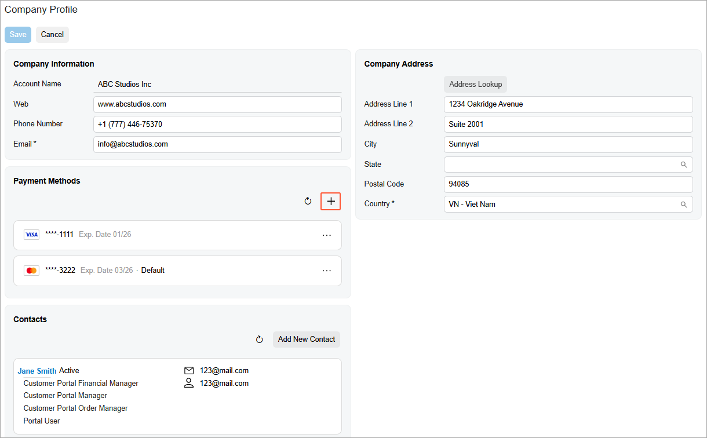
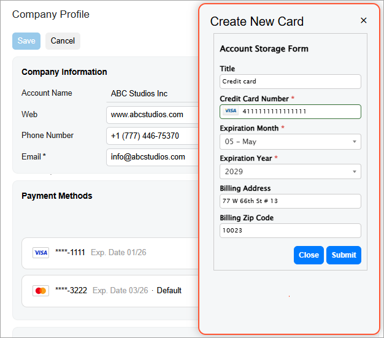

# Modern Customer Portal: Creation of Payment Methods {#_ff1ea01a-1679-45e6-82d0-81006584d4e0 .concept}

In the Modern Customer Portal, you can create, view, and update your company's payment methods.

In this topic, you’ll learn how to create payment methods.

**Who does this:** An authorized portal user in your company, typically with the *Customer Portal Manager* or *Customer Portal Company Manager* role.

## Creating a Payment Method { .section}

You create a payment method on the [Company Profile](SP_20_10_00.md) \(SP201000\) form of the Modern Customer Portal.

In the **Payment Methods** section, click Add New Record \(see below\).

In the **Create New Card** dialog box, enter the card’s settings and click **Submit**.

The new payment method appears in the **Payment Methods** section of the form, where you can set a payment method as the default or delete it.

## What's Next? { .section}

You and other portal users can now place orders and make payments in the Modern Customer Portal.

For more information, see [Modern Customer Portal: Placing and Reviewing Orders](Modern_Customer_Portal_Placing_Orders.md) and [Modern Customer Portal: Paying Sales Orders and Invoices](Modern_Customer_Portal_Paying_Orders_and_Invoices.md).

**Parent topic:**[Adding Contacts and Payment Methods](../UserGuide/Modern_Customer_Portal_Creatind_Contacts_and_Payments_Mapref.md)

