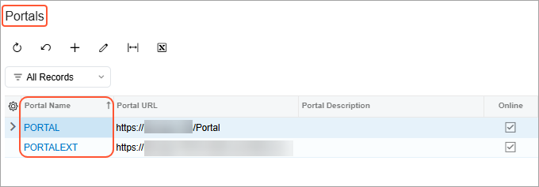

# Modern Customer Portal Administration: General Information {#_e2086fb1-f702-4139-9498-6266bdaf8f2c .concept}

The Modern Customer Portal is a customer-facing site connected to your Acumatica ERP system. Each portal allows your customers’ employees to interact with your company online, based on how you configure the portal and portal users’ access rights.

The Modern Customer Portal and Acumatica ERP use the same records. Changes made in one place—for example, to a contact’s job title or a company’s email address—are immediately reflected in the other place.

**Tip:**

In this guide:

-   *Portal users* are your customers’ employees who use the Modern Customer Portal.
-   The *portal owner* is your company—which runs Acumatica ERP and sets up and manages portals for external portal users.
-   The *support team* is the portal owner’s team, which uses Acumatica ERP to process portal users’ cases.

## Applicable Scenarios { .section}

-   Your customers must rely on email or phone to interact with your company, which slows down tasks like placing orders, making payments, or getting support.
-   Your company wants to reduce manual work and streamline how customer requests are handled by providing secure online access so customers can view information and complete common tasks on their own.
-   You need to control what each customer can do based on how they work with your company.

## Portal Architecture {#section_fwp_qxl_j3c .section}

A customer portal in the Modern Customer Portal consists of:

-   A portal instance deployed through the Acumatica ERP Configuration wizard and connected to your Acumatica ERP database. This instance provides the website framework.
-   A record for each portal, which you create on the [Portals](SP_70_10_00.md) \(SP701000\) form. This record defines how the portal behaves—what functionality is available, what settings apply, and which users can access it.

You manage all portals centrally in Acumatica ERP.

## System Features and Portal Forms {#section_jdq_4yl_j3c .section}

Some portal capabilities require system features to be enabled on the [Enable/Disable Features](CS_10_00_00.md) \(CS100000\) form of Acumatica ERP:

-   *Modern Customer Portal* \(required\)
-   *Inventory and Order Management*
-   *Case Management*

These features are enabled or disabled system-wide. Then for each portal, you select the categories and forms to be available in the portal.

This structure lets you control access at a granular level.

## Managing Portals in Acumatica ERP { .section}

With the [Portals](SP_70_10_00.md) \(SP701000\) form of Modern Customer Portal, you can brand and manage all portals for different customer accounts. On this form, you can:

-   **Manage multiple portals in one place:** View all portal instances and update their settings without leaving Acumatica ERP.
-   **Apply consistent settings:** Maintain consistent settings for portals for customers who purchase similar items and may have common settings, such as case class, visible warehouses, and processing center. You can also apply branding options consistently.
-   **Tailor each portal's settings:** Enter customer-specific information and adjust settings to reflect the way this customer works with your company. This flexibility is useful, for example, when portal settings depend on the branch of your company the customer works with.

## Roles and Access Control {#section_ovt_gyj_j3c .section}

You can control access to portal functionality through predefined roles—which determine the forms and actions available to portal users. Each portal user must be assigned at least one role. Roles can be assigned:

-   In Acumatica ERP by an administrator
-   In the portal by an authorized portal manager

## Portal Administration {#section_dld_41m_j3c .section}

You do the following to configure a customer portal:

1.  Deploy a portal instance.
2.  Create and configure the portal on the [Portals](SP_70_10_00.md) \(SP701000\) form.
3.  Select the categories and forms available in the portal.
4.  Specify finance, ordering, CRM, payment, and branding settings.
5.  Assign roles to portal users.

Once you’ve created portals for customers, you can use the Portals \(SP7010PL\) list of records, shown below, as a starting point for working with any portal. From here, you can add a portal or view and edit any portal's configuration on the [Portals](SP_70_10_00.md) form.

