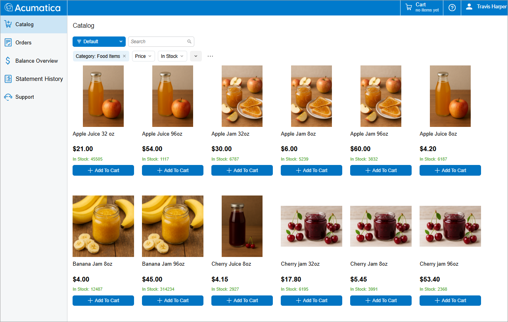
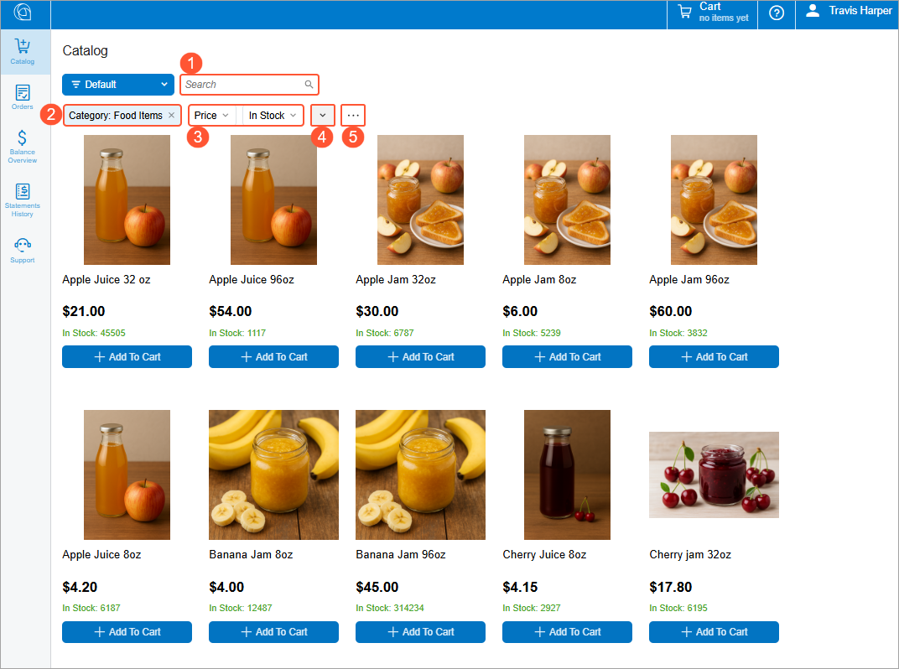
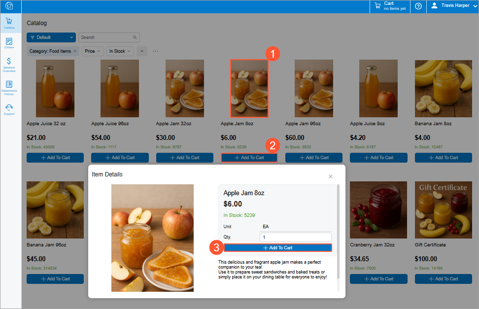
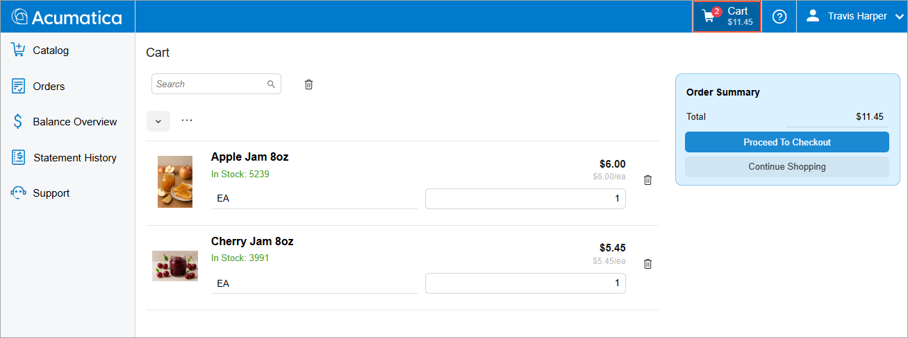

# Modern Customer Portal: Browsing the Catalog {#_291d9602-5258-42f6-a7f7-88d7902513cb .concept}

In the Modern Customer Portal, you can browse a catalog of items, view key information about any item, and add items directly to the cart. The catalog includes search and filtering capabilities, along with real-time inventory visibility as you shop.

This topic explains how to browse the catalog and add items to the cart in the Modern Customer Portal.

**Who does this:** An authorized portal user of your company, typically with the *Customer Portal Manager* or *Customer Portal Order Manager* role and involved in purchasing.

## Catalog Overview { .section}

The Modern Customer Portal catalog is designed for efficient browsing and ordering.

In the catalog, you can:

-   **Search and filter items:** Use the search bar and filters to find items by using keywords, categories, or stock status.
-   **View real-time inventory visibility:** See warehouse-specific item availability. As goods are moved, inventory data in the catalog is updated instantly.
-   **Add items directly to the cart:** Select the quantity, warehouse, and unit of measure, and add items to the cart. The cart in the top pane is updated immediately.
-   **View item details:** Click any item’s image to view more details without leaving the form.

## Starting Your Order {#section_otd_xzk_xgc .section}

To browse the catalog and add needed items to the cart in the Modern Customer Portal, do the following:

1.  Open the Catalog \(SP504001\) form.
2.  At the top of the form, notice the Search box \(Item 1 below\), the Filter List menu \(Item 2\), selection boxes \(Item 3\), the Add Quick Filter button \(Item 4\), and the More button \(Item 5\). You can use these elements to find items faster or narrow the items shown.

    

3.  Click an item’s image \(Item 1 below\). View its description in the **Item Details** dialog box.
4.  Optional: Change the default warehouse, unit of measure, and quantity if you’re purchasing the item.
5.  Click **Add to Cart** \(Item 3\).

    **Tip:** You can also add an item to the cart directly on the Catalog form by clicking **Add to Cart** below the item’s image \(Item 2\).

    

6.  Repeat the three previous steps until you’ve added all needed items.

## Viewing Your Cart {#section_ptd_xzk_xgc .section}

At any time, you can click the **Cart** button on the right side of the top pane, shown below, to open the Cart \(SP504003\) form.

On this form, you can:

-   View the items you’ve added to the cart, along with their in-stock quantities, units of measure, prices, warehouses, and totals
-   Update quantities
-   Change units of measure or warehouses \(if applicable\)
-   Remove items

As you shop, the system instantly updates your totals, so the Cart form always shows an accurate summary of your order. Also, the **Cart** button shows the number of items and the order total.

## What's Next? { .section}

To learn how to place your order, see [Modern Customer Portal: Placing and Reviewing Orders](Modern_Customer_Portal_Placing_Orders.md).

**Parent topic:**[Browsing the Catalog and Placing Orders](../UserGuide/Modern_Customer_Portal_Catalog_and_Payments_Mapref.md)

