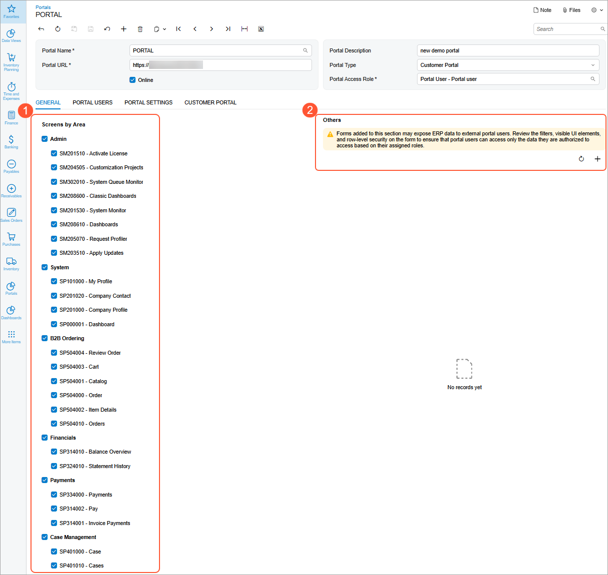
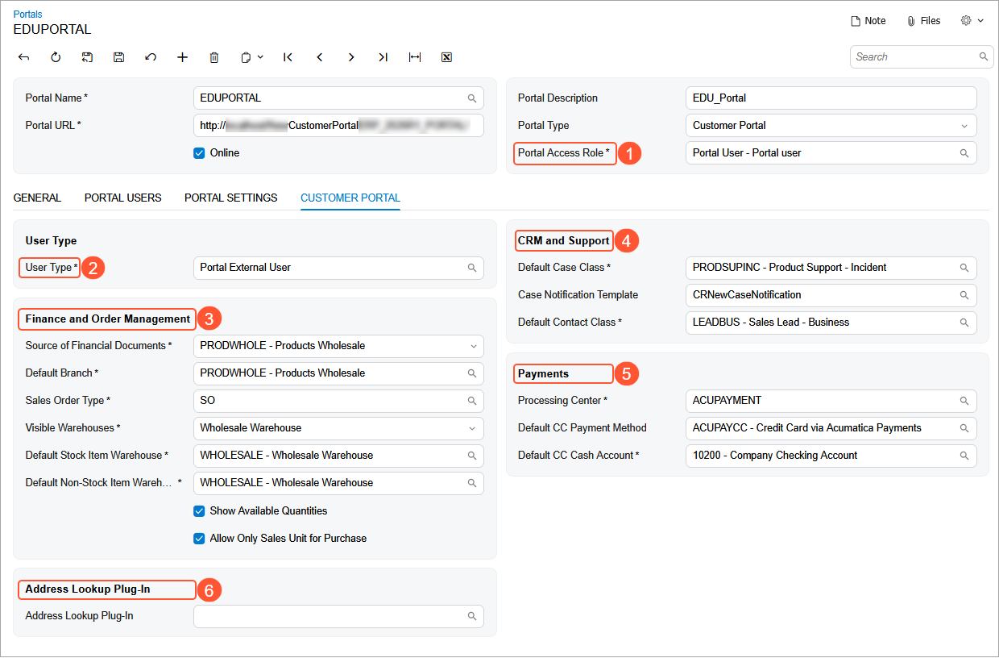
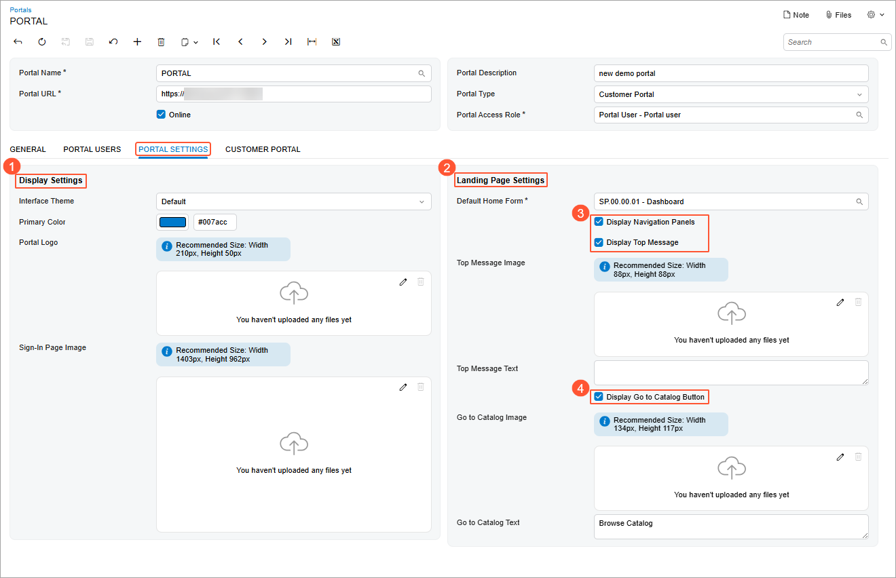

# Modern Customer Portal: Completing Portal Setup {#_322fc14f-2f23-4c49-919e-316a417fadce .concept}

You complete the portal creation process by specifying additional settings on the tabs of the [Portals](SP_70_10_00.md) \(SP701000\) form.

**Important:** You must enter all required settings before you can save the new portal. Portal users with the appropriate access rights can then sign in to the portal and use it.

**At a Glance:** Portal Setup Completion

1.  Select the categories and forms that will be available in the portal
2.  Specify finance, order, and customer relationship management \(CRM\) settings
3.  Save the portal to make it available
4.  Specify and save branding and landing page settings

**Who performs these steps:** An Acumatica ERP administrator of the portal owner—the company whose customers will use the Modern Customer Portal.

The sections that follow describe these steps.

## Controlling the Available Forms { .section}

On the **General** tab of the [Portals](SP_70_10_00.md) \(SP701000\) form, you specify which categories and forms are available in the portal. The tab shows a navigation pane \(Item 1 below\) with check boxes for:

-   **Categories \(top-level nodes\):** Select a category’s check box to make its forms available. If a category’s check box is cleared, the check boxes for its forms are also cleared and unavailable for editing.
-   **Forms within categories:** Select a form’s check box to make the form available to portal users. If a form’s check box is cleared, the form is hidden from portal navigation and can’t be opened, even if its URL is entered directly.



In the **Others** section \(Item 2\), you can select uncategorized forms to make them available in the portal. These might include dashboards, generic inquiry forms, and pivot tables that you create in Acumatica ERP and then add to the portal.

If you haven't added uncategorized forms, the **Others** section is hidden, and you'll see a warning about the steps you need to take to secure these forms' data.

## Security Requirements for Forms Your Company Creates { .section}

In Acumatica ERP, sensitive customer-related data includes data associated with a customer’s business account, such as cases, orders, invoices, payments, and debit and credit memos. This data needs to be protected on all forms, including dashboards, generic inquiry forms, pivot tables, and custom and customized forms—the ones that will appear in the **Others** section of the **General** tab.

When you create custom or customized forms for use in the Modern Customer Portal, follow these guidelines:

-   Limit your company’s data that’s visible to portal users.
-   Ensure that each customer’s data is visible only to that customer’s portal users.

**Attention:** Predefined portal forms already meet these security requirements. For forms that you create or customize in Acumatica ERP for use in the portal, review the filters, visible UI elements, and row-level security settings to ensure that portal users can access only the data allowed by their assigned roles.

You can use the following filtering approaches:

-   BAccount-based filtering: Compare the BAccount record of the new form to the BAccount record of the existing form in the system. You can use built-in portal filters, including filtering by the current BAccount and its child BAccounts tree.
-   Visibility-based filtering: Select only records visible to the current user by using the CurrentMatch condition.

You can use the following conditions to validate data:

-   Restriction.PortalCustomers. This filter is equivalent to PXAccess.GetBAccountIDTree\(\) filtering. It selects only data related to the current BAccount and its child BAccounts.

    ```
    SelectFrom<SPCRCase>.Where<SPCRCase.customerID.IsInSequence
    <Restriction.PortalCustomers>>
    ```

-   `Restriction.PortalConsolidatedCustomers`. This filter selects data for the current account’s consolidating family.

    ```
    SelectFrom<SPSOOrder>.
    Where<SPSOOrder.customerID.IsInSequence<Restriction.PortalConsolidatedCustomers>>
    ```

-   CurrentMatch. This filter selects data that’s visible to the signed-in user.

    ```
    SelectFrom<InventoryItem>.Where<CurrentMatch<InventoryItem, AccessInfo.
    userName>>
    ```


When you create a customized generic inquiry form, on the **Conditions** tab of the [Generic Inquiry](SM_20_80_00.md) \(SM208000\) form \(**Value 1** column\), filter data by using the following conditions:

-   Current `BAccount`: The `@mybaccount` filter variable
-   Current `BAccount` tree: `@mybaccounttree` \(the current `BAccount` and all descendant `BAccounts`\)

Alternatively, you can filter data by the signed-in user or current contact.

## Specifying Finance, Order, and CRM Settings { .section}

On the [Portals](SP_70_10_00.md) \(SP701000\) form, you can specify settings that will be used by portal forms. These include:

-   In the **Portal Access Role** box \(Item 1 below\), select the role assigned to portal users. For external customers, select *Portal Users*.
-   In the **User Type** box \(Item 2\), specify the user type of users who can access the portal. For external customers, specify *Portal External User*.
-   In the **Finance and Order Management** section \(Item 3\), specify the financial source \(the company or branch the portal obtains data from\), the default warehouse and sales order type for portal orders, and warehouse visibility settings.
-   In the **CRM and Support** section \(Item 4\), select the default case class for cases submitted in the portal and the default contact class for contacts created in the portal.
-   In the **Payments** section \(Item 5\), enter the default payment processing center and payment methods.
-   In the **Address Lookup Plug-In** section \(Item 6\), you can specify a plug-in for address lookup and validation.

    


When you enter the required settings, **you can save the portal**. Now portal users with appropriate rights can sign in to the portal and start working in it. The system creates a customer profile on the [Company Profile](SP_20_10_00.md) \(SP201000\) form automatically. The data on this form is copied from the customer's business account, which was previously created on the [Business Accounts](CR_30_30_00.md) \(CR303000\) form of Acumatica ERP.

**Tip:** At this stage, you won’t use the **Portal Users** tab; defining portal users is a separate process described in [Modern Customer Portal: Role Assignment in Acumatica ERP](Modern_Customer_Portal_Granting_Roles_in_ERP.md).

## Specifying Display and Landing Page Settings { .section}

On the **Portal Settings** tab of the [Portals](SP_70_10_00.md) \(SP701000\) form, you can specify the display and landing page settings:

-   In the **Display Settings** section \(Item 1 below\), specify the interface theme, primary color, and company name. You can also upload the company logo and sign-in image to reinforce branding.
-   In the **Landing Page Settings** section \(Item 2\), specify the default Home form and enter the text to be shown as the top message and on the **Go to Catalog** button. You can also upload images for both.

    You can also control the visibility of navigation panels, the top message, and the **Go to Catalog** button by using the corresponding check boxes \(Items 3—4\).


    


Save your changes again.

## What's Next? { .section}

After you’ve set up a portal, you need to assign roles to portal users. For more information, see [Assigning Roles to Portal Users](Modern_Customer_Portal_User_Creation_Mapref.md).

**Parent topic:**[Creating a Portal](../UserGuide/Modern_Customer_Portal_Mapref.md)

