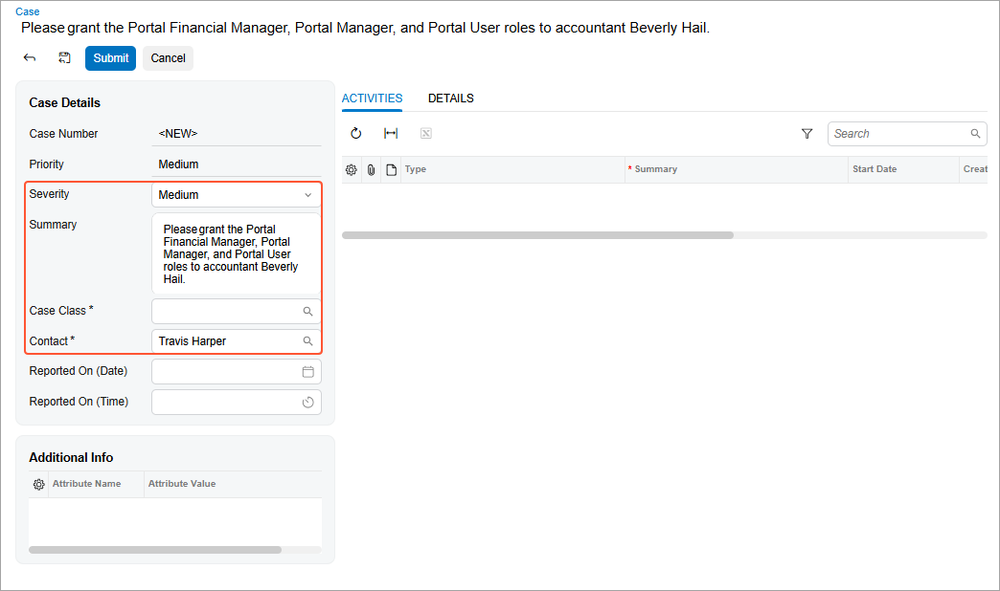

# Modern Customer Portal: Requesting Role Assignment {#_39763eee-5e01-41db-9743-8ce0e9ced849 .concept}

After you create a contact, roles must be assigned before the user can sign in to the portal. If you prefer not to assign roles yourself, you can create a case to request role assignment from the Acumatica ERP administrator, as described in this topic. \(You can also assign roles directly; see [Modern Customer Portal: Role Assignment in the Portal](Modern_Customer_Portal_Creating_Granting_Roles_in_Portal.md).\)

**Who does this:** An authorized portal user of your company with the *Customer Portal Manager* or *Customer Portal Contact Manager* role.

**Tip:** For detailed information about submitting and managing cases, see [Modern Customer Portal: Case Management](Modern_Customer_Portal_Managing_Cases.md).

## Creating a Case to Request Role Assignment { .section}

After you create a contact, it must be assigned roles so that the user can sign in.

To create a case to request role assignment, open the [Case](SP_40_10_00.md) \(SP401000\) form of the portal and fill in the request’s settings.

When you submit the case:

-   It becomes visible in both the portal and Acumatica ERP.
-   The administrator receives an email notification about it.

## What's Next? {#section_c5k_zs1_xgc .section}

After the administrator assigns roles, the contact can sign in to the portal and access the appropriate forms.

If you—or another portal user in your company—want to assign roles directly in the future, see [Modern Customer Portal: Role Assignment in the Portal](Modern_Customer_Portal_Creating_Granting_Roles_in_Portal.md).

**Parent topic:**[Assigning Roles to Users in the Portal](../UserGuide/Modern_Customer_Portal_User_Guide_Mapref_Roles.md)

