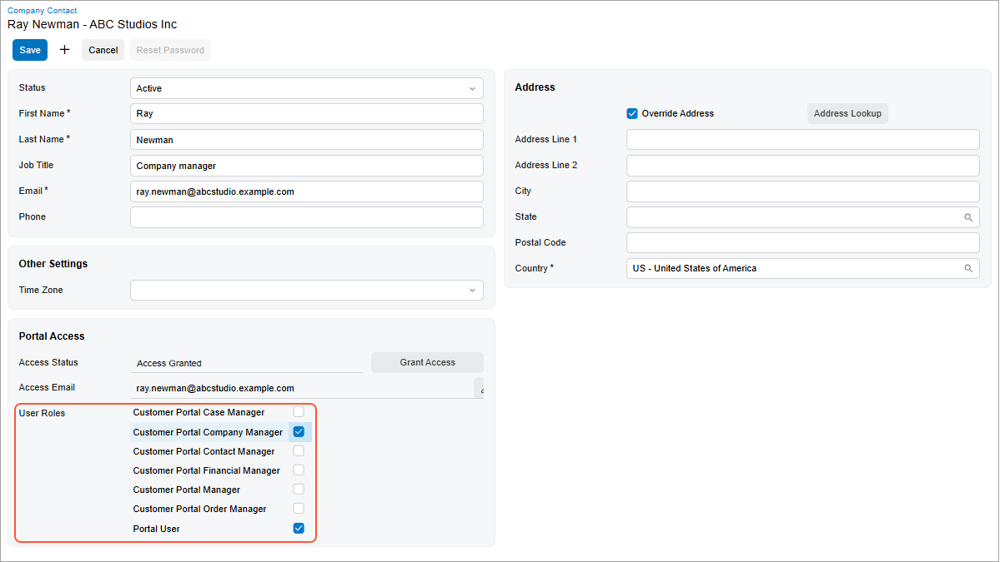

# Modern Customer Portal: Role Assignment in the Portal {#_d032bfe4-860b-439a-adbd-83d98a4a7288 .concept}

After you create a contact, you must assign roles before the employee can sign in to the system. These roles determine access rights.

You can assign roles directly in the Modern Customer Portal, as described in this topic, or request assistance from the Acumatica ERP administrator.

**At a Glance:** Assigning Access Rights to the Portal

1.  Open the contact in the Modern Customer Portal.
2.  Assign one or more roles.

**Who does this:** An authorized portal user of your company with the *Customer Portal Manager* or *Customer Portal Contact Manager* role.

This simple process is described below.

## Assigning Roles to a Contact in the Portal { .section}

On the [Company Contact](SP_20_10_20.md) \(SP201020\) form of the Modern Customer Portal, select the contact you want to assign roles to. In the **Portal Access** section, click the **Grant Access** button.

**Tip:** You can open the [Company Contact](SP_20_10_20.md) form by using the [Company Profile](SP_20_10_00.md) \(SP201000\) form. To do that, in the **Contacts** section, just click the contact’s name.

Then select the check boxes for:

-   The *Portal User* role.

    **Important:** Every contact must be assigned this role to sign in to the Modern Customer Portal.

-   At least one additional role that matches the employee’s position and assigned responsibilities.

    

    **Tip:** For more information, see [Modern Customer Portal: Access Rights Through Predefined Roles](Modern_Customer_Portal_Access_Rights_User_Guide.md).

If you select only the *Portal User* role for a contact, this user can access only the Homepage \(SP000000\) and [My Profile](SP_10_10_00.md) \(SP101000\) forms in the portal.

Save your changes. The system creates the contact’s user account on the [Users](SM_20_10_10.md) \(SM201010\) form of Acumatica ERP.

## What's Next? { .section}

The portal user can now sign in to the Modern Customer Portal, view or edit contact information on the [My Profile](SP_10_10_00.md) \(SP101000\) form, and perform tasks based on the assigned roles. The remaining chapters of this guide describe these tasks.

**Parent topic:**[Assigning Roles to Users in the Portal](../UserGuide/Modern_Customer_Portal_User_Guide_Mapref_Roles.md)

