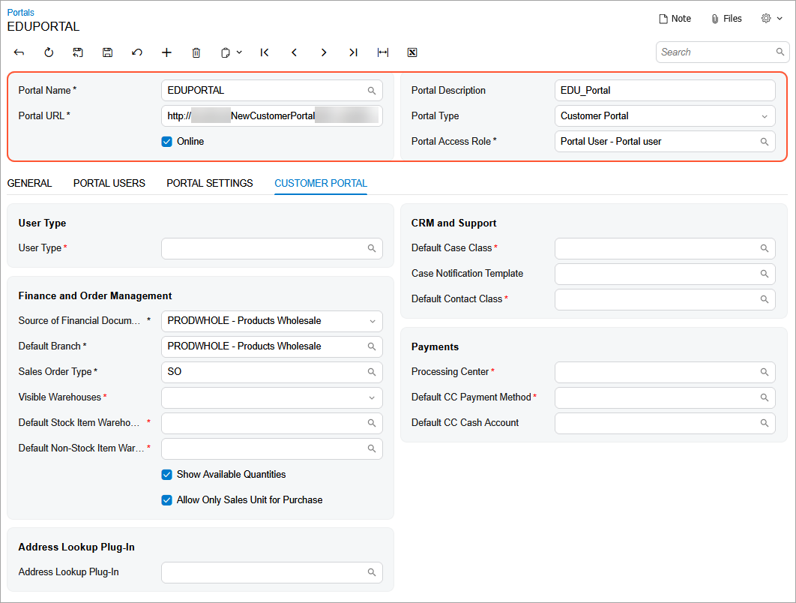

# Modern Customer Portal: Portal Deployment {#_7d3647fa-6766-4347-8f3c-97dd9f268359 .concept}

In this topic, you deploy a new portal instance and create a portal in the Acumatica ERP Configuration wizard so that it’s ready for further configuration.

**At a glance:** Portal deployment

1.  Deploy a portal instance by using the Acumatica ERP Configuration wizard.
2.  Update the `Web.config` file.
3.  Create the portal on the [Portals](SP_70_10_00.md) \(SP701000\) form of Acumatica ERP.

**Who performs these steps:** An Acumatica ERP administrator of the portal owner—the company whose customers will use the Modern Customer Portal.

The sections that follow describe these steps in detail.

## Creating a Portal Instance in Acumatica ERP { .section}

To begin, you use the Acumatica ERP Configuration wizard to deploy a new portal instance—just as you would when creating an Acumatica ERP instance. Do the following:

1.  On the Welcome page, click **Deploy a New Acumatica ERP Instance**.
2.  On the Database Server Connection page, specify the database server type and name, as well as the authentication method.
3.  On the Database Configuration page, select **Connect to an Existing Database** and select the Acumatica ERP database the portal instance will be connected to.

    **Tip:** When a portal is linked to the Acumatica ERP database, it displays customer-related data, including available items, orders, invoices, payments, support cases, and financial information.

4.  On the Database Connection page, specify the sign-in credentials that Acumatica ERP will use to connect to the database.
5.  On the Instance Configuration page, enter the portal instance’s name and make sure that the **Create Modern Portal** option button is selected.
6.  On the Website Configuration page, specify the website and application pool settings.

    Make sure that the **Use Modern UI as Default** check box is selected. Portal forms are available only in the Modern UI.

7.  On the RabbitMQ Configuration page, make sure that the **Set up RabbitMQ Configuration on this server automatically** option button is selected.
8.  On the Confirmation of Configuration page, review your settings and click **Finish**.

The system creates a new Acumatica ERP instance, which you’ll use as a portal instance.

## Editing the Web.config File { .section}

When installing the portal, you must configure additional parameters in a `Web.config` file to ensure that both applications work correctly with the same database.

Do the following:

-   **In a non-cluster environment**, set the `IsMultiSiteMode` parameter to `True` in the `Web.config` files of Acumatica ERP and the Modern Customer Portal.

    ```
    IsMultiSiteMode="true"
    ```

-   **In a cluster environment**, set the `IsClusterEnabled` parameter to `True` in the `Web.config` file of Modern Customer Portal.

    ```
    IsClusterEnabled="true"
    ```


## Creating the Customer Portal in Acumatica ERP { .section}

Next, you open the [Portals](SP_70_10_00.md) \(SP701000\) form in Acumatica ERP and start creating the portal.

**Tip:** Make sure that the *Modern Customer Portal* feature is enabled on the [Enable/Disable Features](CS_10_00_00.md) \(CS100000\) form.

Do the following in the Summary area of the form \(see below\):

1.  Enter a portal name and description.
2.  Enter the full portal URL \(for example, *https://yourserver/CompanyPortal*\).
3.  Select *Customer Portal* in the **Portal Type** box.



## What's Next? { .section}

**Before saving the portal**, you must specify its settings on the tabs of the [Portals](SP_70_10_00.md) \(SP701000\) form. See the next topic to learn how to complete the portal creation process.

**Parent topic:**[Creating a Portal](../UserGuide/Modern_Customer_Portal_Mapref.md)

