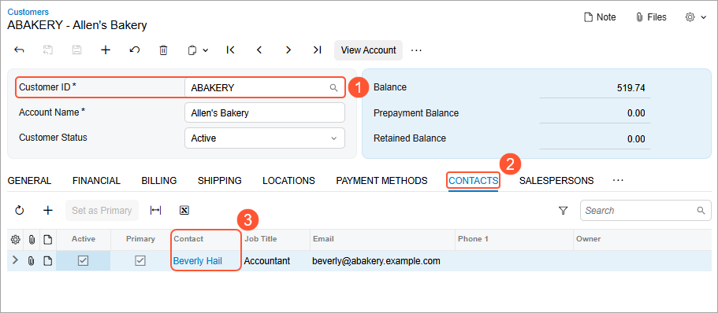
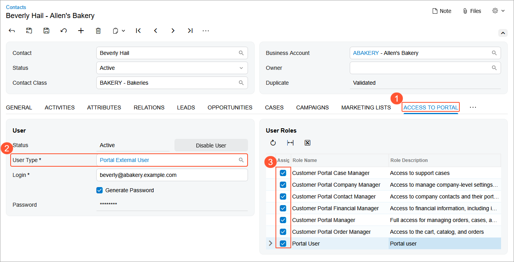
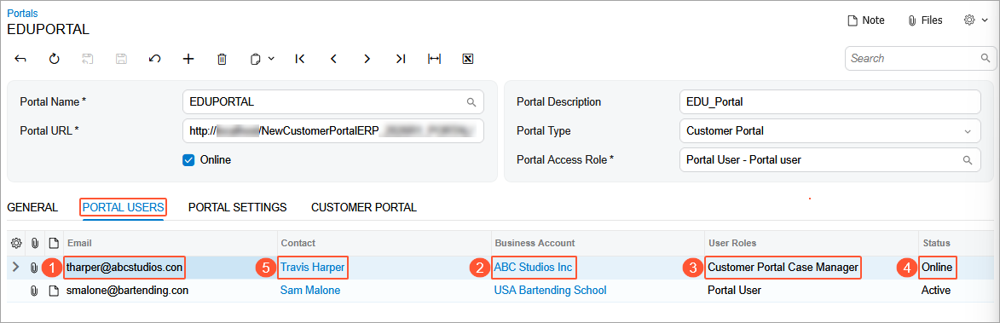

# Modern Customer Portal: Role Assignment in Acumatica ERP {#_eb3f7cf5-0804-4614-b2b7-51ee961c5e66 .concept}

After a portal manager creates a contact, the contact must be assigned access rights before the corresponding portal user can sign in to the system. This can happen in one of these ways:

-   You or another Acumatica ERP administrator assign the role or roles to the contact based on a portal manager’s request. Below you’ll read about this scenario.
-   A portal manager assigns the role or roles to the contact on their own, as described in [Modern Customer Portal: Role Assignment in the Portal](Modern_Customer_Portal_Creating_Granting_Roles_in_Portal.md).

**At a Glance:** Assigning Access Rights in Acumatica ERP

1.  Receive a case requesting the assignment of one or more roles to the contact.
2.  Assign the appropriate user type and the requested role or roles to the contact.
3.  Save the record. The system automatically creates a user account for the contact.

**Who performs these steps:** An Acumatica ERP administrator.

## Assigning Roles to a Contact in Acumatica ERP { .section}

Suppose that the portal manager has created a case requesting that you assign a role to a contact. The submitted case is visible in both the portal and Acumatica ERP.

To find the contact quickly, first open the customer on the [Customers](AR_30_30_00.md) \(AR303000\) form \(Item 1 below\). Then on the **Contacts** tab \(Item 2\), click the link in the **Contact** column \(Item 3\).

The [Contacts](CR_30_20_00.md) \(CR302000\) form opens with the contact selected. On the **Access to Portal** tab \(Item 1 below\), select the *Portal External User* user type \(Item 2\).

In the **User Roles** section, select the check boxes that correspond to the roles the portal manager requested \(Item 3\):

-   The *Portal User* role.

    **Important:** By default, every contact must be assigned this role so that the employee can sign in to the Modern Customer Portal.

-   At least one role that matches the employee’s responsibilities \(see below\).

Save your changes. The system automatically creates a user account on the [Users](SM_20_10_10.md) \(SM201010\) form.

**Tip:** If you select only the *Portal User* role for a contact, this user will see only the homepage and the [My Profile](SP_10_10_00.md) \(SP101000\) form in the portal.

## Viewing Portal Users {#section_npt_zqw_33c .section}

After you create portal users, they appear on the **Portal Users** tab of the [Portals](SP_70_10_00.md) \(SP701000\) form. The list shows each user’s roles, email address, linked business account \(customer\), and status \(Items 1–4 below\).

You can click links \(Item 2 and 5\) to view or update information about the customer and the contact on the [Business Accounts](CR_30_30_00.md) \(CR303000\) and [Contacts](CR_30_20_00.md) \(CR302000\) forms.

## What's Next? {#section_c5k_zs1_xgc .section}

Now that the portal user has been assigned the needed role or roles, they can sign in to the Modern Customer Portal and perform tasks based on their roles.

**Parent topic:**[Assigning Roles to Portal Users](../UserGuide/Modern_Customer_Portal_User_Creation_Mapref.md)

