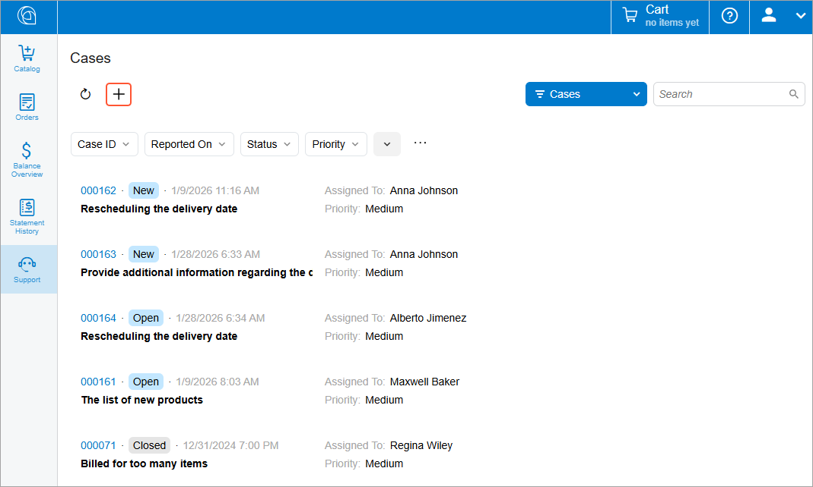
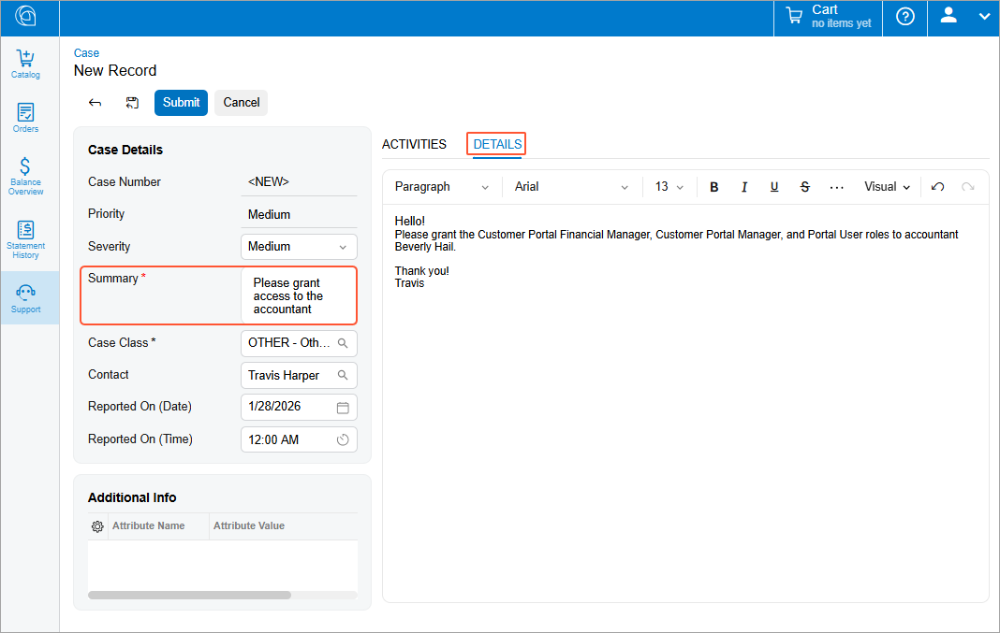
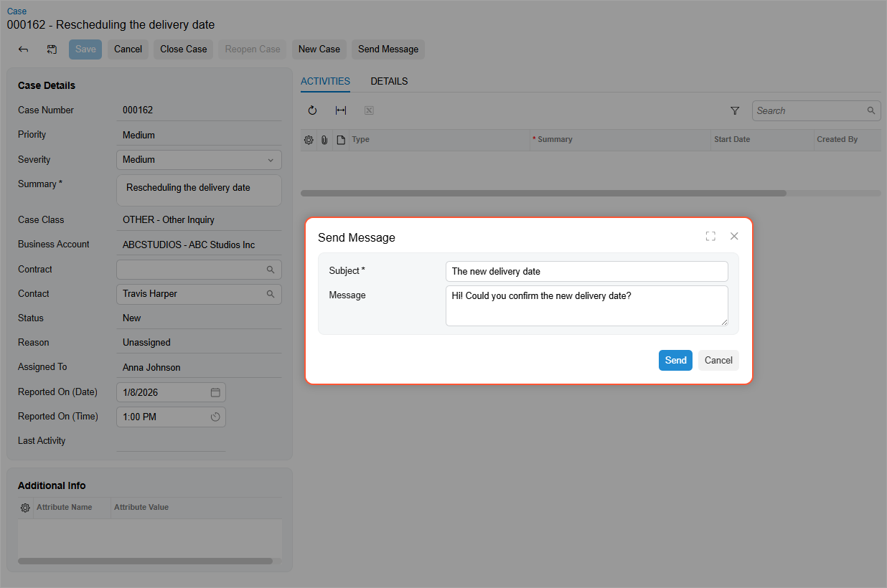
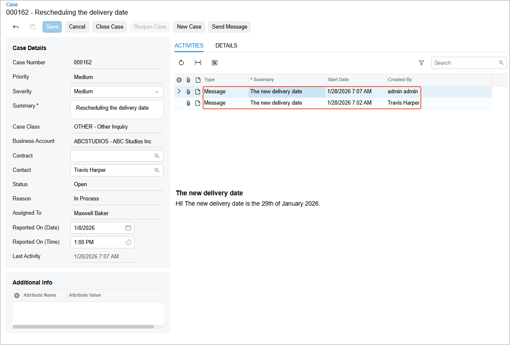
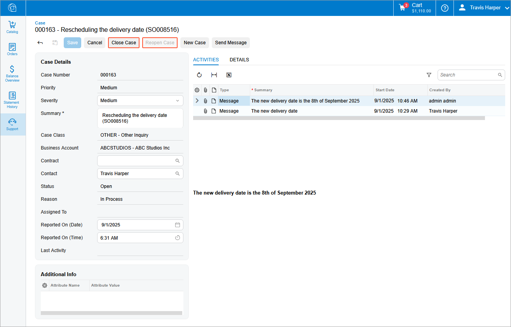

# Modern Customer Portal: Case Management {#_2a4b13c9-e661-4c56-b871-335295371c4b .concept}

The case management forms in the Modern Customer Portal are integrated with Acumatica ERP’s case management functionality. You can submit and manage cases in the portal, and the portal owner’s support team can view and manage these cases in Acumatica ERP.

On the [Case](SP_40_10_00.md) form, you can communicate with the support team through case messages.

This topic explains how you can create and update cases in the Modern Customer Portal.

**At a Glance:** Portal Case Management

-   Create a case in the Modern Customer Portal.
-   Send a case message to the Acumatica ERP support team.

**Who does this:** An authorized portal user of your company, typically with the *Customer Portal Manager* or *Customer Portal Case Manager* role.

## Creating a Case { .section}

The [Cases](SP_40_10_10.md) \(SP401010\) form of the Modern Customer Portal is the starting point for creating cases and viewing all cases your company’s employees have submitted through the portal. Click the Add New Record button to create a case.

Then on the [Case](SP_40_10_00.md) \(SP401000\) form, which opens, fill in the case’s settings. In the **Summary** box, type a brief description of the case. On the **Details** tab, enter a detailed description of the issue or request.

Then click **Submit** to display the case in the portal owner's system. The system assigns an identifier to the case and notifies the portal owner’s support team.

## Updating a Case { .section}

Once you’ve created a case, you can track its status, review it, and update its settings in the Modern Customer Portal.

You can also continue communicating with the Acumatica ERP support team about the case. On the form toolbar of the [Case](SP_40_10_00.md) \(SP401000\) form, you click **Send Message** and enter your message in the dialog box.

On the **Activities** tab, you can view all messages you've sent and received for the case.

To close a case or reopen it, click **Close Case** or **Reopen Case**.

**Parent topic:**[Managing Cases](../UserGuide/Modern_Customer_Portal_Managing_Cases_Mapref.md)

