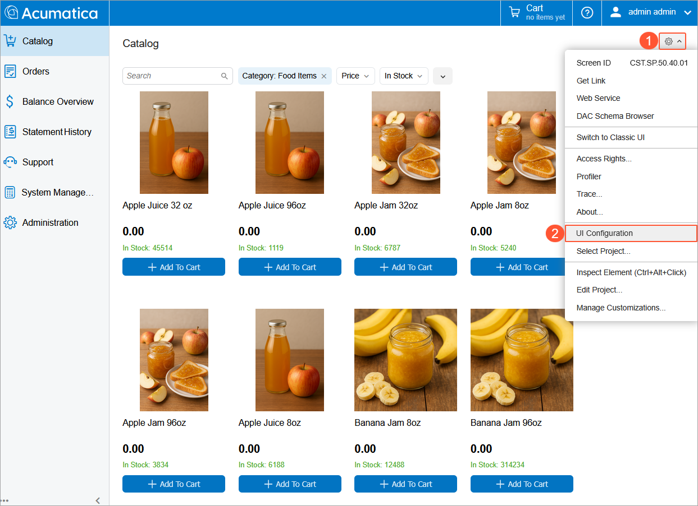
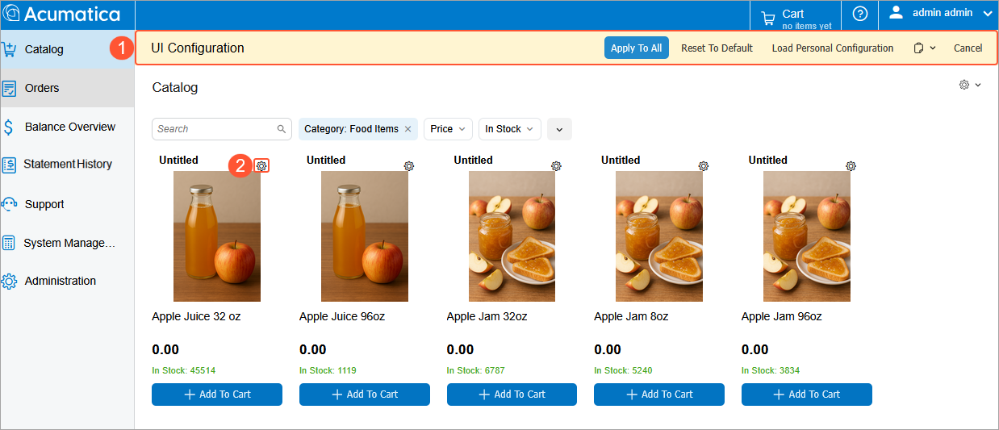
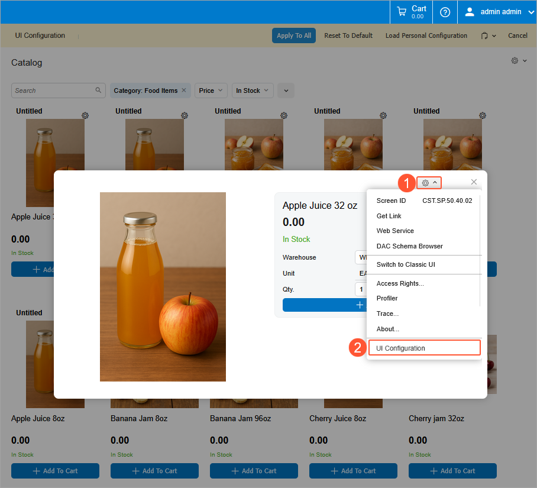
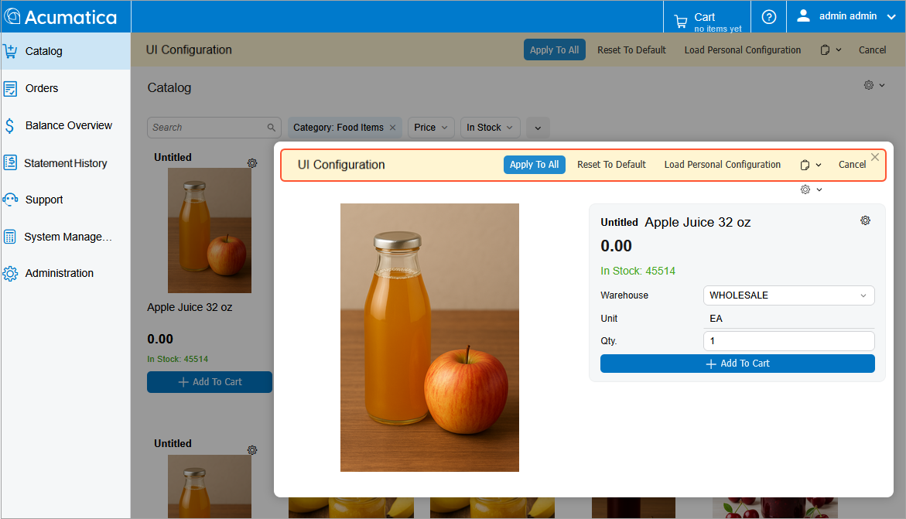
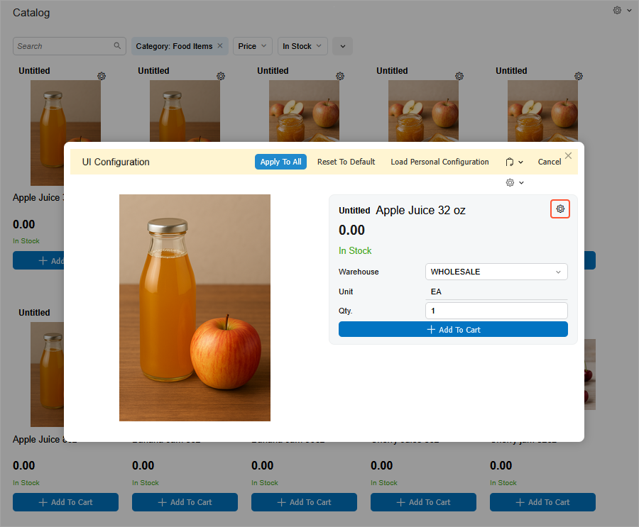
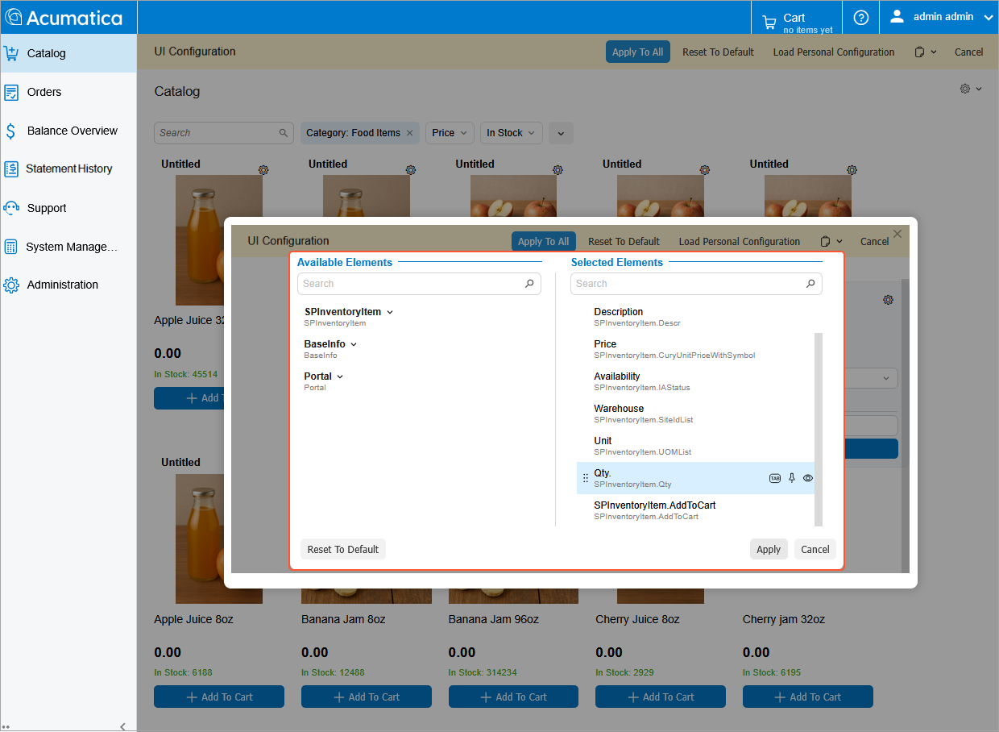
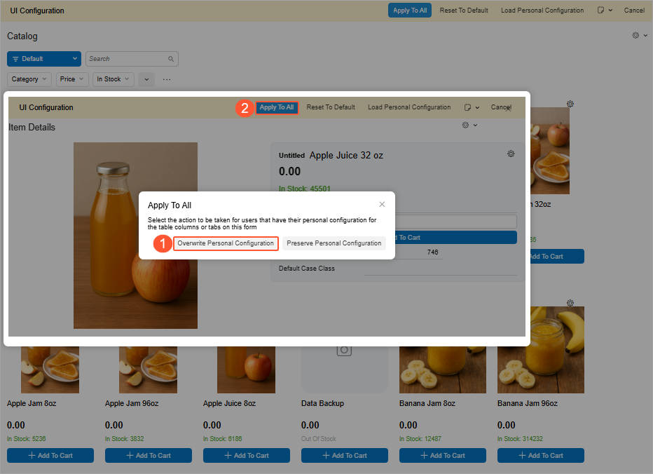

# Modern Customer Portal: Catalog Configuration {#_fbaf9c2a-3496-4209-ab11-c12c074a88d0 .concept}

You can tailor the Catalog \(SP504001\) form in the Modern Customer Portal to control which item details are visible—without customization or coding.

This topic explains how to perform this system-wide form configuration so that portal users see only the item information you want them to see.

**At a Glance:** Configuration of the Catalog Form

1.  Activate UI Configuration mode on the Catalog form.
2.  For a catalog item on the form:
    1.  Turn on UI Configuration mode.
    2.  Activate UI Configuration mode for the **Item Details** dialog box.
    3.  Add or remove elements in the dialog box.
3.  Apply the changes to all items.

    **Tip:** If you modify at least one item on the Catalog form and save the changes, they are applied to all items on the form.

**Who performs these steps:** An Acumatica ERP administrator of the company whose customers will use the Modern Customer Portal.

Below you'll find the details about this process.

## System-Wide Form Configuration {#section_lbp_fgj_5gc .section}

In the Modern UI of Acumatica ERP, an administrator can configure the layout of any form and share that layout with all system users.

In the Modern Customer Portal, this system-wide form configuration is available only on the Catalog \(SP504001\) form.

On this form, you control which item details are visible to portal users by default—so they see only the information you’ve chosen to display.

**Important:** Other portal forms don’t support system-wide UI configuration. Administrators aren’t linked to specific customer accounts and thus can’t view or configure customer-specific data, such as order details, financial documents, and cases.

## Starting Configuration for the Catalog Form {#section_nbp_fgj_5gc .section}

To begin, on the Catalog \(SP504001\) form, click the Settings button \(Item 1 below\) on the form title bar and then click **UI Configuration** \(Item 2\). This activates UI Configuration mode for the form.

## Starting Configuration for the Item Details Dialog Box {#section_u2c_rsx_33c .section}

Now that you’ve turned on UI Configuration mode for the Catalog \(SP504001\) form \(Item 1 below\), switch on this mode for the **Item Details** dialog box. Do the following:

1.  Click the Settings button in the upper right corner of any item \(Item 2\).

    

2.  Click the Settings button in the **Item Details** dialog box, which opens \(Item 1 below\).
3.  Click **UI Configuration** \(Item 2\).

    

UI Configuration mode is now active for the **Item Details** dialog box.

## Configuring Visible Item Details {#section_ad4_rxn_53c .section}

Now that UI Configuration mode is turned on for the**Item Details** dialog box, configure the visible item details. To begin, click the Settings button.

**Important:** Although you’re configuring the **Item Details** dialog box for a specific catalog item, **you will apply these changes to all items on the form**.

The system opens the **Section Configuration** dialog box. Here you can add or remove selected elements from the **Item Details** dialog box. When you complete the configuration, all portal users will see the selected elements for each item.

Click **Apply**.

## Completing the Configuration {#section_bd4_rxn_53c .section}

To finish the configuration, do the following:

1.  In the **UI Configuration** dialog box, click **Overwrite Personal Configuration** \(Item 1 below\).
2.  Click **Apply to All** \(Item 2\).

    

Clicking **Apply to All** ensures that the selected layout is used for every item on the Catalog \(SP504001\) form.

## What's Next? { .section}

After you have configured the portal, you can create contact records for portal users and assign appropriate roles to them. See the next topic to learn how the predefined portal roles control user access.

**Parent topic:**[Creating a Portal](../UserGuide/Modern_Customer_Portal_Mapref.md)

