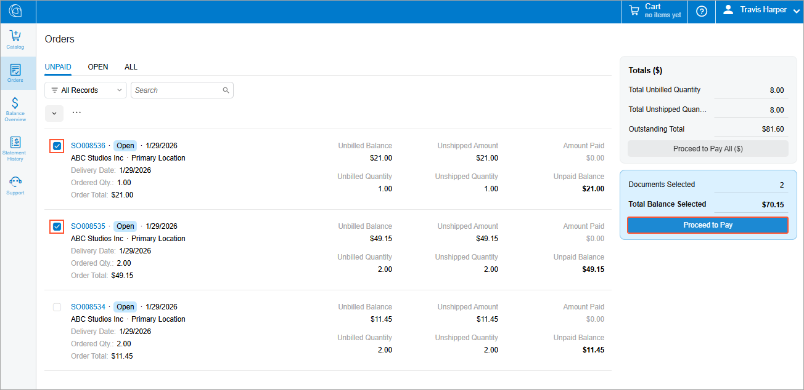
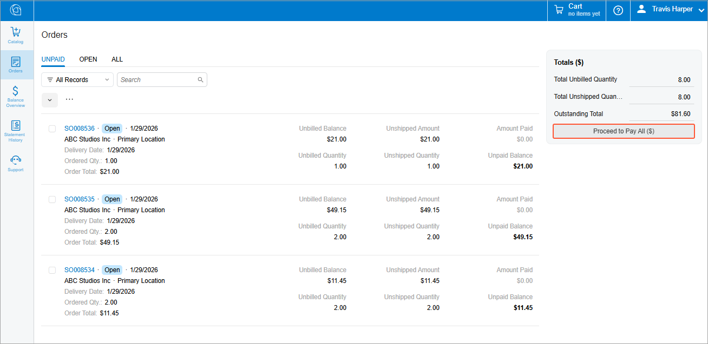
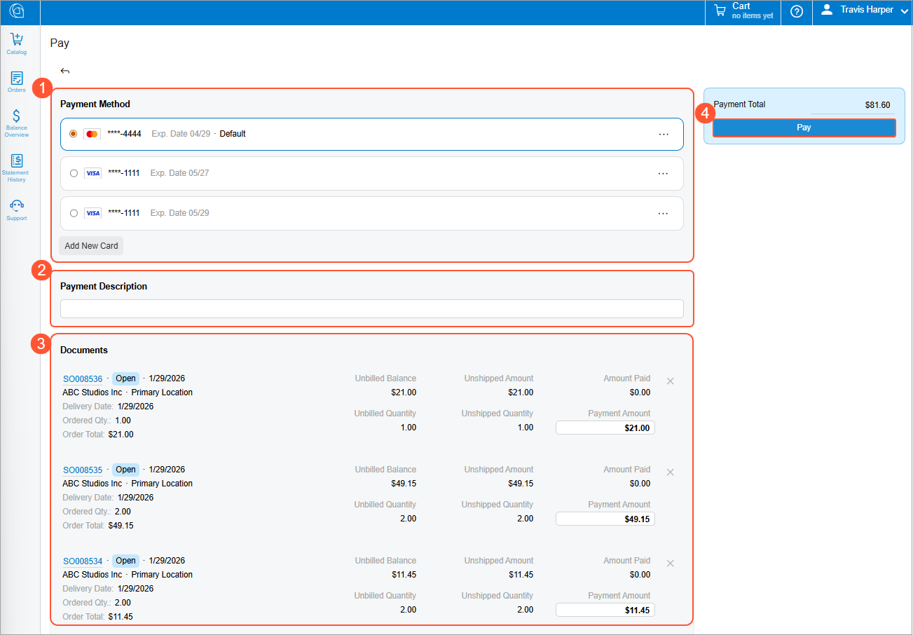
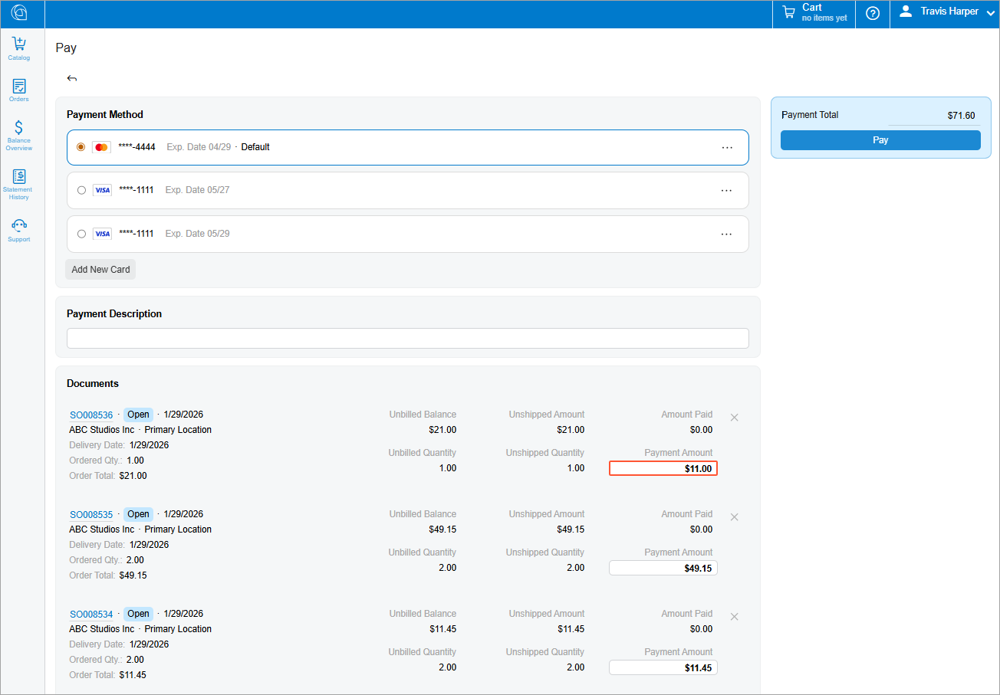
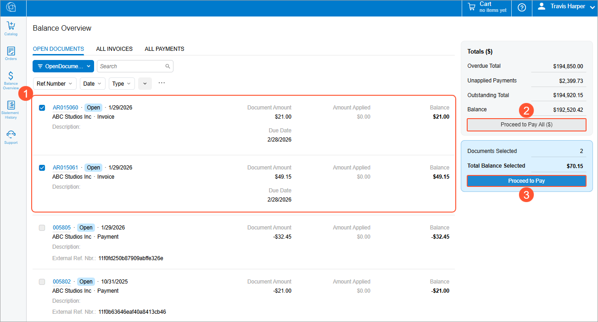
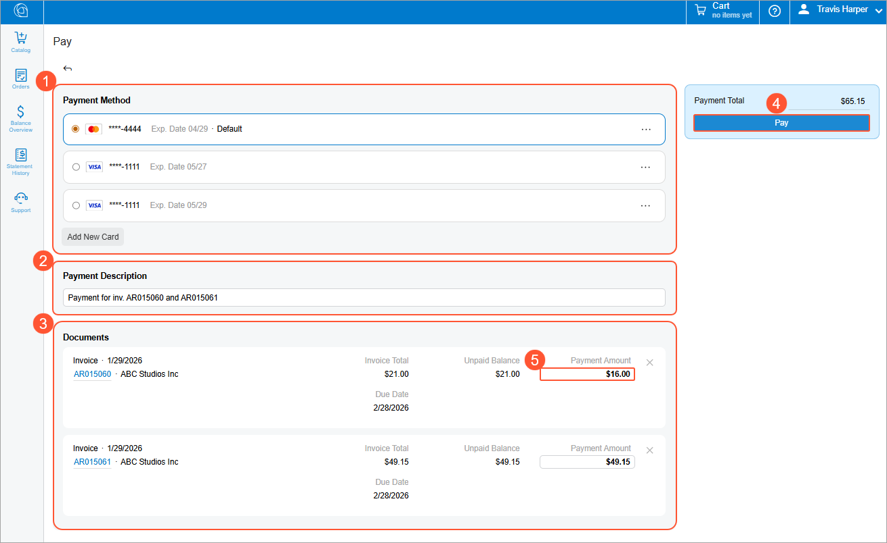

# Modern Customer Portal: Paying Sales Orders and Invoices {#_78049d16-7609-4d9b-bbca-4f463b64109c .concept}

In the Modern Customer Portal, you can make payments for orders and invoices by using saved payment methods or adding new ones on the fly.

**At a Glance:** Making Payments

1.  Open either the Orders \(SP504010\) form for sales orders or the [Balance Overview](SP_31_40_10.md) \(SP314010\) form for sales invoices.
2.  Do one of the following:
    -   Select the sales orders or invoices to be paid now and then click **Proceed to Pay**.
    -   Click **Proceed to Pay All**.
3.  On the [Pay](SP_31_40_02.md) \(SP314002\) form, complete the payment.

**Who does this:** An authorized portal user of your company, typically with the *Customer Portal Manager*, *Customer Portal Financial Manager*, or *Customer Portal Order Manager* role.

Let’s take a closer look at how this process works.

## Starting to Pay Sales Orders { .section}

In the Modern Customer Portal, you start paying open sales orders on the Orders \(SP504010\) form. Do either of the following:

-   Select the check boxes for the open orders you want to pay and click **Proceed to Pay** \(see below\).

    **Important:** You can make payments for selected documents only if they have the same currency. If you select a check box for a document in one currency, the check boxes for documents in other currencies become unavailable.

    

-   Click **Proceed to Pay All** to pay all open orders that are listed on the filter tab.

    

When you click **Proceed to Pay** or **Proceed to Pay All**, the Pay form opens.

## Completing the Payment { .section}

On the [Pay](SP_31_40_02.md) \(SP314002\) form, you complete the payment process. Do either of the following:

-   Make full payments for all listed orders: Select the payment method \(Item 1 below\), enter a payment description \(Item 2\), review the listed sales orders \(Item 3\), and click **Pay** \(Item 4\).

    

    **Tip:** In the **Payment Method** section, you can create a payment method without leaving the form. To do this, click **Add New Card**. In the **Create New Card** dialog box, enter the settings for the payment and click **Submit**.

-   Make partial payments. For any sales order, enter the amount you want to pay and click **Pay**.

    

## Starting to Pay Invoices {#section_omf_n3n_ygc .section}

In the Modern Customer Portal, you can pay any number of open invoices.

To begin this process, open the [Balance Overview](SP_31_40_10.md) \(SP314010\) form. On the **Open Documents** tab, select the check boxes for the invoices you want to pay \(Item 1 below\) and click **Proceed to Pay** \(Item 3\). If you want to pay all listed invoices, click **Proceed to Pay All** \(Item 2\).

Clicking either button opens the [Pay](SP_31_40_02.md) \(SP314002\) form.

## Completing the Invoice Payment {#section_pmf_n3n_ygc .section}

On the [Pay](SP_31_40_02.md) \(SP314002\) form, you finish the payment process. Select the payment method, enter a payment description \(Items 1–2 below\), review the listed invoices \(Item 3\), and click **Pay** \(Item 4\).

You can instead make partial payments for invoices: For any invoice, you enter the amount you want to pay \(Item 5\) and click **Pay**.

## Unsuccessful Payments { .section}

The Modern Customer Portal gives you more control over payments and helps you avoid delays. If a payment attempt fails, you don’t need to start over—you can either retry the payment or change the payment method and submit it again.

If a payment isn't completed \(for example, due to an authorization error\), the system retains your payment details and creates a payment with the *Pending Processing* status. If the next retry is successful, the system:

-   **For sales orders:** Replaces the failed payment with a new one linked to each processed order
-   **For invoices:** Creates a new payment and removes any previously failed payments linked to each processed invoice

## What's Next? { .section}

To learn how to view financial information in the portal, see [Modern Customer Portal: Working with Financial Data](Modern_Customer_Portal_Working_with_Financial_Data.md).

**Parent topic:**[Creating Payments and Viewing Balances](../UserGuide/Modern_Customer_Portal_Payments_Financial_Data_Mapref.md)

