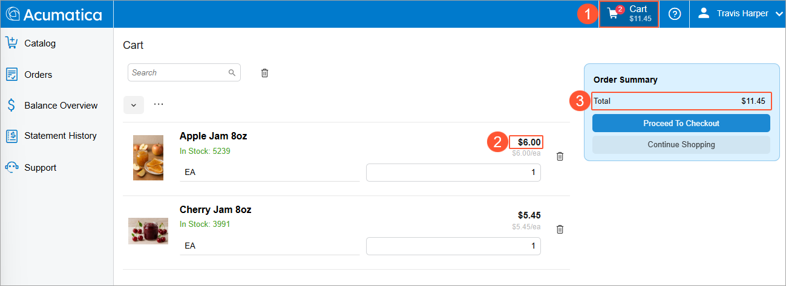
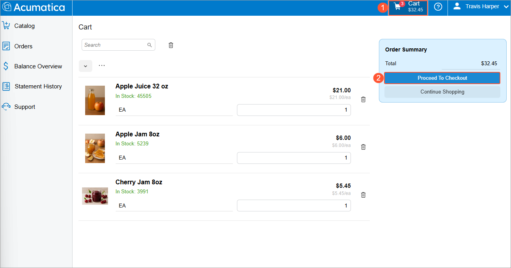
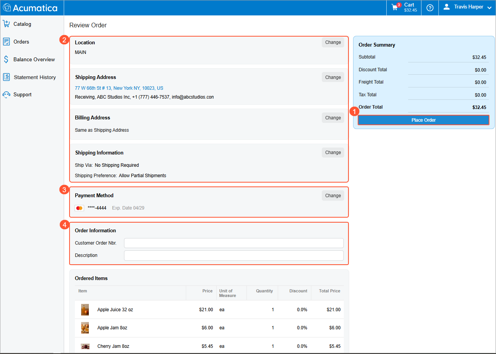
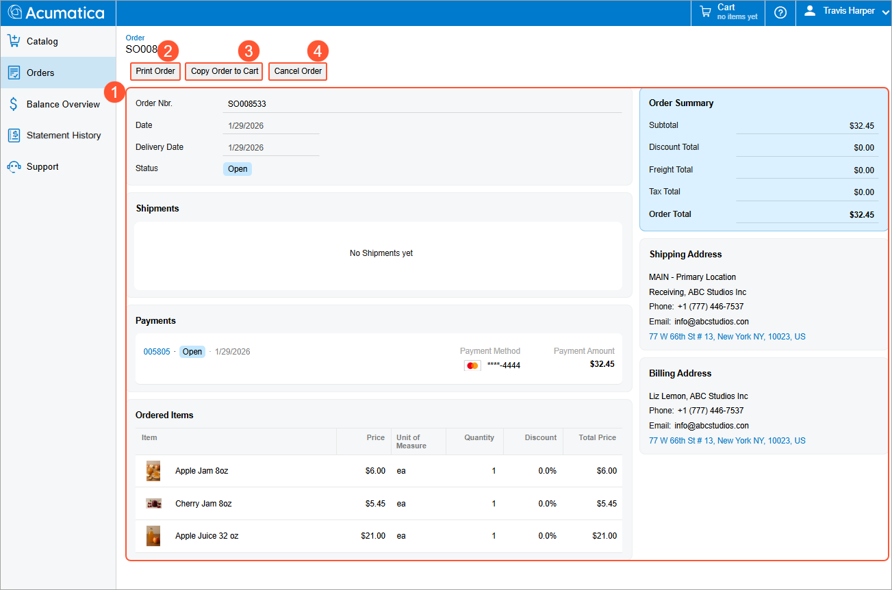
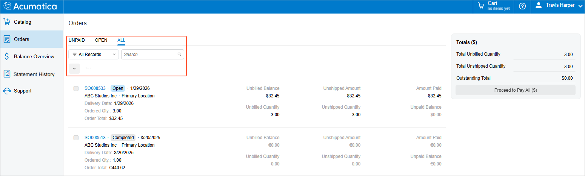

# Modern Customer Portal: Placing and Reviewing Orders {#_44f71345-ad38-4f30-ac95-aaafbcb429d7 .concept}

In the Modern Customer Portal, you can quickly review orders, make adjustments, enter or confirm shipping and payment details, and place the order.

In this topic, you’ll learn how to place orders in the Modern Customer Portal.

**At a Glance:** Placing Orders

1.  Open the cart, review the added items, and proceed to checkout
2.  Review the order’s details on the Review Order \(SP504004\) form, and place the order
3.  View \(and optionally, print or cancel\) the placed order on the Order \(SP504000\) form

**Who does this:** An authorized portal user of your company, typically with the *Customer Portal Manager* or *Customer Portal Order Manager* role and involved in purchasing.

## About the Cart { .section}

As you shop in the Modern Customer Portal, you can:

-   **View key order details and quickly go to your cart:** The cart button \(Item 1 below\) is always visible on the right side of the top pane for users with the *Customer Portal Manager* or *Customer Portal Order Manager* roles \(or both roles\). It shows the current number of items and total—and updates these values as you add items. You can click the button to open the cart.
-   **Modify your cart:** You can remove items, adjust quantities, and select a warehouse or unit of measure \(UOM\) for an item, if applicable. The cart instantly shows refreshed totals for the item and the order as a whole \(Items 2–3\).

    

## Placing an Order {#section_uwf_3dq_xgc .section}

Suppose that you’ve added some items to the cart, as described in [Modern Customer Portal: Browsing the Catalog](Modern_Customer_Portal_Browsing_Catalog.md). To place an order in the portal, do the following:

1.  Click the **Cart** button in the top pane \(Item 1 below\) to open the Cart \(SP504003\) form, also shown below.
2.  Review the items and click **Proceed to Checkout** \(Item 2\).

    

3.  On the Review Order \(SP504004\) form, which opens \(see below\), review the order’s details and click **Place Order** \(Item 1\).

    Before you place the order, you can:

    -   Change shipment and billing details \(Item 2\)
    -   Change the payment method \(Item 3\) or add a new one on the fly
    -   Enter your company’s order number and description \(Item 4\)

    

    The system processes the order and submits it to the portal owner. The order is visible in both the Modern Customer Portal and Acumatica ERP.

The Order \(SP504000\) form opens, showing the order \(Item 1 below\). If needed, you can print or cancel it \(Items 2 and 4\).

**Tip:** Need to create an order that’s similar to or the same as a past order? Start by opening the past order. Then click **Copy Order to Cart** \(Item 3\), and all items and quantities will be added to your cart.

## Viewing All Orders {#section_xwf_3dq_xgc .section}

On the Orders \(SP504010\) form, you can use intuitive filter tabs to view:

-   Unpaid orders
-   Orders with the *Open* status
-   All orders your company has placed

You can also use the Search box to quickly find a particular order.

## What’s Next? { .section}

To learn how to make payments directly through the Modern Customer Portal, see [Modern Customer Portal: Paying Sales Orders and Invoices](Modern_Customer_Portal_Paying_Orders_and_Invoices.md).

**Parent topic:**[Browsing the Catalog and Placing Orders](../UserGuide/Modern_Customer_Portal_Catalog_and_Payments_Mapref.md)

