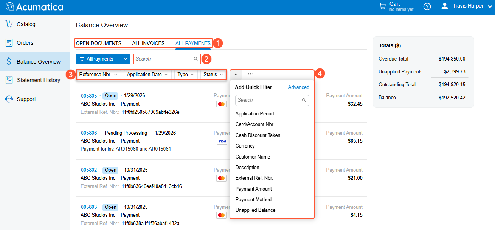
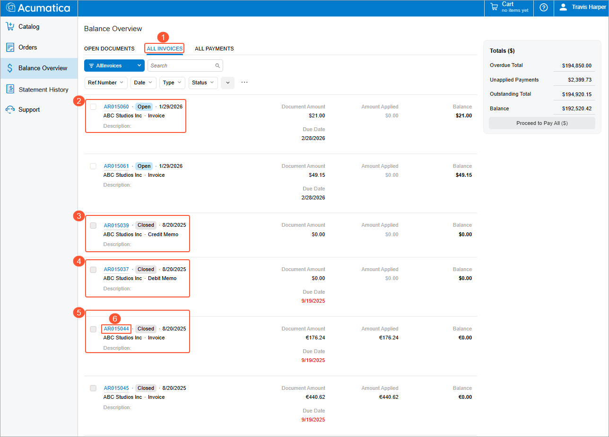
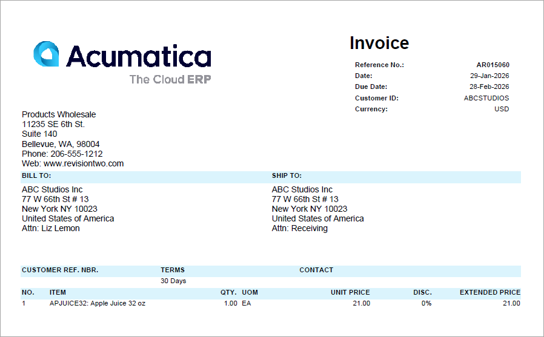
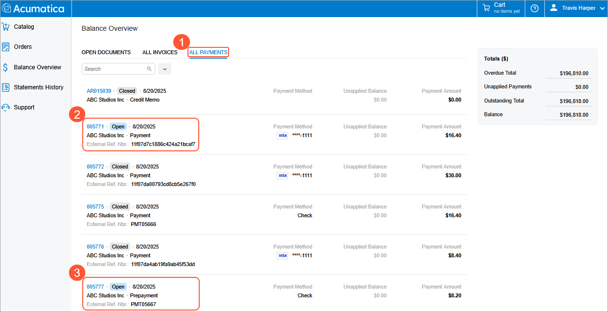
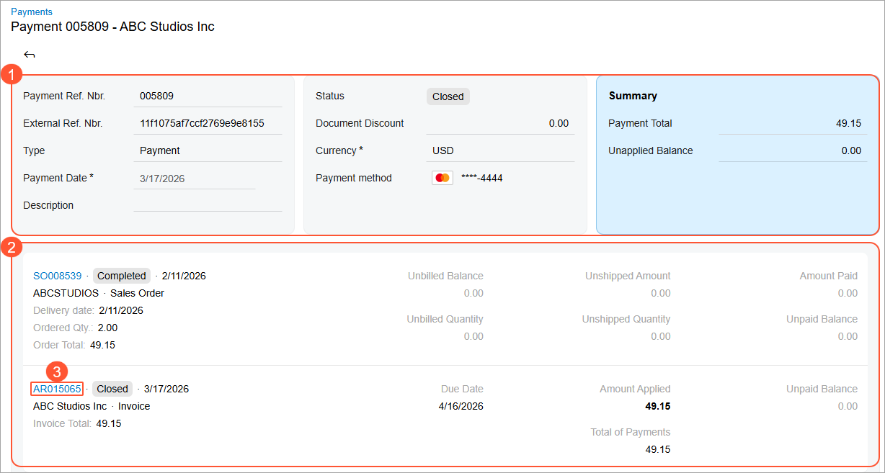
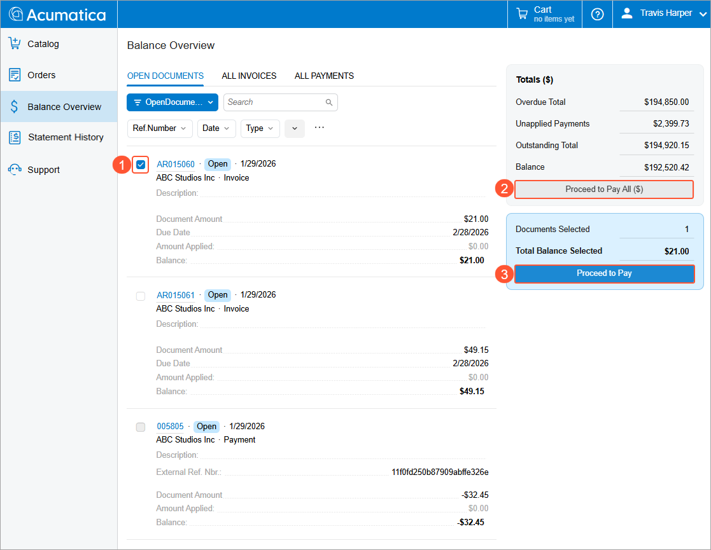
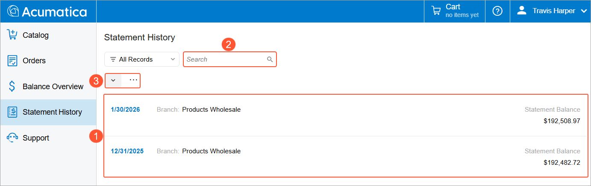
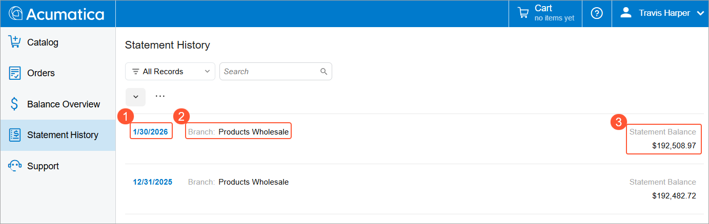
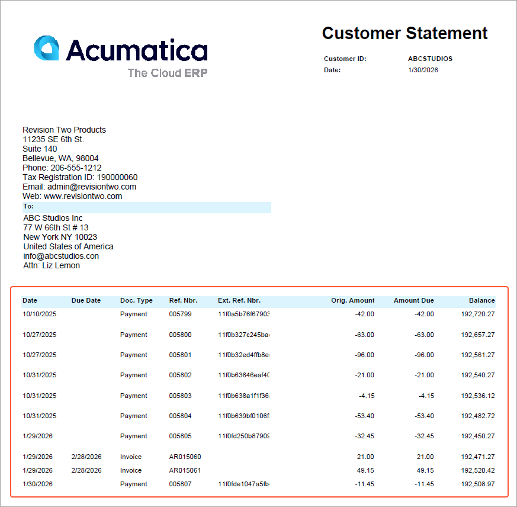

# Modern Customer Portal: Working with Financial Data {#_19143b25-b5be-46c4-aa08-9ba0fdebeb91 .concept}

In the Modern Customer Portal, you can review your company’s financial documents and statements in one place. You can check totals, balances, due dates, and payments to keep track of your company’s finances.

In this topic, you’ll learn how to view financial data in the portal.

**At a Glance:** Viewing Financial Data

-   Open the [Balance Overview](SP_31_40_10.md) \(SP314010\) form. Review open and closed invoices, payments, and totals.
-   Optional: Make partial or full payments of invoices.
-   Open the Statement History \(SP324010\) form to review statements. Open any statement by clicking the statement date, which is a link to it, and review the statement's details.

**Who does this:** An authorized portal user of your company, typically with the *Customer Portal Financial Manager* role.

In the next sections, you'll see how to use these capabilities in the portal.

## Managing Financial Documents in One Place {#section_cwq_vd4_ygc .section}

On the [Balance Overview](SP_31_40_10.md) \(SP314010\) form of the Modern Customer Portal, you can view financial documents \(invoices and payments\) and totals.

You can view the relevant documents and totals without switching forms. By using filter tabs \(Item 1 below\), you can view open documents, all invoices, or all payments. By default, documents are sorted by date, with the most recent ones first. To find the documents you need, you can use the search box \(Item 2\), selection boxes \(Item 3\), and filters \(Item 4\).

On the **All Invoices** tab \(Item 1 below\), you can access invoices \(Item 2\), credit and debit memos \(Items 3 and 4\), and overdue charges \(Item 5\). You can see each document’s due date \(if applicable\), amount, and balance. Document numbers are displayed as links \(Item 6\).

When you click a link with a document number, the system opens a printable version of the document in a browser.

On the **All Payments** filter tab \(Item 1 below\) of the [Balance Overview](SP_31_40_10.md) form, you can view payments \(Item 2\) and prepayments \(Item 3\).

To review any payment's settings, you can click its number, which is a link. The payment opens on the Payments \(SP334000\) form, where you can view its status, date, total, currency, and payment method \(Item 1 below\).

In the table, you can view the list of documents to which the payment is applied \(Item 2\). Click any document number \(Item 3\) to open the Invoice Payments \(SP314001\) form, where you can view the document’s payment details \(due date, outstanding amount, total, and applied payments\).

## Making Partial or Full Payments {#section_dwq_vd4_ygc .section}

From the **Open Documents** and **All Invoices** filter tabs of the [Balance Overview](SP_31_40_10.md) \(SP314010\) form, you can initiate partial or full payments: Select the document or documents to be paid \(Item 1 below\) and then click **Proceed to Pay** \(Item 3\).

You can instead click **Proceed to Pay All** \(Item 2\) to make payments for all open documents listed on the **Open Documents** tab.

For details on making payments in the Modern Customer Portal, see [Modern Customer Portal: Paying Sales Orders and Invoices](Modern_Customer_Portal_Paying_Orders_and_Invoices.md).

## Statement History { .section}

In the Modern Customer Portal, you can access your company's account statements on the Statement History \(SP324010\) form. The form shows a chronological list of all issued customer statements \(Item 1 below\).

By default, statements are sorted by date, with the most recent ones first. You can use the search box to find a statement or use filters \(Items 2–3\).

For each statement, you can view key settings:

-   Its date, which is also a link \(Item 1 below\)
-   The branch of the company selling the items \(Item 2\)
-   The statement’s balance \(Item 3\)

You can click any statement’s date to review its details in a printable document that the system opens in a browser. In this document, you can see invoices and their due dates, amounts due, and balances as of the statement date.

**Parent topic:**[Creating Payments and Viewing Balances](../UserGuide/Modern_Customer_Portal_Payments_Financial_Data_Mapref.md)

