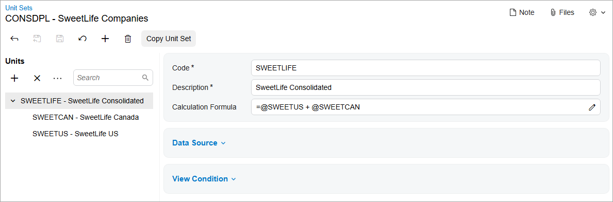
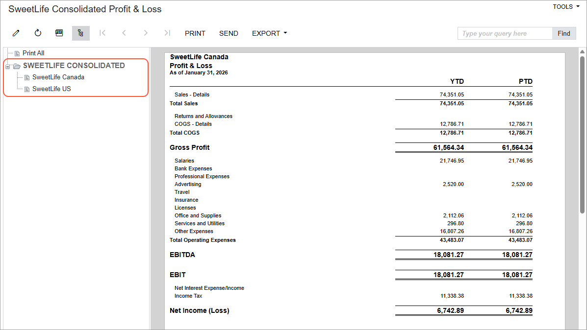

# Consolidated Financial Statement: Creating a Customized Report {#_ee9b98cc-3c81-461f-bcf0-6e8289f47096 .task}

The following activity will walk you through the process of creating a consolidated financial statement for the SweetLife Fruits &amp; Jams and SweetLife Canada companies.

## Story {#section_sm1_jjv_vxb .section}

Suppose that the account balances of the SweetLife Canada company have been translated from Canadian dollars \(the company's base currency\) into the US dollars \(the base currency of the parent company\).

Acting as Kimberly Gibbs, an employee who has access to both companies, you need to create an analytical report based on the Profit &amp; Loss report. The created report will include the financial data of both SweetLife companies—SweetLife United States and SweetLife Canada.

## Configuration Overview { .section}

In the *U100* dataset, the following tasks have been performed to support this activity:

-   On the [Enable/Disable Features](CS_10_00_00.md) \(CS100000\) form, the *Multibranch Support*, *Multicompany Support*, *Customer and Vendor Visibility Restriction*, *Multicurrency Accounting*, and *Multiple Base Currencies* features have been enabled.
-   On the [Companies](CS_10_15_00.md) \(CS101500\) form, the SweetLife company has been configured.
-   On the [Branches](CS_10_20_00.md) \(CS102000\) form, the *HEAD* branch of the SweetLife company has been created.
-   On the [Row Sets](CS_20_60_10.md) \(CS206010\) form, the row set with the *DPL* code has been created.
-   On the [Column Sets](CS_20_60_20.md) \(CS206020\) form, the column set with the *DPLP* code has been created.
-   On the [Report Definitions](CS_20_60_00.md) \(CS206000\) form, the report definition with the *DPLP* code has been created.

## Process Overview {#section_xm1_jjv_vxb .section}

In this activity, you will first create a copy of the predefined [Profit &amp; Loss](GL_63_50_00.md) \(GL635000\) report by copying its row set, column set, and report definition. Then you will create a unit set so that you can filter the displayed data by company and to review the consolidated data for the entire SweetLife company.

**Tip:** We recommend that you not modify predefined Acumatica ERP reports directly. You should instead create a copy of the report before making any modifications.

## System Preparation {#section_an1_jjv_vxb .section}

Before you begin performing the steps of this activity, do the following:

1.  Launch the Acumatica ERP website with the *U100* dataset preloaded, and sign in as a system administrator Kimberly Gibbs by using the *gibbs* username and the *123* password.
2.  On the Company and Branch Selection menu on the top pane of the Acumatica ERP screen, select the *SweetLife Canada* branch.
3.  In the company to which you are signed in, be sure that you have configured the SweetLife Canada company, as described in [Multiple Base Currencies: Implementation Activity](../ImplementationGuide/config_Multicurrency_MultipleBaseCurrencies_Implem_Activity.md), which is a prerequisite activity.
4.  Make sure that you have prepared and released a translation of SweetLife Canada balances into USD, as described in [Consolidated Financial Statement: Performing a Translation](Multicurrency_MBC_Consolidated_Financial_Statement_Activity1.md), which is a prerequisite activity.

## Step 1: Copying the Row Set of the Report {#section_cn1_jjv_vxb .section}

To copy the row set of the predefined [Profit &amp; Loss](GL_63_50_00.md) \(GL635000\) report, do the following:

1.  On the [Row Sets](CS_20_60_10.md) \(CS206010\) form, open the row set with the *DPL* code.
2.  On the form toolbar, click **Copy Row Set**.
3.  In the **Copy Row Set** dialog box, which is opened, specify the following settings:
    -   **New Code**: `CONSDPL`
    -   **Description**: `SweetLife Consolidated P&L`
4.  Click **Save**. The system closes the dialog box and returns you to the form.
5.  On the form toolbar, click **Save**.

## Step 2: Copying the Column Set of the Report {#section_en1_jjv_vxb .section}

To copy the column set of the predefined [Profit &amp; Loss](GL_63_50_00.md) \(GL635000\) report, do the following:

1.  On the [Column Sets](CS_20_60_20.md) \(CS206020\) form, open the column set with the *DPLP* code.
2.  On the form toolbar, click **Copy Column Set**.
3.  In the **Copy Column Set** dialog box, which is opened, specify the following settings:
    -   **New Code**: `CONSDPLP`
    -   **Description**: `SweetLife Consolidated P&L`
4.  Click **Save**. The system closes the dialog box and returns you to the form.
5.  On the form toolbar, click **Save**.

## Step 3: Copying and Updating the Report Definition of the Report {#section_gn1_jjv_vxb .section}

To copy and update the report definition of the predefined [Profit &amp; Loss](GL_63_50_00.md) \(GL635000\) report, do the following:

1.  On the [Report Definitions](CS_20_60_00.md) \(CS206000\) form, open the report definition with the *DPLP* code.
2.  On the form toolbar, click **Copy Report**.
3.  In the **Copy Report** dialog box, which is opened, specify `DPLPCONS` in the **New Code** box and click **Save**. The system closes the dialog box and returns you to the form. You are now working with the copied version of the report with the *DPLPCONS* code.
4.  In the **Report Definition** section, change the settings of the report to the following:
    -   **Description**: `SweetLife Consolidated Profit & Loss`
    -   **Row Set**: *CONSDPL*
    -   **Column Set**: *CONSDPLP*
5.  In the **Site Map** section, specify the following settings to add your report to the site map:
    -   **Title**: `SweetLife Consolidated Profit & Loss`
    -   **Workspace**: *Finance*
    -   **Category**: *Financial Statements*
6.  In the **Default Data Source Settings** section, clear the **Request** check box right of the **Ledger** box.
7.  On the form toolbar, click **Save**.

You have created an ARM report as a copy of the existing *Profit &amp; Loss* report. Next, you need to publish the report to make it visible on the UI.

## Step 4: Publishing the ARM Report { .section}

To publish the ARM report, do the following:

1.  While you are still viewing the report definition on the [Report Definitions](CS_20_60_00.md) \(CS206000\) form, on the form toolbar, click **Publish to the UI**.
2.  In the **Publish to the UI** dialog box, which is opened by the system, specify the following settings:
    -   **Site Map Title**: *SweetLife Consolidated Profit &amp; Loss* \(inserted automatically\)
    -   **Workspace**: *Finance* \(inserted automatically\)
    -   **Category**: *Financial Statements* \(inserted automatically\)
    -   **Screen ID**: *RM.00.00.01* \(inserted automatically\)
    -   **Set to Granted for All Roles**: Selected
3.  Click **Publish**.

Next, you will add a unit set to the new *SweetLife Consolidated Profit &amp; Loss* report to be able to switch between the consolidated financial information of SweetLife company and the consolidated financial information of both SweetLife Fruits &amp; Jams and SweetLife Canada.

## Step 5: Configuring the Unit Set {#section_jn1_jjv_vxb .section}

To configure a unit set that will give users the ability to filter data in the report by company, do the following:

1.  Open the [Unit Sets](CS_20_60_30.md) \(CS206030\) form.
2.  On the form toolbar, click **Add New Record**, and in the **New Unit Set** dialog box, specify the following settings:
    -   **Unit Set Code**: `CONSDPL`
    -   **Type**: *GL* \(inserted by default\)
    -   **Description**: `SweetLife Companies`
3.  Click **Save**.
4.  In the **Units** pane, click Insert on the toolbar, and specify the following settings in the right pane:

    -   **Code**: `SWEETLIFE`
    -   **Description**: `SweetLife Consolidated`
    -   **Calculation Formula**: `=@SWEETUS + @SWEETCAN`
    When you run the report, the topmost unit of the left pane will be *SWEETLIFE*.

    **Tip:** You can use the arrow buttons in the toolbar of the left pane to change the position of a unit in the hierarchy.

    You will use the *SWEETLIFE* unit to show the consolidated account balances of the SweetLife and SweetLife Canada companies. You will present the data for the SweetLife United States and SweetLife Canada companies as child units of *SWEETLIFE*.

5.  On the form toolbar, click **Save** to save your changes to the unit set. The *SWEETLIFE* unit appears in the left pane.
6.  In the left pane, select the *SWEETLIFE* unit.
7.  In the **Units** pane, click Insert and add two units with the settings in the right pane.

    |Code|Description|Data Source|
    |----|-----------|-----------|
    |`SWEETCAN`|`SweetLife Canada`|    -   **Company**: *SLCANADA*
    -   **Ledger**: *CONSSLCAN*
|
    |`SWEETUS`|`SweetLife US`|    -   **Company**: *SWEETLIFE*
    -   **Ledger**: *ACTUAL*
|

8.  On the form toolbar, click **Save** to save your changes.

You have created and configured the unit set shown in the following screenshot.

## Step 6: Applying the Unit Set to the Report {#section_pn1_jjv_vxb .section}

To apply the unit set that you have created in the previous step, do the following:

1.  Open the [Report Definitions](CS_20_60_00.md) \(CS206000\) form.
2.  In the **Code** box of the Summary area, select *DPLPCONS*.
3.  In the **Unit Set** box, select *CONSDPL* to apply the unit set.
4.  In the **Start Unit** box, select *SWEETLIFE - SweetLife Consolidated*.
5.  On the form toolbar, click **Save** to save your changes to the report, and then click **Preview**.

    On the **Report Parameters** tab of the pop-up window that opens, notice that you need to specify the **Financial Period** parameter to run the report.

## Step 7: Running the *SweetLife Consolidated Profit &amp; Loss* Report {#section_sn1_jjv_vxb .section}

To run the *SweetLife Consolidated Profit &amp; Loss* report, do the following:

1.  On the Main menu, click **Finance**, and open the *SweetLife Consolidated Profit &amp; Loss* report under the **Financial Statements** category.
2.  On the **Report Parameters** tab, select *01-2026* in the **Financial Period** box, and click **Run Report**.

    The *SweetLife Consolidated Profit &amp; Loss* report opens with the financial data displayed for the entire SweetLife company.

3.  On the form toolbar, click the Groups button to open the left pane with the report units. Notice that the *SweetLife Consolidated* unit is selected by default, as shown in the following screenshot.

    

4.  In the left pane, select *SweetLife Canada*, and review the report data related to the selected company.
5.  In the left pane, select *SweetLife US*, and review the report data related to the selected company.

**Parent topic:**[Preparing a Consolidated Financial Statement](../UserGuide/Multicurrency_MBC_Consolidated_Financial_Statement_Mapref.md)

