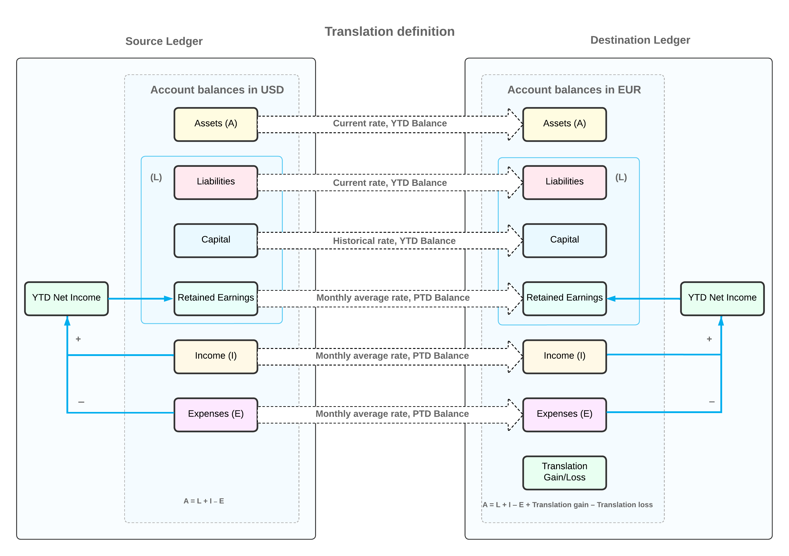

# Translation of Financial Statements: General Information {#_368fcb87-3d61-4bcf-9d37-173240eacf35 .concept}

In Acumatica ERP, you may need to restate account balances from the base currency \(or a foreign currency\) to any foreign currency configured for use in the system. This process of restating account balances from one currency \(base or foreign\) to another foreign currency is called *translation* and is used for reporting purposes.

For each financial period, to perform a translation, you first prepare the translation—that is, you specify the translation settings and create a translation worksheet in the system. You then check the translation worksheet, make corrections \(if necessary\), and release the worksheet.

**Tip:** To enable translation of financial statements in the system, the *Multicurrency Accounting* and *Translation of Financial Statements* features must be enabled on the [Enable/Disable Features](CS_10_00_00.md) \(CS100000\) form.

## Learning Objectives {#section_yxz_3jv_vxb .section}

In this chapter, you will learn how to do the following:

-   Prepare a translation in the system
-   Edit the prepared translation worksheet
-   Release the translation

## Applicable Scenarios {#section_ayz_3jv_vxb .section}

You perform the translation of financial statements if your company is a subsidiary of a larger entity that operates in a different currency, and your company's financial statements are included in the parent entity's consolidated statements, which are prepared in a different currency.

## Translation Steps {#section_cyz_3jv_vxb .section}

In general, the translation process consists of the following steps:

1.  You configure the system for translation, as described in [Translation Definitions: Implementation Activity](../ImplementationGuide/config_Multicurrency_TranslationDefinition_Implem_Activity.md).
2.  You check and update \(if necessary\) the effective currency rates from the currency of the account to be converted to the reporting currency for the date of translation on the [Currency Rates](CM_30_10_00.md) \(CM301000\) form. For details on currency rates, see [Configuration of Rate Types and Rates: General Information](../ImplementationGuide/config_Multicurrency_Configuring_Rates_GeneralInfo.md).
3.  You prepare a translation for a particular financial period on the [Prepare Translation](CM_50_10_00.md) \(CM501000\) form. When the system prepares the translation by using the specified translation definition, it generates a translation worksheet and shows it on the [Translation Worksheets](CM_30_40_00.md) \(CM304000\) form. For details, see [Translation of Financial Statements: Process Activity](Multicurrency_TranslatingFinStatements_Process_Activity.md).
4.  You review, correct \(if necessary\), and release the translation worksheet on the [Translation Worksheets](CM_30_40_00.md) form.

    For a defined translation definition, subsequent translations for the same financial period are incremental: The current translation adjusts the result of the previous released translation to match the current one. When the translation is released, an appropriate batch of adjusting transactions is created.

5.  If the **Automatically Post to GL on Release** check box is cleared on the [Currency Management Preferences](CM_10_10_00.md) \(CM101000\) form, you post the translation batch on the [Post Transactions](GL_50_20_00.md) \(GL502000\) form.

    Gains or losses resulting from translation are posted to the translation gain or loss account \(and subaccount, if subaccounts are used in your system\) specified in the **Translation Gain and Loss Accounts** section of the **GL Accounts** tab of the [Currencies](CM_20_20_00.md) \(CM202000\) form.

6.  You review the translated account balances for the ledger and period on the [Account Summary](GL_40_10_00.md) \(GL401000\) form.

## Translation Preparation {#section_gyz_3jv_vxb .section}

For each financial period for which you want to translate balances, you prepare a translation on the [Prepare Translation](CM_50_10_00.md) \(CM501000\) form. On this form, you specify the following settings:

-   In the **Fin. Period** box: The financial period for which the translation is to be performed
-   In the **Translation ID** box: The translation definition to be used for translation
-   In the **Currency Effective Date** box: The effective date of the currency exchange rate to be used for translation
-   In the **Description** box: A brief description of the translation

In the Summary area of the [Prepare Translation](CM_50_10_00.md) form, the system automatically fills in the settings of the selected translation definition \(that is, the source ledger and currency and the destination ledger and currency\). The table displays the currency rates that will be used in the translation. These are the rates of different rate types that are effective on the translation date.

After you have specified the settings for the translation, you click the **Create Translation** button on the form toolbar. The system creates the translation worksheet, which shows the translated account balances, on the [Translation Worksheets](CM_30_40_00.md) \(CM304000\) form.

The system will prevent you from preparing a translation and will display an error message in any of the following cases:

-   There is an unreleased translation worksheet for the destination ledger and the branch used in the selected translation ID, if a branch is specified in the translation definition.
-   There is an unreleased translation worksheet for the destination ledger in the selected translation ID, if no branch is specified in the translation definition.
-   There are unposted batches in the destination ledger for the branch used in the selected translation ID, if a branch is specified in the translation definition.
-   There are unposted batches in the destination ledger, if no branch is specified in the translation definition.

## Translation Worksheet Editing {#section_kyz_3jv_vxb .section}

Before you release a translation worksheet, you can view it on the [Translation Worksheets](CM_30_40_00.md) \(CM304000\) form. On this form, the **Source Amount** column shows the amount to be translated: the PTD balance for the accounts translated with the *PTD Balance* method, and the ending balance for the period for the accounts translated with the *YTD Balance* method. These accounts and the translation methods have been specified in a translation definition related to the worksheet on the [Translation Definition](CM_20_30_00.md) \(CM203000\) form.

The **Translated Amount** column shows the source amount that the system converted by using the specified currency rate as follows:

-   For the accounts translated with the *YTD Balance* method, this is the account balance at the end of the period in the reporting ledger.
-   For the accounts translated with the *PTD Balance* method, this is the account period-to-date balance for the period in the reporting ledger.

The **Transaction Debit Amount** and **Transaction Credit Amount** columns show the amount in which the account will be debited or credited in the translation batch to yield the needed balance.

Before you release a translation worksheet, you can manually edit the worksheet, if needed. To do so, on the [Translation Worksheets](CM_30_40_00.md) form, you edit the amounts in the **Transaction Debit Amount** and **Transaction Credit Amount** columns.

**Tip:** As you adjust the values, the credit total and debit total on this form change synchronously to reflect the changes, because one of them contains the translation gain or loss.

## Translation Release {#section_qyz_3jv_vxb .section}

To release a single prepared translation worksheet, while viewing the worksheet on the [Translation Worksheets](CM_30_40_00.md) \(CM304000\) form, you click **Release** on the form toolbar. You can also release multiple prepared translation worksheets on the [Release Translations](CM_50_20_00.md) \(CM502000\) form.

**Tip:** Before you release a translation, you should make sure that you have released the translation for the previous periods. If any periods were skipped, you will see incorrect balances of the accounts that have been translated with the *PTD Balance* method selected on the [Translation Definition](CM_20_30_00.md) \(CM203000\) form, and that have nonzero PTD balances for the skipped periods.

On release, the system generates a currency management batch for each translation. If the **Automatically Post to GL on Release** check box is selected on the [Currency Management Preferences](CM_10_10_00.md) \(CM101000\) form, the batch is posted to the reporting ledger. If this check box is cleared, you need to post the batch manually to the general ledger.

## Correction of a Released Translation {#section_uyz_3jv_vxb .section}

Sometimes after a translation is performed for a period, some new transactions are posted to the actual ledger in this period. In this case, you have to perform the translation \(that is, prepare and release it\) one more time for that period; subsequent translations for the same period will adjust the account balance if the account balance has changed.

If you have used the wrong currency rate in the translation, you should change the rate to the correct one and prepare and release the translation.

## Translation Workflow {#section_xyz_3jv_vxb .section}

The diagram below illustrates how the system performs the translation of the account balances by using the *EUR* translation definition. For details on configuring this translation definition, see [Translation Definitions: Implementation Activity](../ImplementationGuide/config_Multicurrency_TranslationDefinition_Implem_Activity.md). The system translates assets, liabilities, income, and expenses by using the methods and currency rates of the rate types that are specified in the translation definition.

The Year-to-Date \(YTD\) Net Income account is not included in the translation definition, because in the reporting ledger, just as in the actual ledger, this account accumulates the difference between amounts posted to income and expense accounts and is updated by every transaction posted to these accounts. Thus, to get the translated balance of the YTD Net Income account in the reporting ledger, you translate the balances of the income and expense accounts, and then the system calculates the account balance based on the translated amounts.

To get the correct translated balance of the Retained Earnings account in the reporting ledger, you need to translate the period-to-date \(PTD\) balances of income and expense accounts in each period, starting from the very first one. In addition, you need to translate the transactions that were posted manually to the Retained Earnings account \(if any\). These transactions update the account PTD balance in the transaction period, and the system would translate the account balance by using the PTD Balance method selected for the account in the translation definition. That is why you have to start translations from the first period in which the company begins operations in Acumatica ERP, which is *12-2025* for the company used in the activities of this guide.

**Parent topic:**[Translating Financial Statements](../UserGuide/Multicurrency_TranslatingFinStatements_Mapref.md)

