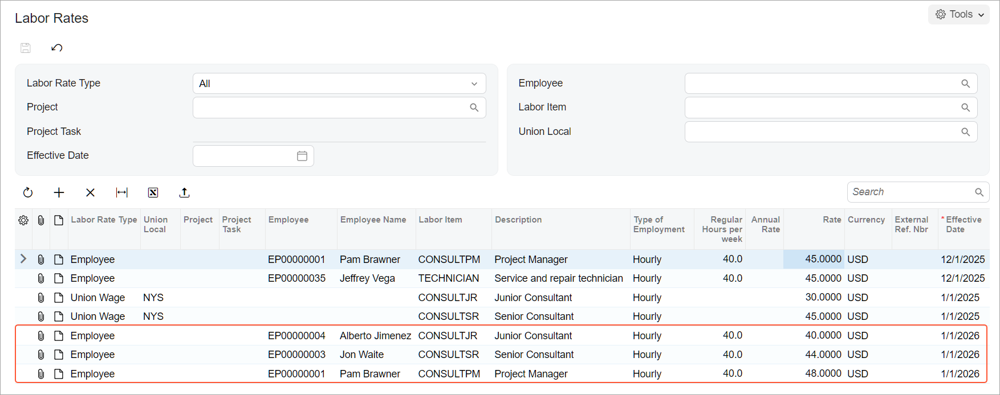

# Labor Items: To Define Labor Cost Rates {#_ffaeacaf-7683-40bc-98f9-a38f40d75cf3 .task}

In the following implementation activity, you will learn how to define labor cost rates.

**Attention:** This activity is based on the *U100* dataset. If you are using another dataset or if any system settings have been changed in *U100*, these changes can affect the workflow of the activity and the results of the processing. To avoid issues, restore the *U100* dataset to its initial state.

## Story { .section}

Suppose that in the SweetLife Fruits &amp; Jams company, the price of the consulting services depends on the qualifications of the consultant who provides the service. Acting as SweetLife's project manager, you need to define the labor cost rates that will become effective on January 1, *2026*, for three of your company's consultants:

-   Pam Brawner, a project manager, whose work rate is $48 per hour
-   Jon Waite, a senior consultant, whose work rate is $44 per hour
-   Alberto Jimenez, a junior consultant, whose work rate is $40 per hour

## Configuration Overview { .section}

In the *U100* dataset, the following tasks have been performed to support this activity:

-   On the [Enable/Disable Features](CS_10_00_00.md) \(CS100000\) form, the *Projects* feature has been enabled.
-   On the [Non-Stock Items](IN_20_20_00.md) \(IN202000\) form, the *CONSULTJR*, *CONSULTSR*, and *CONSULTPM* labor items have been created.
-   On the [Employees](EP_20_30_00.md) \(EP203000\) form, these labor items have been assigned to the *EP00000004 \(Alberto Jimenez\)*, *EP00000003 \(Jon Waite\)*, and *EP00000001 \(Pam Brawner\)* employees, respectively. The base unit of all items is *HOUR*. For an example of configuring a labor item and assigning it to an employee, see [Labor Items: To Configure a Labor Item](Non_Stock_Item_Projects_Implem_Activity.md).

## Process Overview { .section}

You will define labor cost rates that are based on the employee who performed the work on the [Labor Rates](PM_20_99_00.md) \(PM209900\) form.

## System Preparation {#section_c2h_zss_rrb .section}

To sign in to the system and prepare to perform the instructions of the activity, do the following:

1.  Launch the Acumatica ERP website, and sign in to a company with the *U100* dataset preloaded; you should sign in as project accountant by using the *brawner* username and the *123* password.
2.  In the info area, in the upper-right corner of the top pane of the Acumatica ERP screen, make sure that the business date in your system is set to *1/1/2026*. If a different date is displayed, click the Business Date menu button, and select *1/1/2026* on the calendar.

## Step: Defining Labor Cost Rates { .section}

To define the needed labor cost rates, do the following:

1.  On the [Labor Rates](PM_20_99_00.md) \(PM209900\) form, to add a new labor cost rate for Alberto Jimenez, click **Add Row** on the table toolbar, and specify the following settings in the row:
    -   **Labor Rate Type**: *Employee*
    -   **Employee**: *EP00000004 \(Alberto Jimenez\)*
    -   **Labor Item**: *CONSULTJR* \(inserted automatically as the labor item associated with the employee\)
    -   **Rate**: `40`
    -   **Effective Date**: *1/1/2026* \(inserted automatically\)
2.  To add a labor cost rate for Jon Waite, click **Add Row** on the table toolbar, and specify the following settings in the row:
    -   **Labor Rate Type**: *Employee*
    -   **Employee**: *EP00000003 \(Jon Waite\)*
    -   **Labor Item**: *CONSULTSR* \(inserted automatically as the labor item associated with the employee\)
    -   **Rate**: `44`
    -   **Effective Date**: *1/1/2026* \(inserted automatically\)
3.  To add a labor cost rate for Pam Brawner, again click **Add Row** on the table toolbar, and specify the following settings in the row:
    -   **Labor Rate Type**: *Employee*
    -   **Employee**: *EP00000001 \(Pam Brawner\)*
    -   **Labor Item**: *CONSULTPM* \(inserted automatically as the labor item associated with the employee\)
    -   **Rate**: `48`
    -   **Effective Date**: *1/1/2026* \(inserted automatically\)
4.  Save your changes to the labor cost rates. The labor cost rates you have defined should look like those shown below.

    

You have completed configuring labor cost rates.

Now you can complete the [Employee Time Billing: Process Activity](Projects_Tracking_Time_Process_Activity.md) to review how the labor cost rates are used in projects.

**Parent topic:**[Creating Labor Items](../UserGuide/Non_Stock_Item_Projects_Mapref.md)

