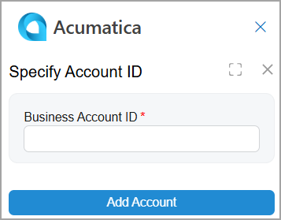
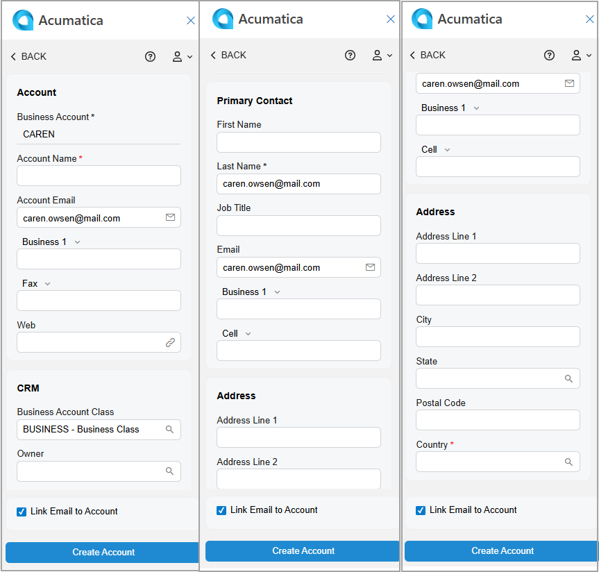

# Acumatica Add-In for Outlook: Business Account Management {#_9e8993a3-e93b-46ca-a389-cd1bf373039d .concept}

When you work with an email in Outlook, the Acumatica add-in for Outlook lets you quickly find any related business accounts in Acumatica ERP and create new ones without leaving your mailbox.

**Tip:** If the add-in isn’t already open, click the Acumatica button on the toolbar to open the add-in panel.

The Acumatica add-in searches for business accounts that have email addresses matching the sender or any recipient of the email on the following forms:

-   [Business Accounts](CR_30_30_00.md) \(CR303000\)
-   [Customers](AR_30_30_00.md) \(AR303000\) if the business account has been extended as a customer
-   [Vendors](AP_30_30_00.md) \(AP303000\) if the business account has been extended as a vendor

If matching accounts are found, they appear in the **Profiles** section of the Related Records form. You can:

-   Link the email to the related account record. For details, see [Acumatica Add-In for Outlook: Email Activity Management](OU_AddIn_Email_Activity_Management.md).
-   Click a business account’s name \(which is a link\) to review it. The record opens on the corresponding data entry form of your Acumatica ERP instance.
-   Quickly create a related account and link it to the email, as described in the next section.

## Business Account Creation { .section}

You can create a new business account with the email address selected in the Filter box of the Related Records form. If the *Customer Management* feature is enabled on the [Enable/Disable Features](CS_10_00_00.md) \(CS100000\) form, you can click **Add Account** in the **Profiles** section—either directly or through the More menu.

The *BIZACCT* segmented key may require manual entry of a key segment. In this case, when you click **Add Account**, the **Specify Account ID** dialog box opens \(shown below\). Enter the business account ID and then click **Add Account** to proceed.

The Account form opens \(see below\), and the following boxes may be filled in automatically:

-   **Business Account**: The business account ID that you’ve entered in the **Specify Account ID** dialog box \(if applicable\).
-   **Account Name**: The display name of the email address, such as *Mill Gibson &lt;mill.gibson.mail.com&gt;*; otherwise, the box is empty.
-   **Account Email**: The email address selected in the filter box.
-   **First Name** \(**Primary Contact** section\): The first word of the email address if it consists of two or more parts separated by spaces \(for example, *Mill Gibson &lt;mill.gibson.mail.com&gt;*\); otherwise, the box is empty.
-   **Last Name** \(**Primary Contact** section\): The second word of the email address if it consists of two or more parts separated by spaces \(for example, *Mill Gibson &lt;mill.gibson.mail.com&gt;*\). If a last name can’t be derived, the email address selected in the Filter box is inserted.
-   **Email** \(**Primary Contact** section\): The email address selected in the Filter box.
-   **Link Email to Contact**: Selected.

After you click **Create Account**, the form you go to depends on the state of the **Link Email to Contact** check box:

-   If it’s cleared, you return to the Related Records form. The system refreshes the **Contacts** section and shows the newly created business account and its primary contact \(if the **Primary Contact** section on the Account form is filled in\).
-   If it’s selected, you go to the Email Activity form. The system fills in the **Related Account** and **Related Entity** boxes with the business account you created and inserts *Business Account* in the **Related Entity Type** box. The email is linked to the newly created business account in Acumatica ERP. For details, see [Acumatica Add-In for Outlook: Email Activity Management](OU_AddIn_Email_Activity_Management.md).

## Access Rights { .section}

Users with the following user roles have the *Delete* access rights to the Account form:

-   *AcumaticaSupport*
-   *Administrator*
-   *CR Marketing Manager*
-   *CR Sales &amp; Marketing Admin*
-   *CR Sales Representative*
-   *CR Support Admin*
-   *CR Support Representative*
-   *Customer Data Manager*
-   *Vendor Data Manager*

**Parent topic:**[Add-In for Outlook: Modern UI](../UserGuide/OU_OU_ModernUI.md)

